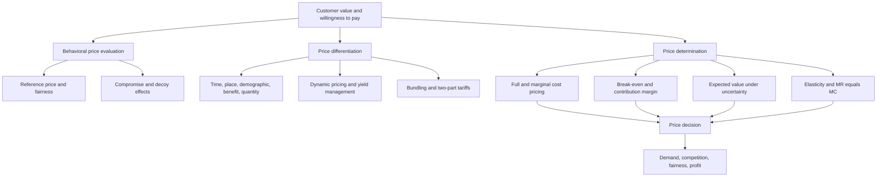

# Chapter 04: Price

Source file: `marketing/raw/GM 2026 Chapter4.pdf`

Course: Marketing

Processed: 2026-06-12

Wiki note: `marketing/wiki/chapter-04-price/chapter-04-price.md`

Course logistics checked: Marketing is assessed through a 90-minute written examination covering all lecture materials, with special attention to research discussed in class. Price is the fourth chapter in the lecture sequence and follows customer value, branding, and product policy.

## 80/20 Exam Summary

Price is the only marketing-mix instrument that directly generates revenue. It is powerful because a small price change affects contribution margin on every unit, but the resulting demand reaction can amplify or reverse the gain.

High-yield ideas:

- Customers evaluate prices psychologically, not only economically. Reference prices, fairness, relative differences, compromise options, decoys, and payment methods change willingness to pay.
- Price differentiation extracts heterogeneous willingness to pay when segments are identifiable and arbitrage or switching can be controlled.
- Temporal, geographical, demographic, benefit-based, quantity-based, dynamic, and bundled prices are different mechanisms, not synonyms.
- Skimming starts high and declines; penetration starts low to build adoption and market share.
- Cost-plus pricing is simple but ignores demand. Break-even and contribution-margin methods connect price to required volume and revenue.
- Under uncertainty, compare probability-weighted outcomes. Under monopoly, maximize profit where marginal revenue equals marginal cost.
- Every numerical answer should state the decision supported and the demand, fairness, or competitive assumptions it cannot prove.

## Why Price Is Powerful

The lecture illustrates a base case with price `100`, variable unit cost `60`, one million units, and fixed cost of EUR 30 million. Profit is EUR 10 million.

```text
Profit = (price - variable unit cost) * quantity - fixed cost
       = (100 - 60) * 1,000,000 - 30,000,000
       = EUR 10,000,000
```

A 10% price increase to `110`, with unchanged quantity and costs, doubles profit to EUR 20 million. The same proportional improvement in variable cost, sales volume, or fixed cost produces smaller profit increases in the illustrated case.

The reverse lesson is critical: a price cut must generate enough extra volume to replace the lost contribution margin. With unit cost `60`, cutting price from `100` to `80` halves unit contribution from `40` to `20`; quantity must double to preserve profit. Raising price to `120` increases unit contribution to `60`, allowing quantity to fall by one third while preserving profit.

Managerial rule:

```text
Never evaluate a price change from percentage price movement alone.
Recalculate contribution per unit and the required demand response.
```

## Behavioral Pricing

### Compromise Effect

Consumers often avoid extreme alternatives and select the middle option. Adding a 0.75-liter drink can shift customers from 0.3 liters toward the formerly large 0.5-liter option because it is now framed as the compromise.

The same logic appears in good-better-best product lines. The middle option can become more attractive without changing its technical attributes.

Exam trap: the compromise effect is context-dependent preference construction, not proof that consumers possess a stable underlying preference for the middle product.

### Decoy Effect

A deliberately inferior alternative can make a target option look more attractive. The decoy is asymmetrically dominated: it is clearly worse than the target but not necessarily worse than every alternative.

Managerial use: redesign the choice set to clarify relative value. Ethical risk arises when the architecture intentionally obscures rather than informs.

### Reference Dependence And Price Fairness

Customers compare observed price with reference points such as:

- fair price
- typical or remembered price
- last price paid
- competitor price
- expected future price
- usual promotional price

The lecture's beer example shows that willingness to pay differs between a local kiosk and a luxury hotel because expectations and perceived cost justification differ.

Dynamic prices can therefore be economically rational but behaviorally rejected. Coca-Cola's proposed hot-weather vending surcharge triggered perceptions of exploitation. A feasible algorithm is not automatically an acceptable market policy.

### Relative Versus Absolute Savings

Consumers may travel to save EUR 10 on a EUR 29 speaker but not to save EUR 10 on a EUR 1,299 television. The absolute saving is identical; the relative saving and transaction framing differ.

### Pain Of Paying And Payment Method

Payment salience changes consumption experience. Cash can make the sacrifice vivid, while cards, mobile payment, subscriptions, and bundles can separate consumption from payment and reduce immediate pain.

## Price Information Processing

```text
Acquisition -> evaluation in short-term memory -> storage in long-term memory
```

Price search rises when value-for-money risk or price is high and information is easy to obtain. Yet customers often search only at the point of sale and use visible cues or heuristics rather than exhaustive comparison.

Marketer strategies:

- Cost leader: increase price attention by communicating value-for-money superiority.
- Value strategy: reduce price centrality by emphasizing quality, service, or risk reduction.
- Good-better-best architecture: retain price-sensitive customers through a lower tier while preserving premium tiers.

Price can also act as a quality signal for experience or credence goods. Weber's-law intuition says a difference must cross a perceptual threshold before customers notice it.

Only selected prices become durable price knowledge. Explicit knowledge means recalling a number; implicit knowledge means remembering only that an offer was expensive or cheap.

## Ethical And Legal Risk In Price Presentation

The deck discusses misleading list-price comparisons and prolonged “was/now” promotions. A high reference price can increase perceived savings, but a fictional benchmark destroys trust and can attract enforcement.

Exam answer structure:

```text
pricing tactic -> psychological mechanism -> expected behavior
-> fairness/transparency risk -> managerial safeguard
```

## Price Differentiation

Price differentiation offers the same or slightly modified benefit at different prices because customers have heterogeneous willingness to pay.

Conditions:

1. Willingness to pay differs.
2. Segments are identifiable or self-select through a tariff.
3. Different offers or communication can be implemented.
4. Resale, switching, or arbitrage is limited.
5. Incremental revenue exceeds implementation, fairness, and complexity costs.

| Form | Discrimination basis | Example | Main risk |
|---|---|---|---|
| Temporal | purchase time | cinema weekday pricing | customers delay or perceive unfairness |
| Geographical/channel | location or channel | supermarket versus airport | arbitrage and fairness |
| Demographic | observable group | student/child prices | discrimination and legitimacy |
| Benefit-based | service level | economy versus business class | cost/value mismatch |
| Quantity-based | usage or volume | volume discounts, flat rates | adverse selection and overuse |
| Dynamic | current demand/capacity | surge pricing | opacity and price gouging perceptions |
| Bundling | combined reservation values | wine and cheese package | forced purchase and cannibalization |

### Yield Management

Yield management controls perishable capacity so the right unit is sold to the right customer at the right time and price.

```text
data acquisition -> demand forecast -> demand management
-> capacity and price controls -> booking/market feedback
```

It is appropriate for airlines, hotels, and other capacity that expires if unsold. The manager must combine forecasting, segment restrictions, inventory protection, and dynamic adjustment.

### Quantity-Based And Two-Part Pricing

A two-part tariff combines an access fee with a per-unit price. In the restaurant example, beer costs EUR 1 to supply and successive willingness to pay is `2.5, 2, 1.5, 1, 0.5, 0`.

- Uniform price EUR 2: two beers sold; profit EUR 2.
- Perfectly differentiated unit prices down to cost: profit EUR 3.
- Two-part tariff: EUR 3 access fee plus EUR 1 per beer; profit EUR 3.

The access fee captures consumer surplus while the per-unit price at marginal cost supports efficient consumption.

Clarification bridge:

- **Quantity-based pricing** is the broad family: the price changes with amount bought or used.
- **Two-part pricing** is a specific quantity-based/self-selection tariff: the customer pays once for access and then pays a usage price for each unit consumed.
- The lecture's beer example is not mainly about "dynamic consumption over time." The cleaner explanation is **decreasing marginal willingness to pay**: the first beer is worth more than the second, the second more than the third, and so on.

Worked intuition:

| Beer | WTP | Usage price if set at marginal cost | Consumer surplus on that beer |
|---:|---:|---:|---:|
| 1 | EUR 2.50 | EUR 1.00 | EUR 1.50 |
| 2 | EUR 2.00 | EUR 1.00 | EUR 1.00 |
| 3 | EUR 1.50 | EUR 1.00 | EUR 0.50 |
| 4 | EUR 1.00 | EUR 1.00 | EUR 0.00 |

If the restaurant charges EUR 1 per beer, the customer buys every beer with WTP at least EUR 1. Total consumer surplus is:

```text
1.50 + 1.00 + 0.50 + 0.00 = EUR 3.00
```

The restaurant can then charge a EUR 3 access fee and still leave the customer indifferent to entering. The fee captures the surplus; the usage price keeps consumption efficient because it equals the EUR 1 marginal cost.

## Skimming Versus Penetration

| Strategy | Initial price | Objective | Best fit | Main danger |
|---|---:|---|---|---|
| Skimming | high | capture early high WTP, recover investment, signal quality | differentiated innovation, limited capacity, short life cycle | slow diffusion and competitor entry |
| Penetration | low | rapid adoption, scale, market share, entry barriers | price-sensitive mass market with scale economies | weak margin and difficult later increases |

Clarification bridge:

- **Skimming** helps recover fixed development, launch, or capacity investment faster from high-WTP early adopters. It is not mainly about covering marginal cost faster; marginal cost is the cost of one additional unit and is usually covered unit by unit.
- **Penetration** sacrifices early margin to build adoption, awareness, network effects, installed base, or retailer/customer lock-in.
- A limited-seat executive course, premium workshop, or scarce luxury launch usually fits skimming: the firm is not trying to reach the broadest market immediately. It is screening for customers with high WTP and protecting exclusivity/capacity.
- A mass-market app, subscription, or platform that becomes more valuable with many users usually fits penetration: adoption itself is part of the strategy.

## Price Bundling

Bundling transfers unused willingness to pay across products. It works especially well when customers' valuations are negatively correlated: a customer who values product A less may value B more, making total bundle valuation more stable.

| Approach | Customer can buy separately? | Best fit |
|---|---|---|
| Unit pricing | yes; no bundle required | valuations differ strongly and independently |
| Full bundling | no | bundle valuations are similar across customers |
| Mixed bundling | both bundle and separate products | heterogeneous mix of the above cases |

The lecture's wine-and-cheese case shows a bundle price of EUR 5.50 attracting more buyers than the separate profit-maximizing prices.

## Methods Of Price Determination

### Full-Cost Pricing

```text
p_i = c_i(1 + gamma)
```

`c_i` is total unit cost, including allocated fixed cost. This method is easy and appears to ensure cost coverage, but unit cost itself depends on sales volume. It also ignores willingness to pay, demand elasticity, competitor behavior, and allocation arbitrariness.

### Marginal-Cost Pricing

```text
p_i = cv_i(1 + gamma')
```

`cv_i` is variable unit cost. This is useful for incremental decisions and contribution analysis, but long-run prices must still cover fixed costs and strategic requirements.

### Break-Even Analysis

```text
Revenue = Total cost
p*x = C_fix + c_var*x

x_crit = C_fix / (p - c_var)
```

The denominator is contribution per unit. A smaller contribution margin requires more units to cover fixed cost.

#### VR Headset Exercise

Given `C_fix = EUR 40,000`, `c_var = EUR 30`, and `p = EUR 80`:

```text
x_crit = C_fix / (p - c_var)
       = 40,000 / (80 - 30)
       = 800 headsets
```

For a EUR 10,000 target profit:

```text
x_target = (C_fix + target profit) / (p - c_var)
         = (40,000 + 10,000) / 50
         = 1,000 headsets
```

### Contribution Margin Ratio

```text
CMR = (p - c_var)/p = (R - C_var)/R
R_crit = C_fix/CMR
```

For the headset:

```text
CMR = (80 - 30)/80 = 0.625 = 62.5%
R_crit = 40,000/0.625 = EUR 64,000
x_crit = 64,000/80 = 800 headsets
```

## Pricing Under Uncertainty

When competitor reactions or sales outcomes are uncertain:

```text
Expected outcome at price p = sum(probability_j * outcome_j)
```

A decision tree separates the firm's price, competitor response, and conditional sales outcome. Expected sales and expected profit are different objectives; a high-volume price can lose to a lower-volume price when contribution per unit differs.

Exam trap: probabilities along a path multiply; mutually exclusive path outcomes then add.

Worked expected-profit example:

Assume a headset has `c_var = EUR 30` and `C_fix = EUR 10,000`. The firm compares a high price of EUR 80 with a low price of EUR 60.

| Firm price | Competitor outcome | Probability | Sales | Profit calculation | Profit |
|---:|---|---:|---:|---|---:|
| EUR 80 | competitor stays high | 0.60 | 1,000 | `(80 - 30) * 1,000 - 10,000` | EUR 40,000 |
| EUR 80 | competitor cuts price | 0.40 | 600 | `(80 - 30) * 600 - 10,000` | EUR 20,000 |
| EUR 60 | competitor stays high | 0.50 | 1,600 | `(60 - 30) * 1,600 - 10,000` | EUR 38,000 |
| EUR 60 | competitor cuts price | 0.50 | 1,200 | `(60 - 30) * 1,200 - 10,000` | EUR 26,000 |

```text
EV_high price = 0.60*40,000 + 0.40*20,000 = EUR 32,000
EV_low price  = 0.50*38,000 + 0.50*26,000 = EUR 32,000
```

The expected profits are equal. The decision then depends on risk tolerance, positioning, capacity, fairness, and strategic objectives. The reason is not probability alone: each probability weights a **profit outcome**, and profit depends on contribution margin as well as sales volume.

## Market Structure And Marginal Analysis

| Structure | Sellers | Pricing implication |
|---|---|---|
| Monopoly | one relevant seller | optimize against customer demand |
| Oligopoly | few sellers | model customer and competitor reactions |
| Polypoly | many small sellers | limited pricing discretion; market price dominates |

For a linear demand function:

```text
x(p) = a - bp
elasticity epsilon = (dx/dp)*(p/x) = -bp/(a - bp)
```

Demand is elastic when `|epsilon| > 1` and inelastic when `|epsilon| < 1`.

Variable definitions:

| Variable | Meaning | Managerial use |
|---|---|---|
| `p` | unit price | determines revenue per unit and contribution per unit |
| `x` | quantity sold | captures the demand response to price |
| `c_var` | variable unit cost | simple proxy for marginal cost |
| `C_fix` | fixed cost | amount contribution must cover before profit |
| `epsilon` | percentage quantity response divided by percentage price change | shows how sensitive demand is to a price change |
| `MR` | marginal revenue | extra revenue from selling one more unit |
| `MC` | marginal cost | extra cost of producing or serving one more unit |

Elasticity is useful because it converts a price-change idea into a demand-change forecast. But elasticity alone does not decide the price. Profit still requires contribution:

```text
Current: p = EUR 100, x = 1,000, c_var = EUR 40
Current contribution = (100 - 40) * 1,000 = EUR 60,000

If epsilon = -2 and price rises by 10%:
quantity changes by -20%, so x_new = 800
new contribution = (110 - 40) * 800 = EUR 56,000
```

In this case, raising price lowers contribution because demand is very elastic. If `epsilon = -0.5`, the same 10% price increase would reduce quantity by only 5%:

```text
x_new = 950
new contribution = (110 - 40) * 950 = EUR 66,500
```

Here the price increase improves contribution. Exam correction: use elasticity to estimate demand response, then calculate contribution or profit.

With constant variable unit cost `c_var`, profit maximization requires marginal revenue equal marginal cost:

```text
p* = 0.5 * (a/b + c_var)
x* = 0.5 * (a - b*c_var)
```

### PapaTurk Monopoly Exercise

Inverse demand is `p = 5 - x/3000`, variable cost is EUR 0.80 per can, and fixed cost is EUR 3,000.

Why the revenue equation creates `2x` in marginal revenue:

```text
p = 5 - x/3000
R = p*x
R = (5 - x/3000)x
R = 5x - x^2/3000
MR = dR/dx = 5 - 2x/3000
```

The `2x` appears because the derivative of `x^2` is `2x`. The managerial intuition is also important: to sell one more can, PapaTurk must lower the price, and that lower price applies to all units sold, not only the marginal can. Therefore marginal revenue falls faster than price.

```text
Prohibitive price: x = 0 -> p = EUR 5
Saturation quantity: p = 0 -> x = 15,000 cans

Revenue maximum:
MR = 5 - 2x/3000 = 0
x_R = 7,500 cans
p_R = 5 - 7,500/3000 = EUR 2.50
profit_R = (2.50 - 0.80)*7,500 - 3,000 = EUR 9,750

Profit maximum:
MR = MC
5 - 2x/3000 = 0.80
x* = 6,300 cans
p* = 5 - 6,300/3000 = EUR 2.90
profit* = (2.90 - 0.80)*6,300 - 3,000 = EUR 10,230
```

Revenue maximization and profit maximization differ because revenue ignores cost.

## Managerial Decision Router

| Question | Primary method |
|---|---|
| How much volume covers fixed cost? | break-even analysis |
| What revenue covers fixed cost? | contribution margin ratio |
| How should uncertain competitor reactions be compared? | expected value decision tree |
| How should a monopolist optimize price? | demand function, elasticity, MR = MC |
| How can heterogeneous WTP be captured? | price differentiation or bundling |
| How should a new product enter? | skimming versus penetration |
| Why might an economically sound price fail? | behavioral pricing and fairness analysis |

## Visual Knowledge Map



## Subject Knowledge Graph

| Node | Meaning | Exam relevance |
|---|---|---|
| Behavioral Pricing | context-dependent price perception | explains deviations from purely economic response |
| Reference Price | benchmark used to judge an observed price | central to promotions and fairness |
| Price Differentiation | different prices for heterogeneous WTP | requires segment and arbitrage conditions |
| Yield Management | dynamic price/capacity control | applies to perishable capacity |
| Price Bundling | combined sale that pools reservation values | compare unit, full, and mixed bundling |
| Break-Even Point | volume or revenue where profit is zero | core calculation routine |
| Price Elasticity | percentage demand response to price | diagnoses demand sensitivity |
| Cournot Price | monopoly profit-maximizing price | derived from MR = MC |

| From | Relationship | To | Why it matters |
|---|---|---|---|
| Reference Price | shapes | Perceived Fairness | affects acceptance beyond objective price |
| Heterogeneous WTP | enables | Price Differentiation | creates surplus-extraction opportunity |
| Negative valuation correlation | favors | Bundling | stabilizes total bundle WTP |
| Contribution Margin | determines | Break-Even Volume | lower margin raises required volume |
| Demand Function | determines | Price Elasticity | quantifies market reaction |
| Marginal Revenue | equals at optimum | Marginal Cost | monopoly profit rule |

## Exam Relevance

Likely prompts:

1. Explain why a price reduction can lower profit despite higher sales.
2. Diagnose a compromise, decoy, reference-price, or fairness effect.
3. Select and justify a form of price differentiation.
4. Compare skimming and penetration pricing.
5. Calculate break-even volume, target-profit volume, and contribution margin ratio.
6. Build an expected-value pricing decision tree.
7. Derive elasticity or monopoly profit-maximizing price and quantity.

Common traps:

- treating revenue as profit
- using fixed cost as a per-unit marginal cost
- ignoring demand response after a price change
- assuming dynamic pricing is accepted merely because it is efficient
- calling every discount price differentiation without identifying the segmentation basis
- maximizing sales instead of expected profit
- forgetting absolute value when classifying elasticity

## Retrieval Prompts

1. Why is price more leveraged than the other marketing-mix instruments?
2. How do compromise and decoy effects differ?
3. Which conditions must hold for price differentiation?
4. Why can yield management improve revenue for perishable capacity?
5. When is bundling superior to unit pricing?
6. What does the contribution margin ratio measure?
7. Why does the monopoly optimum satisfy `MR = MC`?

## Practice Tasks

1. A product costs EUR 40 variably, sells for EUR 100, and has EUR 120,000 fixed cost. Calculate break-even volume and revenue.
2. A manager cuts price by 20%. Calculate the required volume increase to preserve contribution, given the original variable unit cost.
3. Design one ethical temporal price differentiation and one questionable demographic differentiation.
4. Draw a decision tree for two prices, two competitor reactions, and two demand outcomes.
5. For `x(p) = 10,000 - 1,000p` and `c_var = 2`, derive elasticity at `p = 5` and calculate monopoly `p*` and `x*`.

## Connections

- [Chapter 01 Basic Concepts](../chapter-01-basic-concepts-of-marketing/chapter-01-basic-concepts-of-marketing.md): customer value, segmentation, and the 4Ps.
- [Chapter 02 Branding](../chapter-02-branding/chapter-02-branding.md): brand equity can reduce price sensitivity and support premiums.
- [Chapter 03 Product](../chapter-03-product/chapter-03-product.md): product architecture creates benefit tiers and bundling opportunities.
- Next: [Chapter 05 Promotion/Communication](../chapter-05-promotion-communication/chapter-05-promotion-communication.md): communication shapes price expectations, fairness, and perceived value.

## Open Uncertainties

- Several contemporary examples and market statistics are illustrative and may change; the exam-relevant mechanism is more stable than the exact headline value.
- The deck labels some price-determination categories differently from standard textbook taxonomies. Use the lecture labels in the exam and explain the mechanism precisely.
