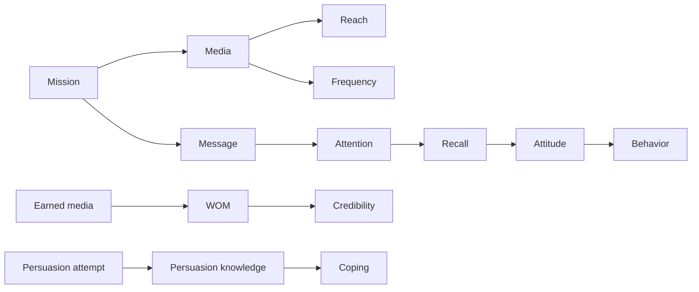

# Ubiquitous Language: Chapter 05 Promotion And Communication

Source note: `chapter-05-promotion-communication.md`

Definition source: local lecture deck and note, enriched with standard communication terminology where needed.

## Campaign Language

| Term | Definition | Aliases to avoid |
|---|---|---|
| **Communication Policy** | All instruments used to present the firm and interact with stakeholders. | advertising only |
| **Promotional Mix** | Coordinated advertising, sales promotion, personal selling, PR, and related instruments. | media plan |
| **Push Strategy** | Communication that motivates channel members to stock and sell. | aggressive promotion |
| **Pull Strategy** | Communication that creates final-customer preference and channel demand. | consumer discount only |
| **Integrated Marketing Communication** | Coherent positioning and cues across touchpoints and instruments. | identical ad everywhere |
| **5Ms** | Mission, Money, Message, Media, Measurement. | AIDA |
| **AIDA** | Attention, Interest, Desire, Action effect hierarchy. | guaranteed customer journey |

## Media Language

| Term | Definition | Aliases to avoid |
|---|---|---|
| **Reach** | Number or percentage with at least one exposure opportunity. | people who noticed |
| **Frequency** | Average exposure opportunities among the reached audience. | reach |
| **GRPs** | Impressions relative to target-population size, commonly reach percentage times frequency. | unique reach |
| **CPT/CPM** | Advertising cost per thousand audience members or impressions, as defined in the plan. | cost per sale |
| **Weighted CPT** | CPT adjusted for the share belonging to the target group. | raw CPT |
| **Owned Media** | Firm-controlled touchpoints. | free media |
| **Paid Media** | Exposure purchased by the firm. | earned media |
| **Earned Media** | Exposure or conversation generated by others. | fully controllable media |

## Effect Language

| Term | Definition | Aliases to avoid |
|---|---|---|
| **Recognition** | Identifying previously encountered content when shown. | unaided recall |
| **Aided Recall** | Remembering after a cue. | recognition |
| **Unaided Recall** | Producing the brand or message without a cue. | aided recall |
| **Pre-Test** | Evaluation before campaign launch. | post-test |
| **Post-Test** | Effect assessment after exposure or campaign activity. | sales report only |
| **Attention Effect** | Degree to which content attracts and holds processing. | persuasion success |

## WOM And Persuasion Language

| Term | Definition | Aliases to avoid |
|---|---|---|
| **WOM** | Person-to-person commercial-topic communication perceived as non-commercial. | any brand discussion |
| **eWOM** | Online consumer statements accessible to a broad audience. | influencer advertising automatically |
| **Credibility** | Perceived believability or truthfulness. | helpfulness |
| **Helpfulness** | Degree information assists a decision. | credibility |
| **Influencer Marketing** | Marketer engagement of an influencer to pursue a business objective. | organic WOM |
| **Persuasion Knowledge** | Consumer knowledge about persuasion goals and tactics. | advertising awareness only |
| **Agent** | Party perceived as responsible for the persuasion attempt. | influencer always |
| **Target** | Person intended to be influenced. | target segment only |
| **Coping** | Any adaptive response to persuasion, including acceptance or resistance. | rejection only |

## Formula And Metric Language

```text
CPT = campaign cost / audience in thousands
weighted CPT = CPT / target-group share
GRPs = reach percentage * average frequency
NPS = percentage promoters - percentage detractors
```

| Metric | Unit | What it cannot prove alone |
|---|---|---|
| Reach | people or percent | attention or persuasion |
| Frequency | contacts per reached person | message quality |
| CPT | currency per thousand | target relevance or sales |
| Recall | percent remembering | favorable attitude or purchase |
| NPS | score from -100 to +100 | profit, loyalty, or causality |

## Canonical Relationships

- **Mission** determines the appropriate **message**, **media**, and **measurement**.
- **Reach** and **frequency** jointly create contact pressure; target fit determines contact quality.
- **Owned**, **paid**, and **earned media** should reinforce one positioning.
- **Satisfaction**, **loyalty**, **trust**, and **commitment** can generate **eWOM**.
- **Credibility** depends on sender, message, receiver, and platform cues.
- Sponsorship disclosure can activate **persuasion knowledge**, which shapes **coping**.

## Visual Memory Aid



## Example Dialogue

> **Manager:** "Platform A has the lowest CPT, so should we buy it?"
>
> **Analyst:** "Not yet. Compute **weighted CPT** using the target-group share, then check whether the **reach** and **frequency** support the campaign **Mission**."
>
> **Manager:** "Our influencer post received attention. Is it successful?"
>
> **Analyst:** "Attention is one effect. Check credibility, recall, attitude, behavior, disclosure, and the audience's **persuasion knowledge**."

## Flagged Ambiguities

- **Promotion** is the marketing-mix field; a **sales promotion** is one specific short-term instrument.
- **Reach** means opportunity for exposure, not confirmed viewing.
- **Earned media** can be stimulated but is not fully controlled.
- Paid influencer content is **influencer marketing/native advertising**, not independent WOM merely because it appears in a personal feed.
- **Coping** in PKM is neutral and includes acceptance, resistance, and other strategic responses.

## Exam Trap Corrections

| Trap | Correction |
|---|---|
| Cheapest CPT is best. | Correct for target fit and objective quality. |
| High reach means effective campaign. | Measure attention, memory, evaluation, and behavior separately. |
| WOM is always positive and spontaneous. | It can be negative, solicited, or firm-stimulated. |
| eWOM volume proves credibility. | Volume can signal consensus but also overload or manipulation. |
| Disclosure always destroys persuasion. | It activates knowledge; response depends on fit, appropriateness, and credibility. |

## Cheat-Sheet Language

```text
Campaign answer: audience -> objective -> 5Ms -> media metrics -> effect measurement.
Persuasion answer: who -> what -> whom -> credibility/helpfulness -> PKM coping response.
```
