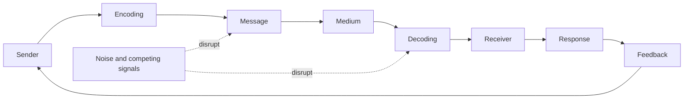
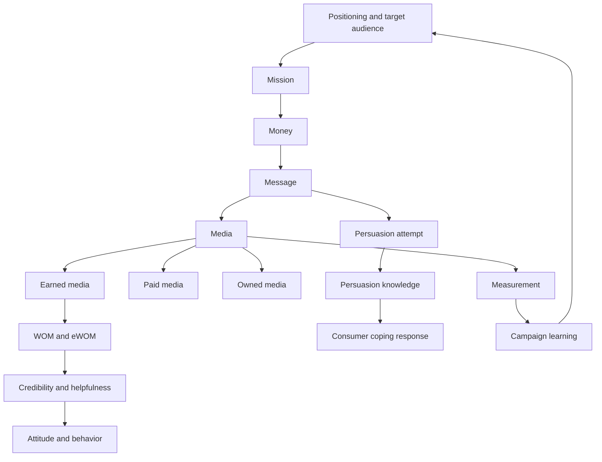

# Chapter 05: Promotion And Communication

Source file: `marketing/raw/GM 2026 Chapter5.pdf`

Course: Marketing

Processed: 2026-06-12

Wiki note: `marketing/wiki/chapter-05-promotion-communication/chapter-05-promotion-communication.md`

Course logistics checked: Marketing is assessed through a 90-minute written examination covering all lecture materials, with special attention to discussed research papers. This chapter follows Price and develops the Promotion element of the marketing mix.

## 80/20 Exam Summary

Marketing communication is a managed meaning-exchange process. A high-scoring answer links a defined audience and objective to message, medium, timing, budget, and measurable effect.

High-yield ideas:

- Communication is more than advertising. It includes external, internal, and interactive communication and combines advertising, sales promotion, personal selling, PR, direct marketing, WOM/eWOM, and digital formats.
- Push communication targets channel members; pull communication creates final-customer demand that moves backward through the channel.
- The 5Ms structure campaign planning: Mission, Money, Message, Media, and Measurement.
- Media choice requires both quantity metrics, such as reach and frequency, and quality, especially target-group fit.
- `CPT/CPM`, weighted CPT, GRPs, recall, recognition, attitudes, and behavior measure different things and must not be treated as interchangeable.
- WOM is perceived as non-commercial interpersonal communication. eWOM is larger, faster, persistent, measurable, and often anonymous.
- eWOM persuasiveness depends on sender, message, receiver, and context. Credibility is not the same as helpfulness.
- The Persuasion Knowledge Model explains how consumers recognize persuasion tactics and cope with them; recognition can produce resistance, acceptance, or another adaptive response.

## Communication Scope

Communication is an intentional exchange of meaning through symbols. The managerial questions are:

```text
Who says what, under which circumstances, through which channel,
in what design, to whom, and with what result?
```

Communication policy includes:

- external market communication, such as advertising
- internal communication, such as employee newsletters
- interactive communication, such as customer service

The classic promotional mix contains advertising, sales promotion, personal selling, and public relations. The lecture extends this with direct marketing, owned/paid/earned media, WOM/eWOM, influencer marketing, and emerging formats.

## Communication Process



Managerial implication: failure may occur because the audience was wrong, the message was badly encoded, the medium did not reach them, competing signals created noise, or the chosen KPI did not measure the intended response.

## Push Versus Pull

| Strategy | Primary target | Mechanism | Typical instruments |
|---|---|---|---|
| Push | wholesalers and retailers | producer motivates channel to stock and sell | field sales, trade fairs, trade promotions |
| Pull | final consumers | consumer preference creates channel demand | advertising, social media, consumer promotions |

Push moves supply forward; pull draws demand backward. Many campaigns combine both.

Exam trap: push and pull describe where communication pressure is directed, not whether a message is aggressive or gentle.

## Advertising Effects

The lecture distinguishes:

- immediate observable reactions to contact
- sustained internal effects, such as perception and learning
- long-term observable behavior

AIDA provides a memory structure:

```text
Attention -> Interest -> Desire -> Action
```

AIDA is not proof that every consumer follows a strict linear path. It is a planning heuristic connecting cognitive, affective, and conative outcomes.

| Goal class | Examples |
|---|---|
| Cognitive | attention, awareness, product/brand knowledge |
| Affective | interest, attitude, image, emotional experience |
| Conative | information search, intention, trial, repeat purchase |

In saturated markets, informative claims may fail because products are perceived as similar and consumers face too many variants. Communication must make a relevant difference noticeable rather than merely add information.

## The 5Ms Of Advertising

| M | Decision | Core question |
|---|---|---|
| Mission | communication and economic goals | What should change? |
| Money | media/campaign budget | What resources are justified? |
| Message | content and execution | What meaning should be encoded? |
| Media | channels, reach, frequency, timing | Where and how often should contact occur? |
| Measurement | pre/post evaluation and control | Did the intended effect occur? |

### Complete Communication Goals

A goal should specify:

1. KPI or target variable
2. baseline and desired degree of change
3. target audience and geography
4. planning horizon
5. alignment with marketing and corporate goals

Example: increase aided recall among 18-49-year-olds in Germany from 15% to 30% within one year.

## Budgeting Methods

### Optimization Functions

Budget-response functions model sales or another KPI as a function of spend. They can represent saturation, competition, and carry-over, but the relationship is difficult to identify and often context-specific.

### Heuristics

| Method | Advantage | Main weakness |
|---|---|---|
| percentage of sales | quick and simple | circular and procyclical |
| percentage of profit | easy constraint | profit has many causes and may cut communication when needed |
| affordable method | respects cash limit | no link to objectives |
| competitor parity | provides benchmark | copies firms with different goals and resources |
| objective-and-task | links activities to goals | effortful and does not automatically prove benefit exceeds cost |

Objective-and-task procedure:

```text
define goals -> identify required activities -> estimate activity costs
-> compare with budget ceiling -> implement or revise
```

## Integrated Marketing Communication

Integrated communication keeps positioning and meaning coherent across touchpoints while adapting execution to each medium.

```text
one strategic promise + coordinated visual/verbal cues
across advertising, salespeople, PR, packaging, digital, and service encounters
```

Integration does not mean identical content everywhere. It means mutually reinforcing messages rather than contradiction.

## Owned, Paid, And Earned Media

| Type | Controlled by | Examples | Trade-off |
|---|---|---|---|
| Owned | firm | website, store, packaging, sales staff | control but limited independent credibility |
| Paid | purchased exposure | TV, print, search, display, sponsorship | scalable but costly and recognized as persuasion |
| Earned | other actors | reviews, WOM, press coverage | credible and scalable but less controllable |

The aim is coordinated brand engagement, not simply maximizing one media type.

## Message Design

Message development starts from positioning, objective, and target group. It separates content from execution.

Content can use informative/causal arguments or psychological/emotional appeals. Execution can use language, imagery, sound, sensory cues, surprise, contrast, price cues, or values.

Evaluate messages for:

- attention
- credibility
- differentiation
- positioning fit
- understandability
- originality

Controversial, guerrilla, virtual-reality, and 3D formats can increase attention but attention alone does not guarantee suitable brand meaning or behavior.

## Media Planning

```text
intermedia selection -> intramedia selection -> timing and frequency
```

- Intermedia: choose media types, such as TV versus online.
- Intramedia: choose a channel or title, such as one TV station or magazine.
- Timing: choose when contacts occur and how they are distributed.

### Reach, Frequency, And GRPs

- **Reach:** different people with at least one opportunity for exposure.
- **Frequency:** average number of exposure opportunities among those reached.
- **GRPs:** total impressions expressed as a percentage of the target population; commonly approximated by `reach % * average frequency`.

Reach is not guaranteed attention, comprehension, or persuasion.

### Cost Per Thousand

```text
CPT = advertising cost / audience in thousands
```

Example:

```text
CPT = EUR 50,000 / (10,000,000/1,000)
    = EUR 5 per 1,000 readers
```

Raw CPT can reward a large but irrelevant audience. Correct for target fit:

```text
weighting factor = 1 / target-group share
weighted CPT = CPT * weighting factor
```

Lecture example:

```text
Stern: 6.83 / 0.50 = EUR 13.66
Der Spiegel: 8.89 / 0.70 = EUR 12.70
```

Der Spiegel is more efficient for that target despite the higher unweighted CPT.

### Timing Policies

| Policy | Pattern | Suitable logic |
|---|---|---|
| Blitz | concentrated burst | launch or short event |
| Even | continuous level | stable ongoing demand |
| Pulsing | separated bursts | periodic demand or events |
| Pulsing/maintenance | baseline plus bursts | preserve memory while adding peaks |

The learning and forgetting curves explain why recall rises with exposure and decays without reinforcement.

## Measuring Communication Effects

Pre-tests estimate likely success before launch; post-tests assess effects afterward.

| Effect | Measures |
|---|---|
| Attention | stopping, holding, sending power; eye tracking |
| Memory | recognition, aided recall, unaided recall |
| Evaluation | preference, attitude, image change |
| Behavior | search, trial, purchase, repeat purchase, WOM |

Methods include observation, surveys, eye tracking, skin conductance, and medical imaging. Each method observes a different layer; physiological activation is not automatically positive persuasion or purchase.

## Word Of Mouth

Traditional WOM is person-to-person commercial-topic communication whose source is perceived as non-commercial.

Dimensions:

- positive or negative valence
- spontaneous or firm-stimulated
- before, during, or after purchase
- solicited or unsolicited

WOM often receives more credibility than firm-created communication. Negative WOM can be especially influential because dissatisfied customers may tell more people.

### Net Promoter Score

Respondents answer likelihood-to-recommend on a 0-10 scale.

```text
Promoters = 9-10
Passives = 7-8
Detractors = 0-6

NPS = % promoters - % detractors
```

NPS measures recommendation disposition, not profit or retention directly. Diagnose the reasons behind the score.

## Electronic Word Of Mouth

eWOM is online positive or negative consumer information about products, services, brands, or firms that is available to many people.

Compared with traditional WOM, eWOM usually has:

- larger networks and weaker social ties
- faster, asynchronous diffusion
- higher volume
- computer-mediated context
- greater anonymity and public visibility
- persistence, accessibility, and measurability

Consumer opportunity: broad independent experience information. Consumer challenge: source identity and credibility are harder to judge.

Company opportunity: product feedback, quality control, and market learning. Company challenge: negative information and product flaws spread rapidly and remain visible.

### Antecedents Of eWOM Activity

- satisfaction or dissatisfaction
- loyalty or post-switch justification
- trust
- commitment and identification

Commitment can generate advocacy even after a weaker experience because customers seek cognitive consistency.

## eWOM Persuasiveness

The Yale attitude-change logic asks: **who says what to whom?**

Two outcomes must be separated:

- **Credibility:** perceived truthfulness or believability.
- **Helpfulness:** usefulness for making the purchase decision.

Credibility drivers:

| Layer | Drivers |
|---|---|
| Sender/platform | expertise, platform reputation, homophily |
| Message | argument quality, balanced valence, review volume |
| Receiver | propensity to trust, prior beliefs and confirmation |

High review volume can improve credibility through social proof but also create information overload.

## Influencer Marketing

Influencers are nontraditional media actors who build audiences through social content and lifestyle or expertise signals. Influencer marketing engages them to pursue a business objective and is often a form of native advertising.

The manager must assess:

- audience and brand fit
- topic expertise
- authenticity and credibility
- commercial disclosure
- reach versus meaningful engagement
- effect on persuasion knowledge

## Persuasion Knowledge Model

Consumers learn how persuasion works through experience, observation, discussion, and media commentary. This knowledge helps them recognize, interpret, evaluate, remember, and respond to influence attempts.

Canonical actors:

- **Agent:** party perceived as responsible for the persuasion attempt.
- **Target:** person the attempt is intended to influence.
- **Persuasion attempt:** strategic behavior intended to affect beliefs, attitudes, decisions, or action.
- **Persuasion episode:** observable interaction in which the attempt occurs.
- **Coping:** any adaptive response, not only resistance.

PKM includes topic knowledge, agent knowledge, and persuasion knowledge. Recognition of sponsorship may trigger scrutiny, but the response depends on whether tactics are judged effective and appropriate.

Consumers especially update agent attitudes when the marketer is unfamiliar, enters a new context, or uses a distinctly new tactic. They evaluate both tactical effectiveness and normative appropriateness.

Exam trap: activated persuasion knowledge does not automatically cause rejection. Consumers can resist, accept, negotiate, ignore, or use the message strategically.

## AI Advertising Research

The Ford et al. (2023) slides position AI advertising as a research agenda rather than one settled effect. The stable exam takeaway is that AI can alter message creation, personalization, targeting, media operations, consumer inference, and measurement while raising transparency, agency, bias, privacy, and human-AI responsibility questions.

Do not memorize tiny research-table wording without the source. Be able to identify the actor, AI role, advertising stage, expected effect, and ethical or measurement risk.

## Campaign Decision Router

| Question | Tool |
|---|---|
| What should change? | complete communication objective |
| Whom should communication pressure target? | push/pull choice |
| How should the campaign be structured? | 5Ms |
| Which channel is efficient? | reach, fit, CPT, weighted CPT, GRPs |
| How should exposure be scheduled? | blitz/even/pulsing/maintenance |
| Did communication work? | pre/post tests and effect hierarchy |
| Why is a review persuasive? | sender-message-receiver credibility analysis |
| How will consumers respond to sponsorship? | PKM |

## Visual Knowledge Map



## Subject Knowledge Graph

| Node | Meaning | Exam relevance |
|---|---|---|
| 5Ms | integrated campaign-planning sequence | main planning framework |
| Push Strategy | communication directed through channel | distinguish from pull |
| Pull Strategy | final-customer demand creation | distinguish from push |
| Weighted CPT | contact cost corrected for target fit | media calculation |
| Integrated Communication | coherent meaning across touchpoints | avoids fragmented positioning |
| WOM | perceived non-commercial interpersonal communication | high credibility mechanism |
| eWOM | persistent online consumer communication | digital scale and credibility challenge |
| PKM | consumer knowledge about persuasion tactics | explains sponsorship response |

| From | Relationship | To | Why it matters |
|---|---|---|---|
| Mission | guides | Message | execution must serve objective |
| Target-group fit | corrects | CPT | cheap broad reach may be inefficient |
| Frequency | supports and can exceed | Memory | reinforcement competes with wear-out |
| Satisfaction | can generate | eWOM | connects Chapter 01 relationship logic |
| Source expertise | increases | Credibility | affects review persuasiveness |
| Persuasion recognition | activates | Coping | disclosure changes processing, not uniformly rejection |

## Exam Relevance

Likely prompts:

1. Apply the 5Ms to a campaign.
2. Distinguish push and pull strategies.
3. Calculate CPT and weighted CPT and select a medium.
4. Recommend a timing policy using learning and forgetting logic.
5. Design a complete communication objective and measurement plan.
6. Compare WOM and eWOM.
7. Diagnose review credibility using sender, message, and receiver factors.
8. Apply PKM to an influencer disclosure case.

Common traps:

- treating reach as actual attention
- selecting the lowest raw CPT without target fit
- confusing aided recall with unaided recall
- treating an attention-grabbing ad as effective on every objective
- calling paid influencer content independent WOM
- equating credibility with helpfulness
- assuming persuasion knowledge always creates resistance
- using sales as the only campaign KPI despite an awareness objective

## Retrieval Prompts

1. What does each of the 5Ms decide?
2. Why can a pull campaign affect retailers?
3. How do reach, frequency, GRPs, CPT, and weighted CPT differ?
4. When is pulsing preferable to an even policy?
5. How should communication effects be measured from attention to behavior?
6. What makes eWOM different from traditional WOM?
7. Which sender, message, and receiver factors shape credibility?
8. What does “cope” mean in PKM?

## Practice Tasks

1. Write a complete communication objective for a new sustainable detergent.
2. Compare a TV station with CPT EUR 8 and 40% target fit against a platform with CPT EUR 12 and 80% target fit.
3. Design a 5M campaign for a new product using one owned, paid, and earned channel.
4. Diagnose whether a sponsored influencer post is credible, helpful, and likely to activate persuasion knowledge.
5. Create pre-test and post-test measures for attention, recall, attitude, and purchase behavior.

## Connections

- [Chapter 01 Basic Concepts](../chapter-01-basic-concepts-of-marketing/chapter-01-basic-concepts-of-marketing.md): satisfaction, retention, complaints, and relationship outcomes feed WOM.
- [Chapter 02 Branding](../chapter-02-branding/chapter-02-branding.md): communication builds awareness, associations, positioning, and resonance.
- [Chapter 03 Product](../chapter-03-product/chapter-03-product.md): product differences determine whether informative claims are meaningful.
- [Chapter 04 Price](../chapter-04-price/chapter-04-price.md): price signals and promotions shape message content, fairness, and reference prices.

## Open Uncertainties

- Market-spending charts are descriptive snapshots and should not be memorized as timeless facts.
- The AI advertising slides summarize an emerging research agenda. Use the conceptual categories unless exact paper details are explicitly required by the lecturer.
