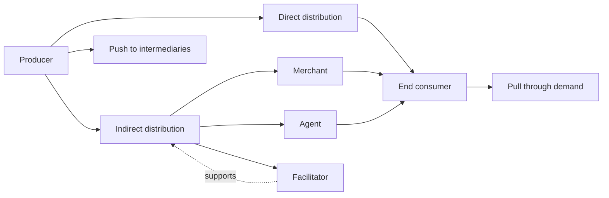

# Chapter 06 Place And Distribution - Context

Source note: `marketing/wiki/chapter-06-place-distribution/chapter-06-place-distribution.md`

Purpose: standalone terminology and decision-language companion for the Marketing Place/Distribution chapter.

## Channel Actors And Roles

| Term | Definition | Aliases to avoid |
|---|---|---|
| Distribution | Making a product or service available for use or consumption by a consumer or business user. | shipping only; logistics only |
| Distribution channel system | The set of independent organizations involved in making the offer available to the user. | sales path only |
| Intermediary | A channel actor between producer and end user. It may be a merchant, agent, or facilitator. | retailer for every third party |
| Merchant | Intermediary that buys, takes title, and resells merchandise. | agent; facilitator |
| Wholesaler | Merchant that buys and resells to retailers or other business actors. | retailer |
| Retailer | Merchant that sells to final customers. | channel in general |
| Agent | Intermediary that searches for customers or negotiates on the producer's behalf without taking title. | merchant |
| Facilitator | Actor that supports distribution, such as transport, warehousing, banking, or advertising, without taking title or negotiating sales. | intermediary who sells |
| End consumer | Final user or consuming party reached by the channel. | retailer; buyer in every case |

## Distribution Decision Rules

| Term | Definition | Aliases to avoid |
|---|---|---|
| Distribution goal | The intended channel outcome, such as cost reduction, market coverage, channel-image use, collaboration, flexibility, or control. | logistics KPI only |
| Market coverage | Extent to which a product is available across relevant outlets, regions, or customer access points. | market share |
| Channel image | Associations transferred from a channel or retailer to the product/brand. | retailer reputation only |
| Channel control | Manufacturer's ability to influence price, presentation, service, territory, customer group, and data access. | ownership only |
| Channel conflict | Tension caused by different manufacturer and retailer goals, power, information, or expectations. | bad relationship only |
| Distribution management | Governance of channel structure, legal bindings, sales bodies, information, and relationships. | logistics |
| Physical/logistical distribution | Physical movement of benefits/services and related information flows to the end user. | full distribution policy |

Decision cheat sheet:

```text
If the question is about who sells, controls, owns the customer relation, or coordinates intermediaries -> distribution management.
If the question is about physical movement, delivery, warehousing, or information flows around delivery -> logistics.
```

## Channel Structure

| Term | Definition | Aliases to avoid |
|---|---|---|
| Direct distribution | Producer reaches the end customer without marketing intermediaries. | online only |
| Indirect distribution | Producer uses one or more intermediaries to reach the end customer. | weak distribution |
| One-stage indirect channel | Producer -> retail seller -> consumer. | direct channel |
| Two-stage indirect channel | Producer -> wholesaler -> retail seller -> consumer. | several-stage channel |
| Several-stage indirect channel | Producer -> specialty/general wholesalers -> retailer -> consumer. | always inefficient |
| Vertical structure | Number and type of channel levels from producer to customer. | hierarchy inside one firm only |
| Horizontal structure | Breadth and depth of intermediaries at a given channel stage. | market coverage only |
| Breadth | Number of marketing intermediaries per stage. | depth |
| Depth | Type of marketing intermediaries per stage. | breadth |
| Forward integration | Manufacturer moves closer to retail/customer contact. | backward integration |
| Backward integration | Retailer moves closer to production or supply. | forward integration |

Mental model:

```text
Vertical = how many layers between producer and customer.
Horizontal breadth = how many partners at a layer.
Horizontal depth = what kinds of partners at a layer.
```

## Push, Pull, And Coverage

| Term | Definition | Aliases to avoid |
|---|---|---|
| Push strategy | Producer creates selling pressure toward intermediaries, often through trade promotions or sales force support. | aggressive advertising |
| Pull strategy | Producer creates final-customer demand that pulls the product through intermediaries. | passive selling |
| Intensive selling | Product should be available broadly with no major qualitative or quantitative retailer limitation. | maximum profit automatically |
| Selective selling | Manufacturer chooses retailers based on quality criteria such as format, service, expertise, or marketing actions. | exclusive selling |
| Exclusive selling | Manufacturer relies on very few selected partners to control pricing, service, presentation, or brand image. | selective selling |

Coverage correction rule:

```text
Convenience/FMCG -> usually intensive.
Service/image-sensitive product -> often selective.
Luxury/scarcity/control-sensitive product -> often exclusive.
```

## Contractual And Retail Formats

| Term | Definition | Aliases to avoid |
|---|---|---|
| Informal collaboration | Loose channel cooperation, often based on delivery contracts and low manufacturer control. | franchising |
| Framework contract | Contract that predefines prices, quantities, territories, or customer-group limits. | one-off order |
| Exclusive selling agreement | Contractual limitation to selected partners or territories. | own retail store |
| Franchise | Contractual system where a business format/brand is licensed with standardized control. | private label |
| Concession | Brand-operated sales space inside another retailer's location. | shop-in-shop in every case |
| Factory outlet | Producer-controlled sales channel, often selling directly through outlet stores. | wholesaler |
| Own retail store | Direct sales body owned/controlled by the firm. | selective retailer |
| Private label | Retailer-owned brand, often produced by suppliers or manufacturers. | manufacturer brand |

## Retail Technology And Research Language

| Term | Definition | Aliases to avoid |
|---|---|---|
| Scan&Go | Self-service checkout in which shoppers scan items while shopping and pay without conventional cashier checkout. | cashierless store in every case |
| Just Walk Out | Sensor/data-based cashierless retail model where entry, product taking/returning, and payment are tracked automatically. | normal self-checkout |
| Technology-enabled personalization | Personalization using data collection, analytics, automation, CRM, AI, apps, kiosks, or digital signage. | cold automation only |
| Human-enabled personalization | Personalization based on sales staff knowledge, conversation, intuition, and interpersonal skill. | manual inefficiency |
| In-store behavior tracking | Methods for measuring shopping behavior in physical retail, such as surveys, observation, RFID, CCTV, eye tracking, and VR. | purchase proof |
| Eye tracking | Measurement of visual attention and gaze behavior. It does not by itself prove persuasion or purchase. | mind reading |
| Self-expansion | Consumer perception that an experience expands identity, abilities, or social/experiential possibilities. | entertainment only |
| Metaverse retail | Virtual retail environment where consumers interact, express identity, socialize, and may buy virtual or physical-linked items. | online shop only |
| Haptics | Touch-related consumer experience, including actual, device-mediated, imagined, or language-evoked touch. | physical touch only |
| Actual touch | Proximal physical contact with a product, object, or person. | haptics in all forms |
| Device-mediated touch | Touch experienced through electronic interfaces or feedback, such as touchscreen or vibration. | actual product touch |
| Imaginal touch | Mental simulation of touch evoked by advertising or marketing prompts. | physical contact |
| Touch in language use | Words or nonverbal language cues that convey haptic experience, such as "soft" or "feel". | sensory copy only |

## Relationships Between Canonical Terms

- **Distribution** splits into **distribution management** and **physical/logistical distribution**.
- **Distribution channel system** contains **merchants**, **agents**, and **facilitators**.
- **Direct distribution** increases **channel control** but requires more internal capability.
- **Indirect distribution** increases reach through **intermediaries** but creates **channel conflict** risk.
- **Push strategy** works through intermediaries; **pull strategy** works through customer demand.
- **Intensive**, **selective**, and **exclusive selling** are coverage choices, not quality rankings.
- **Technology-enabled personalization** scales relevance; **human-enabled personalization** adds empathy and complex judgment.
- **Self-expansion** explains why **metaverse retail** can create purchase intention for virtual items.
- **Haptics** can be physical, device-mediated, imagined, or language-based.

## Example Dialogue

Student: "For a premium skincare brand, should the distribution goal be maximum market coverage?"

Coach: "Not automatically. First define the positioning. If the brand relies on expert advice, controlled presentation, and trust, **selective selling** may be better than **intensive selling**. The brand might use trained retailers plus its own web shop. That gives enough reach while preserving **channel image** and **service quality**."

Student: "So the retailer is just logistics?"

Coach: "No. Logistics moves the product. The retailer is part of **distribution management**: it affects image, assortment, price, advice, customer data, and the final experience."

## Exam Traps And Correction Rules

| Trap | Correction rule |
|---|---|
| "Distribution = shipping" | Say distribution includes channel governance plus physical/logistical distribution. |
| "More outlets is always better" | Match coverage intensity to product type, image, service need, and control requirement. |
| "Push means aggressive ads" | Push means pressure through intermediaries; pull means final-customer demand. |
| "Every intermediary buys the product" | Merchants take title; agents and facilitators do not. |
| "AI personalization is always better" | Compare scalability/consistency against privacy, trust, and loss of human empathy. |
| "Eye tracking proves purchase intention" | Eye tracking measures attention; interpretation needs additional evidence. |
| "Touch means only physical stores" | Haptics also includes device-mediated, imaginal, and language-based touch. |

## Compact Visual


