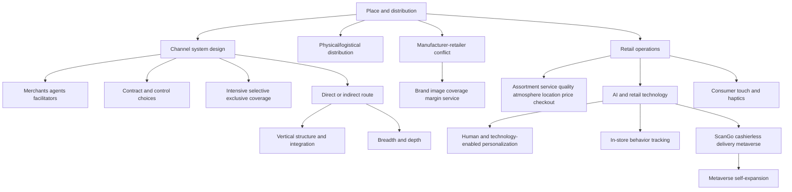

# Chapter 06: Place And Distribution

Source file: `marketing/raw/GM 2026 Chapter6.pdf`

Course: Marketing

Processed: 2026-07-11

Wiki note: `marketing/wiki/chapter-06-place-distribution/chapter-06-place-distribution.md`

Course logistics checked: Marketing is assessed through a 90-minute written examination covering all lecture materials, with special attention to discussed research papers. This chapter follows Promotion and completes the `Place` element of the marketing mix.

## 80/20 Exam Summary

Place/distribution answers the question: how does the firm's value proposition reach the customer with the right availability, cost, control, image, service, and data feedback?

High-yield ideas:

- Distribution is not only logistics. It includes channel structure, intermediary roles, legal relationships, power/conflict, retail format, data collection, personalization, and last-mile access.
- A distribution channel system is the set of organizations that make the product or service available for consumption.
- Intermediaries can be merchants, agents, or facilitators. The exam trap is to classify every third party as a retailer; only merchants take title and resell.
- Distribution goals must fit the rest of the marketing strategy: cost, market coverage, channel image, collaboration, flexibility, and control.
- Manufacturers and retailers often want different things: manufacturer brand image, broad availability, and low margins may clash with retailer assortment image, selective focus, and high margins.
- Channel design requires vertical structure, horizontal structure, and contractual control choices.
- Push and pull are channel-pressure logics. Push motivates intermediaries; pull creates customer demand that pressures the channel.
- Direct distribution gives control and customer data but requires capabilities. Indirect distribution gives reach and specialization but creates dependency and conflict.
- Retail is being changed by AI, personalization, Scan&Go, cashierless stores, delivery services, metaverse channels, in-store tracking, and haptic/touch research.
- Research-paper slides are examinable because logistics explicitly says discussed research papers receive special focus.

## Core Concepts

### Distribution And Channel System

Distribution is the process of making a product or service available for use or consumption by a consumer or business user. It can be direct or indirect.

A distribution channel system is the particular set of independent organizations involved in making a product or service available.

| Actor | Role | Takes title? | Example |
|---|---|---:|---|
| Merchant | buys and resells merchandise | yes | wholesaler, retailer |
| Agent | searches, negotiates, or represents producer | no | broker, sales agent, manufacturer's representative |
| Facilitator | supports distribution without buying or negotiating | no | transport firm, warehouse, bank, advertising agency |

Managerial implication: channel design is a governance problem, not just a shipping problem. The firm chooses who owns the customer relationship, who controls service quality, who carries inventory, and who captures margin.

### Distribution Goals

Distribution goals include:

- reduce distribution costs or increase margin
- increase market coverage
- use a distribution channel's image
- collaborate with intermediaries
- increase flexibility and control over distribution channels

Goals must align with marketing and corporate goals. A luxury brand may reject maximum coverage because scarcity, service, and presentation are part of the brand value. A fast-moving consumer goods brand may prioritize ubiquity.

## Channel Conflict

Channel conflict arises because manufacturers and retailers optimize different objectives.

| Policy area | Manufacturer tendency | Retailer tendency | Exam implication |
|---|---|---|---|
| Product | protect product and brand image | protect assortment image and private label | The retailer may not support the manufacturer's full brand meaning. |
| Distribution | few large deliveries, high coverage, many variants | just-in-time deliveries, selective focus | Logistics efficiency and market coverage can conflict. |
| Communication | brand loyalty and differentiation | retailer loyalty, retail differentiation, complementary products | Channel partner may advertise the category or store rather than the brand. |
| Price | identical prices, low retailer margin | differentiated prices, high retailer margin | Price consistency and channel margin are a common conflict point. |

Causes include purchasing-power differences, information asymmetries, conflicting goals, and conflicting expectations.

## Distribution Management Versus Logistics

Distribution management concerns channel decisions from producer to end user from a legal, economic, informational, and relationship perspective. It covers:

- selection and structuring of channels
- legal bindings of channels
- selection and control of sales bodies

Physical/logistical distribution concerns the physical flow of benefits/services and related information flows to the end user.

Exam trap: do not use "logistics" as a synonym for all distribution policy. Logistics is the physical-flow subsystem; distribution management also covers channel governance and relationship control.

## Designing Distribution Systems

### Push Versus Pull

| Strategy | Direction of pressure | Main target | Typical use |
|---|---|---|---|
| Push | producer -> intermediaries -> consumer | channel members | trade promotions, sales force, retailer incentives |
| Pull | consumer demand -> intermediaries -> producer | final customers | advertising, consumer promotions, brand preference |

Push asks the intermediary to sell harder. Pull asks the customer to demand the product so the intermediary wants to stock it.

### Direct Versus Indirect Distribution

Direct distribution means the producer reaches the end consumer without marketing intermediaries. Indirect distribution adds one or more intermediary stages.

| Structure | Route | Strength | Weakness |
|---|---|---|---|
| Direct channel | producer -> end consumer | control, margin capture, customer data | requires sales/logistics/service capability |
| One-stage indirect | producer -> retail seller -> consumer | retail reach and local access | retailer controls point of sale |
| Two-stage indirect | producer -> wholesaler -> retail seller -> consumer | broader reach and inventory aggregation | more margin sharing and less control |
| Several-stage indirect | producer -> specialty wholesaler -> general wholesaler -> retailer -> consumer | useful for fragmented markets | slow, complex, lower transparency |

Horizontal structure adds:

- breadth: number of marketing intermediaries per stage
- depth: type of marketing intermediaries per stage

### Vertical Structure And Integration

Forward integration means the manufacturer moves closer to retail/customer contact, such as factory outlets or own retail stores. Backward integration means the retailer moves toward supply or production, such as private label brands or own production of simple products.

Examples:

- shop-in-shop: producer presence inside another retailer
- franchise: standardized business format with legal and brand control
- concessions: retail space operated by a brand in another store
- factory outlet: brand-controlled discount or direct sales channel
- own retail store: maximum control and data, higher fixed commitment
- private label: retailer uses supplier/manufacturer capacity to build own brand power

## Horizontal Structure: Coverage Intensity

| Coverage choice | Logic | Suitable for | Trade-off |
|---|---|---|---|
| Intensive selling | be available everywhere; no qualitative or quantitative retailer limitation | convenience goods, FMCG | high reach, low control |
| Selective selling | choose retailers by quality criteria | products needing service, expertise, image fit | balanced reach and control |
| Exclusive selling | rely on very few partners | luxury, high-service or image-sensitive products | high control, low reach |

Exam trap: exclusive distribution is not automatically "better". It fits when brand presentation, service level, or scarcity matters more than ubiquity.

## Contractual Relationships And Control

Channel contracts differ by retailer freedom and manufacturer control.

Low-control forms include informal collaboration and delivery contracts. Stronger control appears in framework contracts that set prices and units, limit regions, or limit sales to customer groups. Exclusive selling, franchising, own retail stores, and sales representatives increase manufacturer control.

The channel-control continuum moves from indirect sales with high retailer freedom to direct sales with high manufacturer control.

## Retail Operations And New Retail Channels

Retail choice factors include assortment, service, product quality, store atmosphere, location, price level, checkout speed, opening hours, friendliness of salespeople, and parking. Visit frequency is influenced by store attitude, store image, and gender in the cited lecture slide.

New physical retail concepts:

- Scan&Go and self-service checkout systems
- Amazon Go-style "Just Walk Out" cashierless stores
- cashierless kiosks such as shop.box and collect.box
- mobile snack or mini-store concepts
- delivery services such as flaschenpost

Managerial implication: "Place" increasingly includes friction reduction. Checkout speed, data capture, payment automation, and last-mile convenience can become part of the value proposition.

## AI, Personalization, And Retail Data

AI in retail is framed as a way to improve personalization, operational decisions, recommendations, inventory/channel decisions, and customer experience. The exam issue is not "AI is good"; it is when AI increases relevance and efficiency without damaging privacy, trust, or service quality.

### Personalization In Physical Stores

Scholdra, Wichmann, and Reinartz (2023) distinguish human-enabled and technology-enabled personalization.

| Type | Mechanism | Strength | Weakness |
|---|---|---|---|
| Human-enabled personalization | staff knowledge, conversation, intuition, interpersonal skill | empathy, rich adaptation to unique needs | limited scalability, inconsistent quality |
| Technology-enabled personalization | CRM, analytics, AI, apps, kiosks, digital signage | scalable, consistent, data-driven | privacy risk, weaker human/emotional connection |

Examples from the slide include Nordstrom personal stylists, Levi's Tailor Shop, Apple store service, Sephora Color IQ, OBI's heyOBI app, H&M COS smart mirrors, LoweBot, Superfeet biometric insoles, and IKEA kitchen planning.

### Tracking In-Store Shopping Behavior

Nordfalt and Ahlbom (2024) compare methods:

| Method | Strength | Weakness |
|---|---|---|
| Surveys | low cost, easy, flexible | memory/perception bias |
| Manual observation | actual behavior and context | labor intensive, limited detail |
| RFID tracking | large automated datasets | imprecise if shoppers leave carts; limited to cart movement |
| Video/CCTV | behavior and spatial patterns | synchronization complexity and privacy concerns |
| Screen-based eye tracking | controlled and easier to analyze | forced exposure and less realism |
| VR-based eye tracking | controlled with better retail realism than screen labs | resource-intensive and artificial |
| Field eye tracking | precise attention data and authentic context | costly, slow, sample-size limits |

Exam trap: each method measures a different layer. A survey measures reported perception; eye tracking measures attention; neither automatically proves purchase causality.

## Metaverse Retail And Self-Expansion

Ahn, Jin, and Seo (2024) are used to explain why consumers buy virtual items in metaverse contexts. The slide's structural model shows self-expansion as the central mediator. Significant paths emphasized:

- playfulness -> self-expansion
- connectedness -> self-expansion
- self-expansion -> purchase intention of virtual items

Control, synchronicity, and responsiveness appear in the model, but the significant bold paths focus on playfulness and connectedness feeding self-expansion, which then drives purchase intention.

Managerial implication: virtual retail works when the environment helps consumers expand identity, play, and social connection. It is not just another shelf.

## Consumer Touch And Haptics

Krishna, Luangrath, and Peck (2024) organize haptics in consumer research across a continuum from physical contact to no physical contact:

| Category | Meaning | Marketing relevance |
|---|---|---|
| Actual touch | physical contact with product/object or person | texture, weight, ownership feelings, social influence |
| Device-mediated touch and feedback | touch through electronic devices | touchscreens, AR/VR, notifications, vibrotactile feedback |
| Imaginal touch | mental imagery of touch | ads and descriptions that make consumers imagine touching |
| Touch in language use | verbal/nonverbal haptic cues | words like "soft" or textual paralanguage conveying tactile sentiment |

Exam trap: touch is not limited to physically touching a product in a store. Digital and language-based cues can evoke perceived haptic experience.

## Visual Knowledge Map

## Subject Knowledge Graph

| Node | Meaning | Exam Relevance |
|---|---|---|
| Distribution | Making a product/service available for use or consumption | Base definition for Place questions |
| Distribution channel system | Set of organizations involved in making the offer available | Explains why channel actors matter |
| Merchant | Intermediary that takes title and resells | Separates retailers/wholesalers from agents |
| Agent | Intermediary that searches or negotiates without title | Avoids wrong ownership assumptions |
| Facilitator | Supports distribution without title or negotiation | Clarifies logistics/support actors |
| Push strategy | Producer pressure toward intermediaries | Channel-management logic |
| Pull strategy | Consumer demand pressure toward intermediaries | Links communication and distribution |
| Direct distribution | Producer sells to end consumer | High control/data, capability burden |
| Indirect distribution | Route uses intermediaries | Reach/specialization, lower control |
| Intensive selling | Maximum market coverage | FMCG availability logic |
| Selective selling | Retailer choice by quality criteria | Service and image fit |
| Exclusive selling | Very few partners | Luxury/control logic |
| Technology-enabled personalization | Scalable data-driven personalization | Physical-store digitalization |
| Self-expansion | Consumer feels identity/capability expansion | Explains metaverse purchase intention |
| Haptics | Touch-related consumer experience | Retail and digital sensory strategy |

| From | Relationship | To | Why It Matters |
|---|---|---|---|
| Distribution goals | must align with | Marketing and corporate goals | Place cannot be optimized alone |
| Manufacturer goals | can conflict with | Retailer goals | Explains channel tension |
| Push strategy | targets | Intermediaries | Distinguishes trade pressure from consumer demand |
| Pull strategy | targets | Consumers | Explains demand-driven channel pressure |
| Direct distribution | increases | Manufacturer control | But raises execution burden |
| Indirect distribution | increases | Market reach | But shares margin and data |
| Intensive selling | maximizes | Coverage | Fits convenience/high-availability products |
| Exclusive selling | protects | Brand image and service quality | Fits luxury or high-service positioning |
| Personalization | depends on | Data and human service | Key retail technology trade-off |
| Playfulness and connectedness | increase | Self-expansion | Explains virtual-item purchase intention |
| Haptic cues | influence | Product experience and evaluation | Touch matters even in digital/language formats |

## Real Business Examples

- Coca-Cola or chewing gum: intensive distribution because availability matters more than channel exclusivity.
- Rolex or high-end fashion: selective/exclusive selling because service, scarcity, and presentation support brand image.
- Apple Store: direct or tightly controlled retail experience that supports product education, service, and brand experience.
- Sephora Color IQ: technology-enabled personalization with human store support.
- Amazon Go: cashierless retail reduces checkout friction but requires heavy data, sensor, and trust infrastructure.
- IKEA kitchen planner: technology plus human advice helps customers design a complex purchase.

## Exam Relevance

Likely exam prompts:

- Define distribution and distinguish merchants, agents, and facilitators.
- Compare direct and indirect distribution for a brand entering a new market.
- Explain push versus pull and show how it links to promotion.
- Recommend intensive, selective, or exclusive distribution for a given product.
- Diagnose manufacturer-retailer conflict in product, price, communication, or distribution goals.
- Explain why physical stores still matter despite e-commerce growth.
- Interpret one research-paper model: physical-store personalization, metaverse self-expansion, eye tracking, or consumer touch.

Common traps:

- Treating distribution as only transportation.
- Assuming maximum coverage is always best.
- Confusing push/pull with aggressive/soft communication tone.
- Calling every intermediary a retailer.
- Ignoring the channel image effect on brand positioning.
- Treating AI personalization as automatically superior to human service.
- Treating eye tracking, touch, or metaverse concepts as gimmicks rather than decision mechanisms.

High-scoring answer structure:

1. State the distribution objective and customer need.
2. Identify the channel actors and route: direct, one-stage, two-stage, or several-stage.
3. Choose coverage intensity: intensive, selective, or exclusive.
4. Discuss control, margin, data, service quality, and conflict.
5. Link to the rest of the 4Ps and to customer experience.

## Retrieval Prompts

Closed-book questions:

1. Define distribution, distribution channel system, merchant, agent, and facilitator.
2. Explain the difference between distribution management and logistics.
3. What is the difference between direct and indirect distribution?
4. When should a brand use intensive, selective, or exclusive selling?
5. Why can manufacturer and retailer goals conflict?
6. How do playfulness and connectedness explain metaverse purchase intention in the Ahn et al. model?
7. What is the difference between human-enabled and technology-enabled physical-store personalization?
8. Name four ways consumer touch can matter even without direct physical contact.

Application prompts:

1. A luxury watch brand wants to expand online. Recommend a distribution structure and justify coverage intensity.
2. A grocery brand wants rapid national availability. Should it push, pull, or combine both?
3. A retailer wants to personalize in-store recommendations. Choose between staff training, CRM/app data, smart mirrors, or a hybrid.
4. A firm uses field eye tracking to test shelf layout. What does the method measure, and what can it not prove?

## Practice Tasks

1. Mini-case: A sustainable sneaker startup must choose between its own web shop, Amazon, selected concept stores, and a flagship store. Build a channel recommendation using control, coverage, margin, image, and data.
2. Comparison: Explain why Amazon Go and Nordstrom personal stylist both count as retail personalization but solve different problems.
3. Research-paper interpretation: In two paragraphs, explain why a metaverse store should design for playfulness and connectedness rather than only product display.
4. Exam drill: Given a product category, choose intensive/selective/exclusive selling and defend the choice in five bullet points.

## Connections

Previous Marketing notes:

- `marketing/wiki/chapter-01-basic-concepts-of-marketing/chapter-01-basic-concepts-of-marketing.md`: completes the 4Ps and links Place to the marketing management process.
- `marketing/wiki/chapter-03-product/chapter-03-product.md`: distribution must fit product type, product levels, innovation, and customer value.
- `marketing/wiki/chapter-04-price/chapter-04-price.md`: retailer margins, price differentiation, and channel conflict affect pricing policy.
- `marketing/wiki/chapter-05-promotion-communication/chapter-05-promotion-communication.md`: push/pull and channel image link promotion to distribution.

Cross-course links:

- Supply Chain Management: logistics, intermediaries, capacity, last-mile delivery, and channel flow.
- Organization: channel governance and conflict among independent organizations.
- Finance: margin, fixed retail investment, channel cost, and customer lifetime value implications.

## Open Uncertainties

- Several retail-sales and AI-market slides are image/chart based; the extracted text did not preserve all numeric chart values. The exam-useful takeaway is direction and concept rather than memorizing exact chart numbers unless the lecturer explicitly emphasized them in class.

## Weakness Flags

- Add after active recall: direct versus indirect route selection, push/pull application, and research-paper model interpretation.
