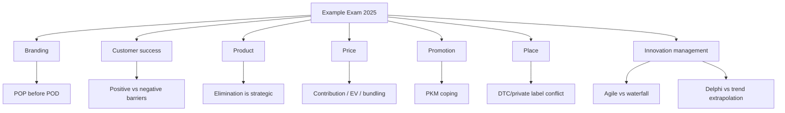

# Example Exam Marketing 2025 - Context

Source note: `marketing/wiki/example-exam-marketing-2025/example-exam-marketing-2025.md`
Source PDF: `marketing/raw/Marketing.pdf`

Purpose: standalone terminology and trap-control companion for the scanned 2025 Marketing and Innovation Management example exam.

## Exam Source Language

| Term | Definition | Aliases to avoid |
|---|---|---|
| **Historical Example Exam** | Past or sample exam source useful for diagnostics but not necessarily identical to the current exam rules. | current exam rules |
| **Inferred Answer Key** | Answer guide derived from course notes and reasoning because no official solution key is present. | official solution |
| **OCR Boundary** | Scan-to-text uncertainty; visually verify tables, formulas, and small symbols before relying on extracted text. | perfect transcript |

## Branding And Customer Success Terms

| Term | Definition | Aliases to avoid |
|---|---|---|
| **House Of Brands** | Portfolio strategy where separate brands stand largely independently, helping isolate risk. | branded house |
| **Branded House** | Portfolio strategy where the master brand is central across offerings. | house of brands |
| **Line Extension** | Existing brand used for a close variant within an existing product line. | brand extension into any new category |
| **Ingredient Branding** | Branding a component or ingredient inside another branded product. | co-branding only |
| **Brand Identity** | Desired self-presentation and associations from the firm's perspective. | brand image |
| **Brand Image** | Actual consumer perception of the brand. | brand identity |
| **Brand Salience** | Ability of the brand to come to mind in relevant contexts. | emotional bond |
| **Brand Resonance** | Highest CBBE level involving loyalty, attachment, community, or engagement. | recall only |
| **Point Of Parity** | Association needed for category legitimacy. | unique advantage |
| **Point Of Difference** | Strong, favorable, unique association that explains why this brand should be chosen. | basic category feature |
| **Positive Switching Barrier** | Retention support that adds value, such as loyalty rewards, clubs, or guarantees. | lock-in fee |
| **Negative Switching Barrier** | Retention obstacle based on penalty, lost data, contractual minimum, or friction. | loyalty |

## Product, Price, Promotion, Place Terms

| Term | Definition | Aliases to avoid |
|---|---|---|
| **Collaborative Filtering** | Recommender logic based on user/user-item behavior similarities. | product-attribute matching |
| **Content-Based Filtering** | Recommender logic based on item attributes and a user's past preferences. | user-neighbor matching |
| **Product Elimination** | Strategic removal of a product; evaluate sales, contribution, brand image, suppliers, partners, know-how, and customer effects. | delete low sales |
| **Penetration Pricing** | Low initial price to accelerate adoption, scale, market share, or network effects. | skimming |
| **Surge Pricing** | Dynamic price increase under real-time supply-demand imbalance. | arbitrary price gouging |
| **Expected Profit** | Probability-weighted average of scenario profits. | expected sales |
| **Pure Bundling** | Products are available only as a bundle. | mixed bundling |
| **Mixed Bundling** | Products are available both separately and as a bundle. | pure bundling |
| **Push Strategy** | Communication pressure aimed at intermediaries such as wholesalers or retailers. | consumer advertising |
| **Pull Strategy** | Final-customer demand creation that encourages intermediaries to stock the product. | trade promotion |
| **Persuasion Knowledge Model** | Consumer recognition of persuasion attempts and coping responses. | automatic rejection |
| **Earned Media** | Voluntary, independent consumer or third-party brand-related content. | paid placement |
| **eWOM** | Online word-of-mouth that can be persistent, searchable, scalable, anonymous, and source-dependent. | ordinary ad |
| **Exclusive Distribution** | Very limited channel coverage to preserve control, service, scarcity, or prestige. | always no conflict |
| **Direct Distribution** | Producer reaches customers without marketing intermediaries. | warehouse-only distribution |
| **Channel Conflict** | Tension among manufacturers and retailers over margins, price, shelf space, private labels, DTC, data, or control. | only international conflict |

## Innovation Management Bridge Terms

| Term | Definition | Aliases to avoid |
|---|---|---|
| **Customer Co-Creation** | Customers participate in idea generation, voting, design, testing, or value creation. | closed innovation |
| **Crowdsourcing** | Open call to a crowd for ideas, input, or solutions. | Delphi method |
| **Lead User** | User experiencing future mainstream needs early and sometimes developing solutions. | ordinary average customer |
| **Tacit Knowledge** | Experiential, intuitive knowledge that is difficult to articulate and often transferred through observation, mentorship, or informal networks. | written manual |
| **Innovation Leadership** | Leadership that enables experimentation, learning, curiosity, psychological safety, and exploration/exploitation balance. | top-down control |
| **Innovation Alliance** | Collaboration that gives access to complementary skills, resources, markets, or technologies. | post-launch-only partnership |
| **Agile Development** | Iterative, feedback-driven approach that adapts to changing requirements. | no planning |
| **Waterfall Development** | Linear approach suited to stable requirements and low change risk. | best for ambiguity |
| **Product Innovation** | Change in the offering experienced by customers. | process innovation |
| **Process Innovation** | Change in the way the offering is produced, delivered, or operated. | product innovation |
| **Delphi Method** | Anonymous, multi-round expert forecasting method designed to reduce bias and move toward informed consensus. | dominated group discussion |
| **Trend Extrapolation** | Forecasting by projecting past patterns into the future; useful in stable environments but weak under discontinuities. | radical-shock forecast |

## Relationships

- **Brand Identity** can differ from **Brand Image**.
- **Points Of Parity** must be credible before **Points Of Difference** can persuade.
- **Positive Switching Barriers** support retention by adding value; **Negative Switching Barriers** can create resentment.
- **Product Elimination** can affect **Brand Equity**, **Supplier Relationships**, **Customer Relationships**, and **Know-How**.
- **Expected Profit** requires scenario-specific profit before probability weighting.
- **Pure Bundling** can beat **Mixed Bundling** when total bundle WTP is more stable than individual WTP.
- **Push Strategy** works through intermediaries; **Pull Strategy** works through final-customer demand.
- **Persuasion Knowledge Model** explains coping, not automatic rejection.
- **Direct Distribution** can trigger **Channel Conflict** when retailers feel bypassed.
- **Tacit Knowledge** needs social transfer; manuals alone capture mainly explicit knowledge.
- **Agile Development** fits uncertain requirements; **Waterfall Development** fits stable requirements.
- **Delphi Method** reduces dominant-personality bias; **Trend Extrapolation** fails when the past pattern breaks.

## Visual Memory Aid



## Example Dialogue

Student: "For Q11, a 10% price cut means I need 10% more sales, right?"

Coach: "No. The old contribution is `EUR 100`; the new contribution is `EUR 80`. To keep total contribution constant, volume must become `100/80 = 1.25`, so the required increase is 25%."

Student: "If Delphi uses experts, can dominant personalities skew it?"

Coach: "That is exactly what Delphi tries to reduce through anonymity and multiple rounds. Dominance is a bigger problem in ordinary open expert panels."

## Flagged Ambiguities

| Ambiguous phrase | Canonical recommendation |
|---|---|
| "Brand equity is tangible logo value." | Use customer-based brand equity: brand knowledge changes consumer response. |
| "Line extension enters adjacent categories." | If category changes materially, call it brand extension. |
| "High stakes increase price sensitivity." | In urgent situations, customers may become less price sensitive; fairness risk still rises. |
| "Packaging is independent of environmental expectations." | Sustainability expectations shape packaging decisions. |
| "PKM means rejection." | PKM means recognition and coping; rejection is one possible response. |
| "Direct distribution removes conflict." | It can create conflict by bypassing existing retailers. |
| "Tacit knowledge can be fully documented." | Documentation helps explicit knowledge; tacit knowledge needs social learning. |
| "Agile eliminates planning." | Agile uses adaptive planning. |

## Cheat-Sheet Language

```text
Branding: identity intended, image perceived, POP before POD, recall not relationship.
Customer success: satisfaction matters, but moderators and switching barriers also shape retention.
Product: elimination and co-creation have relationship, brand, capability, and expectation effects.
Price: contribution and expected profit decide; behavior and fairness limit acceptance.
Promotion: audience -> objective -> media/message -> measurement; PKM is coping, not automatic rejection.
Place: channel choice trades off reach, control, cost, data, and conflict.
Innovation: tacit knowledge travels socially; agile adapts; Delphi reduces expert-panel bias.
```
