# Example Exam Marketing 2025 - Answer Guide

Source: `marketing/raw/Marketing.pdf`
Course: Marketing
Processed: 2026-07-21
Wiki note: `marketing/wiki/example-exam-marketing-2025/example-exam-marketing-2025.md`

Course logistics checked: the current Marketing exam is on 2026-07-22, lasts 90 minutes, is written, allows a non-programmable calculator, and covers all lecture materials with special focus on discussed research papers. The scanned source itself is a historical/example exam dated 2025-08-11 and states 120 minutes for 35 equally weighted tasks. That historical timing is preserved in `_course-logistics.md` but should not override the current 2026 exam guidance.

Source boundary: `Marketing.pdf` is a 15-page scanned image PDF. Ordinary text extraction was empty, so page images were extracted and OCRed with Tesseract English. The answer sheet on page 1 is blank. The answer key below is inferred from local Marketing notes, the generated OCR, and standard marketing/innovation logic. It is not an official solution key.

Expanded answer logic: see `example-exam-marketing-2025-expanded-rationales.md` for option-level explanations, including why the non-selected choices are wrong or incomplete.

## 80/20 Exam Summary

This example exam is broader than the uploaded 9-question mock. It blends Marketing and Innovation Management:

- Branding: brand architecture, brand functions, identity/image, CBBE pyramid, brand associations, Rolex POP/POD.
- Customer success: success chain, internal/external moderators, positive/negative switching barriers.
- Product: recommender systems, product elimination, packaging, customer co-creation, lead users.
- Price: behavioral pricing, surge pricing, price-cut contribution logic, penetration pricing, expected-profit pricing, bundling.
- Promotion: push/pull, PKM in influencer marketing, owned/paid/earned media, communication goals, eWOM.
- Place: exclusive/direct/indirect distribution and manufacturer-retailer conflict.
- Innovation/organization: tacit knowledge, innovation leadership, alliances, agile/waterfall, product/process innovation, lean startup, Delphi/trend extrapolation.

Fast exam rule:

```text
For "how many are correct" questions, mark each statement T/F first.
For "which are incorrect" questions, watch whether the option asks incorrect statements or correct statements.
For calculations, solve contribution/revenue before looking at the answer options.
```

## Inferred Answer Key

| Q | Topic Route | Answer | Core Reason |
|---:|---|---|---|
| 1 | Brand architecture | C | Three correct; line extension wording overreaches into adjacent categories. |
| 2 | Brand functions/equity | B | Two correct: quality signal and entry barrier; segmentation bypass, vertical integration wording, and tangible-logo equity are wrong. |
| 3 | Brand identity vs image | C | Identity is intended by firm; image is perceived by consumers. |
| 4 | Customer success chain | D | Internal firm-side moderators include switching barriers/contractual ties; customer laziness/inertia can externally affect retention. |
| 5 | CBBE pyramid | D | All four statements are correct. |
| 6 | AI recommenders | C | Collaborative filtering relies on user/user-item behavior similarities. |
| 7 | Brand functions | C | Intermediaries reduce risk/image transfer; consumers reduce overload/self-express; brand leaders build loyalty/premium. |
| 8 | Positive switching barriers | B | Three: loyalty programs, customer clubs, price guarantees. |
| 9 | Behavioral pricing | B | Compromise and decoy are correct; identical response to absolute discount is false. |
| 10 | Rolex POP/POD | C | Two incorrect: prestige as POP, and ignoring basic POP failures. |
| 11 | Price-cut volume | B | 10% price cut requires 25% more volume. |
| 12 | Surge pricing | B | Only statement 2 is incorrect; high stakes often reduce, not increase, price sensitivity. |
| 13 | Product elimination | D | All five consequences are plausible and strategically relevant. |
| 14 | Penetration pricing | C | Low initial price to accelerate adoption/scale and deter competition. |
| 15 | Packaging | B | Statements 1, 2, and 4 are correct; packaging is not independent of environmental expectations. |
| 16 | Expected-profit pricing | A | `p1 = EUR 50` gives expected profit of EUR 90,000 and beats `p2`. |
| 17 | Push/pull | C | Statements 2, 3, and 4 are correct; statement 1 describes pull, not push. |
| 18 | PKM/influencers | C | Four correct; statement 5 overclaims automatic disengagement/distrust. |
| 19 | Brand associations | A | Statements 1, 4, and 5 are correct. |
| 20 | Owned/paid/earned media | C | Earned media is voluntary independent consumer content. |
| 21 | Communication goals | A | Statements 1, 2, and 3 are correct. |
| 22 | Bundling | B | Pure bundle at EUR 130 yields EUR 390, the highest among options. |
| 23 | Exclusive distribution | D | Statements 1, 2, and 4 are correct. |
| 24 | Direct/indirect distribution | C | Direct can increase control/customer interaction but may be costly at scale. |
| 25 | eWOM | D | All four statements are correct. |
| 26 | Channel conflict | D | All listed statements are incorrect. |
| 27 | Customer co-creation | C | Online feature proposals/voting = crowdsourcing-based customer co-creation. |
| 28 | Early customer integration | A | Statements 1, 3, and 4 are correct. |
| 29 | Tacit knowledge | B | Mentorship and informal networks transfer tacit know-how. |
| 30 | Innovation leadership | B | Three correct: experimentation, curiosity, exploration/exploitation. |
| 31 | Innovation alliances | C | Alliances can matter before commercialization, including R&D. |
| 32 | Agile vs waterfall | C | Three correct; agile does not eliminate planning/documentation. |
| 33 | Innovation types | C | New recipes = product innovation; backend logistics redesign = process innovation. |
| 34 | Lean startup/agile | D | Agile teams adapt; they do not freeze the original plan. |
| 35 | Forecasting methods | A | Three correct; Delphi is designed to reduce dominant-personality bias. |

For the broader option-by-option reasoning behind every answer, use:

- `marketing/wiki/example-exam-marketing-2025/example-exam-marketing-2025-expanded-rationales.md`

## Calculation Routes

### Question 11 - Price Cut Volume Increase

Decision problem: keep the same total profit/contribution after lowering price.

Known inputs:

```text
Old price = EUR 200
Variable cost = EUR 100
New price = EUR 180 after 10% price cut
```

Contribution per unit:

```text
Old contribution = 200 - 100 = EUR 100
New contribution = 180 - 100 = EUR 80
```

Volume needed:

```text
Old total contribution = 100 * x
New total contribution = 80 * x_new
80 * x_new = 100 * x
x_new = 1.25x
```

Result: sales volume must increase by **25%**. Answer **B**.

Exam trap: never use the 10% price cut as the required volume increase. Recalculate contribution.

### Question 16 - Expected-Profit Pricing

Decision problem: choose between `p1 = EUR 50` and `p2 = EUR 60` under uncertain competitor pricing.

Known inputs:

```text
Variable cost = EUR 30
Competitor price EUR 50 with probability 0.5
Competitor price EUR 60 with probability 0.5
```

Option 1: `p1 = EUR 50`

```text
Contribution per unit = 50 - 30 = EUR 20
If competitor = EUR 50: profit = 20 * 4,000 = EUR 80,000
If competitor = EUR 60: profit = 20 * 5,000 = EUR 100,000
Expected profit = 0.5 * 80,000 + 0.5 * 100,000 = EUR 90,000
```

Option 2: `p2 = EUR 60`

```text
Contribution per unit = 60 - 30 = EUR 30
If competitor = EUR 50: profit = 30 * 2,000 = EUR 60,000
If competitor = EUR 60: profit = 30 * 3,500 = EUR 105,000
Expected profit = 0.5 * 60,000 + 0.5 * 105,000 = EUR 82,500
```

Result: choose `p1 = EUR 50`, expected profit **EUR 90,000**. Answer **A**.

Exam trap: higher price does not automatically mean higher expected profit; quantity response matters.

### Question 22 - Bundling Revenue

Decision problem: compare separate pricing, pure bundling, and mixed bundling.

WTP table from visual inspection:

| Customer | WTP A | WTP B | Bundle WTP |
|---:|---:|---:|---:|
| 1 | EUR 100 | EUR 40 | EUR 140 |
| 2 | EUR 60 | EUR 100 | EUR 160 |
| 3 | EUR 90 | EUR 90 | EUR 180 |

Option A: separate pricing `A = EUR 90`, `B = EUR 90`

```text
A buyers: customer 1 and 3 -> 2 * 90 = EUR 180
B buyers: customer 2 and 3 -> 2 * 90 = EUR 180
Total revenue = EUR 360
```

Option B: pure bundle at `EUR 130`

```text
All three customers have bundle WTP >= 130
Total revenue = 3 * 130 = EUR 390
```

Option C: mixed bundle `bundle = EUR 150`, `A = EUR 100`, `B = EUR 100`

```text
Customer 1 buys A for EUR 100
Customer 2 buys B for EUR 100
Customer 3 buys bundle for EUR 150
Total revenue = EUR 350
```

Option D: pure bundle at `EUR 180`

```text
Only customer 3 has bundle WTP >= 180
Total revenue = EUR 180
```

Result: pure bundling at `EUR 130` yields **EUR 390**. Answer **B**.

Exam trap: calculate actual buyers under each option. Do not assume mixed bundling always wins.

## Topic Repair Guide

| Missed Questions | Repair Topic | What To Drill |
|---|---|---|
| 1-3, 5, 7, 10, 19 | Branding | Architecture, identity/image, CBBE, associations, POP/POD, brand functions. |
| 4, 8 | Customer success | Success chain moderators and positive versus negative switching barriers. |
| 6, 13, 15, 27, 28 | Product / innovation input | AI recommenders, product elimination, packaging, co-creation, lead users. |
| 9, 11, 12, 14, 16, 22 | Price | Behavioral pricing, contribution math, expected value, surge pricing, penetration, bundling. |
| 17, 18, 20, 21, 25 | Promotion | Push/pull, PKM, owned/paid/earned, goals, eWOM. |
| 23, 24, 26 | Place | Exclusive/direct/indirect distribution and channel conflict. |
| 29-35 | Innovation management / organization bridge | Tacit knowledge, innovation leadership, alliances, agile/waterfall, product/process innovation, forecasting. |

## Visual Knowledge Map

```mermaid
flowchart TD
    Exam[Example Exam 2025] --> Brand[Branding]
    Exam --> Success[Customer success]
    Exam --> Product[Product and innovation input]
    Exam --> Price[Pricing]
    Exam --> Promotion[Promotion and communication]
    Exam --> Place[Place and channels]
    Exam --> Innov[Innovation management bridge]

    Brand --> Architecture[Architecture and leverage]
    Brand --> CBBE[CBBE and associations]
    Brand --> POPPOD[POP/POD positioning]

    Success --> Chain[Acquisition -> satisfaction -> retention -> economic success]
    Success --> Barriers[Switching barriers]

    Product --> Recommenders[AI recommenders]
    Product --> Elimination[Elimination consequences]
    Product --> CoCreation[Customer co-creation and lead users]

    Price --> Behavior[Compromise decoy relativity fairness]
    Price --> Math[Contribution expected profit bundling]

    Promotion --> PKM[Persuasion Knowledge Model]
    Promotion --> Media[Owned paid earned and eWOM]
    Promotion --> Goals[Cognitive affective conative]

    Place --> Coverage[Exclusive distribution]
    Place --> Conflict[Manufacturer-retailer conflict]

    Innov --> Tacit[Tacit knowledge]
    Innov --> Leadership[Innovation leadership]
    Innov --> Agile[Agile and waterfall]
    Innov --> Forecast[Delphi and trend extrapolation]
```



## Subject Knowledge Graph

| Node | Meaning | Exam Relevance |
|---|---|---|
| Example Exam 2025 | Historical scanned 35-question Marketing and Innovation Management exam. | Final diagnostic across Marketing plus innovation topics. |
| Brand Architecture | House of brands, branded house, line extension, ingredient branding, co-branding. | Tests precise strategy labels. |
| Customer Success Chain | Marketing activities to acquisition, satisfaction, retention, and economic success. | Tests moderators and retention logic. |
| Switching Barriers | Positive and negative obstacles to customer switching. | Tests retention mechanism classification. |
| Product Elimination | Strategic removal of a product with brand, cost, relationship, and capability consequences. | Prevents sales-only reasoning. |
| Behavioral Pricing | Price perception effects such as compromise, decoy, relativity, surge fairness. | Tests psychology beyond calculation. |
| Expected-Profit Pricing | Probability-weighted profit comparison under uncertainty. | Requires formula and arithmetic. |
| Bundling | Pricing strategy pooling WTP across products. | Requires buyer-by-buyer revenue comparison. |
| Persuasion Knowledge Model | Consumer recognition and coping with persuasion attempts. | Tests influencer/disclosure logic. |
| eWOM | Scalable, persistent online word-of-mouth. | Tests credibility/source expertise and reach. |
| Channel Conflict | Manufacturer-retailer goal, control, price, and private-label tensions. | Tests Place chapter application. |
| Tacit Knowledge | Difficult-to-articulate know-how transferred through observation and participation. | Innovation-management bridge. |
| Agile/Waterfall | Development mindsets based on uncertainty and feedback timing. | High-yield innovation trap. |
| Delphi / Trend Extrapolation | Forecasting methods for uncertain futures. | Tests method choice and limitations. |

| From | Relationship | To | Why It Matters |
|---|---|---|---|
| Brand Identity | differs from | Brand Image | Intended meaning is not the same as consumer perception. |
| Points Of Parity | enable | Category Legitimacy | Differentiation alone is insufficient. |
| Switching Barriers | moderate | Customer Retention | Satisfaction is not the only retention driver. |
| Product Elimination | can harm | Brand Equity And Relationships | Low sales alone is not enough. |
| Price Cut | changes | Contribution Per Unit | Required volume increase can exceed the price-cut percentage. |
| Expected Profit | weights | Scenario Profits | Higher price can lose if quantity response is too weak. |
| Bundling | pools | Willingness To Pay | Can outperform separate or mixed pricing in the right WTP pattern. |
| PKM Disclosure | activates | Persuasion Coping | Recognition does not always mean rejection. |
| Direct Distribution | increases | Control And Customer Data | But may be costly at scale. |
| Private Label | increases | Channel Conflict | Retailer becomes competitor. |
| Tacit Knowledge | transfers through | Mentorship And Informal Networks | Manuals alone are insufficient. |
| Agile | fits | Changing Requirements | Feedback arrives early enough to adapt. |
| Trend Extrapolation | fails under | Discontinuities | Stable past patterns may break. |

## Exam Traps

| Trap | Correction |
|---|---|
| Treating line extension as any adjacent-category move. | Adjacent category is often brand extension; line extension stays closer to the existing line. |
| Brand equity = logo/trademark value. | CBBE begins with consumer knowledge and response. |
| Switching barriers are all positive. | Loyalty clubs and price guarantees are positive; termination fees and lock-in are negative. |
| POP failures do not matter for luxury brands. | Luxury still needs basic category legitimacy. |
| A 10% price cut needs 10% more sales. | Recalculate contribution per unit. |
| Higher price means higher expected profit. | Weight profit by demand scenario probability. |
| Mixed bundling automatically beats pure bundling. | Compare buyer choices and revenue under each option. |
| PKM always causes rejection. | Coping can include acceptance, resistance, ignoring, or strategic use. |
| Direct-to-consumer removes channel conflict. | DTC can create retailer resistance. |
| Agile means no planning. | Agile plans iteratively and adapts through feedback. |
| Delphi is dominated by vocal experts. | Delphi's anonymity and rounds are designed to reduce that bias. |

## Retrieval Prompts

1. Explain why Q11 requires a 25% volume increase after a 10% price cut.
2. Recompute Q16 from memory and state why `p1` beats `p2`.
3. Recompute Q22 and explain why pure bundling wins.
4. Distinguish brand identity, brand image, brand knowledge, and CBBE.
5. Explain why Rolex still needs points of parity.
6. Give three positive and three negative switching barriers.
7. Explain why PKM activation is not the same as automatic message rejection.
8. Compare direct distribution, indirect distribution, and channel conflict in one manufacturer-retailer example.
9. Distinguish customer co-creation, lead-user method, Delphi forecasting, and closed innovation.
10. Explain why agile is useful under changing requirements but does not eliminate planning.

## Weakness Flags

- Add after active recall: missed questions, raw answer, correction sentence, and chapter repair target.
