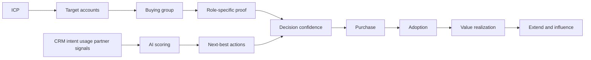

# Guest Lecture Modern B2B Marketing - Context

Source note: `marketing/wiki/guest-lecture-modern-b2b-marketing/guest-lecture-modern-b2b-marketing.md`

Purpose: standalone terminology and decision-language companion for the Modern B2B Marketing guest lecture.

## Core B2B Strategy Terms

| Term | Definition | Aliases to avoid |
|---|---|---|
| B2B marketing | Marketing to organizations, where buying usually involves multiple roles, risk evaluation, ROI logic, and implementation concerns. | boring B2C; corporate advertising only |
| B2C marketing | Marketing to individual consumers or households, often with shorter decision paths and stronger individual preference/emotion logic. | simple marketing |
| Enterprise software | Software sold to organizations, often expensive, configurable, integrated into systems, and dependent on adoption. | app; finished product only |
| Confidence engineering | Mental model that B2B marketing reduces decision risk, builds consensus, and proves value. | manipulation; lead generation |
| Decision confidence | The buyer group's confidence that the solution is useful, credible, and low-risk enough to buy and adopt. | awareness |
| Decision risk | Perceived danger that the product will fail technically, financially, organizationally, legally, or politically. | price only |
| Value proof | Evidence that the solution produces business outcomes, such as ROI, payback, efficiency, revenue, compliance, or reduced risk. | feature list |
| Value narrative | Shareable story that connects customer problem, solution, outcome, and proof in language the buying group can repeat internally. | slogan |

## Buying Group Language

| Term | Definition | Aliases to avoid |
|---|---|---|
| Buying group | Multi-role organizational decision unit that evaluates and influences a B2B purchase. | one persona |
| Economic buyer | Stakeholder responsible for budget, ROI, payback, and funding justification. | end user |
| Business owner | Stakeholder responsible for growth, efficiency, transformation, or process outcome. | budget owner in every case |
| IT/security buyer | Stakeholder responsible for integration, security, reliability, data, and technical risk. | technical blocker only |
| End user | People whose work changes when the product is adopted. They care about usability, workflow, and adoption burden. | buyer in every case |
| Executive sponsor | Senior stakeholder who frames the purchase as a strategic priority. | final approver only |
| Procurement | Function focused on terms, compliance, vendor risk, and purchasing process. | finance |
| Champion | Internal supporter who carries the value narrative through the organization. | salesperson |
| External influencer | Advisor, consultant, analyst, partner, or peer reference shaping confidence and risk perception. | customer |

Role-proof matching:

```text
CFO/economic buyer -> ROI calculator or payback model.
CIO/IT -> architecture brief or security proof.
Business owner -> outcome case or peer story.
End users -> demo path or adoption playbook.
Procurement -> contract, compliance, vendor-risk proof.
```

## Segmentation, Targeting, And ABM

| Term | Definition | Aliases to avoid |
|---|---|---|
| Ideal Customer Profile (ICP) | Account-level description of the type of company that gets most value from the solution and is most valuable to the seller. | buyer persona |
| Firmographics | Company descriptors such as industry, size, region, and revenue. | demographics |
| Technographics | Technology-stack descriptors such as ERP/CRM system, cloud maturity, or integration environment. | firmographics |
| Buying behavior | Account-level purchasing tendencies such as deal size, sales cycle, and propensity to adopt. | personality |
| Buyer persona | Person-level description of a role inside the target account, such as CFO, IT lead, or business owner. | ICP |
| Account-based marketing (ABM) | Coordinated operating model focused on selected target accounts, buying-group insight, value story, coordinated touches, and deal learning. | lead-generation campaign |
| Target account | Specific company or organization selected for focused go-to-market effort. | segment |
| Intent data | Signals suggesting account interest or research activity around relevant topics. | purchase proof |
| Stakeholder-level targeting | Tailoring messages and proof to different roles inside the same account. | personalization only |

Decision rule:

```text
Start with ICP to decide which companies matter.
Then use buyer personas to decide which role-specific proof each stakeholder needs.
```

## 4Ps In Enterprise Software

| Term | Definition | Aliases to avoid |
|---|---|---|
| Product in B2B software | Business capability, platform, integration, roadmap, implementation, and adoption path. | feature set only |
| Price in B2B software | Value-capture and risk-sharing structure, such as subscription, consumption pricing, bundles, discount guidance, or proof of value. | list price only |
| Place in B2B software | Buying and deployment routes, such as direct sales, partners, cloud marketplaces, customer success, and implementation support. | website only |
| Promotion in B2B software | Confidence-building communication across the buying committee using thought leadership, proof, events, executive content, and role-specific assets. | advertising only |
| Customer Value Journey | Lifecycle engagement path such as Discover, Select, Adopt, Derive, Extend, Influence. | funnel only |
| Adoption | Customer organization actually uses the solution in workflows after purchase. | purchase |
| Value realization | Customer derives measurable outcomes from using the solution. | contract signing |
| Customer success | Function that supports adoption, value realization, retention, and expansion. | support desk only |

## Data, AI, And Martech

| Term | Definition | Aliases to avoid |
|---|---|---|
| CRM | Shared account/contact/pipeline system used by marketing and sales. | email tool |
| Marketing automation | Systems for email, nurture, event follow-up, scoring, and handoffs. | spam engine |
| Data integration | Connecting website, email, event, product, partner, and sales data into usable signals. | dashboard only |
| AI scoring | Model-based prioritization of leads/accounts/deals using intent, behavior, history, or conversion patterns. | automatic truth |
| Next-best action | Recommended follow-up triggered by signals or model output. | generic automation |
| Marketing learning system | Loop from signals to models to decisions to activation to learning. | reporting stack |
| Attribution | Assigning observed outcomes to marketing/sales actions or touchpoints. | proof of causality in every case |
| Experiment backlog | Prioritized list of tests to improve messaging, targeting, channels, or offers. | random A/B testing |
| Win/loss learning | Structured learning from deals won or lost. | sales anecdote |

Correction rule:

```text
AI can prioritize, personalize, and detect signals.
Humans still choose positioning, segments, ethics, proof standards, and exceptions.
```

## Partner And Operating Model Terms

| Term | Definition | Aliases to avoid |
|---|---|---|
| Partner ecosystem | Set of firms that help the customer buy, implement, integrate, extend, and realize value from the solution. | reseller channel only |
| Systems integrator | Partner that helps deliver transformation and integrate software into customer processes/systems. | IT department |
| Hyperscaler | Large cloud infrastructure provider that can influence marketplace route and credibility. | any cloud user |
| ISV/app partner | Independent software vendor or app partner providing extensions and industry apps. | reseller |
| Co-sell motion | Coordinated sales effort between vendor and partner. | referral only |
| Marketplace | Platform-based route where enterprise customers can discover, procure, or deploy software. | e-commerce shop only |
| Revenue team | Marketing, sales, partners, and customer success functions aligned around pipeline and customer value. | sales department only |
| Campaign council | Coordination ritual for aligning campaigns, accounts, messages, and teams. | status meeting only |
| Account review | Cross-functional review of target accounts, signals, buying group, next actions, and learning. | sales forecast only |

## Relationships Between Canonical Terms

- **ICP** selects the company; **buyer personas** explain the people inside it.
- **Buying group** creates **decision risk** because roles have different concerns.
- **Confidence engineering** reduces **decision risk** through **value proof**, **role-specific content**, and **partner/customer-success credibility**.
- **ABM** operationalizes **ICP** by coordinating target accounts, buying-group insight, value story, touches, and deal learning.
- **AI scoring** improves focus only when **data integration** and **strategy** are strong.
- **Partner ecosystem** extends **Place** because buying, deployment, and adoption are part of the B2B software offer.
- **Customer Value Journey** shifts the funnel from purchase completion to adoption, value derivation, extension, and influence.

## Example Dialogue

Student: "For B2B SaaS, should we just generate as many leads as possible?"

Coach: "Not if the market is enterprise software. Start with the **ICP**: which accounts have the urgent problem, budget, tech stack, and adoption fit? Then map the **buying group**. A CFO needs ROI proof, IT needs architecture/security proof, and users need adoption proof. That is **confidence engineering**, not just lead volume."

Student: "So ABM is personalized ads?"

Coach: "Personalized ads can be one touch, but **ABM** is broader: target accounts, buying-group insight, value story, coordinated sales/partner/marketing touches, and learning from the deal."

## Exam Traps And Correction Rules

| Trap | Correction rule |
|---|---|
| "B2B = less creative B2C" | Say B2B creativity is aligning stakeholders, proving value, integrating with IT, and reducing risk. |
| "The customer is the user" | In B2B, the customer is a buying group; the user is only one role. |
| "Persona first" | Start with ICP at company/account level; then define personas inside the account. |
| "ABM means fewer but nicer ads" | ABM is account-focused orchestration across marketing, sales, partners, and learning. |
| "AI replaces strategy" | AI scales research, scoring, personalization, and testing, but strategy and ethics remain human responsibilities. |
| "Partner is just a channel" | In enterprise software, partners often create implementation credibility and value realization. |
| "Purchase = success" | For software, adoption and measurable outcomes determine realized value. |

## Compact Visual


