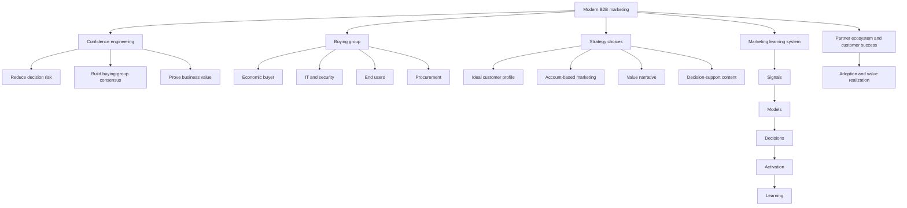

# Guest Lecture: Modern B2B Marketing

Source file: `marketing/raw/Modern B2B Marketing - Guest Lecture at TUM by Namita Gupta-Hehl.pdf`

Course: Marketing

Processed: 2026-07-11

Wiki note: `marketing/wiki/guest-lecture-modern-b2b-marketing/guest-lecture-modern-b2b-marketing.md`

Course logistics checked: Marketing is assessed through a 90-minute written examination covering all lecture materials, with special attention to discussed research papers and in-class materials. This guest lecture is an applied strategy bridge across B2B/B2C marketing, segmentation, 4Ps, data science, ABM, and software marketing.

## 80/20 Exam Summary

Modern B2B software marketing is not a less creative version of B2C marketing. It is a different strategic problem: reduce decision risk, build buying-group consensus, prove business value, and coordinate marketing, sales, partners, customer success, technology, and data.

High-yield ideas:

- B2B customer is not one person. The decision unit is a buying group with economic, technical, user, executive, procurement, and external-influencer roles.
- The core mental model is "confidence engineering": usefulness x credibility x low perceived risk.
- B2B software value is often invisible before adoption, expensive, risky, configurable, and organizationally disruptive.
- The 4Ps still apply, but the unit of analysis shifts from consumer preference to organizational change.
- ICP is the account-level segmentation base; buyer personas are people inside the account.
- Account-based marketing (ABM) flips the question from "how many leads?" to "which accounts should change, and how do we help the buying group decide?"
- Content should make the internal argument easier for the buying group, not merely list features.
- AI, CRM, automation, intent data, and analytics turn marketing into a learning system, but they do not replace customer strategy, proof, consent, or human judgment.
- Partners are not only channels; in enterprise software, partners often become part of the offer because they help implement, integrate, and realize value.

## Core Concepts

### B2B Versus B2C As A Marketing Problem

| Dimension | B2C logic | Enterprise B2B software logic |
|---|---|---|
| Buyer | individual or household | buying committee plus influencers |
| Value | benefit, emotion, convenience | business outcome and quantified ROI |
| Product | finished experience | configurable system plus implementation |
| Place | retail or digital channel | sales, partners, marketplaces, customer success |
| Promotion | preference and conversion | consensus, trust, and risk reduction |
| Research | surveys, experiments, panels | account data, intent signals, usage, sales feedback |

Translation challenge: keep marketing fundamentals, but change the unit of analysis from individual consumer to organizational decision system.

### Confidence Engineering

The lecture's thesis:

```text
B2B marketing reduces decision risk.

Decision confidence = usefulness x credibility x low perceived risk
```

This is a mental model, not a mathematical formula. The managerial task is to:

- reduce risk with adoption paths, proof, references, implementation clarity, and security assurance
- increase consensus with shared language across finance, IT, users, and executives
- prove value with quantified outcomes and credible evidence
- improve pipeline quality by focusing on better-fit opportunities

## The Buying Group

The "customer" is a buying group, not a persona. Enterprise software decisions combine multiple jobs-to-be-done.

| Role | Main concern | Useful proof |
|---|---|---|
| Economic buyer | budget, ROI, payback | ROI calculator, payback model, business case |
| Business owner | growth, efficiency, transformation | value narrative, peer case, outcome evidence |
| IT/security | integration, reliability, risk | architecture brief, security proof, compatibility evidence |
| End users | workflow, usability, adoption | demo path, training/adoption playbook |
| Executive sponsor | strategic narrative and change priority | transformation story, strategic fit |
| Procurement | terms, compliance, vendor risk | contract clarity, vendor-risk evidence |
| Partner/advisor | implementation feasibility | implementation method, partner credentials |

Marketing must make the business case shareable, equip champions for internal selling, reduce risk with proof and peer signals, and coordinate digital, sales, and partner touchpoints.

## Evolution Of B2B And B2C Marketing

### B2C Evolution

B2C moved from TV, print, radio, basic websites, broad segments, and one-way broadcast toward mobile-first, social, influencers, marketplaces, apps, behavioral data, micro-segmentation, real-time optimization, UGC, reviews, and community-driven interactions.

### B2B Evolution

B2B moved from sales-led trade shows, cold calls, printed collateral, vendor-driven journeys, broad firmographic targeting, basic CRM, and spreadsheets toward digital plus sales orchestration, content, webinars, social selling, buyer-driven self-research, shortlisting before sales, ABM, intent data, stakeholder-level targeting, automation, AI scoring, and chatbots.

Convergence: B2B buyers increasingly expect B2C-like digital experiences, including self-service, transparency, and fast answers.

## The 4Ps In Enterprise Software

| P | Enterprise software question | Examples |
|---|---|---|
| Product | What business capability are we helping the customer build? | platform, integration, roadmap, adoption |
| Price | How do we align value capture with buyer risk? | subscription, consumption, bundles, proof of value |
| Place | Which routes make buying and deploying easier? | direct sales, partners, cloud marketplaces, customer success |
| Promotion | How do we create confidence across the committee? | thought leadership, proof, events, executive content |

Strategic shift: not only "what do we sell?" but "how do we make organizational change easier to buy?"

## AI Inside The 4Ps

AI does not replace the 4Ps. It sits inside each P.

| P | Without AI | With AI | Caveat |
|---|---|---|---|
| Product | surveys and sales feedback | usage analytics, in-product recommendations, next-best actions | AI can scale wrong assumptions |
| Price | static lists and manual discounts | price corridors, discount guidance, deal scoring | strategic exceptions need judgment |
| Place | fixed channels and manual territories | direct/partner/digital routing and coverage prioritization | over-automation can hurt trust |
| Promotion | broad segments and batch email | predictive targeting, personalization, automated testing | data quality and bias matter |

Rule: strategy and ethics lead. AI makes choices faster and more data-driven only if the firm owns segmentation, positioning, proof, and governance.

## SAP Customer Value Journey

The lecture uses SAP's customer value journey as a lifecycle engagement example:

```text
Discover -> Select -> Adopt -> Derive -> Extend -> Influence
```

The strategic shift is that the market offer is not only software. It is a path to measurable customer outcomes. Partners and customer success become part of marketing strategy because value is realized after purchase.

## ICP, Personas, And ABM

### Ideal Customer Profile

An Ideal Customer Profile (ICP) describes the type of company that gets the most value from the solution and is most valuable to the seller.

Typical ICP criteria:

- firmographics: industry, company size, region, revenue
- technographics: ERP/CRM stack, cloud maturity
- business model and situation: B2B/B2C, growth stage, key challenges
- buying behavior: deal size, sales cycle, propensity to adopt

```text
ICP = ideal company/account.
Buyer persona = ideal people inside that company.
```

### Account-Based Marketing

ABM is a coordinated operating model:

```text
target accounts -> buying-group insight -> value story -> coordinated touches -> deal learning
```

ABM asks:

```text
Which accounts should change, and how can we help the buying group decide?
```

It does not ask only how many leads the campaign can generate.

### AI-Powered ABM

| Dimension | Traditional ABM | AI-powered ABM |
|---|---|---|
| Account selection | manual lists from firmographics and sales input | scoring from intent, behavior, conversion history |
| Research | human account research | account topics, product signals, intent insights |
| Personalization | manual plays for few top accounts | variations by industry, role, and stage |
| Execution | fixed plays and periodic reporting | real-time targeting, bids, and content optimization |
| Measurement | activity and pipeline reports | pattern detection and next-action recommendations |

AI does not change ABM's goal; it scales account choice, insight, and personalization.

## Content For Complex Change

Good B2B content is not "more information." It is decision support for a buying group.

| Stakeholder | Core question | Useful content |
|---|---|---|
| CFO | Will the economics work? | ROI calculator, payback model |
| CIO/IT | Will this fit and be secure? | architecture brief, security proof |
| Business leader | Will the outcome matter? | value narrative, peer case story |
| Users | Will my work get easier? | demo path, adoption playbook |

Campaigns work when problem framing is role-specific, sales alignment turns interest into pipeline, and the right accounts, channels, and proof are connected. They fail when messaging is generic/feature-heavy, marketing and sales operate in silos, or audience/problem/channel is wrong.

## Marketing Technology And Data Science

B2B marketing uses technology to see account behavior and coordinate revenue teams.

| Tool layer | Role |
|---|---|
| CRM and lead management | shared record of accounts, contacts, pipeline, and sales activity |
| Marketing automation | email, nurture, event follow-up, scoring, and handoffs |
| Data integration | connects website, events, email, product usage, partners, and sales |
| AI and analytics | lead scoring, intent detection, next-best action, and experimentation |

Marketing becomes a learning system:

```text
signals -> models -> decisions -> activation -> learning
```

The hard part is not building a score. The hard part is deciding what action a score should trigger and how teams learn when the score is wrong.

## Partner Ecosystems

In enterprise software, partner ecosystems are part of the offer, not merely a distribution detail.

| Actor | Contribution |
|---|---|
| Software vendor | roadmap, platform, brand |
| Systems integrator | transformation delivery |
| Hyperscaler | cloud infrastructure |
| ISV/app partner | extensions and industry apps |
| Customer success | adoption and value realization |

Managerial implication: Place is not only where the software is bought. It is also how implementation and adoption become credible.

## Strategic Trade-Offs

B2B software marketers manage:

- scale versus relevance
- speed versus confidence
- automation versus trust
- category thought leadership versus product proof
- ecosystem reach versus brand control

Strategic maturity means knowing which side to emphasize for the ICP, buying stage, and growth objective.

## Operating Rhythm

Modern B2B marketing teams coordinate:

- product marketing: positioning, value proof, launch narrative
- demand/ABM: account plays, campaigns, coverage
- digital and data: intent signals, personalization, experiments
- partner marketing: co-sell motions, marketplace, ecosystem proof
- sales and customer success: field feedback, adoption story, expansion signals

Alignment rituals include campaign council, account review, message testing, experiment backlog, and win/loss learning.

## Content Gating Debate

The lecture frames a trade-off:

| Gate content | Ungate content |
|---|---|
| capture intent | reduce friction |
| qualify accounts | build trust |
| route to sales | reach hidden buyers |
| measure demand | support internal sharing |

Better question:

```text
Which content should build confidence before the buyer is willing to reveal themselves?
```

## Seven-Point B2B Strategy Checklist

1. Which customer problem is urgent enough to fund?
2. Which accounts and buying groups are prioritized?
3. What value narrative can travel internally?
4. Which proof reduces perceived risk?
5. Which digital and human interactions should be combined?
6. Which partners make buying and adopting easier?
7. Which metrics show decision confidence and learning?

## Visual Knowledge Map



## Subject Knowledge Graph

| Node | Meaning | Exam Relevance |
|---|---|---|
| Confidence engineering | B2B marketing reduces decision risk and builds confidence | Central guest-lecture thesis |
| Buying group | Organizational decision unit with multiple roles | Replaces single-person persona logic |
| Economic buyer | Role focused on budget, ROI, and payback | Explains CFO content |
| IT/security buyer | Role focused on integration, reliability, and risk | Explains architecture/security proof |
| End user | Role focused on workflow, usability, and adoption | Explains demo/adoption content |
| ICP | Account-level description of best-fit companies | B2B segmentation foundation |
| Buyer persona | Person-level role inside target account | Must not replace ICP |
| ABM | Coordinated account-focused operating model | Core B2B targeting and orchestration method |
| Value narrative | Shareable story connecting product to business outcome | Helps internal selling |
| Marketing learning system | Signals, models, decisions, activation, learning loop | Explains data science role |
| Partner ecosystem | Partners that make buying, deployment, and adoption credible | Place/offer extension in B2B |

| From | Relationship | To | Why It Matters |
|---|---|---|---|
| B2B software marketing | reduces | Decision risk | Explains confidence engineering |
| Buying group | requires | Role-specific proof | Generic messaging fails |
| ICP | selects | Target accounts | Account-level segmentation before personas |
| ABM | coordinates | Marketing, sales, partners | Turns target accounts into focused plays |
| Content | supports | Internal argument | Buying committees need shareable proof |
| AI and analytics | scale | Insight and personalization | But strategy and ethics still lead |
| CRM and automation | coordinate | Revenue teams | Prevents siloed handoffs |
| Partner ecosystem | enables | Adoption and value realization | Software value often arrives after purchase |
| Metrics | should show | Decision confidence and learning | Not only clicks or lead volume |

## Real Business Examples

- SAP: customer value journey shows that marketing continues through adoption, value derivation, extension, and influence.
- ERP analytics add-on: ICP could be mid-to-large firms using SAP or similar ERP, with fragmented reporting and compliance pressure.
- Cloud marketplace route: "Place" in B2B software may be direct sales plus hyperscaler marketplace plus systems-integrator implementation.
- Security proof: a CIO needs architecture and compliance evidence before supporting a deal, even if business users love the product.
- ROI calculator: a CFO needs payback evidence to justify funding; feature claims alone are insufficient.

## Exam Relevance

Likely exam prompts:

- Compare B2B and B2C marketing using the 4Ps.
- Explain why a B2B customer is a buying group rather than one persona.
- Define ICP and distinguish it from buyer persona.
- Explain ABM and why it differs from lead-generation logic.
- Use the confidence-engineering model to design a campaign for B2B SaaS.
- Explain how AI changes B2B marketing workflow without replacing strategy.
- Discuss why partners and customer success are part of the enterprise software offer.

Common traps:

- Treating B2B as boring B2C with higher prices.
- Calling the user the only customer.
- Using personas before defining the account-level ICP.
- Measuring B2B marketing only by lead volume.
- Writing generic product-feature content instead of role-specific proof.
- Assuming AI solves strategy, data quality, consent, or sales alignment problems.

High-scoring answer structure:

1. Identify the target account and urgent business problem.
2. Map the buying group and each role's concern.
3. State the value narrative and proof needed by role.
4. Choose account-focused orchestration: ABM, content, sales, partners, and customer success.
5. Define metrics that show confidence, pipeline quality, adoption, and learning.

## Retrieval Prompts

Closed-book questions:

1. What does "B2B marketing is confidence engineering" mean?
2. Name five buying-group roles and one proof point each needs.
3. Distinguish ICP from buyer persona.
4. Explain how the 4Ps change in enterprise software.
5. What is ABM, and how does it flip the lead-generation question?
6. Why is good B2B content decision support rather than more information?
7. What is the marketing learning system loop?
8. Why are partners part of the offer in enterprise software?

Application prompts:

1. Build a mini buying-group map for a university analytics platform.
2. Draft an ICP for an AI-powered ERP analytics add-on.
3. Decide which high-value content should be gated and which should remain ungated.
4. Recommend a B2B campaign operating rhythm for a SaaS company entering a new industry.

## Practice Tasks

1. Buying committee map: For a cybersecurity SaaS product, list six roles, their concerns, and one proof point each.
2. ABM design: Choose one target-account segment and define the value story, coordinated touches, and learning metric.
3. AI critique: Identify where AI helps account selection and where human judgment remains necessary.
4. Content strategy: Rewrite a feature claim into separate CFO, CIO, business-owner, and user proof messages.

## Connections

Previous Marketing notes:

- `marketing/wiki/chapter-01-basic-concepts-of-marketing/chapter-01-basic-concepts-of-marketing.md`: extends customer value and market orientation into organizational buying.
- `marketing/wiki/chapter-02-branding/chapter-02-branding.md`: thought leadership and proof affect brand trust in B2B.
- `marketing/wiki/chapter-03-product/chapter-03-product.md`: enterprise software product includes roadmap, integration, adoption, and customer success.
- `marketing/wiki/chapter-05-promotion-communication/chapter-05-promotion-communication.md`: communication metrics and persuasion must become role-specific buying-group support.
- `marketing/wiki/chapter-06-place-distribution/chapter-06-place-distribution.md`: B2B Place includes direct sales, partners, marketplaces, and customer success.

Cross-course links:

- Organization: stakeholder alignment, decision systems, and cross-functional coordination.
- Finance: ROI, payback, business cases, subscription pricing, and risk reduction.
- Supply Chain Management: partner ecosystems and implementation routes resemble network/channel design.

## Open Uncertainties

- The lecture is a guest lecture and may be assessed as applied understanding rather than a standalone theoretical chapter. Treat it as an exam bridge: use it to make B2B/B2C, 4Ps, segmentation, communication, and Place answers more managerial.

## Weakness Flags

- Add after active recall: buying-group role mapping, ICP/persona distinction, ABM logic, and choosing proof metrics beyond lead volume.
