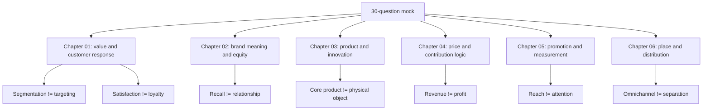

# Mock Exam 30 Questions - Context

Source exam: `marketing/wiki/mock-exam-30-all-chapters/mock-exam-30-all-chapters.md`
Answer key: `marketing/wiki/mock-exam-30-all-chapters/mock-exam-30-all-chapters-answer-key.md`

Purpose: standalone trap-control and terminology companion for the generated 30-question Marketing mock exam.

## Exam Mechanics

| Term | Definition | Aliases to avoid |
|---|---|---|
| **Statement-Count Question** | MCQ format where each listed statement must be marked true or false before choosing the count option. | option guessing |
| **Incorrect-Statement Question** | MCQ format asking for the false statement among mostly true options. | most unfamiliar statement |
| **Formula Question** | Question requiring formula choice, substitution, arithmetic, unit, and interpretation. | final-number-only answer |
| **Boundary Trap** | A statement that sounds plausible because it mixes two nearby concepts. | trick wording only |

## Chapter Boundary Terms

| Term | Definition | Aliases to avoid |
|---|---|---|
| **Segmentation** | Dividing a market into meaningful groups. It does not itself choose the target. | targeting |
| **Targeting** | Selecting which segment or segments the firm will serve. | segmentation |
| **Customer Satisfaction** | Customer response from comparing expectations with perceived performance. | loyalty guarantee |
| **Brand Identity** | Intended meaning from the firm's perspective. | brand image |
| **Brand Image** | Actual consumer perception of the brand. | brand identity |
| **Brand Recall** | Ability to retrieve a brand from memory. It is not proof of relationship alone. | resonance |
| **Core Product** | Fundamental benefit or problem solution. | physical object |
| **Product Mix Breadth** | Number of product lines. | depth |
| **Product Mix Depth** | Number of variants within a product line. | breadth |
| **Contribution Margin Ratio** | Contribution margin divided by revenue; share of sales revenue available for fixed cost and profit. | net profit margin |
| **Weighted CPT** | Cost per thousand adjusted for target-group share. | raw CPT |
| **GRPs** | Reach percentage multiplied by average frequency; total contact pressure. | unique reach |
| **Merchant** | Channel actor that buys and resells merchandise. | every intermediary |
| **Agent** | Channel actor that searches or negotiates without taking title. | merchant |
| **Facilitator** | Channel support actor such as transport, warehouse, bank, or advertising service. | retailer |
| **Omnichannel Strategy** | Integrated online/offline customer journey. | channel separation |

## Relationships

- **Segmentation** comes before **Targeting**.
- **Customer Satisfaction** can support **Retention**, but it does not guarantee loyalty.
- **Brand Identity** is intended; **Brand Image** is perceived.
- **Brand Recall** supports salience; **Brand Relationship** requires loyalty, attachment, community, or engagement.
- **Core Product** explains why the customer buys; **Generic Product** and **Expected Product** describe what must exist.
- **Contribution Margin Ratio** links pricing to break-even revenue.
- **Weighted CPT** corrects broad reach by target fit.
- **Direct Distribution** increases control/data; **Indirect Distribution** increases reach/dependency.
- **Omnichannel Strategy** integrates channels instead of separating them.

## Visual Memory Aid



## Example Dialogue

Student: "If a campaign reaches 40% of the target audience three times, can I say 43 GRPs because 40 plus 3?"

Coach: "No. **GRPs** multiply reach percentage by average frequency: `40 * 3 = 120`. The number is contact pressure, not unique people."

Student: "For a product, the core product is the physical item, right?"

Coach: "No. The **Core Product** is the fundamental benefit. The object is the generic or tangible form that delivers it."

## Flagged Ambiguities

| Ambiguous phrase | Canonical correction |
|---|---|
| "Segmentation chooses the customer." | Segmentation groups; targeting chooses. |
| "Satisfied customers are loyal." | Satisfaction supports retention; loyalty needs behavior/commitment evidence. |
| "Brand recall means relationship." | Recall is salience; relationship is resonance. |
| "Best channel means maximum reach." | Match reach to control, service, image, margin, and customer access needs. |
| "Measurement means sales." | Measurement depends on objective: awareness, memory, attitude, behavior, target fit, or sales. |
| "Dynamic pricing is accepted if profitable." | Price fairness and reference prices affect acceptance. |

## Cheat-Sheet Language

```text
Attempt route:
1. Identify chapter.
2. Name the concept boundary.
3. For calculations: formula -> substitution -> result -> unit.
4. For statement-count questions: T/F each statement first.
5. After grading, write one correction sentence for every miss.
```
