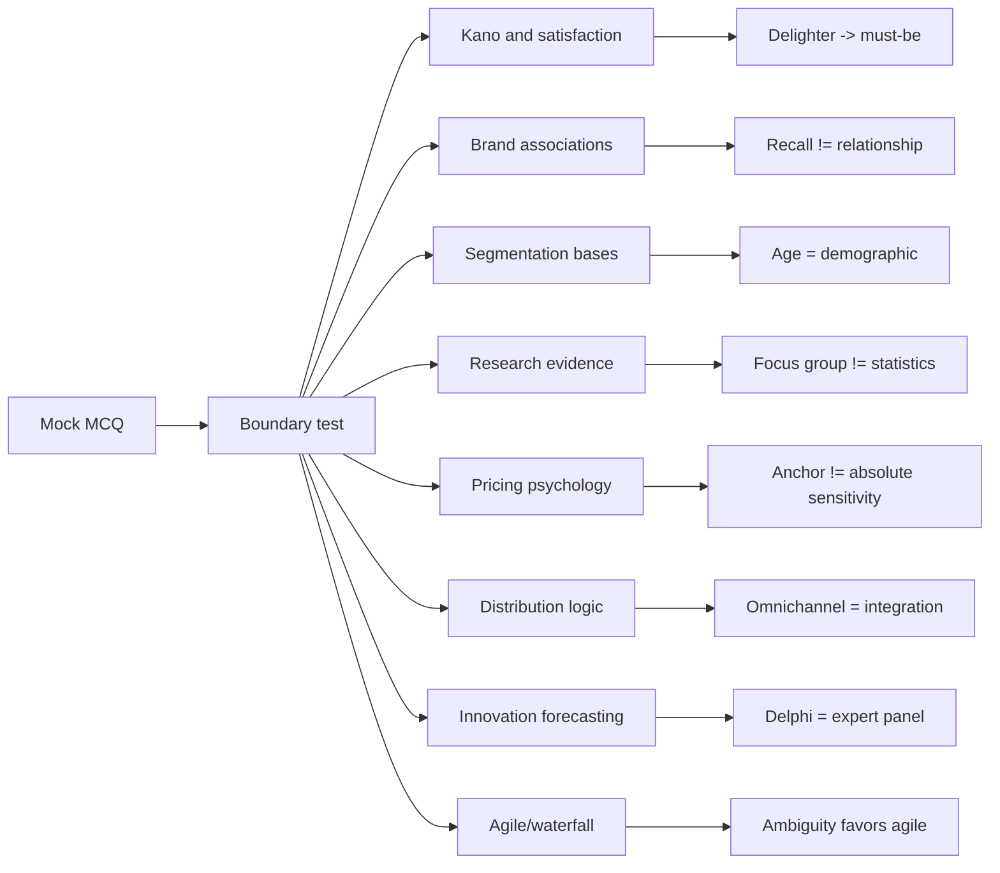

# Mock Exam Questions - Marketing Context

Source note: `marketing/wiki/mock-exam-questions/mock-exam-questions.md`

Purpose: standalone terminology and trap-control companion for the Marketing mock exam. Definition sources are the local Marketing notes plus standard marketing terminology where the mock asks concepts not fully defined in the existing notes.

## Exam-Question Language

| Term | Definition | Aliases to avoid |
|---|---|---|
| **Statement-Count MCQ** | A multiple-choice question where the correct letter depends on how many listed statements are true. Mark each statement true/false before selecting the count option. | guess the option |
| **Incorrect-Statement MCQ** | A multiple-choice question where three statements are true and one is false. Identify the false claim, not the most unfamiliar claim. | choose the weird answer |
| **Trap Word** | A word that makes a statement too broad, too causal, or wrongly classified, such as "always", "generally", "only", or "automatically". | detail |
| **Boundary Test** | The exact distinction that separates two similar concepts, such as recall versus relationship or qualitative insight versus statistical proof. | definition only |

## Customer And Brand Language

| Term | Definition | Aliases to avoid |
|---|---|---|
| **Kano Must-Be Attribute** | Basic attribute whose absence causes dissatisfaction, while presence is usually taken for granted. | delighter |
| **Kano Performance Attribute** | Attribute where better execution increases satisfaction and poor execution reduces satisfaction. | must-be |
| **Kano Excitement Attribute** | Unexpected attribute that can create high satisfaction when present, but whose absence usually does not dissatisfy. | basic feature |
| **Expectation Drift** | Over time, customers can start expecting what previously delighted them; an excitement attribute may become a must-be attribute. | stable delight |
| **Brand Association Strength** | How strongly and consistently an association is linked to the brand in memory and relevant usage contexts. | high recall only |
| **Brand Association Favorability** | Whether the association is positive and fits customer needs, wants, and perceived value. | popularity |
| **Brand Association Uniqueness** | Whether the association differentiates the brand from competitors and supports positioning. | random difference |
| **Brand Recall** | Customer ability to retrieve a brand from memory. It is awareness/salience evidence, not proof of emotional relationship by itself. | loyalty |
| **Brand Relationship / Resonance** | Deep customer-brand connection involving loyalty, attachment, community, or active engagement. | recall |

## Segmentation And Research Language

| Term | Definition | Aliases to avoid |
|---|---|---|
| **Geographic Segmentation** | Grouping customers by location, region, climate, country, or urban/rural context. | demographic |
| **Demographic Segmentation** | Grouping customers by observable population traits such as age, income, education, gender, family status, or occupation. | psychographic |
| **Psychographic Segmentation** | Grouping customers by lifestyle, values, interests, personality, or attitudes. | age or marital status |
| **Behavioral Segmentation** | Grouping customers by usage frequency, loyalty, benefits sought, purchase occasion, or response behavior. | personality |
| **Conjoint Analysis** | Preference-measurement method that estimates how customers trade off product attributes and levels. | simple survey preference |
| **Eye Tracking** | Measurement of visual attention or gaze behavior. It does not by itself prove persuasion, purchase intention, or causality. | mind reading |
| **Focus Group** | Qualitative discussion method useful for exploration, wording, reactions, and idea generation. It is not designed for statistical testing. | representative survey |
| **Quantitative Survey** | Structured measurement from many respondents, better suited than focus groups for statistical generalization when sampled well. | interview chat |
| **Experiment** | Research design that manipulates variables under controlled conditions to test causal relationships. | correlation study |

## Pricing And Distribution Language

| Term | Definition | Aliases to avoid |
|---|---|---|
| **Compromise Effect** | Increased preference for a middle option when an extreme option makes it look balanced. | decoy effect |
| **Anchoring** | Price or value judgment influenced by an initial reference point. It does not automatically imply sensitivity to small absolute differences. | exact price memory |
| **Reference Price** | Internal memory benchmark or externally presented benchmark used to evaluate a current price. | fair price always |
| **Mental Accounting** | Tendency to treat money differently depending on source, budget, purpose, or spending category. | rational cash equivalence |
| **Direct Distribution** | Producer reaches customers without marketing intermediaries, increasing control and data but requiring capability. | online only |
| **Indirect Distribution** | Producer uses intermediaries to reach customers, often increasing reach but reducing control and sharing margins. | cheaper always |
| **Omnichannel Strategy** | Coordinated integration of online and offline channels into one customer journey. | channel separation |
| **Channel Conflict** | Tension among manufacturers, retailers, and other channel members caused by different goals, incentives, data access, power, or margins. | bad relationship only |
| **Private Label** | Retailer-owned brand that can compete with manufacturer brands inside the distribution channel. | manufacturer sub-brand |
| **Exclusive Distribution** | Use of very few selected partners to protect control, service, scarcity, or brand image. It does not automatically eliminate conflict. | no-conflict distribution |

## Innovation And Development Language

| Term | Definition | Aliases to avoid |
|---|---|---|
| **Scenario Planning** | Forecasting approach that explores several plausible future environments instead of one prediction. | exact forecast |
| **Delphi Method** | Structured expert-judgment method using a panel, often with iterative rounds, to converge toward informed estimates. | single expert opinion |
| **Trend Extrapolation** | Forecasting by extending historical patterns into the future; most suitable when the environment is relatively stable. | future-proof forecast |
| **Innovation Forecasting** | Use of methods to reduce uncertainty before or during product decisions. It is not limited to late product-life-cycle stages. | post-launch reporting only |
| **Agile Mindset** | Iterative development logic that tests assumptions, releases increments, and incorporates stakeholder/customer feedback. | no planning |
| **Waterfall Mindset** | Linear development logic with substantial upfront planning and sequencing; works better when requirements are stable. | old-fashioned always |
| **Requirement Uncertainty** | Degree to which the team does not yet know exactly what customers need or what solution will work. High uncertainty favors agile discovery. | project complexity only |

## Relationships Between Canonical Terms

- A **Statement-Count MCQ** should be solved by applying a **Boundary Test** to every statement.
- **Kano Excitement Attributes** can become **Kano Must-Be Attributes** through **Expectation Drift**.
- **Brand Recall** supports awareness, but **Brand Relationship / Resonance** requires deeper loyalty or attachment evidence.
- **Psychographic Segmentation** uses attitudes and lifestyle; **Demographic Segmentation** uses observable population traits.
- **Focus Groups** discover language and hypotheses; **Quantitative Surveys** and **Experiments** are stronger for statistical testing or causality.
- **Anchoring** and **Reference Price** both shape perceived price, but neither proves economic value by itself.
- **Direct Distribution** increases control and data; **Indirect Distribution** increases reach but creates dependency and **Channel Conflict** risk.
- **Scenario Planning**, **Delphi Method**, and **Trend Extrapolation** are different responses to uncertainty.
- **Agile Mindset** fits high **Requirement Uncertainty**; **Waterfall Mindset** fits stable requirements.

## Visual Memory Aid



## Example Dialogue

Student: "Question 2 says high brand recall. That sounds like a strong relationship, right?"

Coach: "No. Use the boundary test. **Brand Recall** is memory accessibility. A **Brand Relationship / Resonance** needs loyalty, attachment, community, or engagement evidence. So recall alone is not enough."

Student: "And for distribution, indirect is usually cheaper?"

Coach: "Too broad. **Indirect Distribution** can lower internal capability needs and expand reach, but it shares margins and reduces control. In a statement-count question, that broad 'generally cheaper' wording is risky."

## Flagged Ambiguities

| Ambiguous phrasing | Canonical recommendation |
|---|---|
| "Strong emotional relationship" | Require relationship/resonance evidence, not recall alone. |
| "Unconscious patterns" from eye tracking | Say visual attention patterns; avoid claiming purchase causality. |
| "More reliable" for focus groups | Specify reliable for exploration, not statistical testing. |
| "Anchoring means sensitivity to small absolute differences" | Say anchoring means reference-point dependence. |
| "Omnichannel separates channels" | Say omnichannel integrates channels around one customer journey. |
| "Exclusive distribution reduces conflict risk" | It may improve control but does not automatically align all goals. |
| "Delphi = one expert" | Delphi uses a structured expert panel. |
| "Waterfall for ambiguity" | Stable requirements favor waterfall; ambiguity favors agile iteration. |

## Exam Trap Corrections

| Trap | Correction |
|---|---|
| Selecting the letter before counting statements. | Mark each statement T/F, then choose the count option. |
| Treating recall as relationship. | Recall is salience; relationship requires loyalty/attachment/engagement. |
| Calling age psychographic. | Age is demographic; psychographic means lifestyle, values, personality, or attitudes. |
| Treating focus groups as statistical proof. | Use focus groups for exploration; use surveys/experiments for statistical or causal claims. |
| Saying eye tracking proves purchase intention. | Eye tracking measures attention and needs additional behavioral evidence. |
| Treating direct/indirect as a simple cost ranking. | Compare control, data, reach, margin sharing, capability, and conflict. |
| Saying agile means no planning. | Agile plans iteratively around feedback and changing knowledge. |

## Cheat-Sheet Language

```text
Mock MCQ route:
1. Mark each statement T/F.
2. Circle the trap word.
3. Name the concept boundary.
4. Count only after all statements are classified.

Marketing boundary anchors:
Recall != relationship.
Psychographic != demographic.
Focus group != statistical proof.
Eye tracking != purchase causality.
Omnichannel != channel separation.
Exclusive distribution != no conflict.
Agile = uncertainty learning; waterfall = stable upfront plan.
```
