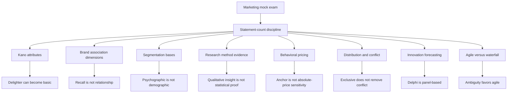

# Mock Exam Questions - Marketing

Source: `marketing/raw/Mock exam questions.pdf`
Course: Marketing
Processed: 2026-07-21
Wiki note: `marketing/wiki/mock-exam-questions/mock-exam-questions.md`

Course logistics checked: the Marketing exam is on 2026-07-22, lasts 90 minutes, is written, allows a non-programmable calculator, and covers all lecture materials with special focus on discussed research papers.

Source boundary: the PDF contains 9 possible multiple-choice mock questions and no official answer key. The answer key below is inferred from the local Marketing wiki notes and standard marketing terminology. Use it as an exam-practice guide, not as an official solution sheet.

## 80/20 Exam Summary

The mock exam tests whether you can classify short statements precisely:

- Kano model: distinguish must-be, performance, and excitement attributes.
- Brand associations: separate strength, favorability, uniqueness, recall, and relationship.
- Segmentation: match bases to examples without mixing demographic and psychographic variables.
- Research methods: know what conjoint, eye tracking, focus groups, surveys, and experiments can and cannot prove.
- Behavioral pricing: separate compromise effects, anchoring, reference prices, and mental accounting.
- Distribution: diagnose direct/indirect channels, channel conflict, private labels, exclusive selling, and omnichannel integration.
- Product innovation: separate scenario planning, Delphi, trend extrapolation, and agile/waterfall logic.

Fast exam rule:

```text
For "how many statements are correct" questions, mark each statement T/F first, then map the count to the answer option. Do not jump to the letter before checking all statements.
```

## Inferred Answer Key

| Question | Topic Route | Inferred Answer | Correct Count / Logic | Main Trap |
|---:|---|---|---|---|
| 1 | Kano model | D | All four statements are correct. | Forgetting that delighters can become expected basics over time. |
| 2 | Brand associations | C | Three statements are correct; the recall statement is false. | Treating brand recall as proof of emotional relationship. |
| 3 | Segmentation bases | C | Three statements are correct; age and marital status are demographic, not psychographic. | Mixing consumer traits with attitudes/lifestyles. |
| 4 | Marketing research methods | C | The focus-group statement is incorrect. | Treating qualitative insight as statistical proof. |
| 5 | Behavioral pricing | C | Three statements are correct; the anchoring wording is too broad. | Confusing reference/anchor dependence with sensitivity to small absolute differences. |
| 6 | Channel conflict | C | Statements 1, 2, and 4 are correct. | Assuming exclusive distribution automatically aligns all channel goals. |
| 7 | Distribution strategies | B | Two statements are correct; omnichannel integration and blanket cost-effectiveness claims are false. | Treating omnichannel as channel separation. |
| 8 | Innovation forecasting | B | Two statements are correct. | Delphi uses a panel, not one expert; forecasting is not only late-growth work. |
| 9 | Agile versus waterfall | B | Statement B is incorrect. | Using waterfall for ambiguous, evolving requirements. |

## Question-By-Question Solution Logic

### Question 1 - Kano Model

Route:

```text
customer attribute -> satisfaction effect -> time evolution of expectations
```

The correct answer is **D: all four**.

- Must-be attributes are taken for granted when present and create dissatisfaction when absent.
- Performance attributes move satisfaction up or down depending on execution quality.
- Excitement attributes can delight, but their absence usually does not punish satisfaction.
- Over time, market expectations rise: yesterday's delight can become today's expected baseline.

Real example: hotel Wi-Fi was once a delighter; now weak or absent Wi-Fi is often a basic-service failure.

### Question 2 - Brand Associations

Route:

```text
brand image -> associations -> strength / favorability / uniqueness
```

The correct answer is **C: three**.

- Strong associations are accessible and retrieved consistently in relevant contexts.
- Favorable associations fit customer needs and perceived value.
- Unique associations matter strategically when they support differentiation and positioning.
- High recall alone is not proof of emotional relationship. Recall belongs to awareness/salience; relationship belongs closer to resonance, loyalty, attachment, and engagement.

Exam sentence:

```text
Brand recall can show salience, but it does not by itself prove a strong emotional brand relationship.
```

### Question 3 - Segmentation Bases

Route:

```text
segmentation base -> observable trait or behavior -> matched example
```

The correct answer is **C: three**.

| Statement Type | Correct Example | Why |
|---|---|---|
| Geographic | climate zone or region | Location-based grouping. |
| Behavioral | frequency of product use | Action or usage pattern. |
| Psychographic | lifestyle, values, personality | Age and marital status are not psychographic. |
| Demographic | income or education | Socio-demographic profile. |

Exam trap: demographics are easy to measure, but they are not always enough to explain needs or behavior.

### Question 4 - Research Methods

Route:

```text
research method -> what it measures -> what it can prove
```

The incorrect statement is **C**.

- Conjoint analysis estimates preferences and attribute tradeoffs.
- Eye tracking measures visual attention patterns; it does not directly prove purchase or persuasion.
- Focus groups are useful for exploration and language discovery, but they are not more reliable than quantitative surveys for statistical testing.
- Experiments are suited to causal testing when the design controls alternative explanations.

Exam sentence:

```text
Qualitative methods help discover how customers think; quantitative and experimental methods are stronger for statistical testing and causal claims.
```

### Question 5 - Behavioral Pricing

Route:

```text
price perception -> context effect -> decision consequence
```

The correct answer is **C: three**.

- The compromise effect increases preference for a middle option in a choice set.
- The anchoring statement is too broad. Anchoring makes judgments depend on a reference point; it does not automatically mean consumers are more sensitive to small absolute price differences.
- Reference prices can come from internal memory or external presentation.
- Mental accounting makes consumers treat money differently depending on source, budget, or intended use.

Real example: a EUR 10 surcharge feels different on a EUR 20 product than on a EUR 1,000 product, but that is relative evaluation/reference framing, not simply "small absolute differences."

### Question 6 - Channel Conflict

Route:

```text
channel actor goals -> power/data/margin conflict -> mitigation
```

The correct answer is **C: statements 1, 2, and 4**.

- Direct-to-consumer entry can anger retailers because the manufacturer competes with its own channel partners.
- Private labels increase tension because retailers become stronger competitors against manufacturer brands.
- Exclusive distribution does not automatically align all channel goals. It can improve control, but conflict can still arise over prices, margins, territories, service standards, or data.
- Joint objectives and aligned incentives are plausible conflict-mitigation mechanisms.

Exam sentence:

```text
Channel conflict arises when manufacturers and intermediaries optimize different objectives; governance reduces conflict but does not remove it automatically.
```

### Question 7 - Distribution Strategies

Route:

```text
distribution route -> control / reach / data / cost tradeoff
```

The correct answer is **B: two**.

- Direct channels increase customer insight because the producer owns more customer interaction and data.
- Indirect channels often broaden reach, but reduce brand control and data transparency.
- Omnichannel does not intentionally separate online and offline experiences. It integrates them into a coordinated customer journey.
- Indirect distribution is not generally more cost-effective in every case. It can reduce internal capability burden and increase reach, but it also shares margins and may create dependency or conflict.

Real example: Nike's direct channel gives data and brand control, while retail partners provide reach. The right mix depends on brand strategy, product category, and channel economics.

### Question 8 - Forecasting In Innovation Management

Route:

```text
uncertain future -> forecasting approach -> assumption
```

The correct answer is **B: two**.

- Scenario planning explores multiple plausible future environments.
- The Delphi method does not rely on a single expert. It gathers structured judgments from a panel, often iteratively.
- Trend extrapolation assumes historical patterns continue, so it fits more stable contexts.
- Forecasting is used before and during innovation decisions, not only after late growth.

Exam sentence:

```text
Innovation forecasting reduces uncertainty; it does not eliminate uncertainty, and the right method depends on whether the market is stable, expert-driven, or structurally uncertain.
```

### Question 9 - Agile Versus Waterfall

Route:

```text
requirement uncertainty -> development mindset -> feedback timing
```

The incorrect statement is **B**.

- Agile uses iterative cycles and frequent stakeholder feedback.
- Waterfall is not best for ambiguous requirements and evolving technologies.
- Agile emphasizes working prototypes or increments over heavy upfront documentation.
- Waterfall emphasizes linear sequencing and upfront planning.

Real-life rule:

```text
Waterfall fits stable requirements and high coordination/control needs.
Agile fits uncertain requirements where feedback and learning reduce risk.
```

## Option-Level Rationales

Use this section after attempting the mock closed-book. It explains why the selected answer is correct and why the non-selected options are wrong or incomplete.

### Question 1

Correct answer: **D**

- Statement 1 is correct: must-be attributes are expected basics; absence causes dissatisfaction.
- Statement 2 is correct: performance attributes move satisfaction with execution quality.
- Statement 3 is correct: excitement attributes delight when present but are not punished as strongly when absent.
- Statement 4 is correct: delighters can become expected basics as markets mature.
- Why not A/B/C: those choices undercount because all four Kano statements are true.

### Question 2

Correct answer: **C**

- Statement 1 is correct: strong associations are accessible in memory.
- Statement 2 is correct: favorable associations fit needs and perceived value.
- Statement 3 is correct: unique associations support differentiation.
- Statement 4 is false: high recall proves salience, not emotional relationship or resonance.
- Why not A/B: those choices undercount the three valid association-quality statements.
- Why not D: it overcounts by accepting the false recall-equals-relationship statement.

### Question 3

Correct answer: **C**

- Geographic examples such as region or climate are correct.
- Behavioral examples such as usage frequency are correct.
- Demographic examples such as age and marital status are correct.
- Psychographic examples must be lifestyle, values, personality, interests, or attitudes; age and marital status are not psychographic.
- Why not A/B: those choices undercount the correct matches.
- Why not D: it overcounts by accepting a demographic example as psychographic.

### Question 4

Correct answer: **C**

- A is correct as a statement: conjoint analysis estimates attribute tradeoffs and preferences.
- B is correct as a statement: eye tracking measures visual attention patterns, not purchase causality by itself.
- C is the answer because it is the incorrect statement: focus groups are exploratory and qualitative, not more reliable than quantitative surveys for statistical testing.
- D is correct as a statement: experiments can support causal claims when properly controlled.

### Question 5

Correct answer: **C**

- Statement 1 is correct: the compromise effect can make the middle option attractive.
- Statement 2 is false: anchoring creates reference-point dependence; it does not automatically mean consumers are more sensitive to small absolute price differences.
- Statement 3 is correct: reference prices can be internal or externally shown.
- Statement 4 is correct: mental accounting changes how consumers treat money across budgets, sources, and uses.
- Why not A/B: those choices undercount the three true behavioral-pricing statements.
- Why not D: it overcounts by accepting the overly broad anchoring statement.

### Question 6

Correct answer: **C**

- Statement 1 is correct: DTC entry can create retailer resistance.
- Statement 2 is correct: private labels increase manufacturer-retailer competitive tension.
- Statement 3 is false: exclusive distribution can improve control but does not automatically align all goals.
- Statement 4 is correct: joint objectives and aligned incentives can mitigate conflict.
- Why C is correct: it includes statements 1, 2, and 4 while excluding statement 3.
- Why not the other choices: any option including statement 3 overclaims exclusive distribution; any option omitting 1, 2, or 4 misses a valid channel-conflict mechanism.

### Question 7

Correct answer: **B**

- Statement 1 is correct: direct channels can increase customer insight and data access.
- Statement 2 is correct: indirect channels can broaden reach but reduce control.
- Statement 3 is false: omnichannel integrates online and offline channels; it does not intentionally separate them.
- Statement 4 is false: indirect distribution is not always more cost-effective because it can involve margin sharing, dependency, and control loss.
- Why B is correct: exactly two statements are correct.
- Why not the other choices: lower-count choices miss a real direct/indirect tradeoff; higher-count choices accept the omnichannel or blanket-cost-effectiveness errors.

### Question 8

Correct answer: **B**

- Statement 1 is correct: scenario planning explores multiple plausible futures.
- Statement 2 is false: Delphi uses structured input from a panel of experts, not one expert.
- Statement 3 is correct: trend extrapolation assumes past patterns continue and fits more stable environments.
- Statement 4 is false: forecasting is useful before and during innovation decisions, not only in late growth.
- Why B is correct: exactly two statements are correct.
- Why not the other choices: lower-count choices miss scenario planning or trend extrapolation; higher-count choices accept the false single-expert Delphi or late-growth-only claim.

### Question 9

Correct answer: **B**

- A is correct as a statement: agile uses iterative cycles and frequent stakeholder feedback.
- B is the answer because it is the incorrect statement: waterfall is not best for ambiguous requirements and fast-changing technology.
- C is correct as a statement: agile favors working increments and learning over heavy upfront documentation.
- D is correct as a statement: waterfall emphasizes linear phases and upfront planning.

## Visual Knowledge Map



## Subject Knowledge Graph

| Node | Meaning | Exam Relevance |
|---|---|---|
| Statement-Count MCQ | Question type requiring each statement to be marked before choosing the count option. | Prevents premature answer selection. |
| Kano Model | Attribute-satisfaction framework with must-be, performance, and excitement attributes. | High-yield satisfaction/product trap. |
| Brand Association Dimensions | Strength, favorability, and uniqueness of brand image associations. | Separates recall from deeper relationship. |
| Segmentation Bases | Geographic, demographic, psychographic, and behavioral grouping logic. | Common matching question type. |
| Research Evidence Hierarchy | Different methods support insight, measurement, or causal inference differently. | Prevents overclaiming from focus groups or eye tracking. |
| Behavioral Pricing Effects | Contextual price-perception mechanisms. | Tests pricing psychology rather than only formulas. |
| Channel Conflict | Tension among channel members with different goals and incentives. | Core Place/distribution application. |
| Innovation Forecasting | Methods for reasoning about uncertain product futures. | Links product innovation to market uncertainty. |
| Agile/Waterfall Mindset | Development logic chosen by requirement uncertainty and feedback need. | Product innovation decision rule. |

| From | Relationship | To | Why It Matters |
|---|---|---|---|
| Statement-Count MCQ | requires | T/F marking per statement | Avoids count-option mistakes. |
| Kano Model | classifies | Satisfaction effects | Explains why not every feature affects satisfaction equally. |
| Brand Recall | is not sufficient for | Emotional Relationship | Prevents overclaiming brand equity. |
| Segmentation Bases | constrain | Example classification | Prevents demographic/psychographic mixups. |
| Focus Groups | support | Qualitative exploration | Not statistical testing. |
| Experiments | support | Causal inference | Stronger for cause-effect claims. |
| Anchoring | shapes | Reference-dependent price judgment | Not a blanket sensitivity claim. |
| Direct Distribution | increases | Control and customer data | But requires capability and investment. |
| Indirect Distribution | increases | Reach | But can reduce control and create conflict. |
| Delphi Method | aggregates | Expert panel judgment | Not single-expert forecasting. |
| Agile | fits | Ambiguous requirements | Feedback reduces uncertainty. |
| Waterfall | fits | Stable requirements | Upfront planning is useful when requirements are known. |

## Real Business Examples

- **Apple retail**: direct retail gives stronger control over product demonstration, service, and customer data.
- **Nike DTC**: moving direct can improve margin/data but may strain retailer relationships.
- **Hotel Wi-Fi**: an old delighter became a must-be attribute.
- **Streaming plans**: compromise effects can make the middle subscription tier more attractive.
- **New app feature development**: agile testing is useful when the team does not yet know which feature customers will value.
- **Regulatory software rollout**: waterfall-like planning can fit when requirements are fixed and auditability matters.

## Exam Relevance

Likely exam prompts:

- Count how many statements correctly describe a framework.
- Identify the incorrect statement.
- Match a method, effect, or strategy with the correct example.
- Choose the best development or distribution logic for a mini-case.

Common traps:

- Brand recall = emotional relationship.
- Focus groups = statistical testing.
- Eye tracking = proof of purchase intention.
- Psychographic = age/marital status.
- Omnichannel = separated channels.
- Exclusive distribution = no conflict.
- Agile = no planning; waterfall = good for ambiguity.

High-scoring answer structure:

```text
1. Classify each statement.
2. Name the precise concept.
3. State the boundary or trap.
4. Choose the letter only after counting or identifying the false statement.
```

## Retrieval Prompts

Closed-book questions:

1. Why can a Kano delighter become a must-be attribute?
2. Why does high brand recall not prove brand resonance?
3. Give one geographic, one demographic, one psychographic, and one behavioral segmentation example.
4. What can eye tracking measure, and what can it not prove alone?
5. Why is omnichannel integration the opposite of intentional channel separation?

Application prompts:

1. A sportswear brand opens its own online store. Explain the distribution benefit and the likely channel-conflict risk.
2. A product team faces unclear user needs and fast technology change. Choose agile or waterfall and justify.
3. A company wants to test whether a package redesign causes higher purchase probability. Choose a research method and explain why.

## Practice Tasks

1. Re-answer all 9 mock questions closed-book in 12 minutes.
2. For every missed item, write the exact trap as one correction sentence.
3. Convert Questions 6 and 7 into a mini-case about a manufacturer entering DTC while keeping retail partners.
4. Convert Question 9 into a real enterprise project decision: ERP compliance rollout versus mobile-app feature discovery.

## Connections

Previous Marketing notes:

- `marketing/wiki/chapter-01-basic-concepts-of-marketing/chapter-01-basic-concepts-of-marketing.md`: Kano model, segmentation, satisfaction logic.
- `marketing/wiki/chapter-02-branding/chapter-02-branding.md`: brand associations, awareness, image, CBBE.
- `marketing/wiki/chapter-03-product/chapter-03-product.md`: innovation, conjoint analysis, agile/lean startup.
- `marketing/wiki/chapter-04-price/chapter-04-price.md`: behavioral pricing and pricing effects.
- `marketing/wiki/chapter-06-place-distribution/chapter-06-place-distribution.md`: distribution channels, channel conflict, retail research, eye tracking.

Cross-course links:

- Supply Chain Management: service-level and inventory decisions also use decision ratios and tradeoffs, but Marketing mock questions focus on customer and channel logic.
- Organization: agile/waterfall and enterprise implementation connect to coordination, uncertainty, and change-management design.
- Finance: pricing and channel decisions affect contribution margin, customer value capture, and investment justification.

## Weakness Flags

- Add after active recall: which of the 9 questions were missed, why the wrong statement looked tempting, and which chapter must be repaired before the Marketing exam.
