# Organization Course Knowledge Graph

This file aggregates Organization concepts learned so far. It is graph-view-first for visual recall.

Scope: Organization only. Logistics and administrative material are excluded.

## Course Graph View

```mermaid
graph LR
    Org[Organization] -->|defined as| Social[Social entity]
    Org -->|defined as| Goal[Goal-directed]
    Org -->|defined as| Structured[Deliberately structured]
    Org -->|defined as| EnvLinked[Environment-linked]

    Org -->|solves| Problems[Organizing problems]
    Problems --> TaskStruct[Structuring tasks]
    Problems --> Motivation[Motivation]
    Problems --> Uncertainty[Coping with uncertainty]
    Problems --> Emergence[Emergent processes]
    Problems --> Change[Change/adaptability]

    Org -->|can be viewed as| Rational[Rational system]
    Org -->|can be viewed as| Natural[Natural system]
    Org -->|can be viewed as| Open[Open system]
    Rational --> FormalGoals[Formal goals and structure]
    Natural --> Informal[Informal behavior and power]
    Open --> Environment[Environmental embeddedness]

    Org -->|has| FormalDesign[Formal design]
    FormalDesign --> Rules[Rules/procedures]
    FormalDesign --> Roles[Roles]
    FormalDesign --> Incentives[Incentives]
    FormalDesign --> Structures[Structural forms]
    Rules -->|increase| Control[Control]
    Rules -->|do not determine| Action[Action in practice]
    Roles -->|support| Monitoring[Monitoring]
    Roles -->|support| Substitution[Substitution]
    Roles -->|support| CommonPerspective[Common perspective]
    Incentives -->|shape| Attention[Attention and behavior]
    Structures --> Simple[Simple]
    Structures --> Functional[Functional]
    Structures --> Divisional[Divisional]
    Structures --> Matrix[Matrix]
    Structures --> Horizontal[Horizontal]

    Org -->|embedded in| Environment
    Environment --> Boundary[Boundary problem]
    Environment --> TaskEnv[Task environment]
    Environment --> GlobalEnv[Global environment]
    Environment --> Interdependence[Interdependence]
    Interdependence --> Pooled[Pooled]
    Interdependence --> Sequential[Sequential]
    Interdependence --> Reciprocal[Reciprocal]
    Environment --> EnvUncertainty[Environmental uncertainty]
    EnvUncertainty --> EnvChange[Environmental change]
    EnvUncertainty --> Complexity[Environmental complexity]
    Environment --> Contingency[Contingency theory]
    Contingency --> Fit[Structure-environment fit]
    Fit --> Mechanistic[Mechanistic]
    Fit --> Organic[Organic]
    Environment --> RDT[Resource dependence]
    RDT --> Need[Need]
    RDT --> Scarcity[Scarcity]
    RDT --> Substitutes[Substitutes]
    Environment --> Ecology[Population ecology]
    Ecology --> Variation[Variation]
    Ecology --> Selection[Selection]
    Ecology --> Retention[Retention]

    Org -->|guided by| Strategy[Strategy]
    Strategy --> StrategicIntent[Strategic intent]
    StrategicIntent --> Mission[Mission]
    StrategicIntent --> Vision[Vision]
    StrategicIntent --> Purpose[Purpose]
    StrategicIntent --> Goals[Goals]
    Strategy --> StructureRelation[Strategy-structure relation]
    StructureRelation --> StructureFollows[Structure follows strategy]
    StructureRelation --> StrategyFollows[Strategy follows structure]
    Strategy --> Tensions[Strategic tensions]
    Tensions --> Ambidexterity[Ambidexterity]
    Ambidexterity --> Exploration[Exploration]
    Ambidexterity --> Exploitation[Exploitation]
    Tensions --> Diversification[Diversification]
    Diversification --> PortersTests[Porter's three tests]
    Tensions --> Responsibility[Responsibility]
    Responsibility --> Shareholder[Shareholder view]
    Responsibility --> Stakeholder[Stakeholder view]
    Strategy --> Strategizing[Strategy as practice]

    Org -->|uses| Technology[Technology]
    Technology --> Transformation[Input-transformation-output]
    Technology --> Modernist[Modernist classification]
    Modernist --> Woodward[Woodward: technical complexity]
    Modernist --> Thompson[Thompson: standardization]
    Modernist --> Perrow[Perrow: variability/analyzability]
    Technology --> Symbolic[Symbolic interpretation]
    Symbolic --> SCOT[Social construction of technology]
    Symbolic --> AST[Adaptive structuration]
    AST --> TechShapes[Technology shapes routines]
    AST --> RoutinesShape[Routines shape technology-in-use]
    Technology --> TechControl[Technology and control]

    Technology --> AI[AI in organizations]
    AI --> NoDeterminism[No determinism]
    AI --> TaskDivision[Task division]
    TaskDivision --> Automation[Automation]
    TaskDivision --> Augmentation[Augmentation]
    Automation --> Paradox[Automation-augmentation paradox]
    Augmentation --> Paradox
    AI --> Expertise[Roles/knowledge/expertise]
    Expertise --> ExpertiseGrowth[Expertise growth]
    Expertise --> ExpertiseErosion[Expertise erosion]
    AI --> StabilityChange[Stability/change]
    StabilityChange --> Capacitating[Capacitating]
    StabilityChange --> Reframing[Reframing]
    StabilityChange --> Shielding[Shielding]
    StabilityChange --> Adhering[Adhering]
    AI --> Ethics[Fairness/ethics/accountability]
    Ethics --> Bias[Bias]
    Ethics --> Privacy[Privacy]
    Ethics --> Transparency[Transparency]
    Ethics --> Accountability[Accountability]
    Ethics --> AlgorithmicControl[Algorithmic control]
```

## Decision Flow View

```mermaid
flowchart TD
    Start[Organizational problem] --> Define{What kind of problem?}

    Define -->|Definition/application| Criteria[Apply organization criteria]
    Criteria --> SocialCheck[Social entity]
    Criteria --> GoalCheck[Goal-directed]
    Criteria --> StructureCheck[Deliberately structured]
    Criteria --> EnvCheck[Environment-linked]

    Define -->|Formal design| Formal[Diagnose formal design]
    Formal --> RulesQ[Rules/procedures: control or workaround?]
    Formal --> RolesQ[Roles: monitoring, substitution, common perspective?]
    Formal --> IncentivesQ[Incentives: what behavior/attention?]
    Formal --> StructureQ[Structure type and tradeoffs]

    Define -->|Environment| Env[Analyze environment]
    Env --> BoundaryQ[Draw boundary]
    Env --> TaskGlobal[Task vs global environment]
    Env --> InterdepQ[Interdependence type]
    Env --> UncertaintyQ[Change x complexity]
    Env --> TheoryLens[Choose lens]
    TheoryLens --> ContingencyQ[Contingency: fit]
    TheoryLens --> RDTQ[Resource dependence]
    TheoryLens --> EcologyQ[Population ecology]

    Define -->|Strategy| Strat[Analyze strategic design]
    Strat --> IntentQ[Mission/vision/purpose/goals]
    Strat --> StructureStrategy[Structure follows or shapes strategy?]
    Strat --> TensionQ[Ambidexterity/diversification/responsibility]
    Strat --> PracticeQ[Strategy-as-practice/emergence]

    Define -->|Technology| Tech[Analyze technology]
    Tech --> Classify[Classify using Woodward/Thompson/Perrow]
    Tech --> Use[Analyze affordances/constraints/frames/enactment]
    Tech --> ControlQ[Check control/surveillance implications]

    Define -->|AI| AIQ[Analyze AI effects]
    AIQ --> WorkAlloc[Task division: automation/augmentation]
    AIQ --> Learning[Roles and expertise]
    AIQ --> Adapt[Stability/change]
    AIQ --> Govern[Fairness/ethics/accountability]
```

## Subject Graph Index

| Subject / Deck | Wiki Note | Main Visual Logic | Last Updated |
|---|---|---|---|
| Session 01 Definitional Basics | `session-01-definitional-basics-of-organization.md` | Definition -> organizing problems -> rational/natural/open views -> management | 2026-05-16 |
| Session 02 Formal Organizational Design | `session-02-formal-organizational-design.md` | Weber -> rules/roles/incentives/structures -> BP formal design | 2026-05-16 |
| Session 03 Organization And Environment | `session-03-organization-and-environment.md` | Boundaries -> task/global environment -> uncertainty -> theories -> BP interdependence | 2026-05-16 |
| Session 04 Strategic Organization Design | `session-04-strategic-organization-design.md` | Strategy intent -> structure relation -> ambidexterity/diversification/responsibility -> strategy-as-practice | 2026-05-16 |
| Session 05 Technology And Organization | `session-05-technology-and-organization.md` | Technology classification -> symbolic use -> adaptive structuration -> control | 2026-05-16 |
| Session 06 AI And Organization | `session-06-ai-and-organization.md` | AI no determinism -> task division/expertise/stability/ethics -> Aurelia operating concepts | 2026-05-16 |

## Supporting Node Reference

| Node | Meaning | Source Note |
|---|---|---|
| Organization | Social, goal-directed, deliberately structured, environment-linked entity | `session-01-definitional-basics-of-organization.md` |
| Rational System | Formal goals and formalized structure | `session-01-definitional-basics-of-organization.md` |
| Natural System | Multiple interests, informal behavior, power | `session-01-definitional-basics-of-organization.md` |
| Open System | Interdependent flows embedded in wider environment | `session-01-definitional-basics-of-organization.md` |
| Formal Design | Planned rules, roles, incentives, structures | `session-02-formal-organizational-design.md` |
| Structural Forms | Simple, functional, divisional, matrix, horizontal | `session-02-formal-organizational-design.md` |
| Task Environment | Direct actors/forces linked to task accomplishment | `session-03-organization-and-environment.md` |
| Global Environment | Wider technological/legal/social/ecological/macro context | `session-03-organization-and-environment.md` |
| Contingency Theory | Organization structure must fit environment | `session-03-organization-and-environment.md` |
| Resource Dependence | Dependence on external resource holders | `session-03-organization-and-environment.md` |
| Population Ecology | Population-level selection and retention | `session-03-organization-and-environment.md` |
| Strategic Intent | Mission, vision, purpose, goals | `session-04-strategic-organization-design.md` |
| Ambidexterity | Exploration and exploitation | `session-04-strategic-organization-design.md` |
| Technology | Means of transforming inputs into outputs | `session-05-technology-and-organization.md` |
| Adaptive Structuration | Technology and routines mutually shape each other | `session-05-technology-and-organization.md` |
| AI | Machine performance of cognitive functions | `session-06-ai-and-organization.md` |
| Automation/Augmentation | AI task takeover vs human-AI support | `session-06-ai-and-organization.md` |
| Algorithmic Control | AI-enabled monitoring/evaluation/allocation/control | `session-06-ai-and-organization.md` |

## Supporting Edge Reference

| From | Relationship | To | Source Note |
|---|---|---|---|
| Organization | solves | Collective-action problems | `session-01-definitional-basics-of-organization.md` |
| Formal Structure | enables/constrains | Organizing in practice | `session-01-definitional-basics-of-organization.md` |
| Rules | increase | Control | `session-02-formal-organizational-design.md` |
| Rules | do not determine | Action | `session-02-formal-organizational-design.md` |
| Roles | coordinate through | Monitoring/substitution/common perspective | `session-02-formal-organizational-design.md` |
| Environmental change and complexity | create | Uncertainty | `session-03-organization-and-environment.md` |
| Stable environment | fits | Mechanistic structure | `session-03-organization-and-environment.md` |
| Dynamic environment | fits | Organic structure | `session-03-organization-and-environment.md` |
| Need and scarcity | increase | Resource dependence | `session-03-organization-and-environment.md` |
| Strategic intent | guides | Organization design | `session-04-strategic-organization-design.md` |
| Structure | can shape | Strategy | `session-04-strategic-organization-design.md` |
| Technology | shapes and is shaped by | Routines | `session-05-technology-and-organization.md` |
| AI | affects | Task division/expertise/stability/ethics | `session-06-ai-and-organization.md` |
| Automation | can erode | Expertise | `session-06-ai-and-organization.md` |
| Algorithmic dashboard | can become | Control instrument | `session-06-ai-and-organization.md` |
