# Organization Course Knowledge Graph

This file aggregates Organization concepts learned so far. It is graph-view-first for visual recall.

Scope: Organization only. Logistics and administrative material are excluded.

## Course Graph View

```mermaid
graph LR
    Org[Organization] -->|defined as| Social[Social entity]
    Org -->|defined as| Goal[Goal-directed]
    Org -->|defined as| Structured[Deliberately structured]
    Org -->|defined as| EnvLinked[Environment-linked]

    Org -->|solves| Problems[Organizing problems]
    Problems --> TaskStruct[Structuring tasks]
    Problems --> Motivation[Motivation]
    Problems --> Uncertainty[Coping with uncertainty]
    Problems --> Emergence[Emergent processes]
    Problems --> Change[Change/adaptability]

    Org -->|can be viewed as| Rational[Rational system]
    Org -->|can be viewed as| Natural[Natural system]
    Org -->|can be viewed as| Open[Open system]
    Rational --> FormalGoals[Formal goals and structure]
    Natural --> Informal[Informal behavior and power]
    Open --> Environment[Environmental embeddedness]

    Org -->|has| FormalDesign[Formal design]
    FormalDesign --> Rules[Rules/procedures]
    FormalDesign --> Roles[Roles]
    FormalDesign --> Incentives[Incentives]
    FormalDesign --> Structures[Structural forms]
    Rules -->|increase| Control[Control]
    Rules -->|do not determine| Action[Action in practice]
    Roles -->|support| Monitoring[Monitoring]
    Roles -->|support| Substitution[Substitution]
    Roles -->|support| CommonPerspective[Common perspective]
    Incentives -->|shape| Attention[Attention and behavior]
    Structures --> Simple[Simple]
    Structures --> Functional[Functional]
    Structures --> Divisional[Divisional]
    Structures --> Matrix[Matrix]
    Structures --> Horizontal[Horizontal]

    Org -->|embedded in| Environment
    Environment --> Boundary[Boundary problem]
    Environment --> TaskEnv[Task environment]
    Environment --> GlobalEnv[Global environment]
    Environment --> Interdependence[Interdependence]
    Interdependence --> Pooled[Pooled]
    Interdependence --> Sequential[Sequential]
    Interdependence --> Reciprocal[Reciprocal]
    Environment --> EnvUncertainty[Environmental uncertainty]
    EnvUncertainty --> EnvChange[Environmental change]
    EnvUncertainty --> Complexity[Environmental complexity]
    Environment --> Contingency[Contingency theory]
    Contingency --> Fit[Structure-environment fit]
    Fit --> Mechanistic[Mechanistic]
    Fit --> Organic[Organic]
    Environment --> RDT[Resource dependence]
    RDT --> Need[Need]
    RDT --> Scarcity[Scarcity]
    RDT --> Substitutes[Substitutes]
    Environment --> Ecology[Population ecology]
    Ecology --> Variation[Variation]
    Ecology --> Selection[Selection]
    Ecology --> Retention[Retention]

    Org -->|guided by| Strategy[Strategy]
    Strategy --> StrategicIntent[Strategic intent]
    StrategicIntent --> Mission[Mission]
    StrategicIntent --> Vision[Vision]
    StrategicIntent --> Purpose[Purpose]
    StrategicIntent --> Goals[Goals]
    Strategy --> StructureRelation[Strategy-structure relation]
    StructureRelation --> StructureFollows[Structure follows strategy]
    StructureRelation --> StrategyFollows[Strategy follows structure]
    Strategy --> Tensions[Strategic tensions]
    Tensions --> Ambidexterity[Ambidexterity]
    Ambidexterity --> Exploration[Exploration]
    Ambidexterity --> Exploitation[Exploitation]
    Tensions --> Diversification[Diversification]
    Diversification --> PortersTests[Porter's three tests]
    Tensions --> Responsibility[Responsibility]
    Responsibility --> Shareholder[Shareholder view]
    Responsibility --> Stakeholder[Stakeholder view]
    Strategy --> Strategizing[Strategy as practice]

    Org -->|uses| Technology[Technology]
    Technology --> Transformation[Input-transformation-output]
    Technology --> Modernist[Modernist classification]
    Modernist --> Woodward[Woodward: technical complexity]
    Modernist --> Thompson[Thompson: standardization]
    Modernist --> Perrow[Perrow: variability/analyzability]
    Technology --> Symbolic[Symbolic interpretation]
    Symbolic --> SCOT[Social construction of technology]
    Symbolic --> AST[Adaptive structuration]
    AST --> TechShapes[Technology shapes routines]
    AST --> RoutinesShape[Routines shape technology-in-use]
    Technology --> TechControl[Technology and control]

    Technology --> AI[AI in organizations]
    AI --> NoDeterminism[No determinism]
    AI --> TaskDivision[Task division]
    TaskDivision --> Automation[Automation]
    TaskDivision --> Augmentation[Augmentation]
    Automation --> Paradox[Automation-augmentation paradox]
    Augmentation --> Paradox
    AI --> Expertise[Roles/knowledge/expertise]
    Expertise --> ExpertiseGrowth[Expertise growth]
    Expertise --> ExpertiseErosion[Expertise erosion]
    AI --> StabilityChange[Stability/change]
    StabilityChange --> Capacitating[Capacitating]
    StabilityChange --> Reframing[Reframing]
    StabilityChange --> Shielding[Shielding]
    StabilityChange --> Adhering[Adhering]
    AI --> Ethics[Fairness/ethics/accountability]
    Ethics --> Bias[Bias]
    Ethics --> Privacy[Privacy]
    Ethics --> Transparency[Transparency]
    Ethics --> Accountability[Accountability]
    Ethics --> AlgorithmicControl[Algorithmic control]

    FormalDesign -->|is enacted through| Informal
    Informal --> Structuration[Structuration]
    Structuration -->|structure enables/constrains| EnactedAction[Enacted action]
    EnactedAction -->|reproduces/changes| Structuration
    Informal --> Culture[Organizational culture]
    Culture --> Artifacts[Artifacts]
    Culture --> Values[Espoused values]
    Culture --> Assumptions[Basic assumptions]
    Culture --> Subcultures[Subcultures and clashes]
    Informal --> Knowledge[Organizational knowledge]
    Knowledge --> Tacit[Tacit knowledge]
    Knowledge --> Explicit[Explicit knowledge]
    Knowledge --> SECI[SECI conversion]
    Informal --> PowerPolitics[Power and politics]
    PowerPolitics --> DepartmentPower[Departmental power]
    PowerPolitics --> ConflictOrg[Organizational conflict]
    Incentives --> Cybernetic[Cybernetic control]
    Cybernetic -->|measures/rewards shape| Attention

    Change --> DynamicChange[Organizational change over time]
    DynamicChange --> Iceberg[Iceberg Model of Change]
    Iceberg --> Objectification[Objectification]
    Iceberg --> Distinction[Distinction]
    Iceberg --> Unfolding[Unfolding]
    DynamicChange --> ChangeModels[Change-management frameworks]
    ChangeModels --> Kotter[Kotter]
    ChangeModels --> Lewin[Lewin and Force Field]
    ChangeModels --> ADKAR[ADKAR]
    ChangeModels --> Bridges[Bridges transition]
    ChangeModels --> Appreciative[Appreciative Inquiry]
    ChangeModels --> SCARF[SCARF]

    Org -->|increasingly uses| SkillsOrg[Skills-powered organization]
    SkillsOrg --> JobArchitecture[Job architecture]
    SkillsOrg --> SkillArchitecture[Skill architecture]
    JobArchitecture --> JobFamilies[Job families]
    JobArchitecture --> JobLevels[Job levels]
    JobArchitecture --> JobGrades[Job grades]
    SkillArchitecture --> CoreCompetencies[Core competencies]
    SkillArchitecture --> FunctionalCompetencies[Functional/job-family competencies]
    SkillArchitecture --> RoleSpecificSkills[Role-specific skills]
    SkillArchitecture --> Proficiency[Observable proficiency levels]
    SkillsOrg -->|affects| RoleIdentity[Role identity]
    SkillsOrg -->|affects| MotivationNeeds[Autonomy/competence/relatedness]
    SkillsOrg -->|requires| SkillFairness[Fairness and contestability]
    AI -->|can enable| SkillArchitecture

    Org -->|evolves through| Trends[Trends in organizational design]
    Trends --> NewForms[New organizational forms]
    NewForms --> FourProblems[Four-problem novelty canvas]
    FourProblems --> FTaskDivision[Task division]
    FourProblems --> FTaskAllocation[Task allocation]
    FourProblems --> FReward[Reward provision]
    FourProblems --> FInformation[Information provision]
    Trends --> Agile[Agile]
    Trends --> SelfManagement[Self-management]
    Trends --> NetworkOrg[Network organization]
    NetworkOrg --> ComplementaryCapabilities[Complementary capabilities]
    NetworkOrg --> Ecosystem[Ecosystem value creation]
    SelfManagement --> Holacracy[Holacracy]
    Holacracy --> HolacracyRoles[Roles]
    Holacracy --> Circles[Circles]
    Holacracy --> GovernanceMeetings[Governance meetings]
    Agile --> Scrum[Scrum]
    Scrum --> ScrumRoles[Scrum roles/events/artifacts]
    Scrum --> ScalingScrum[Scaling Scrum]
    Trends --> DesignThinking[Design thinking]
    Trends --> OKR[OKR]
    DesignThinking --> UserNeeds[User needs/prototypes/testing]
    OKR --> Objectives[Objectives]
    OKR --> KeyResults[Key results]
    OKR --> RoofMoon[Roofshots/moonshots]
```

## Decision Flow View

```mermaid
flowchart TD
    Start[Organizational problem] --> Define{What kind of problem?}

    Define -->|Definition/application| Criteria[Apply organization criteria]
    Criteria --> SocialCheck[Social entity]
    Criteria --> GoalCheck[Goal-directed]
    Criteria --> StructureCheck[Deliberately structured]
    Criteria --> EnvCheck[Environment-linked]

    Define -->|Formal design| Formal[Diagnose formal design]
    Formal --> RulesQ[Rules/procedures: control or workaround?]
    Formal --> RolesQ[Roles: monitoring, substitution, common perspective?]
    Formal --> IncentivesQ[Incentives: what behavior/attention?]
    Formal --> StructureQ[Structure type and tradeoffs]

    Define -->|Environment| Env[Analyze environment]
    Env --> BoundaryQ[Draw boundary]
    Env --> TaskGlobal[Task vs global environment]
    Env --> InterdepQ[Interdependence type]
    Env --> UncertaintyQ[Change x complexity]
    Env --> TheoryLens[Choose lens]
    TheoryLens --> ContingencyQ[Contingency: fit]
    TheoryLens --> RDTQ[Resource dependence]
    TheoryLens --> EcologyQ[Population ecology]

    Define -->|Strategy| Strat[Analyze strategic design]
    Strat --> IntentQ[Mission/vision/purpose/goals]
    Strat --> StructureStrategy[Structure follows or shapes strategy?]
    Strat --> TensionQ[Ambidexterity/diversification/responsibility]
    Strat --> PracticeQ[Strategy-as-practice/emergence]

    Define -->|Technology| Tech[Analyze technology]
    Tech --> Classify[Classify using Woodward/Thompson/Perrow]
    Tech --> Use[Analyze affordances/constraints/frames/enactment]
    Tech --> ControlQ[Check control/surveillance implications]

    Define -->|AI| AIQ[Analyze AI effects]
    AIQ --> WorkAlloc[Task division: automation/augmentation]
    AIQ --> Learning[Roles and expertise]
    AIQ --> Adapt[Stability/change]
    AIQ --> Govern[Fairness/ethics/accountability]

    Define -->|Informal organization| InformalQ[Analyze enacted organization]
    InformalQ --> StructQ[Structuration: how action reproduces structure]
    InformalQ --> CultureQ[Culture: artifacts, values, assumptions]
    InformalQ --> KnowledgeQ[Knowledge: tacit/explicit and SECI]
    InformalQ --> PowerQ[Power: resources, centrality, dependency]
    InformalQ --> ConflictQ[Conflict: type, level, performance effect]

    Define -->|Organizational change| ChangeQ[Analyze change over time]
    ChangeQ --> StateQ[What changed: objectification/distinction]
    ChangeQ --> ProcessQ[How it changed: unfolding mechanisms]
    ChangeQ --> FrameworkQ[Choose framework by problem and level]
    FrameworkQ --> OrganizationQ[Kotter/Lewin]
    FrameworkQ --> IndividualQ[ADKAR/Bridges/SCARF]
    FrameworkQ --> StrengthQ[Appreciative Inquiry]

    Define -->|Skills-powered organization| SkillsQ[Analyze skill-based work design]
    SkillsQ --> JobQ[Job architecture: families/levels/grades/streams]
    SkillsQ --> SkillQ[Skill architecture: core/functional/role-specific]
    SkillsQ --> ProfQ[Proficiency: observable behavior]
    SkillsQ --> PeopleQ[People impact: identity/motivation/fairness]

    Define -->|New form or trend| TrendQ[Apply four-problem novelty canvas]
    TrendQ --> TDQ[Task division]
    TrendQ --> TAQ[Task allocation]
    TrendQ --> RPQ[Reward provision]
    TrendQ --> IPQ[Information provision]
    TrendQ --> NetworkQ[Network/ecosystem]
    TrendQ --> HolacracyQ[Holacracy/self-management]
    TrendQ --> ScrumQ[Scrum/scaling]
    TrendQ --> DTQ[Design thinking]
    TrendQ --> OKRQ[OKR]
```

## Subject Graph Index

| Subject / Deck | Wiki Note | Main Visual Logic | Last Updated |
|---|---|---|---|
| Session 01 Definitional Basics | `session-01-definitional-basics-of-organization/session-01-definitional-basics-of-organization.md` | Definition -> organizing problems -> rational/natural/open views -> management | 2026-05-16 |
| Session 02 Formal Organizational Design | `session-02-formal-organizational-design/session-02-formal-organizational-design.md` | Weber -> rules/roles/incentives/structures -> BP formal design | 2026-05-16 |
| Session 03 Organization And Environment | `session-03-organization-and-environment/session-03-organization-and-environment.md` | Boundaries -> task/global environment -> uncertainty -> theories -> BP interdependence | 2026-05-16 |
| Session 04 Strategic Organization Design | `session-04-strategic-organization-design/session-04-strategic-organization-design.md` | Strategy intent -> structure relation -> ambidexterity/diversification/responsibility -> strategy-as-practice | 2026-05-16 |
| Session 05 Technology And Organization | `session-05-technology-and-organization/session-05-technology-and-organization.md` | Technology classification -> symbolic use -> adaptive structuration -> control | 2026-05-16 |
| Session 06 AI And Organization | `session-06-ai-and-organization/session-06-ai-and-organization.md` | AI no determinism -> task division/expertise/stability/ethics -> Aurelia operating concepts | 2026-05-16 |
| Sessions 07-08 Informal Organization | `session-07-08-informal-organization/session-07-08-informal-organization.md` | Formal design -> structuration -> culture/knowledge/power/conflict -> Motorica process redesign | 2026-06-13 |
| Session 09 Dynamic Perspectives On Organizing | `session-09-dynamic-perspectives-on-organizing/session-09-dynamic-perspectives-on-organizing.md` | Change states/process -> Iceberg perspectives -> six framework comparison -> AI-tool implementation | 2026-06-13 |
| Session 10 Skills As The New Currency Of Organizations | `session-10-skills-as-new-currency-of-organizations/session-10-skills-as-new-currency-of-organizations.md` | Business strategy -> job architecture + skill architecture -> HR decisions -> people and governance effects | 2026-07-11 |
| Session 11 Trends In Organizational Design - New Forms | `session-11-trends-in-organizational-design-new-forms/session-11-trends-in-organizational-design-new-forms.md` | Four-problem novelty canvas -> agile/self-management -> network organization -> holacracy | 2026-07-11 |
| Session 12 Trends In Organizational Design - Scrum, Design Thinking, And OKR | `session-12-trends-scrum-design-thinking-okr/session-12-trends-scrum-design-thinking-okr.md` | Scrum roles/events/artifacts + scaling -> design thinking -> OKR roofshots/moonshots | 2026-07-11 |

## Supporting Node Reference

| Node | Meaning | Source Note |
|---|---|---|
| Organization | Social, goal-directed, deliberately structured, environment-linked entity | `session-01-definitional-basics-of-organization/session-01-definitional-basics-of-organization.md` |
| Rational System | Formal goals and formalized structure | `session-01-definitional-basics-of-organization/session-01-definitional-basics-of-organization.md` |
| Natural System | Multiple interests, informal behavior, power | `session-01-definitional-basics-of-organization/session-01-definitional-basics-of-organization.md` |
| Open System | Interdependent flows embedded in wider environment | `session-01-definitional-basics-of-organization/session-01-definitional-basics-of-organization.md` |
| Formal Design | Planned rules, roles, incentives, structures | `session-02-formal-organizational-design/session-02-formal-organizational-design.md` |
| Structural Forms | Simple, functional, divisional, matrix, horizontal | `session-02-formal-organizational-design/session-02-formal-organizational-design.md` |
| Task Environment | Direct actors/forces linked to task accomplishment | `session-03-organization-and-environment/session-03-organization-and-environment.md` |
| Global Environment | Wider technological/legal/social/ecological/macro context | `session-03-organization-and-environment/session-03-organization-and-environment.md` |
| Contingency Theory | Organization structure must fit environment | `session-03-organization-and-environment/session-03-organization-and-environment.md` |
| Resource Dependence | Dependence on external resource holders | `session-03-organization-and-environment/session-03-organization-and-environment.md` |
| Population Ecology | Population-level selection and retention | `session-03-organization-and-environment/session-03-organization-and-environment.md` |
| Strategic Intent | Mission, vision, purpose, goals | `session-04-strategic-organization-design/session-04-strategic-organization-design.md` |
| Ambidexterity | Exploration and exploitation | `session-04-strategic-organization-design/session-04-strategic-organization-design.md` |
| Technology | Means of transforming inputs into outputs | `session-05-technology-and-organization/session-05-technology-and-organization.md` |
| Adaptive Structuration | Technology and routines mutually shape each other | `session-05-technology-and-organization/session-05-technology-and-organization.md` |
| AI | Machine performance of cognitive functions | `session-06-ai-and-organization/session-06-ai-and-organization.md` |
| Automation/Augmentation | AI task takeover vs human-AI support | `session-06-ai-and-organization/session-06-ai-and-organization.md` |
| Algorithmic Control | AI-enabled monitoring/evaluation/allocation/control | `session-06-ai-and-organization/session-06-ai-and-organization.md` |
| Informal Organization | Emergent norms, relations, knowledge flows, and influence patterns | `session-07-08-informal-organization/session-07-08-informal-organization.md` |
| Structuration | Action and structure recursively reproduce or change each other | `session-07-08-informal-organization/session-07-08-informal-organization.md` |
| Organizational Culture | Shared meanings enacted through artifacts, values, assumptions, and stories | `session-07-08-informal-organization/session-07-08-informal-organization.md` |
| SECI | Socialization, externalization, combination, and internalization | `session-07-08-informal-organization/session-07-08-informal-organization.md` |
| Departmental Power | Influence based on resources, centrality, non-substitutability, and uncertainty coping | `session-07-08-informal-organization/session-07-08-informal-organization.md` |
| Organizational Conflict | Perceived interference among goals, efforts, status, resources, or outcomes | `session-07-08-informal-organization/session-07-08-informal-organization.md` |
| Organizational Change | Difference across time plus the mechanism through which it emerges | `session-09-dynamic-perspectives-on-organizing/session-09-dynamic-perspectives-on-organizing.md` |
| Iceberg Model Of Change | Objectification, distinction, and unfolding perspectives | `session-09-dynamic-perspectives-on-organizing/session-09-dynamic-perspectives-on-organizing.md` |
| ADKAR | Awareness, desire, knowledge, ability, and reinforcement | `session-09-dynamic-perspectives-on-organizing/session-09-dynamic-perspectives-on-organizing.md` |
| SCARF | Status, certainty, autonomy, relatedness, and fairness | `session-09-dynamic-perspectives-on-organizing/session-09-dynamic-perspectives-on-organizing.md` |
| Skills-Powered Organization | Organization that uses skill visibility to guide work, careers, talent allocation, and people decisions | `session-10-skills-as-new-currency-of-organizations/session-10-skills-as-new-currency-of-organizations.md` |
| Job Architecture | Framework for classifying roles, job families, levels, grades, career streams, and pay-related role value | `session-10-skills-as-new-currency-of-organizations/session-10-skills-as-new-currency-of-organizations.md` |
| Skill Architecture | Framework for classifying competencies, skills, and proficiency levels required for work | `session-10-skills-as-new-currency-of-organizations/session-10-skills-as-new-currency-of-organizations.md` |
| Proficiency Level | Observable behavioral depth of a skill | `session-10-skills-as-new-currency-of-organizations/session-10-skills-as-new-currency-of-organizations.md` |
| Four-Problem Canvas | Novelty test based on task division, task allocation, reward provision, and information provision | `session-11-trends-in-organizational-design-new-forms/session-11-trends-in-organizational-design-new-forms.md` |
| Network Organization | Relationship-based coordination among legally independent actors with complementary capabilities | `session-11-trends-in-organizational-design-new-forms/session-11-trends-in-organizational-design-new-forms.md` |
| Holacracy | Self-management framework using roles, circles, governance meetings, tactical meetings, and formal distributed authority | `session-11-trends-in-organizational-design-new-forms/session-11-trends-in-organizational-design-new-forms.md` |
| Scrum | Agile framework using roles, events, artifacts, and sprints to structure team execution | `session-12-trends-scrum-design-thinking-okr/session-12-trends-scrum-design-thinking-okr.md` |
| Design Thinking | User-centered iterative problem-solving method using prototypes and testing | `session-12-trends-scrum-design-thinking-okr/session-12-trends-scrum-design-thinking-okr.md` |
| OKR | Objectives and Key Results method for short-cycle strategy implementation | `session-12-trends-scrum-design-thinking-okr/session-12-trends-scrum-design-thinking-okr.md` |

## Supporting Edge Reference

| From | Relationship | To | Source Note |
|---|---|---|---|
| Organization | solves | Collective-action problems | `session-01-definitional-basics-of-organization/session-01-definitional-basics-of-organization.md` |
| Formal Structure | enables/constrains | Organizing in practice | `session-01-definitional-basics-of-organization/session-01-definitional-basics-of-organization.md` |
| Rules | increase | Control | `session-02-formal-organizational-design/session-02-formal-organizational-design.md` |
| Rules | do not determine | Action | `session-02-formal-organizational-design/session-02-formal-organizational-design.md` |
| Roles | coordinate through | Monitoring/substitution/common perspective | `session-02-formal-organizational-design/session-02-formal-organizational-design.md` |
| Environmental change and complexity | create | Uncertainty | `session-03-organization-and-environment/session-03-organization-and-environment.md` |
| Stable environment | fits | Mechanistic structure | `session-03-organization-and-environment/session-03-organization-and-environment.md` |
| Dynamic environment | fits | Organic structure | `session-03-organization-and-environment/session-03-organization-and-environment.md` |
| Need and scarcity | increase | Resource dependence | `session-03-organization-and-environment/session-03-organization-and-environment.md` |
| Strategic intent | guides | Organization design | `session-04-strategic-organization-design/session-04-strategic-organization-design.md` |
| Structure | can shape | Strategy | `session-04-strategic-organization-design/session-04-strategic-organization-design.md` |
| Technology | shapes and is shaped by | Routines | `session-05-technology-and-organization/session-05-technology-and-organization.md` |
| AI | affects | Task division/expertise/stability/ethics | `session-06-ai-and-organization/session-06-ai-and-organization.md` |
| Automation | can erode | Expertise | `session-06-ai-and-organization/session-06-ai-and-organization.md` |
| Algorithmic dashboard | can become | Control instrument | `session-06-ai-and-organization/session-06-ai-and-organization.md` |
| Formal organization | is enacted through | Informal organization | `session-07-08-informal-organization/session-07-08-informal-organization.md` |
| Structure | enables/constrains | Action | `session-07-08-informal-organization/session-07-08-informal-organization.md` |
| Action | reproduces/changes | Structure | `session-07-08-informal-organization/session-07-08-informal-organization.md` |
| Tacit knowledge | becomes discussable through | Externalization | `session-07-08-informal-organization/session-07-08-informal-organization.md` |
| Resource control | creates | Departmental power | `session-07-08-informal-organization/session-07-08-informal-organization.md` |
| Moderate task conflict | can improve | Decision quality | `session-07-08-informal-organization/session-07-08-informal-organization.md` |
| State comparison | identifies | What changed | `session-09-dynamic-perspectives-on-organizing/session-09-dynamic-perspectives-on-organizing.md` |
| Unfolding analysis | explains | How change emerged | `session-09-dynamic-perspectives-on-organizing/session-09-dynamic-perspectives-on-organizing.md` |
| Restraining forces | preserve | Current equilibrium | `session-09-dynamic-perspectives-on-organizing/session-09-dynamic-perspectives-on-organizing.md` |
| Reinforcement | stabilizes | Adopted behavior | `session-09-dynamic-perspectives-on-organizing/session-09-dynamic-perspectives-on-organizing.md` |
| Business strategy | is translated into | Job architecture and skill architecture | `session-10-skills-as-new-currency-of-organizations/session-10-skills-as-new-currency-of-organizations.md` |
| Skill architecture | supports | Learning, performance, compensation, and talent deployment | `session-10-skills-as-new-currency-of-organizations/session-10-skills-as-new-currency-of-organizations.md` |
| Skill transparency | can become | Employability or surveillance | `session-10-skills-as-new-currency-of-organizations/session-10-skills-as-new-currency-of-organizations.md` |
| Four-problem canvas | tests | Novelty of organizational forms | `session-11-trends-in-organizational-design-new-forms/session-11-trends-in-organizational-design-new-forms.md` |
| Network organization | coordinates through | Relationships and mutual adjustment | `session-11-trends-in-organizational-design-new-forms/session-11-trends-in-organizational-design-new-forms.md` |
| Holacracy | distributes authority through | Roles, circles, and governance meetings | `session-11-trends-in-organizational-design-new-forms/session-11-trends-in-organizational-design-new-forms.md` |
| Scrum | structures | Short-cycle team execution | `session-12-trends-scrum-design-thinking-okr/session-12-trends-scrum-design-thinking-okr.md` |
| Scaling Scrum | requires | Interdependency analysis and schedule/resource reconfiguration | `session-12-trends-scrum-design-thinking-okr/session-12-trends-scrum-design-thinking-okr.md` |
| Design thinking | tests | User-centered problem-solution assumptions | `session-12-trends-scrum-design-thinking-okr/session-12-trends-scrum-design-thinking-okr.md` |
| OKR | translates | Strategic intent into objectives and key results | `session-12-trends-scrum-design-thinking-okr/session-12-trends-scrum-design-thinking-okr.md` |
