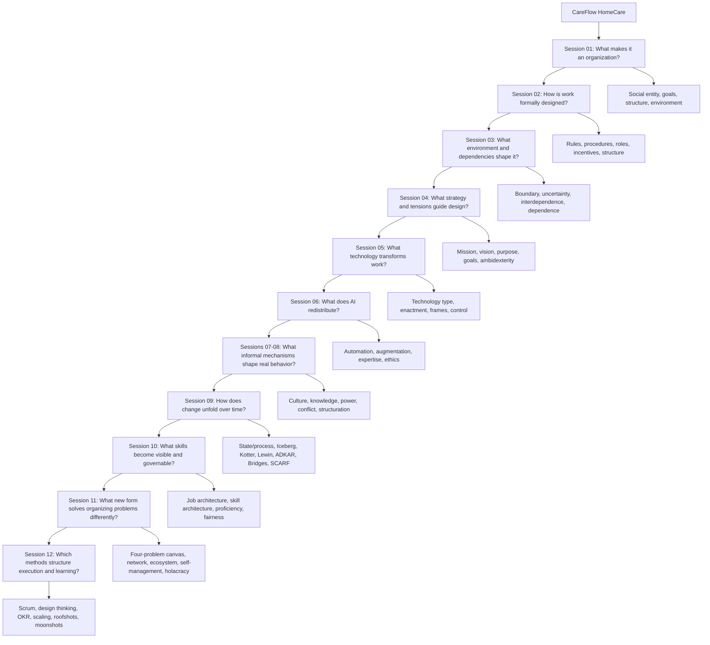

# Organization Full-Coverage Integrated Case

Created: 2026-08-04
Extended: 2026-08-05

Purpose: one fictional organization case that accumulates the main lenses from Sessions 01-12. Use it to understand the whole picture before drilling single-choice questions.

Status note: this is a cross-session exam aid. It does not mark any Organization topic `First Pass` as completed.

Source session notes:

- [Session 01: Definitional Basics Of Organization](session-01-definitional-basics-of-organization/session-01-definitional-basics-of-organization.md)
- [Session 02: Formal Organizational Design](session-02-formal-organizational-design/session-02-formal-organizational-design.md)
- [Session 03: Organization And Environment](session-03-organization-and-environment/session-03-organization-and-environment.md)
- [Session 04: Strategic Organization Design](session-04-strategic-organization-design/session-04-strategic-organization-design.md)
- [Session 05: Technology And Organization](session-05-technology-and-organization/session-05-technology-and-organization.md)
- [Session 06: AI And Organization](session-06-ai-and-organization/session-06-ai-and-organization.md)
- [Sessions 07-08: Informal Organization](session-07-08-informal-organization/session-07-08-informal-organization.md)
- [Session 09: Dynamic Perspectives On Organizing](session-09-dynamic-perspectives-on-organizing/session-09-dynamic-perspectives-on-organizing.md)
- [Session 10: Skills As The New Currency Of Organizations](session-10-skills-as-new-currency-of-organizations/session-10-skills-as-new-currency-of-organizations.md)
- [Session 11: Trends In Organizational Design - New Forms](session-11-trends-in-organizational-design-new-forms/session-11-trends-in-organizational-design-new-forms.md)
- [Session 12: Trends In Organizational Design - Scrum, Design Thinking, And OKR](session-12-trends-scrum-design-thinking-okr/session-12-trends-scrum-design-thinking-okr.md)

## The Case: CareFlow HomeCare

CareFlow HomeCare is a Munich-based home-care service that coordinates nursing visits for elderly patients after hospital discharge. It started with 12 nurses and one founder. It now has 250 employees, including nurses, care coordinators, dispatchers, product managers, software engineers, compliance specialists, and account managers for insurers and hospitals.

CareFlow promises three things:

1. patients receive reliable care at home
2. hospitals can discharge patients earlier
3. insurers reduce expensive readmissions

Growth creates problems. Nurses complain that scheduling targets are unrealistic. Dispatchers complain that nurses bypass the official app and coordinate through private chat groups. Hospitals want faster discharge planning. Insurers demand evidence of care quality. Regulators care about documentation, privacy, and patient safety. Management introduces a digital scheduling platform and later adds an AI tool called `NOVA`, which predicts visit duration, patient risk, and recommended nurse allocation.

After the AI rollout, informal conflicts become visible. Senior nurses say the system ignores tacit clinical judgment. Dispatchers say nurses use "patient safety" as an excuse to reject efficient schedules. Product managers say nurses resist change because they dislike transparency. Compliance says private chat groups create documentation and privacy risks. A new internal phrase appears: "the app is for management; WhatsApp is for real care."

Management announces a transformation program called `CareFlow One`: all regions must use the official platform, NOVA recommendations must be reviewed inside the app, and private chat groups must be replaced by documented care channels. Adoption is uneven. Some teams use the system as intended; others keep spreadsheets and chats in parallel. Team leads fear losing autonomy. Nurses fear surveillance. Management wants visible progress before the next insurer contract renewal.

The transformation exposes a second issue: job titles no longer describe what people actually do. Some "care coordinators" mainly manage hospital relations, others resolve clinical escalations, and some act as product testers for the app. Senior nurses mentor juniors but this invisible work is not rewarded. Product managers want data-literacy skills in care teams. HR proposes a `CareFlow Skill Grid` that maps job families, skill families, proficiency levels, career paths, and internal mobility.

To expand capacity without hiring every specialist internally, CareFlow creates a partner network called `CareNet`. It coordinates freelance specialist nurses, telehealth doctors, pharmacies, rehab providers, and regional care teams around patient episodes. One pilot region experiments with self-managed care circles, where nurses and coordinators allocate some work themselves through roles rather than direct managerial assignment. Product and clinical teams use Scrum to improve the platform, design thinking to redesign nurse/patient workflows, and OKRs to align the transformation with patient safety, documentation, and innovation goals.

This one case can be analyzed through Sessions 01-12.

## Whole-Picture Map



## Session 01 Layer: Definitional Basics

Core question:

```text
Is CareFlow an organization, and which perspective best explains the case?
```

### Apply The Four Criteria

| Criterion | Case evidence | Exam-safe interpretation |
|---|---|---|
| Social entity | nurses, coordinators, dispatchers, managers, software team, patients, partner hospitals | CareFlow is built from coordinated social relationships, not just assets or software. |
| Goal-directed | reliable home care, lower readmissions, growth, insurer trust, patient safety | It has multiple goals, not one simple objective. |
| Deliberately structured | care teams, scheduling rules, escalation procedures, app workflows, managerial roles | Coordination is deliberately organized through roles, rules, and routines. |
| Environment-linked | hospitals, insurers, patients, regulators, labor market, technology vendors | CareFlow depends on and responds to external actors. |

Conclusion:

```text
CareFlow clearly qualifies as an organization because it is a social entity,
goal-directed, deliberately structured, and linked to its external environment.
```

### Choose A Perspective

| Perspective | What it highlights in CareFlow | What it misses if used alone |
|---|---|---|
| Rational system | formal goals, roles, scheduling procedures, dashboards, KPIs | nurses' workarounds, informal chats, identity, resistance |
| Natural system | professional norms, informal coordination, conflicting interests, motivation | formal rules, reporting lines, official accountability |
| Open system | hospitals, insurers, regulators, labor market, patient families | internal design details if used too broadly |

Best exam answer:

```text
A complete analysis combines rational, natural, and open-system views:
CareFlow has formal design, informal behavior, and strong environmental dependence.
```

### Single-Choice Traps

| Trap option | Correction |
|---|---|
| CareFlow is an organization mainly because it is legally incorporated. | Legal form is not enough. Use the four organizational criteria. |
| CareFlow has one goal: profit. | Too narrow. It has multiple goals: care quality, growth, patient safety, insurer trust, and operational efficiency. |
| The formal app workflow fully explains how work happens. | No. The natural-system view captures informal coordination and workarounds. |

## Session 02 Layer: Formal Organizational Design

Core question:

```text
How does CareFlow formally divide, coordinate, control, and motivate work?
```

### Formal Design Elements

| Element | CareFlow example | Organizational effect |
|---|---|---|
| Rules | nurses must log every visit within 2 hours; high-risk patients need supervisor approval | increases accountability and patient-safety control |
| Procedures | intake -> risk classification -> scheduling -> visit -> documentation -> billing | standardizes the care process |
| Roles | nurse, dispatcher, care coordinator, clinical lead, product manager, compliance officer | creates expectations and responsibility boundaries |
| Incentives | teams are evaluated on visit completion, punctuality, patient ratings, documentation accuracy | directs attention, but may cause shortcuts or gaming |
| Structure | functional units: Care Operations, Dispatch, Product/Tech, Compliance, Sales | creates specialization, but also silos |

Rule vs procedure:

```text
Rule: high-risk visits require supervisor approval.
Procedure: intake -> classify risk -> assign nurse -> confirm visit -> document care.
```

### Structure Diagnosis

CareFlow began as a simple structure:

```text
founder directly assigned nurses and solved problems personally.
```

As it grew, it became functional:

```text
Care Operations, Dispatch, Product/Tech, Compliance, Sales.
```

Functional structure helps specialization but creates silos. Dispatch optimizes schedules, nurses optimize safe care, Product optimizes app adoption, Sales optimizes insurer contracts. These goals are connected but not automatically aligned.

If CareFlow expands into different patient groups, a divisional or matrix form may become more appropriate:

| Design option | When it fits | Tradeoff |
|---|---|---|
| Functional | few service lines, efficiency, professional specialization | silos and slow cross-functional response |
| Divisional by patient segment | dementia care, post-surgery care, chronic disease care each need different processes | duplicated functions |
| Matrix | both patient-segment expertise and functional expertise matter | dual authority and conflict |
| Horizontal/process structure | patient journey is the main coordination problem | hard redesign; needs culture, IT, training, and incentives |

### Formal Design Does Not Equal Real Action

The app says nurses should document visits immediately. In practice, nurses sometimes write notes at night because visit schedules are overloaded. Dispatchers use private chat groups because the official escalation function is too slow.

Exam-safe interpretation:

```text
Formal design gives the planned architecture of work, but procedures become real only through interpretation, enactment, and local adaptation.
```

### Single-Choice Traps

| Trap option | Correction |
|---|---|
| Rules guarantee reliable care. | No. Rules help only if enacted and supported by realistic routines. |
| Functional structure is always best because it creates specialization. | No. It also creates silos and may not fit patient-journey coordination. |
| Matrix is more modern, therefore superior. | No. Matrix fits dual demands but creates dual authority and conflict. |
| Nurses using private chat means the formal organization disappeared. | No. It means formal design is being enacted and modified in practice. |

## Session 03 Layer: Organization And Environment

Core question:

```text
What external actors, boundaries, dependencies, and uncertainty shape CareFlow?
```

### Boundary Analysis

CareFlow's legal boundary is not the same as its task boundary.

| Actor | Legally inside CareFlow? | Inside the task system? | Why it matters |
|---|---:|---:|---|
| employed nurses | yes | yes | deliver core service |
| freelance specialist nurses | no | yes | provide scarce expertise |
| hospitals | no | yes | provide discharge referrals and patient information |
| insurers | no | yes | pay for care and demand quality evidence |
| software vendor | no | partly | maintains critical platform infrastructure |
| regulators | no | yes | constrain documentation, privacy, and safety |

Exam-safe sentence:

```text
Organizational boundaries are analytical and shifting; actors outside legal ownership can still be inside the task system.
```

### Task And Global Environment

| Environment type | CareFlow examples |
|---|---|
| Task environment | patients, families, hospitals, insurers, freelance nurses, regulators, software vendors |
| Global environment | aging population, nursing shortage, data-protection law, digital health technology, inflation, public trust in AI |

### Interdependence

| Type | CareFlow example | Coordination need |
|---|---|---|
| Pooled | regional care teams share brand, IT, compliance rules | standards and shared resources |
| Sequential | hospital discharge -> intake -> scheduling -> nurse visit -> documentation -> billing | reliable handoffs |
| Reciprocal | nurse, dispatcher, doctor, and family adapt during an urgent patient deterioration | mutual adjustment and rich communication |

### Uncertainty

CareFlow faces high uncertainty because both change and complexity are high.

| Dimension | Case evidence | Design implication |
|---|---|---|
| Change | patient demand fluctuates; regulations change; hospitals change discharge patterns | sensing and flexible response |
| Complexity | many actors, medical cases, insurers, technologies, privacy constraints | boundary-spanning roles and cross-functional coordination |

### Theory Comparison

| Theory | CareFlow use | Correct answer logic |
|---|---|---|
| Contingency theory | structure should fit unstable, complex care environment | more organic, cross-functional coordination may fit better than rigid bureaucracy |
| Resource dependence | CareFlow depends on scarce nurses, hospital referrals, insurer contracts, software infrastructure | reduce dependence through partnerships, training pipeline, multiple insurers, internal tech competence |
| Population ecology | digital home-care platforms compete; some forms survive while others fail | explains selection of organizational forms at population level, not one manager's design choice |

### Single-Choice Traps

| Trap option | Correction |
|---|---|
| Environment means only competitors. | No. Include task and global environments. |
| Freelance nurses are outside CareFlow, so they are irrelevant to organization design. | No. They may be outside legal ownership but inside the task system. |
| High uncertainty means only high change. | No. Uncertainty combines change and complexity. |
| Population ecology tells CareFlow managers which structure to choose. | No. Population ecology explains form selection at the population level. |

## Session 04 Layer: Strategic Organization Design

Core question:

```text
What strategy is CareFlow pursuing, and what design tensions follow?
```

### Strategic Intent

| Term | CareFlow version | Function |
|---|---|---|
| Mission | provide reliable home care after hospital discharge | current task |
| Vision | become the trusted home-care coordination platform for aging patients in Germany | future image |
| Purpose | help patients recover safely at home while reducing avoidable hospital stays | broader reason for existence |
| Goals | reduce readmissions by 15%; reach 20 partner hospitals; keep nurse turnover below 10%; maintain documentation compliance above 98% | concrete targets |

Trap correction:

```text
Mission, vision, purpose, and goals are not interchangeable.
```

### Strategy And Structure

| Logic | CareFlow example |
|---|---|
| Structure follows strategy | if CareFlow chooses premium complex-care service, it should create specialized clinical teams and richer coordination. |
| Strategy follows structure | if its existing app and scheduling department favor short standardized visits, the realized strategy may drift toward high-volume routine care. |
| Strategy as practice | care coordinators, nurses, product managers, and hospital account managers translate the strategy through meetings, dashboards, exceptions, and local decisions. |

### Strategic Tensions

| Tension | CareFlow example | Correct interpretation |
|---|---|---|
| Exploration vs exploitation | exploit routine care visits efficiently while exploring AI-supported complex-care coordination | ambidexterity requires a design choice, not "do both somehow" |
| Focus vs diversification | expand from home nursing into telehealth, pharmacy delivery, or remote monitoring | diversification creates value only if attractiveness, cost-of-entry, and better-off tests pass |
| Performance vs responsibility | pressure to lower costs may conflict with patient safety, nurse workload, and privacy | legal compliance is not the full ethical test |

### Porter's Diversification Tests

If CareFlow considers pharmacy delivery:

| Test | Question | Possible answer |
|---|---|---|
| Attractiveness | Is pharmacy delivery attractive or improvable? | maybe, if medication adherence is valuable and reimbursable |
| Cost-of-entry | Is entry cost lower than expected future benefit? | uncertain, because licenses, logistics, and partnerships may be costly |
| Better-off | Does common ownership create synergy? | yes only if nurse visits, patient data, and medication delivery improve care together |

Exam-safe conclusion:

```text
Growth alone is not strategic value creation; the better-off test asks whether common ownership creates real synergy.
```

### Single-Choice Traps

| Trap option | Correction |
|---|---|
| CareFlow's strategy is only the CEO's written plan. | No. Strategy is also enacted through routines, tools, meetings, and local interpretation. |
| Ambidexterity means doing efficiency and innovation at the same time without design tradeoffs. | No. Specify structural or contextual ambidexterity and the related risk. |
| Pharmacy delivery is valuable because it grows the company. | No. Apply attractiveness, cost-of-entry, and better-off tests. |
| If an action is legal, it is ethically sufficient. | No. Stakeholder responsibility can go beyond legality. |

## Session 05 Layer: Technology And Organization

Core question:

```text
What is the technology, how should it be classified, and how is it enacted in practice?
```

### Technology Is Broad

CareFlow's technology includes:

- scheduling software
- patient-risk scoring forms
- visit documentation templates
- mobile devices
- care protocols
- nurse skills and medical knowledge
- billing processes
- data dashboards

Exam-safe definition:

```text
Technology is the means by which inputs are transformed into outputs, including tools, methods, procedures, skills, and knowledge.
```

### Input-Transformation-Output

| Stage | CareFlow example |
|---|---|
| Inputs | patient discharge data, nurse availability, medical protocols, insurer rules, family information |
| Transformation | triage, scheduling, home visit, care documentation, escalation, billing |
| Outputs | completed care visit, patient stability, readmission prevention, insurer report, learning data |

### Modernist Classification

| Lens | CareFlow application | Exam use |
|---|---|---|
| Woodward | home care is not pure mass production; it combines standardized routines with customized service | structure must fit technical complexity |
| Thompson | CareFlow combines long-linked processes, mediating platform work, and intensive care coordination | different technologies need different coordination |
| Perrow | routine medication reminders are low variability/high analyzability; complex wound care has higher variability; crisis cases can be high variability/low analyzability | high variability plus low analyzability requires judgment and flexible coordination |

### Technology-In-Practice

| Concept | CareFlow example |
|---|---|
| Affordance | dashboard makes patient status and nurse workload visible |
| Constraint | app forms make unusual patient situations hard to describe |
| Technological frames | managers see the app as coordination; nurses see it as surveillance; insurers see it as evidence |
| Enactment | nurses use the app for documentation but private chats for urgent coordination |

### Control Angle

The scheduling dashboard can support coordination, but it can also become a control instrument if it ranks nurses, compares visit speed, flags deviations, and affects rewards.

Exam-safe sentence:

```text
The same technology can coordinate work, make work visible, and shift power, depending on how actors interpret and enact it.
```

### Single-Choice Traps

| Trap option | Correction |
|---|---|
| CareFlow's technology is only the app. | No. Technology also includes procedures, skills, protocols, and knowledge. |
| Because the app is the same for everyone, it has the same effect everywhere. | No. Effects depend on frames, routines, enactment, and power. |
| Perrow classifies whether technology is advanced or outdated. | No. Perrow uses task variability and task analyzability. |
| Dashboards are neutral information systems. | No. They can become control instruments. |

## Session 06 Layer: AI And Organization

Core question:

```text
What does AI redistribute across tasks, roles, expertise, change, and accountability?
```

CareFlow introduces `NOVA`, an AI system that:

- predicts patient risk
- recommends visit duration
- suggests which nurse should be assigned
- drafts documentation after a visit
- flags suspiciously short or delayed visits

### Reject Determinism

Wrong:

```text
NOVA will automatically make CareFlow more efficient and objective.
```

Correct:

```text
AI effects depend on development, data, introduction, interpretation, routines, roles, power relations, and governance.
```

### Four AI Effect Domains

| Domain | CareFlow diagnosis | Recommendation |
|---|---|---|
| Task division | NOVA automates parts of scheduling and documentation but creates validation, exception handling, and data-quality work | redesign work allocation before scaling |
| Roles, knowledge, expertise | senior nurses may become validators; junior nurses may lose learning opportunities if they follow recommendations blindly | protect learning routines and clinical reasoning |
| Stability and change | historical data may reinforce old visit patterns and under-serve complex patients | review low-score or anomaly cases separately |
| Fairness, ethics, accountability | AI scores may influence patient care, nurse evaluation, and insurer reporting | define human owner, appeal route, data limits, validation checks |

### Automation And Augmentation

| AI use | Classification | Why |
|---|---|---|
| automatically fills routine documentation draft | partial automation | machine performs part of the task |
| nurse reviews AI draft and corrects clinical judgment | augmentation | human and AI jointly produce output |
| AI schedules routine visits but dispatchers handle exceptions | automation plus adjacent human work | automation creates exception-management work |
| AI suggests risk level and nurse decides final plan | centaur-like split | human and machine handle different parts |

Exam-safe insight:

```text
Automation and augmentation are interdependent, not clean opposites.
```

### Expertise Growth Or Erosion

| Possible effect | Case evidence |
|---|---|
| Expertise growth | NOVA explains alternative risk factors and gives feedback after patient outcomes. |
| Expertise erosion | junior nurses stop practicing independent assessment because the system recommends the route. |

Correct design:

```text
Use AI as a second opinion, not as an invisible substitute for clinical learning.
```

### Algorithmic Control And Ethics

NOVA can become algorithmic control if it monitors, allocates, evaluates, compares, rewards, sanctions, or restricts nurses.

Governance checklist:

| Risk | Governance rule |
|---|---|
| bias | audit outcomes by patient group, region, and case type |
| privacy | minimize data and define access rights |
| opacity | provide explainable factors for risk scores |
| accountability | assign a human owner for final care decisions |
| unfair evaluation | do not use raw AI flags for sanctions without review |
| contestability | allow nurses and patients to challenge wrong classifications |

### Single-Choice Traps

| Trap option | Correction |
|---|---|
| NOVA replaces human work. | Too simple. It automates, augments, splits, and creates adjacent human work. |
| NOVA is objective because it is based on data. | No. Data can contain bias, omissions, and historical assumptions. |
| If nurses follow NOVA, expertise always grows. | No. Expertise may grow or erode depending on feedback and learning design. |
| AI dashboards are only decision support. | No. They can become algorithmic control. |
| Fairness means the model has high accuracy. | No. Fairness also concerns bias, transparency, privacy, accountability, and appeal rights. |

## Sessions 07-08 Layer: Informal Organization

Core question:

```text
How do informal norms, culture, knowledge, power, and conflict shape what CareFlow actually does?
```

### Formal Vs Informal

| Formal organization | Informal organization in CareFlow |
|---|---|
| official app workflow | nurses use private chats for urgent coordination |
| documented escalation procedure | experienced nurses call trusted doctors directly |
| NOVA-based assignment recommendation | senior nurses challenge or ignore assignments they consider clinically unsafe |
| compliance rule against private patient data sharing | teams still use informal shortcuts when the official system is slow |
| formal performance targets | local teams protect each other from metrics they see as unfair |

Exam-safe sentence:

```text
Informal organization can support, modify, bypass, or oppose formal design.
```

The point is not that informal behavior is "bad." Private chats may solve urgent coordination problems, but they also create privacy, documentation, and accountability risks.

### Structuration

CareFlow's formal rules do not simply determine behavior. Repeated behavior reproduces or changes the structure.

| Structural property | CareFlow example | What gets reproduced or changed |
|---|---|---|
| Signification | "real care happens outside the app" becomes shared language among nurses | the app is interpreted as management control rather than care support |
| Domination | dispatch controls schedules; nurses control clinical expertise and patient access | power is distributed across formal authority and non-substitutable expertise |
| Legitimation | teams praise nurses who "protect patients" by bypassing unrealistic schedules | informal norms legitimize workarounds |

Exam-safe interpretation:

```text
Structure enables and constrains action, but repeated action can reproduce or change the structure.
```

### Culture Router

| Schein level | CareFlow evidence | Correct interpretation |
|---|---|---|
| Artifacts | private chats, dashboard rankings, nurse handover stories, escalation meetings | visible clues, not final proof |
| Espoused values | patient safety, reliability, transparency, compliance, innovation | official values may conflict in practice |
| Basic assumptions | "good nurses protect patients from unrealistic systems"; "management values numbers over care" | infer only from repeated decisions, rewards, stories, and routines |
| Subcultures | nurses, dispatchers, Product/Tech, Compliance, Sales, regional teams | different groups attach different meaning to the same system |
| Counterculture | nurses openly reject NOVA rankings and build alternative coordination norms | informal opposition to the dominant digital-control logic |

Single-choice trap:

```text
Do not infer a basic assumption from one artifact. Triangulate artifacts, decisions, rewards, and repeated stories.
```

### Knowledge Router

CareFlow has both explicit and tacit knowledge.

| Knowledge type | Case example | Exam use |
|---|---|---|
| Explicit knowledge | care protocols, risk forms, documented visit notes, insurer reports | can be codified and transferred |
| Tacit knowledge | senior nurse intuition about frail patients, family dynamics, warning signs in the home | hard to articulate; learned through participation |
| Data | time stamps, visit duration, patient flags | raw symbols or recorded observations |
| Information | dashboard showing delayed high-risk visits | organized data with meaning |
| Knowledge | nurse understands why a short visit was clinically sufficient or unsafe | ability to interpret and act |

SECI in CareFlow:

| Mode | CareFlow example |
|---|---|
| Socialization, tacit to tacit | junior nurse shadows senior nurse during complex wound-care visits |
| Externalization, tacit to explicit | senior nurses write "red flag" examples into a clinical judgment guide |
| Combination, explicit to explicit | compliance integrates clinical guide, privacy rule, and insurer reporting template |
| Internalization, explicit to tacit | nurses repeatedly use the guide until risk assessment becomes practical skill |

Exam-safe correction:

```text
Tacit knowledge is not secret information. It is hard-to-articulate know-how built through practice.
```

### Power, Politics, And Conflict

Power at CareFlow does not equal formal authority.

| Power source | CareFlow example |
|---|---|
| Resource control | Sales controls insurer contracts; Product controls app development priorities |
| Centrality | Dispatch sits between patient demand, nurse availability, and hospital requests |
| Non-substitutability | experienced wound-care nurses are hard to replace |
| Dependency | CareFlow depends on hospitals for referrals and scarce nurses for delivery |
| Uncertainty coping | senior nurses handle ambiguous high-risk patient cases |
| Information control | Product and managers interpret dashboard metrics; nurses interpret patient reality |

Conflict diagnosis:

| Conflict type | CareFlow example | Management implication |
|---|---|---|
| Task conflict | what is the best care plan for a high-risk patient? | can improve decisions if psychologically safe |
| Process conflict | should urgent changes happen through the app or private chat? | needs clear workflow redesign |
| Resource conflict | who gets scarce specialist nurses? | needs transparent allocation rule |
| Status conflict | whose expertise counts more: nurse judgment, dispatch optimization, or AI recommendation? | needs evidence integration and role clarity |

Conflict-performance rule:

```text
Too little conflict creates passivity. Moderate task conflict can improve quality.
Too much conflict becomes politics, hostility, and distraction.
```

### Intervention

Do not say "improve communication" as a final answer. Use a design intervention:

1. create a shared superordinate goal: safe, timely, documented home care
2. define which cases require nurse override and why
3. create an official urgent-care channel that is as fast as private chat
4. externalize senior nurses' tacit risk criteria into examples and checklists
5. make NOVA explanations visible but contestable
6. separate learning feedback from punitive performance scoring
7. build cross-functional review meetings with nurses, dispatch, Product, and Compliance

### Single-Choice Traps

| Trap option | Correction |
|---|---|
| Informal organization means unofficial behavior only. | Too shallow. Explain the coordinating mechanism: norms, knowledge, status, power, conflict, workarounds. |
| Private chats prove employees are irrationally resisting. | No. They may solve real coordination problems while creating other risks. |
| Strong patient-safety culture is always good. | No. It can protect care but also justify bypassing documentation and learning. |
| Power belongs to managers only. | No. Nurses have power through expertise, non-substitutability, and uncertainty coping. |
| Better communication fixes the conflict. | Incomplete. Redesign decisions, evidence, incentives, knowledge flows, and escalation channels. |

## Session 09 Layer: Dynamic Perspectives On Organizing

Core question:

```text
How does CareFlow change over time, and which change framework fits the adoption problem?
```

### What Changed Vs How It Changed

Separate state and process.

| Question | CareFlow answer |
|---|---|
| What changed? | CareFlow moved from informal private-chat coordination toward official platform-based, AI-supported care coordination. |
| How did it change? | management announced `CareFlow One`, teams interpreted it differently, resistance emerged, workarounds persisted, pilots varied by region, and trust had to be built over time. |

Exam-safe sentence:

```text
Change is not just the announced tool or structure. It includes adoption, routines, identity, politics, capability, and reinforcement over time.
```

### Iceberg Model Of Change

| Perspective | CareFlow use | Limitation |
|---|---|---|
| Objectification | "AI rollout", "platform adoption", or "new coordination model" names the change | hides how adoption unfolds |
| Distinction | compare before and after: private chats and spreadsheets vs official NOVA-supported workflows | can imply clean phases that do not exist |
| Unfolding | trace how nurses, dispatch, Product, Compliance, hospitals, and insurers interact over time | harder to reduce to one simple answer |

Compact:

```text
Objectification names change. Distinction compares change. Unfolding explains change.
```

### Framework Router For CareFlow

| Framework | Use for CareFlow when... | Example application | Blind spot |
|---|---|---|---|
| Kotter | management needs organization-wide mobilization | create urgency around safety/compliance, build coalition with nurses/Product/Compliance, anchor new routines | can become top-down and linear |
| Lewin / Force Field | you must map drivers and resistance | driving forces: insurer demand, privacy risk, coordination delays; restraining forces: surveillance fear, workload, loss of autonomy | may oversimplify continuous change |
| ADKAR | individual adoption is the bottleneck | nurses need awareness, desire, knowledge, ability, and reinforcement to use official channels | underplays politics and structure |
| Bridges | people struggle with identity and loss | nurses must let go of "real care happens in private chats" and form a new professional identity around documented care | underplays technical design |
| Appreciative Inquiry | the organization wants to build on existing strengths | study teams that already combine fast care coordination with good documentation | can avoid conflict or harm |
| SCARF | social threat/reward explains resistance | status, certainty, autonomy, relatedness, and fairness threats shape nurse response | not a full implementation roadmap |

### Kotter Applied To CareFlow

| Step | CareFlow application |
|---|---|
| Urgency | show patient-safety, privacy, and insurer-contract risks from fragmented coordination |
| Coalition | include respected senior nurses, dispatch leads, Product, Compliance, and hospital-facing managers |
| Vision | "fast care coordination with documented professional judgment" |
| Communicate/enlist | explain why the app must support care, not only monitor care |
| Remove barriers | make urgent official channels as fast as private chats; reduce duplicate documentation |
| Short-term wins | pilot one region with lower escalation time and better documentation quality |
| Sustain | spread learning to other regions and adapt app workflows |
| Anchor | connect training, evaluation, escalation, and product updates to the new routines |

Single-choice correction:

```text
Listing Kotter steps is not enough. Each step must connect to case facts.
```

### Lewin / Force Field

| Driving forces | Restraining forces |
|---|---|
| insurer demand for evidence | fear of surveillance |
| privacy and compliance risk from private chats | loss of nurse autonomy |
| patient-safety need for traceable escalation | extra documentation workload |
| management need for scalable coordination | distrust of NOVA recommendations |
| hospitals want faster discharge planning | local teams trust old routines |

Intervention logic:

```text
Do not only push harder. Reduce restraining forces by redesigning workload, autonomy, fairness, and trust conditions.
```

### ADKAR By Stakeholder

| ADKAR element | Nurse adoption question |
|---|---|
| Awareness | Do nurses understand why private chats create patient-safety, privacy, and learning risks? |
| Desire | Do they see the official system as supporting professional care rather than only monitoring them? |
| Knowledge | Do they know when to override NOVA and how to document the reason? |
| Ability | Is the app fast enough during urgent visits, and have they practiced realistic cases? |
| Reinforcement | Are good documented judgments rewarded, or are only speed metrics rewarded? |

### Bridges And SCARF

Bridges transition:

| Phase | CareFlow interpretation |
|---|---|
| Ending / letting go | nurses lose the familiar private-chat identity of "we solve care problems ourselves" |
| Neutral zone | teams use app, chat, and spreadsheets in parallel; ambiguity and frustration rise |
| New beginning | documented care coordination becomes normal once it protects autonomy and patient quality |

SCARF threats:

| SCARF dimension | CareFlow threat | Better design |
|---|---|---|
| Status | senior nurses feel AI downgrades their expertise | make override reasons visible as expert judgment |
| Certainty | unclear how NOVA scores affect evaluation | publish use limits and review rules |
| Autonomy | nurses feel forced to follow recommendations | allow justified override and clinical discretion |
| Relatedness | Product and nurses see each other as opponents | mixed review teams and shared patient-safety goals |
| Fairness | nurses fear raw metrics punish complex cases | risk-adjusted review and appeal route |

### Appreciative Inquiry

Instead of starting only from failure, CareFlow can study teams where coordination already works.

| Stage | CareFlow application |
|---|---|
| Discover | find teams that use official channels quickly without losing patient judgment |
| Dream | define what excellent documented care coordination would look like |
| Design | build workflows, training, and dashboard rules from those positive cases |
| Destiny/Deploy | scale the routines and keep improving through feedback |

### Single-Choice Traps

| Trap option | Correction |
|---|---|
| Change happened when `CareFlow One` was announced. | No. Announcement is not adoption; change unfolds through routines, identity, politics, and reinforcement. |
| Employee resistance is irrational. | No. Diagnose status, certainty, autonomy, fairness, workload, incentives, and identity. |
| Bridges is about the external technology change. | No. Bridges is about internal psychological transition. |
| SCARF gives the full implementation plan. | No. SCARF is a social threat/reward lens. |
| Appreciative Inquiry means ignoring problems. | No. It starts from strengths but should not avoid conflict, harm, or structural constraints. |

## Session 10 Layer: Skills As The New Currency Of Organizations

Core question:

```text
How can CareFlow describe work and capability more precisely than job titles alone?
```

CareFlow has grown quickly. The title "care coordinator" now covers different work:

- hospital-discharge planning
- patient-family communication
- clinical escalation support
- app workflow testing
- insurer documentation support
- regional capacity planning

This creates inconsistent pay, unclear progression, poor internal mobility, and invisible expert work. HR proposes the `CareFlow Skill Grid`.

### Strategic Claim

Exam-safe sentence:

```text
If work changes faster than job titles, CareFlow needs a capability language that
describes people, roles, development paths, and talent decisions more precisely.
```

Drivers in the case:

| Driver | CareFlow evidence |
|---|---|
| Evolution of work | care roles now include digital documentation, family communication, and insurer reporting |
| AI impact | NOVA creates validation, explanation, data-quality, and exception-handling work |
| Regulation and fairness pressure | employees want transparent pay, appeal rights, and recognition of invisible work |

### Job Architecture Vs Skill Architecture

| Architecture | What it organizes at CareFlow | Core elements |
|---|---|---|
| Job architecture | roles, job families, hierarchy, responsibility, pay logic | job function, family, sub-family, level, grade, career stream |
| Skill architecture | what people must know and do across jobs | core competencies, functional skills, role-specific skills, proficiency levels |

CareFlow job architecture example:

| Job family | Sub-family examples | Possible levels |
|---|---|---|
| Clinical Care | home nursing, wound care, geriatric care, clinical supervision | junior, care professional, senior, lead |
| Care Coordination | hospital intake, family coordination, escalation support, regional planning | coordinator, specialist, senior, lead |
| Product And Data | product management, data quality, workflow design, AI validation | associate, manager, senior, lead |
| Compliance And Risk | privacy, documentation audit, insurer evidence, care-quality control | analyst, specialist, senior, lead |
| Partner Network | hospital accounts, freelance specialist pool, pharmacy partners, rehab providers | manager, senior manager, lead |

CareFlow skill architecture example:

| Skill cluster | Skills |
|---|---|
| Core competencies | patient orientation, ethical judgment, collaboration, documentation discipline |
| Clinical functional skills | risk assessment, wound-care support, medication red-flag recognition |
| Coordination skills | discharge planning, urgent escalation, cross-functional handoff, family communication |
| Digital/AI skills | NOVA interpretation, data-quality review, dashboard literacy, AI override documentation |
| Partner skills | hospital relationship management, insurer evidence translation, external-provider coordination |

Exam trap:

```text
Job architecture is not an org chart. It classifies work, responsibility, value,
progression, and pay logic.
```

### Skill Vs Competency

| Term | CareFlow example | Correction |
|---|---|---|
| Skill | documents a justified NOVA override in the official care channel | specific practical ability |
| Competency | makes safe care decisions under uncertainty while balancing patient, regulatory, and operational demands | broader role performance ability combining skills, behavior, and knowledge |

Single-choice trap:

```text
Skill and competency are related but not identical. Skill is more specific;
competency is broader performance capability.
```

### Proficiency Levels

Vague wording:

```text
understands patient-risk scoring
```

Better observable wording:

```text
independently evaluates NOVA risk recommendations, documents justified overrides,
and escalates ambiguous cases according to clinical and privacy rules.
```

| Level | CareFlow behavior example |
|---|---|
| Basic | follows standard risk-scoring prompts with supervision |
| Advanced beginner | handles routine cases and asks for support when patient context shifts |
| Competent | independently applies risk scoring and documents normal overrides |
| Proficient | adapts across complex cases and coaches others |
| Expert | shapes the risk-scoring standard and validates NOVA governance rules |

### HR Linkages

The `CareFlow Skill Grid` becomes organization design only if it affects decisions.

| HR/process decision | CareFlow use |
|---|---|
| Recruiting | hire for clinical judgment plus digital documentation ability |
| Performance management | evaluate documented judgment quality, not only speed |
| Compensation | recognize specialist and mentoring work, not only title |
| Learning and development | build paths from junior nurse to senior clinical validator |
| Succession planning | identify future regional care leads |
| Workforce planning | see shortages in wound-care, discharge planning, AI validation |
| Talent deployment | assign people to patient cases or innovation pilots based on proficiency |

Risk:

```text
A taxonomy without decision rules becomes an HR database, not organization design.
```

### People Consequences

Use Self-Determination Theory:

| Need | Good rollout | Bad rollout |
|---|---|---|
| Autonomy | employees see skill paths and can choose development routes | top-down skill scoring determines opportunities |
| Competence | skill levels guide training and mastery | public skill gaps shame employees without support |
| Relatedness | shared capability language improves collaboration | rankings create mistrust between nurses, Product, and managers |

Fairness questions:

| Question | CareFlow risk |
|---|---|
| Which skills count? | invisible mentoring and coordination may be ignored |
| Who defines skills? | Product/HR may overvalue digital traces and undervalue clinical judgment |
| Can employees correct profiles? | AI-inferred profiles may be wrong or outdated |
| Are AI matching tools audited? | biased data may route better opportunities to already visible employees |

### Single-Choice Traps

| Trap option | Correction |
|---|---|
| CareFlow's skill grid is just a database. | No. It is organization design only when tied to work, careers, pay, learning, and deployment decisions. |
| Job architecture and skill architecture are the same. | No. Job architecture organizes roles and levels; skill architecture organizes abilities and proficiency. |
| Level and grade are the same. | No. Level concerns responsibility and complexity; grade concerns compensation class. |
| AI-inferred skills are objective. | No. Discuss bias, transparency, privacy, accountability, and appeal rights. |
| Vague proficiency labels are enough. | No. Proficiency should be observable behavior. |

## Session 11 Layer: Trends In Organizational Design - New Forms

Core question:

```text
Does CareFlow's partner-network and self-managed circle model solve organizing problems differently?
```

CareFlow creates `CareNet`, a network around patient episodes. A patient leaving hospital may need a home nurse, telehealth doctor, pharmacy delivery, rehab provider, family support, and insurer approval. CareFlow does not own all these actors. It coordinates them through platform access, contracts, trust, shared patient-status information, and episode-level roles.

### Novelty Test

Do not say:

```text
CareNet is new because it is a platform, agile, or digital.
```

Use the test:

1. hold the goal stable: safe and reliable home recovery after hospital discharge
2. choose comparison group: traditional home-care provider employing mostly internal staff
3. identify what organizing problems changed
4. assess the bundle, not one isolated feature

### Four-Problem Canvas

| Organizing problem | Traditional provider | CareNet version | What changed |
|---|---|---|---|
| Task division | internal departments handle care, scheduling, billing, and escalation | patient episode is decomposed into nursing, telehealth, pharmacy, rehab, insurer evidence, family coordination | more modular episode-based task division |
| Task allocation | managers assign internal staff | platform and coordinators match internal and external actors by skill, availability, and patient need | allocation shifts toward network matching |
| Reward provision | salary, hierarchy, local team norms | salary plus project income, reputation, flexibility, partner access, patient-outcome reputation | motivation includes network and reputational incentives |
| Information provision | internal records and phone calls | shared digital episode record, documented escalation channel, NOVA support, partner dashboards | transparent artifacts coordinate across legal boundaries |

Exam-safe sentence:

```text
"Network" is not the answer. The answer is which organizing problem is solved
differently and how.
```

### Why The New Form Becomes Attractive

CareNet responds to:

| Pressure | Case evidence |
|---|---|
| volatile demand | hospital discharge volume changes quickly |
| digitalization and AI | platform and NOVA make network coordination more feasible |
| scarce capabilities | specialist nurses and telehealth doctors cannot all be hired internally |
| legitimacy and fairness demands | documented patient episode records help insurers and regulators |
| adaptability | CareFlow can form temporary care constellations around patient needs |

### Network Organization

Definition:

```text
Network organization = legally independent actors coordinate through relationships,
trust, complementary capabilities, contracts, digital artifacts, and mutual adjustment.
```

Pros for CareFlow:

- access to scarce specialist capabilities
- flexible capacity without full internal ownership
- broader patient solution across nursing, telehealth, pharmacy, and rehab
- innovation through complementary expertise

Cons for CareFlow:

- coordination costs
- unclear accountability when care fails
- partner dependence
- privacy and knowledge-leakage risk
- harder governance and conflict resolution

Network vs ecosystem:

```text
CareNet as network = relationship-based coordination among partners.
CareNet as ecosystem = broader value system around patient recovery, data flows,
payment, regulation, and complementary providers.
```

### Self-Management And Holacracy Logic

One region pilots self-managed care circles. Each circle contains nurses, a coordinator, and a part-time product/compliance liaison. The circle handles routine scheduling tensions, assigns role responsibilities, and proposes workflow changes.

Self-management correction:

```text
Self-management does not mean no structure. It means authority is structured differently.
```

Holacracy-like elements:

| Element | CareFlow adaptation |
|---|---|
| Role | patient escalation owner, documentation steward, NOVA override reviewer |
| Circle | regional care circle with semi-autonomous responsibilities |
| Governance meeting | changes roles, policies, and authority domains |
| Tactical meeting | handles operational tensions and current care issues |
| Facilitator/secretary | keeps process and role records disciplined |

Holacracy trap:

```text
Holacracy reduces managerial hierarchy but increases formal governance.
It is less boss-centered, not less structured.
```

### Single-Choice Traps

| Trap option | Correction |
|---|---|
| CareNet is new because it is digital. | No. Apply the four-problem novelty test. |
| A network organization has no hierarchy or control. | No. It uses contracts, trust, governance, boundary roles, and digital artifacts. |
| Ecosystem and network mean the same thing. | No. Network focuses on relationships among actors; ecosystem is the broader value system. |
| Self-management means everyone chooses freely without structure. | No. Authority is structured differently through roles, rules, and governance. |
| Holacracy removes formalization. | No. It often increases formal governance through explicit roles and meetings. |
| The four-problem canvas only asks about task allocation. | No. It also includes task division, reward provision, and information provision. |

## Session 12 Layer: Scrum, Design Thinking, And OKR

Core question:

```text
Which method helps CareFlow learn, coordinate, and implement the transformation?
```

CareFlow uses three methods:

1. design thinking to understand nurse, patient, hospital, and family needs
2. Scrum to build and improve the official platform in short cycles
3. OKR to align strategic priorities across care operations, Product, Compliance, and partner management

### Method Comparison

```text
Design thinking finds and tests problem-solution direction.
OKR aligns strategic priorities.
Scrum executes product work in short learning cycles.
```

| Method | Best CareFlow use | Main blind spot |
|---|---|---|
| Design thinking | redesign urgent-care coordination around nurse and patient needs | weak if implementation discipline, regulation, scale, or reliability dominate |
| Scrum | build app features such as fast escalation, override documentation, dashboard explanations | scaling across clinical, compliance, and platform dependencies |
| OKR | align transformation goals and measurable outcomes | metric gaming and overload |

### Scrum Applied To CareFlow

Scrum definition:

```text
Scrum = team-level agile framework for completing work through sprint cycles.
```

CareFlow product team:

| Category | CareFlow example | Function |
|---|---|---|
| Roles | Product Owner, Scrum Master, Developers | divide value responsibility, process responsibility, and product-work responsibility |
| Events | Sprint Planning, Daily Scrum, Sprint Review, Retrospective | create rhythm, feedback, coordination, and learning |
| Artifacts | Product Goal, Product Backlog, Sprint Goal, Sprint Backlog, Increment | make priorities, work, and progress visible |

Scrum cycle:

```text
backlog refinement -> sprint planning -> daily scrum -> increment
-> sprint review -> retrospective -> next sprint
```

Scrum four-problem canvas:

| Problem | CareFlow Scrum answer |
|---|---|
| Task division | backlog breaks platform work into escalation, override, privacy, and dashboard items |
| Task allocation | Product Owner orders priorities; Developers self-organize the sprint work |
| Reward provision | ownership, visible progress, patient-safety impact, team learning |
| Information provision | boards, events, artifacts, sprint reviews, retrospectives |

Scaling Scrum:

```text
Multiple teams create technical, priority, and timing interdependencies.
```

CareFlow scaling issues:

| Scaling problem | Case example | Practice |
|---|---|---|
| Technical interdependence | NOVA, mobile app, privacy logging, and hospital interface affect each other | analyze interdependencies |
| Priority interdependence | nurses need speed, Compliance needs documentation, insurers need evidence | reconfigure resources and priorities |
| Timing interdependence | hospital pilot cannot start until privacy review and app release are ready | reconfigure schedules |
| Interference | one team changes risk labels while another builds dashboards | mitigate interferences |

Single-choice trap:

```text
Scrum is not just a project-management tool. It reshapes roles, events, artifacts,
coordination, visibility, and learning.
```

### Design Thinking Applied To CareFlow

Definition:

```text
Design thinking = user-centered problem solving through discovery, iteration,
visualization, prototyping, and testing.
```

Process:

```text
understand/empathize -> define -> ideate -> prototype -> test -> iterate
```

CareFlow use:

| Step | CareFlow application |
|---|---|
| Understand/empathize | shadow nurses during urgent visits; interview patients, families, hospitals, dispatchers |
| Define | frame the problem as "urgent coordination must be fast, documented, and clinically trusted" |
| Ideate | generate official alternatives to private chat |
| Prototype | build quick mockups of urgent escalation, NOVA override explanation, and family update flow |
| Test | run pilots with nurses and hospital discharge teams |
| Iterate | improve speed, privacy, and documentation based on user feedback |

Design-thinking four-problem canvas:

| Problem | CareFlow design-thinking answer |
|---|---|
| Task division | discovery, definition, ideation, prototyping, testing |
| Task allocation | cross-functional participants bring user, technical, clinical, and business knowledge |
| Reward provision | user impact, participation, creativity, visible prototypes |
| Information provision | research notes, journey maps, prototypes, user feedback |

Weak when:

```text
The problem is already known and reliability, compliance, scale, or execution
discipline matters more than discovery.
```

Single-choice trap:

```text
Design thinking is not brainstorming. It includes user research, definition,
prototypes, testing, and iteration.
```

### OKR Applied To CareFlow

Definition:

```text
OKR = Objectives and Key Results; a strategy-implementation method for dynamic environments.
```

Good CareFlow objective:

```text
Make documented urgent-care coordination trusted and fast across pilot regions.
```

Possible key results:

| Key result | Why it works |
|---|---|
| 90% of urgent escalations documented in official channel within 5 minutes | measurable and outcome-oriented |
| reduce duplicate chat/app coordination by 70% in pilot teams | measures adoption of new routine |
| 85% of nurses report they understand when and how to override NOVA | connects ability and trust |
| zero privacy incidents in pilot escalation channels | roofshot-style reliability target |

Bad OKR:

```text
Use the app more.
```

Why bad:

```text
It is vague, activity-oriented, and can create metric gaming without proving better care coordination.
```

OKR four-problem canvas:

| Problem | CareFlow OKR answer |
|---|---|
| Task division | strategy becomes objectives, key results, and tasks |
| Task allocation | top-down and bottom-up alignment across levels |
| Reward provision | focus, meaning, ownership, visible progress |
| Information provision | cycles, check-ins, dashboards, progress metrics |

Roofshot vs moonshot:

| Type | CareFlow example | Use |
|---|---|---|
| Roofshot | zero privacy incidents; 98% legally required documentation completeness | operational, compliance, reliability commitments |
| Moonshot | reduce avoidable readmissions by 40% using AI-enabled care coordination | innovation or exploration where 60-70% success can still be progress |

Single-choice trap:

```text
OKR is not a KPI list. It links strategic intent to measurable progress and learning.
```

### Full Session 12 Single-Choice Traps

| Trap option | Correction |
|---|---|
| Scrum, design thinking, and OKR are interchangeable agile methods. | No. Design thinking explores problems, Scrum executes product work, OKR aligns strategy and progress. |
| Scrum is mainly a software board. | No. It is a framework of roles, events, artifacts, and sprint cycles. |
| Scaling Scrum just means adding more teams. | No. Scaling requires interdependency analysis and resource/schedule reconfiguration. |
| Design thinking is best when the problem is already clear and reliability is the only issue. | Usually no. Design thinking fits ambiguous user problems; reliability needs execution discipline. |
| OKRs should be tied directly to individual pay. | Risky. This can encourage gaming and reduce learning orientation. |
| Moonshots are appropriate for privacy compliance. | No. Use roofshots for binding operational, legal, and reliability commitments. |

## Integrated Answer Pattern

Use this when a case question combines multiple weeks.

```text
CareFlow is an organization because it is a social entity with goals, deliberate
structure, and environmental links. Its formal design divides work through roles,
rules, procedures, incentives, and functional units, but real action also depends
on enactment and informal workarounds. Because CareFlow operates in a complex and
changing environment with hospitals, insurers, regulators, patients, and scarce
nurses, its structure must fit uncertainty and resource dependence. Strategy gives
the design direction, but strategic intent is translated and modified in practice.
Technology is not only the app; it includes tools, procedures, skills, and knowledge.
AI then redistributes work, expertise, learning, accountability, and control, so it
requires governance rather than technological optimism. Sessions 07-08 add the
informal layer: culture, tacit knowledge, power, politics, and conflict explain why
formal design and technology are enacted differently across teams. Session 09 adds
the time layer: change is not an announcement but an unfolding process of adoption,
resistance, identity work, capability building, and reinforcement. Session 10 adds
the capability layer: job and skill architecture make changing work visible for
careers, learning, pay, mobility, and fairness. Session 11 adds the new-form layer:
CareNet must be judged by how it changes task division, task allocation, reward
provision, and information provision, not by labels like platform or network.
Session 12 adds the method layer: design thinking explores the user problem, Scrum
executes product work in cycles, and OKR aligns strategic priorities with measurable
progress.
```

## Week-By-Week Memory Ladder

| Session | Ask first | Best short answer |
|---|---|---|
| 01 Definition | What makes this an organization? | social entity + goals + deliberate structure + environment link |
| 02 Formal design | How is work officially divided and controlled? | rules, procedures, roles, incentives, structure, tradeoffs |
| 03 Environment | What outside actors and uncertainty shape the organization? | boundaries, task/global environment, interdependence, contingency, dependence |
| 04 Strategy | What direction and tensions guide design? | mission/vision/purpose/goals, ambidexterity, diversification, responsibility |
| 05 Technology | What transforms inputs into outputs, and how is it used? | technology is broad; classify and analyze enactment/control |
| 06 AI | What does AI redistribute? | tasks, roles, expertise, stability/change, fairness, accountability |
| 07-08 Informal organization | Why does actual behavior differ from formal design? | structuration, culture, tacit/explicit knowledge, power, conflict |
| 09 Dynamic perspectives | How does change unfold over time? | state/process distinction, Iceberg, Kotter, Lewin, ADKAR, Bridges, Appreciative Inquiry, SCARF |
| 10 Skills | How can capability be described beyond job titles? | job architecture, skill architecture, competencies, proficiency, HR linkages, fairness |
| 11 New forms | What organizing problems are solved differently? | four-problem canvas, network, ecosystem, self-management, holacracy |
| 12 Scrum, design thinking, OKR | Which method structures learning and implementation? | design thinking explores, Scrum executes, OKR aligns |

## Single-Choice Mini-Test

Choose the best correction mentally before checking the answer.

| No. | Statement | Best correction |
|---:|---|---|
| 1 | CareFlow is an organization because it is a GmbH. | Legal form is not enough; use the four organizational criteria. |
| 2 | CareFlow's app workflow fully determines real work. | No. Formal design is enacted, adapted, or bypassed in practice. |
| 3 | High uncertainty means CareFlow's environment changes often. | Incomplete. Uncertainty combines change and complexity. |
| 4 | Resource dependence means CareFlow generally feels uncertain. | No. It depends on need, scarcity, and lack of substitutes for key resources. |
| 5 | CareFlow should diversify because pharmacy delivery would grow revenue. | Growth is not enough; apply attractiveness, cost-of-entry, and better-off tests. |
| 6 | The scheduling dashboard is neutral. | No. It may coordinate work and become a control instrument. |
| 7 | NOVA automates work, so nurse expertise becomes irrelevant. | No. AI can automate, augment, create adjacent work, and reshape expertise. |
| 8 | AI fairness means the model is accurate. | No. Also check bias, privacy, transparency, accountability, and contestability. |
| 9 | Private chat groups are simply employee resistance. | No. They are informal coordination mechanisms that may solve real problems while creating privacy and accountability risks. |
| 10 | Strong patient-safety culture is always beneficial. | No. It can support care but also justify bypassing documentation and suppress learning. |
| 11 | Power in CareFlow belongs to formal managers. | No. Power also comes from expertise, centrality, resource control, non-substitutability, and uncertainty coping. |
| 12 | `CareFlow One` changed the organization when management announced it. | No. Change requires adoption, routine change, identity transition, capability, and reinforcement. |
| 13 | ADKAR is best for explaining population-level survival of digital care platforms. | No. ADKAR diagnoses individual adoption bottlenecks. Population ecology explains population-level selection. |
| 14 | SCARF is a full change-management roadmap. | No. It is a social threat/reward lens and should be combined with implementation frameworks. |
| 15 | The `CareFlow Skill Grid` is mainly an HR database. | No. It becomes organization design only when tied to recruiting, pay, learning, performance, workforce planning, and deployment. |
| 16 | Job architecture and skill architecture both mean the org chart. | No. Job architecture classifies roles and levels; skill architecture classifies abilities and proficiency. |
| 17 | AI-inferred skill profiles are objective because they come from data. | No. They can encode visibility bias, historical inequality, privacy problems, and appeal-right issues. |
| 18 | CareNet is a new form because it is digital. | No. Apply the four-problem canvas and show what changed relative to a comparable organization. |
| 19 | Self-management means CareFlow removes structure. | No. Authority is structured differently through roles, circles, rules, and governance. |
| 20 | Network organization and ecosystem are identical terms. | No. Network focuses on relationships among actors; ecosystem is the broader value system. |
| 21 | Scrum, design thinking, and OKR are basically the same agile method. | No. Design thinking explores, Scrum executes, OKR aligns. |
| 22 | Moonshot OKRs are appropriate for privacy compliance. | No. Use roofshots for binding operational, legal, and reliability commitments. |

## How To Drill This Case

1. Read only the short CareFlow case.
2. Cover the session sections.
3. For each week, answer from memory:

```text
What does this week's lens reveal that the previous weeks did not?
```

4. Then test yourself with the mini-test.
5. If an answer feels vague, open the relevant session cheat sheet before reading the full note.
