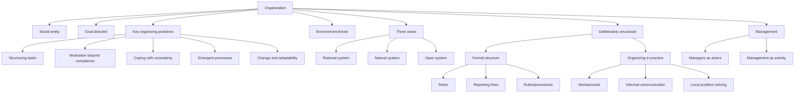

# Session 01: Definitional Basics Of Organization

Source file: `organization/raw/01_TUM_Organization_Definitions.pdf`

Course: Organization
Processed: 2026-05-16
Wiki note: `organization/wiki/session-01-definitional-basics-of-organization/session-01-definitional-basics-of-organization.md`

Course logistics checked: the exam is 60 minutes in English and tests conceptual understanding, application, and transfer. Applied exercise logic is examinable.

## 80/20 Exam Summary

Organizations are arrangements for coordinated action. The exam-safe definition from Daft et al. treats organizations as social entities that are goal-directed, deliberately structured, and linked to the environment.

High-yield points:

- Organizations solve collective-action problems: task structuring, motivation, uncertainty, emergent processes, and change.
- The same entity can be analyzed through rational, natural, and open-system views.
- Formal structure and organizing in practice are related but not identical.
- Management can mean actors in formal roles or the distributed activity of making organizations work.
- Organizing is a process: structures are recreated through recurrent action and interaction.

## Standard Definition

An organization is a:

```text
social entity
that is goal-directed
with deliberately structured coordinated activity systems
linked to the external environment
```

Criteria:

| Criterion | Meaning | Diagnostic question |
|---|---|---|
| Social entity | People and relationships | Who are the relevant actors? |
| Goal-directed | Oriented toward desired outcomes | What outcomes are pursued? Are goals unified or conflicting? |
| Deliberately structured | Coordinated activity system | What roles, rules, routines, or hierarchy structure action? |
| Environment-linked | Resources and constraints matter | Which external actors and conditions affect it? |

Caution:

```text
Definitions clarify patterns but simplify diverse realities. Use them as analytical tools, not exhaustive descriptions.
```

Example exam application:

```text
Fridays for Future can be analyzed as organization-like because it has actors, goals, coordination, and environmental links, even if its boundaries and hierarchy are less formal than a firm.
```

## Instrumental Vs Institutional Understanding

### Instrumental View

Organization is an instrument of management.

Focus:

- rational design of rules and structures
- planning, regulation, implementation
- functional organization as implementation of plans
- configurative organization as durable structural framework

Limit:

```text
It explains planned design better than unofficial modification, contradiction, or dysfunction.
```

### Institutional View

Organization is a whole social system or institution.

Focus:

- specific goals
- division of labor
- boundaries
- planned order and unplanned processes
- functions and dysfunctions
- goal contradictions

Exam-safe contrast:

```text
The instrumental view asks how management designs structure. The institutional view asks how the whole social system works, including unintended and informal processes.
```

## What Organizations Are Expected To Accomplish

Organizations are expected to:

- bring resources together to achieve goals
- facilitate innovation
- create value
- produce goods and services
- adapt to and influence the environment
- address ethics, diversity, motivation, and coordination

## Key Problems Of Organizations

| Key problem | How organizations address it |
|---|---|
| Structuring tasks and activities | Formal structures, differentiation and integration |
| Ensuring motivation beyond compliance | HR systems, incentives, meaning, culture |
| Coping with environmental uncertainty | Adapt structures/strategies, manage external relations |
| Handling emergent processes | Combine formal rules with informal dynamics, politics, symbols |
| Managing change and adaptability | Change processes and transformation capacity |

Managerial implication:

```text
Organization design is not just drawing an org chart; it is solving recurring coordination, motivation, uncertainty, and change problems.
```

## Three Views On Organizations

### Rational System View

Definition:

```text
Organizations are collectives pursuing specific goals and exhibiting highly formalized social structures.
```

Strengths:

- highlights formal goals
- highlights formalization and distinctive organizational features

Limits:

- overstates influence of written rules
- misses informal behavior and power dynamics

Example:

```text
A consulting firm’s formal project roles, deadlines, and KPIs.
```

### Natural System View

Definition:

```text
Organizations are collectives whose participants pursue multiple interests but recognize the value of joint resources.
```

Strengths:

- focuses on actual behavior
- shows multiple and changing goals
- highlights informal structures and power

Limits:

- can understate formal goals and formal structure

Example:

```text
Employees may officially pursue efficiency while informally protecting autonomy or status.
```

### Open System View

Definition:

```text
Organizations are collections of interdependent flows and activities linking shifting coalitions embedded in wider environments.
```

Strengths:

- shows dependence on external personnel, resources, and information
- explains how environments shape organizations

Limits:

- boundaries become ambiguous
- less focused on formal vs informal internal structure

Example:

```text
A startup depends on investors, suppliers, regulators, platforms, labor markets, and customers.
```

## Formal Structure Vs Organizing In Practice

Formal structure includes:

- official roles
- reporting lines
- formal decision rights
- procedures and rules

Organizing in practice includes:

- workarounds
- informal communication
- enacted coordination
- local problem solving

Key idea:

```text
Organizations can only be understood when both formal structure and organizing in practice are studied together.
```

## Organizing

Definition:

```text
Organizing is the process of establishing and adjusting coordinated action among interdependent actors to accomplish collective goals.
```

Mechanism:

```text
Formal structures enable and constrain organizing, but organizing also recreates or modifies organizations over time.
```

## Organization And Management

Management as actors:

```text
People in formal managerial roles, such as team leads, department heads, executives.
```

Management as activity:

```text
Activities needed to make organizations work; may be distributed across many people.
```

Five classical management functions:

| Function | Meaning |
|---|---|
| Planning | Define goals and future action |
| Organizing | Create coordination structures and responsibilities |
| Staffing | Secure and develop personnel |
| Leading | Direct, motivate, and align people |
| Controlling | Monitor results and correct deviations |

## Exercise Logic: Student Consulting Club

Possible application:

- Social entity: members, project teams, partners, clients.
- Goal-directed: learning, consulting projects, recruiting, reputation.
- Deliberately structured: roles, board, project leaders, application processes.
- Environment-linked: university, companies, student labor market, alumni, sponsors.

Likely organizing problems:

- volunteer motivation
- role clarity for events
- coordination with company partners
- knowledge transfer across student generations
- managing turnover

Perspective application:

- Rational: formal roles, event plan, responsibilities.
- Natural: member motivation, informal status, friendship networks.
- Open: dependence on companies, university rules, student availability.

## Mermaid Visual Map



## Subject Knowledge Graph

| Node | Meaning |
|---|---|
| Organization | Social, goal-directed, structured, environment-linked entity |
| Instrumental View | Organization as management instrument |
| Institutional View | Organization as whole social system |
| Rational System | Formal goals and formalized structure |
| Natural System | Multiple interests, informal behavior, power |
| Open System | Interdependent flows embedded in environment |
| Formal Structure | Official roles, rules, reporting, decision rights |
| Organizing In Practice | Enacted coordination and local adaptation |
| Management | Actors or activities that make organizations work |

| From | Relationship | To |
|---|---|---|
| Organization | solves | Collective-action problems |
| Rational System | emphasizes | Formal structure and goals |
| Natural System | reveals | Informal dynamics and multiple interests |
| Open System | reveals | Environmental dependence |
| Formal Structure | enables and constrains | Organizing in practice |
| Organizing in Practice | recreates | Organization |
| Management | includes | Planning, organizing, staffing, leading, controlling |

## Exam Relevance

Likely questions:

- Name and explain definitional criteria of an organization.
- Apply the definition to a borderline case.
- Compare rational, natural, and open-system views.
- Distinguish formal structure from organizing in practice.
- Explain management as actors vs management as activity.

Common mistakes:

- Treating legal status as sufficient for organization membership.
- Assuming organizations have one clear goal.
- Ignoring informal practices when analyzing formal design.
- Using only one perspective when the case invites comparison.

## Practice Questions

1. Apply the organization definition to TUM, Fridays for Future, and a Discord study group.
2. Which organizing problem is most visible in a volunteer organization?
3. Compare rational, natural, and open-system views using a startup.
4. Why is formal structure not enough to understand organizations?
5. What is the difference between management as actor and management as activity?
