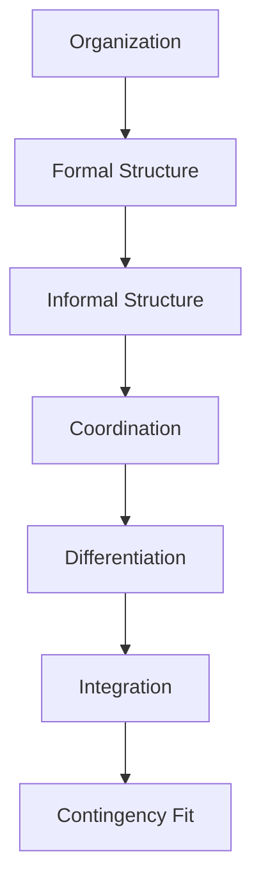

# Ubiquitous Language: Session 02: Formal Organizational Design

Source note: `session-02-formal-organizational-design.md`
Course: Organization
Definition sources: local topic note and raw material for term discovery; enriched with standard domain knowledge where the local note names a term without fully defining it.

This file is a standalone terminology and formula companion. It follows Matt Pocock style: canonical terms, aliases to avoid, relationships, example dialogue, and flagged ambiguities.

## Organization Language

| Term | Definition | Aliases to avoid |
|---|---|---|
| **Organization** | A coordinated social system with goals, members, roles, and boundaries. | company only |
| **Formal Structure** | The officially designed roles, reporting lines, procedures, and authority relationships. | org chart only |
| **Informal Structure** | The unofficial social relationships, routines, norms, and influence patterns inside an organization. | culture only |
| **Coordination** | The integration of interdependent tasks so work fits together. | communication only |
| **Differentiation** | The division of work into specialized roles, units, or tasks. | separation only |
| **Integration** | Mechanisms that connect differentiated work, such as hierarchy, teams, routines, or liaison roles. | standardization only |
| **Contingency Fit** | The idea that effective organization design depends on environment, strategy, technology, and task uncertainty. | best practice |

## Analysis Language

| Term | Definition | Aliases to avoid |
|---|---|---|
| **Level of Analysis** | The layer being explained, such as individual, team, organization, field, or society. | perspective |
| **Boundary Condition** | A condition under which a theory or design recommendation is more or less likely to hold. | exception only |
| **Mechanism** | The causal process explaining why one organizational condition produces an outcome. | definition |

## Design Language

| Term | Definition | Aliases to avoid |
|---|---|---|
| **Specialization** | Dividing work into narrower tasks or roles. | expertise only |
| **Departmentalization** | Grouping jobs or activities into units based on function, product, geography, customer, or process. | hierarchy |
| **Span of Control** | The number of subordinates directly reporting to a manager. | organization size |
| **Centralization** | The concentration of decision authority at higher organizational levels. | standardization |
| **Formalization** | The extent to which rules, procedures, and documentation prescribe behavior. | bureaucracy as insult |
| **Matrix Structure** | A design where employees report along two dimensions, such as function and project. | teamwork only |

## Relationships

- **Organization** should be distinguished from **Formal Structure** when writing exam answers.
- **Formal Structure** should be distinguished from **Informal Structure** when writing exam answers.
- **Informal Structure** should be distinguished from **Coordination** when writing exam answers.
- **Coordination** should be distinguished from **Differentiation** when writing exam answers.
- **Differentiation** should be distinguished from **Integration** when writing exam answers.
- **Integration** should be distinguished from **Contingency Fit** when writing exam answers.
- A strong answer defines the canonical term, applies the rule or formula, and states the managerial, legal, or analytical implication.

## Visual Memory Aid



## Example Dialogue

> **Student:** "I see **Organization** and **Formal Structure** in the note. Are they interchangeable?"
>
> **Professor:** "No. Use **Organization** for its precise technical meaning, and use **Formal Structure** only when the facts match that definition."
>
> **Student:** "So in an exam answer I should name the exact term first?"
>
> **Professor:** "Yes. Name the canonical term, apply the decision rule or mechanism, then state the implication."

## Flagged Ambiguities

- Do not use broad labels like "concept", "factor", or "thing" when a canonical term above fits.
- Do not use aliases listed in the tables unless you are explicitly explaining why they are misleading.
- If a formula symbol appears, define its unit, timing, and decision role before calculating.
- If a legal, theoretical, or framework term has a common everyday meaning, use the technical course meaning in exam answers.

## Exam Trap Corrections

| Trap | Correction |
|---|---|
| Naming a term without applying it. | Define it briefly, then apply it to the facts, formula, or decision. |
| Treating examples as definitions. | Use examples only after the canonical definition is clear. |
| Mixing related terms. | State the boundary between the terms before comparing them. |
| Copying a formula without variable meaning. | Define each variable and unit before substitution. |

## Cheat-Sheet Language

```text
State the theory, causal mechanism, boundary condition, level of analysis, and managerial implication.
For every technical term: define it, identify when it applies, and state the common confusion to avoid.
```
