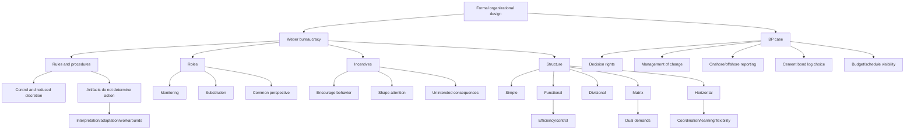

# Session 02: Formal Organizational Design

Source files:

- `organization/raw/02_TUM_Organization_Formal_Design.pdf`
- `organization/raw/02_BP_Case_Study_Part_1.pdf`

Course: Organization
Processed: 2026-05-16
Wiki note: `organization/wiki/session-02-formal-organizational-design/session-02-formal-organizational-design.md`

Course logistics checked: applied case analysis is examinable. BP Deepwater Horizon Part 1 is therefore included as application material for formal design.

## 80/20 Exam Summary

Formal design structures how work is divided, coordinated, controlled, and made accountable. But rules, roles, incentives, and structures do not mechanically determine action; actors interpret, adapt, or ignore formal artifacts.

High-yield points:

- Weber’s bureaucracy is the baseline for formalized roles, hierarchy, and rules.
- Rules specify what is allowed/required/prohibited; procedures specify how tasks should be carried out.
- Roles coordinate work by enabling monitoring, substitution, and a common perspective.
- Incentives encourage behavior but can shift attention and create unintended consequences.
- Structural forms solve different coordination problems and create different tradeoffs.
- Actual organizations are patchworks, not pure models.
- BP Deepwater Horizon Part 1 shows how formal authority, procedures, reporting lines, diagnostics, and accountability pressures can both control risk and make escalation harder.

## Why Formal Design Matters

Formal design:

- structures how work is divided
- shapes coordination and control
- defines authority and managerial expectations
- affects reliability, innovation, and adaptability

Exam-safe sentence:

```text
Formal design is the planned side of organizing, but its effects depend on how formal elements are enacted in practice.
```

## Weber’s Ideal Bureaucracy

Core features:

- fixed division of labor
- clearly defined hierarchy of offices
- general rules governing office performance
- selection based on technical qualifications
- fixed salaries
- office as primary occupation and career
- promotion by seniority
- separation of official work from ownership of administrative means

Key idea:

```text
Bureaucracy is defined by formalized roles, hierarchy, and rules.
```

## Formal Design Elements

The lecture focuses on four elements:

```text
rules and procedures
roles
incentives
structure
```

## Rules And Procedures

Rule:

```text
A formal, explicit prescription specifying what is allowed, required, or prohibited.
```

Procedure:

```text
A formal, specified sequence of steps prescribing how a task or process should be carried out.
```

Visible in:

- written policies
- handbooks
- job descriptions
- manuals
- organization charts

Effects:

- tell employees how to decide and perform tasks
- increase control
- reduce discretion
- can discourage agility and innovation

## McDonaldization

McDonaldization is an extreme case of formal rules and procedures.

Four criteria:

| Criterion | Meaning |
|---|---|
| Efficiency | Least input for highest return |
| Predictability | Same product/service everywhere |
| Standardization | Reduces assembly and process costs |
| Control | Minimizes variation in people, materials, and processes |

Tradeoff:

```text
Formalization increases reliability and scale, but may reduce flexibility, judgment, and innovation.
```

## Caution: Designing Artifacts Is Not Designing Action

Rules and procedures are artifacts. They do not guarantee patterns of action.

Key idea from Pentland and Feldman:

```text
Organizational procedures are generative systems that produce variable, context-dependent performances.
```

Actors may:

- interpret rules differently
- adapt procedures to local constraints
- ignore artifacts
- create workarounds

Exam trap:

```text
Do not assume that because a rule exists, it was followed or had the intended effect.
```

## Roles As Coordination Devices

Roles are:

- mechanisms for coordinating work activity
- expectations associated with social positions
- ways to facilitate continuity over time
- negotiated expectations
- links between tasks and people

### Three Functions Of Roles

| Function | Meaning | Example |
|---|---|---|
| Monitoring | Checking progress and intervening | Senior consultant checks junior work |
| Substitution | Shared understanding lets someone step in | Lawyer covers for sick colleague |
| Common perspective | Information across groups about who does what | Key account manager helps customer navigate firm |

## Incentives

Definition:

```text
Means or instruments designed to encourage actions or behavior.
```

Examples:

- salary
- wages
- benefits
- praise
- acceptance
- promotion
- title

Important nuance:

```text
Incentives shape attention and behavior; they may create unintended effects if they reward one target while weakening another.
```

Example:

```text
Rewarding speed may improve throughput but weaken quality checks or escalation behavior.
```

## Structural Forms

### Simple Structure

Characteristics:

- typical in young organizations with founder and few employees
- little specialization and hierarchy
- founder directs work informally
- employees handle many tasks
- close customer contact

Strengths:

- flexibility
- quick response
- commitment and loyalty
- adaptation
- good for small firms

Weaknesses:

- unclear responsibilities
- no employee economies of scale
- coordination complexity as the firm grows

### Functional Structure

Characteristics:

- grouped by function such as marketing, product development, finance
- specialists consolidated in departments
- vertical coordination through hierarchy
- effective when efficiency matters and horizontal coordination needs are limited

Strengths:

- economies of scale
- deep expertise
- functional goal accomplishment
- good for one or few products

Weaknesses:

- slow response to environmental change
- overloaded hierarchy
- poor horizontal coordination
- less innovation
- silo thinking
- restricted view of organizational goals

### Divisional Structure

Characteristics:

- divisions by product, service, product group, or location
- each division contains its own functions
- decentralized decision-making
- suited to multiple products/services

Strengths:

- flexible in unstable environments
- clear product responsibility
- strong customer contact
- good coordination within divisions
- adaptation to products/regions/customers

Weaknesses:

- loss of functional economies of scale
- poor coordination across product lines
- weaker technical specialization
- difficult integration and standardization

### Matrix Structure

Characteristics:

- dual emphasis on product/function or product/geography
- employees report to two managers
- formal horizontal coordination plus vertical hierarchy
- useful when expertise and innovation both matter

Strengths:

- coordination for dual demands
- flexible sharing of people
- supports complex decisions and frequent change
- develops product and functional skills

Weaknesses:

- dual authority can frustrate/confuse
- requires interpersonal skill and training
- meeting/conflict-heavy
- difficult power balance

### Horizontal Structure

Characteristics:

- built around cross-functional core processes
- reduces hierarchy and departmental boundaries
- self-directed teams central
- process owners responsible for end-to-end processes

Strengths:

- rapid response to customer needs
- strong customer-value focus
- broader goal view
- teamwork across expertise
- improved working life through shared responsibility

Weaknesses:

- hard to identify core processes
- requires culture, job, reward, and information changes
- requires training
- may limit deep skill development

## When To Apply Which Structure

Continuum:

```text
Functional/simple -> more control, efficiency, stability, reliability
Divisional/matrix/horizontal -> more coordination, learning, innovation, flexibility
```

Exam-safe rule:

```text
No structure is best in general. Structural choice depends on coordination demands, environmental uncertainty, size, product diversity, and strategic priorities.
```

## Symptoms Of Structural Deficiency

A structure may be suboptimal if:

- decision-making is delayed or low quality
- organization fails to respond innovatively to environmental change
- employee performance declines and goals are not met
- conflict is excessive

## Organizations In Practice: Patchworks

Actual organizations often contain:

- overlapping structural elements
- remnants of older structures
- ongoing redesign efforts
- top-down restructuring resisted by practice

Exam implication:

```text
Analyze real organizations as hybrids and patchworks, not textbook-pure structures.
```

## BP Deepwater Horizon Part 1: Formal Design Application

Analytical focus:

```text
How did BP’s formal organization shape what actors saw, decided, escalated, or failed to stop?
```

### Key Formal Features

| Formal feature | Case evidence | Organizational question |
|---|---|---|
| Hierarchy | BP Well Site Leaders held final authority over key judgments | How do decision rights work when advice and authority are separated? |
| Procedures | BP had Management of Change requirements and formal control expectations | What happens when procedures exist but are not fully activated? |
| Reporting lines | Onshore BP expertise was available but negative-test anomaly did not alter action | When does layered support strengthen or weaken escalation? |
| Diagnostic decision rights | BP decided not to run cement bond log though available | When should organizations delay for more information? |
| Accountability systems | Project was over budget and behind schedule | How do performance parameters shape attention without mechanically determining action? |

### Core Interpretation

BP’s formal organization concentrated authority, relied on procedures, layered onshore support over offshore execution, and made cost/schedule visible. These arrangements were designed to control risk, but they may also have made renewed diagnosis, stronger escalation, or interruption of work harder.

Exam-safe formulation:

```text
The case should not be reduced to individual error or one bad decision. It illustrates how hierarchy, procedures, reporting lines, diagnostic choices, and accountability pressures interact in high-risk formal organization.
```

## Mermaid Visual Map



## Subject Knowledge Graph

| Node | Meaning |
|---|---|
| Formal Design | Planned rules, roles, incentives, and structures |
| Bureaucracy | Formalized roles, hierarchy, rules |
| Rule | Formal prescription of allowed/required/prohibited behavior |
| Procedure | Formal sequence of task steps |
| Role | Coordination device tied to a social position |
| Incentive | Instrument encouraging behavior |
| Structural Form | Overall arrangement of units and coordination |
| Functional Structure | Grouping by function |
| Divisional Structure | Grouping by product/service/location |
| Matrix Structure | Dual reporting and dual coordination logic |
| Horizontal Structure | Cross-functional process-based structure |
| BP Case | Formal design failure/application case |

| From | Relationship | To |
|---|---|---|
| Rules | increase | Control |
| Rules | reduce | Discretion |
| Rules | do not guarantee | Action |
| Roles | support | Monitoring/Substitution/Common Perspective |
| Incentives | shape | Attention and behavior |
| Structural Forms | solve | Different coordination problems |
| Functional Structure | favors | Efficiency and expertise |
| Divisional Structure | favors | Product/customer responsiveness |
| Matrix Structure | handles | Dual demands |
| Horizontal Structure | favors | Process/customer value coordination |
| BP Formal Organization | concentrated | Authority |
| BP Accountability System | made salient | Cost and schedule |

## Exam Relevance

Likely questions:

- Explain Weber’s ideal bureaucracy.
- Define rule vs procedure.
- Explain why formal rules do not mechanically determine action.
- Explain roles as coordination devices.
- Compare structural forms and tradeoffs.
- Diagnose symptoms of structural deficiency.
- Apply formal design concepts to BP Deepwater Horizon Part 1.

Common mistakes:

- Assuming formal rules are automatically followed.
- Listing structures without tradeoffs.
- Treating BP as only individual failure rather than formal system interaction.
- Ignoring incentives/accountability when analyzing safety-related decisions.

## Practice Questions

1. Why is Weber still useful for formal design analysis?
2. Explain the difference between a rule and a procedure.
3. How can a role support coordination?
4. Compare functional and divisional structure.
5. When is a matrix structure useful and why is it difficult?
6. Analyze BP using hierarchy, procedures, reporting lines, diagnostics, and accountability.
