# Session 03: Organization And Environment

Source files:

- `organization/raw/03_TUM_Organization_Environment.pdf`
- `organization/raw/03_BP_Case_Study_Part_2.pdf`

Course: Organization
Processed: 2026-05-16
Wiki note: `organization/wiki/session-03-organization-and-environment/session-03-organization-and-environment.md`

Course logistics checked: applied exercises are examinable. BP Deepwater Horizon Part 2 is included as application material for organization-environment interaction.

## 80/20 Exam Summary

Organizations do not act alone. They are embedded in task and global environments, depend on other organizations, face environmental uncertainty, and must design structures and boundary practices that fit those conditions.

High-yield points:

- Organization/environment boundaries are analytical distinctions, not naturally given.
- Task environment includes actors directly linked to task accomplishment; global environment includes broader technological, legal, socio-cultural, ecological, and macroeconomic conditions.
- Interdependence can be pooled, sequential, or reciprocal.
- Environmental uncertainty depends on environmental change and complexity.
- Contingency theory: structure must fit environment; no one best structure.
- Resource dependence theory: dependence increases with need and scarcity and decreases with substitutes.
- Population ecology: survival/failure happens at population level through variation, selection, and retention.
- Organizations can manage environments through boundary spanning, PR, differentiation, and sensing.
- BP Part 2 shows how interorganizational dependencies and information asymmetries can prevent uncertainty absorption.

## Boundaries As A Problem

Speaking of an organization’s environment assumes a boundary between organization and environment.

But boundaries are difficult because:

- organizations have no natural visible limits
- membership, employment, ownership, or legal status do not fully settle belonging
- functional definitions can become too broad
- boundaries shift through acquisition, outsourcing, partnerships, platforms, and ecosystems

Exam-safe sentence:

```text
Organizational boundaries are analytical distinctions that are socially produced, maintained, multiple, and shifting.
```

## Task Environment Vs Global Environment

### Task Environment

Actors and forces directly linked to organizational task accomplishment.

Examples:

- suppliers
- buyers
- competitors
- new entrants
- substitutes
- collaborators
- banks or financing partners
- key regulators when directly linked to operations

### Global Environment

Wider conditions shaping organizational action.

Types:

| Global environment | Meaning | Example |
|---|---|---|
| Technological | ICT and other major technical developments | AI tools, automation, platform infrastructure |
| Political-legal | Codified regulation and law | labor law, tax law, corporate forms |
| Socio-cultural | Demographics and cultural values | sustainability preference, aging population |
| Ecological | Natural resources and environmental impact | resource scarcity, climate regulation |
| Macroeconomic | Overall economic indicators | exchange rates, growth, public debt |

## Interdependence Among Organizations

Organizations depend on others for:

- resources
- inputs
- knowledge
- distribution
- legitimacy
- labor
- infrastructure

### Forms Of Task Interdependence

| Type | Meaning | Example |
|---|---|---|
| Pooled | Units contribute separately to a larger whole or share resources | Bank branches using common brand and IT system |
| Sequential | One unit’s output becomes another unit’s input | Manufacturing line, sales handoff to engineering |
| Reciprocal | Units mutually adjust through ongoing exchange | Hospital emergency team, product development with engineering and marketing |

Exam trap:

```text
Higher interdependence usually requires richer coordination mechanisms.
```

## Environmental Dynamics And Uncertainty

Environmental dynamics concerns:

- extent of change
- frequency of change
- predictability of change

Environmental uncertainty matrix:

| Environmental change | Environmental complexity | Uncertainty level | Example |
|---|---|---|---|
| Stable | Simple | Low | soft-drink bottlers, food processors |
| Stable | Complex | Low-moderate | universities, chemical firms |
| Unstable | Simple | High-moderate | fashion clothing, music industry |
| Unstable | Complex | High | AI firms |

Managerial meaning:

```text
Uncertainty increases when many relevant elements change unpredictably.
```

## Contingency Theory

Core claim:

```text
Organizational structures need to fit the environment. There is no one best structure independent of context.
```

Exam-safe formulation:

```text
The right structure depends on environmental conditions, especially uncertainty and dynamism.
```

### Mechanistic Vs Organic Structures

| Criterion | Mechanistic | Organic |
|---|---|---|
| Task definition | Enduring and specialized | Flexible and broad |
| Coordination/control | Top-down | Common culture and mutual adaptation |
| Communication | Vertical | Vertical and horizontal |
| Commitment | To management | To purpose and goals |
| Environment | Stable, low uncertainty | Dynamic, strong uncertainty |

Example of organic structure: W. L. Gore

- few hierarchy levels
- self-organized teams
- hiring, compensation, and project selection in teams
- limited hierarchy, strong horizontal coordination

## Resource Dependence Theory

Core claim:

```text
Organizations need external partners to secure resources. Dependence becomes problematic when resource exchange is uncertain or controlled by others.
```

Dependence increases with:

- need for the resource
- scarcity of the resource

Dependence decreases with:

- number of alternative providers
- available substitutes

Example:

```text
A startup depending on one battery supplier is vulnerable if that supplier controls scarce inputs and alternatives are weak.
```

## Population Ecology

Core claim:

```text
Organizational survival and failure are explained at population level. Environments select organizational forms that fit their niches.
```

Core process:

| Process | Meaning |
|---|---|
| Variation | New organizational forms emerge through entrepreneurship and innovation |
| Selection | Environment supports organizations that fit niche demands |
| Retention | Successful forms continue to receive resources and are reproduced |

Example: quick food delivery

- COVID-19 created attractive niche
- many firms entered
- post-pandemic demand and funding changed
- firms with weak unit economics came under pressure

Exam-safe distinction:

```text
Contingency theory focuses on managerial fit choices. Population ecology emphasizes environmental selection at the population level.
```

## Managing The Environment

Organizational responses:

| Response | Meaning | Example |
|---|---|---|
| Boundary spanning | Roles/departments/alliances connecting organization and environment | key account management |
| Public relations management | Managing relevant publics | lobbying, media relations |
| Differentiation | Creating relatively autonomous units | separate unit for a new market |
| Sensing environment | Planning, forecasting, bottom-up processes | market intelligence, frontline feedback |

Example: Walmart and political-legal environment

- international expansion constrained by political decisions
- Walmart shifted from avoiding politics to active political engagement
- lobbying became institutionalized in top management roles

Core insight:

```text
Organizations can adapt to environments, but they can also try to reshape parts of their environment.
```

## BP Deepwater Horizon Part 2: Environment Application

Analytical focus:

```text
How did BP’s dependence on other organizations, expertise, data systems, suppliers, equipment, and regulation shape events?
```

### Major Dependencies

| Organization | Contribution | Dependency created for BP |
|---|---|---|
| Transocean | Rig, crew, drilling execution | Offshore operating capacity and interpretation on rig |
| Halliburton | Cementing, mudlogging, modeling | Specialized expertise, tests, real-time information |
| Schlumberger | Cement bond log diagnostic option | Extra uncertainty reduction if used |
| Weatherford | Centralizer supply | Material availability and delivery |
| Regulators/oversight bodies | Rules, approvals, oversight context | Institutional expectations and operator-contractor alignment |

### Boundary Problems

- Information did not move through one shared system.
- Halliburton InSite data was visible to some actors.
- Transocean HiTech system was not visible to all relevant actors/onshore BP.
- Cement stability and OptiCem results were not clearly shared with Transocean personnel.
- Onshore BP expertise could add value only if offshore/cross-firm interpretation triggered escalation.

### Sources Of Uncertainty

| Source | Attempted response | Why limited |
|---|---|---|
| Changing geology | Plan adaptation/change management | Later criticized as inadequate risk evaluation |
| Cement analysis | Technical review | Final analysis incomplete when proceeding |
| Potential gas flow | Cross-organizational technical communication | No evidence some results were shared with Transocean |
| Cement placement uncertainty | Cement bond log | Diagnostic available but not used |
| Emergency equipment reliability | Blowout preventer | Later reliability problems not fully absorbed |

Core case insight:

```text
Macondo was not only a failure of BP internal formal control. It was a breakdown of an interorganizational system that had to coordinate authority, expertise, diagnostics, materials, equipment, and oversight under uncertainty.
```

## Mermaid Visual Map

```mermaid
flowchart TD
    Env[Organization and environment] --> Boundary[Boundary problem]
    Boundary --> TaskEnv[Task environment]
    Boundary --> GlobalEnv[Global environment]

    TaskEnv --> Suppliers[Suppliers]
    TaskEnv --> Buyers[Buyers]
    TaskEnv --> Competitors[Competitors]
    TaskEnv --> Collaborators[Collaborators]

    GlobalEnv --> Tech[Technological]
    GlobalEnv --> Legal[Political-legal]
    GlobalEnv --> Socio[Socio-cultural]
    GlobalEnv --> Eco[Ecological]
    GlobalEnv --> Macro[Macroeconomic]

    Env --> Interdependence[Interdependence]
    Interdependence --> Pooled[Pooled]
    Interdependence --> Sequential[Sequential]
    Interdependence --> Reciprocal[Reciprocal]

    Env --> Uncertainty[Environmental uncertainty]
    Uncertainty --> Change[Environmental change]
    Uncertainty --> Complexity[Environmental complexity]

    Env --> Theories[Theories of interaction]
    Theories --> Contingency[Contingency theory]
    Contingency --> Fit[Structure-environment fit]
    Fit --> Mechanistic[Mechanistic]
    Fit --> Organic[Organic]
    Theories --> RDT[Resource dependence]
    RDT --> Need[Need]
    RDT --> Scarcity[Scarcity]
    RDT --> Substitutes[Substitutes]
    Theories --> Ecology[Population ecology]
    Ecology --> Variation[Variation]
    Ecology --> Selection[Selection]
    Ecology --> Retention[Retention]

    Env --> Responses[Managing environment]
    Responses --> BoundarySpanning[Boundary spanning]
    Responses --> PR[Public relations]
    Responses --> Differentiation[Differentiation]
    Responses --> Sensing[Sensing]

    Env --> BP[BP Part 2]
    BP --> Dependencies[Interorganizational dependencies]
    BP --> InfoAsymmetry[Information asymmetry]
    BP --> UncertaintyAbsorption[Failed uncertainty absorption]
```



## Subject Knowledge Graph

| Node | Meaning |
|---|---|
| Boundary | Analytical distinction between organization and environment |
| Task Environment | Direct actors/forces linked to task accomplishment |
| Global Environment | Broader technological, legal, socio-cultural, ecological, macroeconomic context |
| Interdependence | Dependence among units or organizations |
| Environmental Uncertainty | Combination of change and complexity |
| Contingency Theory | Structure must fit environment |
| Mechanistic Structure | Formal, specialized, top-down structure for stable environments |
| Organic Structure | Flexible, mutual-adjustment structure for dynamic environments |
| Resource Dependence | Dependence on external resource holders |
| Population Ecology | Population-level survival and failure through selection |
| Boundary Spanning | Roles/units linking organization and environment |
| BP Part 2 | Interorganizational uncertainty and dependency case |

| From | Relationship | To |
|---|---|---|
| Boundary | enables analysis of | Environment |
| Task Environment | directly affects | Task accomplishment |
| Environmental Change and Complexity | create | Uncertainty |
| Contingency Theory | requires | Fit |
| Stable Environment | fits | Mechanistic Structure |
| Dynamic Environment | fits | Organic Structure |
| Need and Scarcity | increase | Resource Dependence |
| Substitutes | reduce | Resource Dependence |
| Population Ecology | explains | Survival/failure at population level |
| BP Network | distributed | Expertise and information |
| Information Asymmetry | weakened | Uncertainty absorption |

## Exam Relevance

Likely questions:

- Distinguish task and global environment.
- Explain why boundaries are analytical, not natural.
- Classify pooled, sequential, and reciprocal interdependence.
- Use the uncertainty matrix.
- Compare contingency, resource dependence, and population ecology.
- Explain mechanistic vs organic structures.
- Apply organization-environment theories to BP Part 2.

Common mistakes:

- Treating the environment as only external market competition.
- Ignoring boundary ambiguity.
- Confusing contingency theory with population ecology.
- Saying uncertainty is high without naming change and complexity.
- Treating BP as if BP alone controlled all relevant resources and information.

## Practice Questions

1. Is a supplier part of the organization or the environment? Explain boundary logic.
2. Classify a sustainable shoe startup’s environment using the uncertainty matrix.
3. Give examples of pooled, sequential, and reciprocal interdependence.
4. When should a firm use mechanistic rather than organic structure?
5. How does resource dependence differ from contingency theory?
6. Explain BP Part 2 as a failure of uncertainty absorption across boundaries.
