# Session 04: Strategic Organization Design

Source file: `organization/raw/04_TUM_Strategic_Organization_Design.pdf`

Course: Organization
Processed: 2026-05-16
Wiki note: `organization/wiki/session-04-strategic-organization-design.md`

Course logistics checked: the exam tests understanding, application, and transfer. This topic is highly likely to appear as compare/contrast and design-implication questions.

## 80/20 Exam Summary

Strategic organization design links strategy to organization design choices. But the relationship is not one-way: structure can follow strategy, yet strategy also emerges through organizational practices, routines, and constraints.

High-yield points:

- Strategy is an internally developed guiding concept aligned with capabilities, aimed at competitive advantage, and weighing opportunities/risks.
- Strategic intent gives design criteria: mission, vision, purpose, and goals.
- Structure follows strategy is the classic Chandler logic, but strategy can also follow structure.
- Strategic design often means managing tensions, not eliminating them.
- Core tensions: exploration vs exploitation, focus vs diversification, performance vs responsibility.
- Ambidexterity can be structural or contextual.
- Diversification creates value only when Porter’s attractiveness, cost-of-entry, and better-off tests are met.
- Ethical responsibility extends beyond legal compliance.
- Strategy-as-practice views strategy as situated activity, not only top-management plan.
- Realized strategy may diverge from intended strategy because actors interpret, adapt, and negotiate it.

## What Is Strategy?

Key characteristics:

- internally developed guiding concept of the company
- aligned with specific capabilities
- aimed at achieving competitive advantages
- weighs opportunities and risks

Example: Lidl

- guiding concept: everyday products at low prices through efficiency
- capabilities: purchasing power, private labels, logistics, standardization, simple store operations
- advantage: cost advantage and price appeal
- risk accepted: less variety and less personalized experience

Exam-safe sentence:

```text
Strategy gives organization design a direction: it tells designers which capabilities, activities, tradeoffs, and outcomes matter.
```

## Strategy And Structure

### Structure Follows Strategy

Classic Chandler logic:

```text
Strategy -> formal/informal organization -> outcomes
```

Meaning:

```text
A firm first decides what it wants to achieve, then designs structures, roles, incentives, and processes to implement that intent.
```

### Strategy Follows Structure

Counter-logic:

```text
The firm is a social system. Existing structures, routines, power relations, and capabilities shape what strategy becomes possible or thinkable.
```

Exam-safe contrast:

```text
The planning model treats strategy as intent formation followed by implementation. The social-system view treats strategy formation as embedded in organizational structures and interactions.
```

## Intended, Unrealized, And Realized Strategy

Realized strategy may diverge from intended strategy because:

- actors interpret strategy differently
- middle managers translate strategy through local interactions
- implementation creates breakdowns or unintended consequences
- plans become consequential only when used, adapted, and negotiated

Key idea:

```text
Emergence is not the absence of strategy; it is part of how strategy becomes real.
```

## Strategic Intent

Strategic intent can be expressed through four concepts.

| Concept | Core question | Function |
|---|---|---|
| Mission | What do we do? | Defines present organizational task |
| Vision | What do we want to become? | Provides future-oriented image |
| Purpose | Why do we exist? | Articulates broader meaning and justification |
| Goals | What do we aim to achieve? | Translates intent into concrete targets |

Why it matters for design:

- which activities receive resources
- which capabilities must be supported
- which units/roles/practices need coordination
- which tradeoffs must be accepted
- which outcomes count as success

Exam trap:

```text
Mission, vision, purpose, and goals are not interchangeable. Goals are usually more actionable for concrete design choices.
```

## Strategic Tension 1: Ambidexterity

Large organizations must be both:

```text
cruise ship: exploit current capabilities and manage complexity
speed boat: explore new capabilities and adapt to dynamic environments
```

### Dual Strategies

Firms need:

- strategy for today: exploit existing resources, capabilities, and market positions
- strategy for tomorrow: prepare for the future

### Organizational Ambidexterity

Firms need to:

- exploit existing resources/capabilities/positions
- explore new opportunities

### Structural Ambidexterity

Exploration and exploitation are allocated to different units.

Example:

```text
A university administration keeps routine administration stable while an Agility Lab experiments with agile methods.
```

Strength:

- protects routine efficiency
- creates dedicated space for exploration

Risk:

- exploration unit may fail to transfer learning back to core operations

### Contextual Ambidexterity

Same units/people perform both exploration and exploitation.

Example:

```text
Employees do routine administrative work but spend part of time piloting agile methods.
```

Strength:

- exploration embedded in existing work
- easier diffusion through people

Risk:

- time conflicts and role ambiguity

## Strategic Tension 2: Focus Vs Diversification

### Focus

Focusing by:

- location
- product
- customer segment
- capability

Benefit:

```text
Maintains clarity about where value is created.
```

### Diversification

Expansion into additional:

- locations
- products
- customer segments

Caution:

```text
Diversification is attractive but not automatically value creating.
```

### Motives For Diversification

| Motive | Meaning |
|---|---|
| Growth | Escape stagnant/declining industries |
| Risk spreading | Reduce variance in profit flows |
| Value creation | Common ownership increases total profitability |

### Porter’s Three Tests

Diversification creates shareholder value only if it passes:

| Test | Meaning |
|---|---|
| Attractiveness test | Target industry is attractive or has attractive potential |
| Cost-of-entry test | Entry cost does not absorb all future profits |
| Better-off test | Synergy: new unit gains from company or company gains from new unit |

Exam-safe sentence:

```text
The better-off test is the strongest logic for value creation because it asks whether common ownership creates synergy.
```

## Global Design Implications

Two dimensions:

- forces for global integration
- forces for local responsiveness

| Global integration | Local responsiveness | Strategy/design implication |
|---|---|---|
| High | Low | Globalization strategy, global product structure |
| Low | Low | Export strategy, international division |
| Low | High | Multidomestic strategy, global geographic structure |
| High | High | Globalization plus multidomestic, global matrix structure |

Exam implication:

```text
A global matrix is useful when firms must coordinate both global products and local country responsiveness, but it creates dual-authority complexity.
```

## Strategic Tension 3: Performance Vs Responsibility

Business performance emphasizes:

- profit
- shareholder value
- efficiency

Broader responsibility considers:

- stakeholders
- communities
- employees
- animals
- ecology
- future planetary conditions

Key idea:

```text
An organization may act legally and still raise ethical problems.
```

Examples:

- exploiting workers within legal bounds
- using unsustainable technologies
- consuming resources unsustainably
- designing goods to become waste

## Managing Ethics And Responsibility

Tools:

| Tool | Function |
|---|---|
| Code of ethics | Formal expectations for ethical behavior; must connect to everyday decisions |
| CSR function | Coordinates social, environmental, stakeholder responsibilities |
| Stakeholder management | Identifies affected groups and tradeoffs |
| Independent auditing | Reduces greenwashing risk through external standards/reporting |
| Ethical learning | Builds critical reflection and responsible judgment |
| Profit and principles | Recognizes commercial/social/ecological tensions |

## Shareholder Vs Stakeholder Views

### Shareholder View

- business should maximize returns to owners
- CSR may distract from primary obligation
- focus on open/free competition rules

### Stakeholder View

- shareholders are one group among many
- responsibility extends to affected groups
- focus on costs, benefits, and tradeoffs across stakeholders
- strategic management becomes more complex

Exam-safe comparison:

```text
The shareholder view tends to prioritize short-term owner returns; the stakeholder view broadens responsibility and often supports longer-term legitimacy and sustainability.
```

## Strategy As Practice

Mainstream strategy view:

- strategy as organization-level plan
- focus on financial performance
- top-management decision
- implementation as execution

Strategy-as-practice view:

- strategy as situated activity
- focus on how strategy work is accomplished
- distributed strategizing
- implementation as enactment/adaptation

Definition:

```text
Strategizing refers to the social, material, and discursive activities through which actors shape what becomes strategy.
```

Design questions from strategy-as-practice:

- Who shapes strategy?
- Which practices make strategy possible?
- How does organization enable or constrain strategy?
- How are strategic issues recognized?
- How does strategy change organizations?

## Mermaid Visual Map

```mermaid
flowchart TD
    Strategy[Strategy] --> Characteristics[Guiding concept + capabilities + advantage + risk]
    Strategy --> Structure[Structure relationship]
    Structure --> Follows[Structure follows strategy]
    Structure --> Shapes[Strategy follows structure]
    Strategy --> Intent[Strategic intent]
    Intent --> Mission[Mission]
    Intent --> Vision[Vision]
    Intent --> Purpose[Purpose]
    Intent --> Goals[Goals]

    Strategy --> Tensions[Strategic tensions]
    Tensions --> Ambidexterity[Ambidexterity]
    Ambidexterity --> Exploit[Exploitation]
    Ambidexterity --> Explore[Exploration]
    Ambidexterity --> Structural[Structural ambidexterity]
    Ambidexterity --> Contextual[Contextual ambidexterity]

    Tensions --> Diversification[Diversification]
    Diversification --> Growth[Growth]
    Diversification --> Risk[Risk spreading]
    Diversification --> Value[Value creation]
    Diversification --> Porter[Porter's tests]
    Porter --> Attractive[Attractiveness]
    Porter --> Entry[Cost of entry]
    Porter --> BetterOff[Better-off synergy]

    Tensions --> Responsibility[Responsibility]
    Responsibility --> Shareholder[Shareholder view]
    Responsibility --> Stakeholder[Stakeholder view]
    Responsibility --> Ethics[Ethics beyond legality]

    Strategy --> Practice[Strategy as practice]
    Practice --> Strategizing[Strategizing]
    Strategizing --> Interpretation[Interpretation]
    Strategizing --> Adaptation[Adaptation]
    Strategizing --> Emergence[Emergent strategy]
```



## Subject Knowledge Graph

| Node | Meaning |
|---|---|
| Strategy | Guiding concept aligned with capabilities and advantage |
| Strategic Intent | Mission, vision, purpose, goals |
| Mission | Present organizational task |
| Vision | Future-oriented image |
| Purpose | Broader reason for existence |
| Goals | Concrete targets |
| Ambidexterity | Exploration and exploitation capability |
| Structural Ambidexterity | Separate units for exploration/exploitation |
| Contextual Ambidexterity | Same people/units balance both |
| Diversification | Expansion beyond current focus |
| Porter’s Tests | Attractiveness, cost-of-entry, better-off tests |
| Responsibility | Handling broader social/ecological consequences |
| Strategy As Practice | Strategy as situated activity |
| Emergent Strategy | Realized strategy that diverges from intent |

| From | Relationship | To |
|---|---|---|
| Strategic Intent | guides | Organization Design |
| Strategy | can shape | Structure |
| Structure | can shape | Strategy |
| Ambidexterity | balances | Exploration and exploitation |
| Diversification | creates value only if | Porter’s tests passed |
| Stakeholder View | broadens | Responsibility |
| Strategy As Practice | emphasizes | Strategizing |
| Strategizing | produces | Realized strategy |

## Exam Relevance

Likely questions:

- Explain strategy and strategic intent.
- Distinguish mission, vision, purpose, and goals.
- Discuss structure follows strategy vs strategy follows structure.
- Compare structural and contextual ambidexterity.
- Apply Porter’s three tests to diversification.
- Explain shareholder vs stakeholder view.
- Explain strategy-as-practice and emergent strategy.

Common mistakes:

- Treating strategy as only top-management plan.
- Confusing mission and purpose.
- Assuming diversification equals growth equals value creation.
- Treating ethics as identical to legality.
- Ignoring how implementation changes strategy.

## Practice Questions

1. Choose a company and identify mission, vision, purpose, and goals.
2. Explain how strategy can follow structure.
3. Compare structural and contextual ambidexterity using a university or startup.
4. Apply Porter’s three tests to a company entering a new market.
5. Why is legal compliance not enough for ethical responsibility?
6. Explain strategy-as-practice in one applied example.
