# Session 05: Technology And Organization

Source file: `organization/raw/05_TUM_Organization_Technology.pdf`

Course: Organization
Processed: 2026-05-16
Wiki note: `organization/wiki/session-05-technology-and-organization.md`

Course logistics checked: exam questions test conceptual application and transfer. Technology classifications and interpretive analysis are likely compare/application topics.

## 80/20 Exam Summary

Technology is not just machines. In organizations it includes tools, methods, procedures, skills, and transformation processes. Modernist theories classify technologies by complexity, routineness, standardization, variability, and analyzability. Symbolic-interpretive perspectives show that technology gains meaning and consequences through use.

High-yield points:

- Technology transforms inputs into outputs through core transformation processes.
- Technology can be analyzed at task, department, organization, and society levels.
- Woodward: structure effectiveness depends on technical complexity.
- Thompson: technologies differ by standardization of inputs/outputs and transformation processes.
- Perrow: technologies differ by task variability and task analyzability.
- Modernist view: technology as condition affecting structure and coordination.
- Symbolic view: technology as enacted in practice.
- SCOT: social groups shape technology and technology shapes society.
- Adaptive structuration: technology and social structure shape each other through use.
- Same technology can become coordination tool, control instrument, workaround, or conflict arena.
- Technology can enable control, surveillance, domination, and resistance.

## Definition Of Technology

Technology comes from:

- `technē`: art, skill, craft, method
- `logos`: study, knowledge

Modern meaning:

```text
Knowledge and practical use of scientific discoveries, including machines, tools, methods, procedures, and skills.
```

Exam-safe definition:

```text
Organizational technology refers to the means by which inputs are transformed into outputs, including tools, methods, procedures, skills, and knowledge.
```

## Basic View: Inputs To Outputs

Technology sits inside transformation processes:

```text
Inputs -> core technology / transformation process -> outputs
```

Examples:

- hospital: patients and medical knowledge -> diagnosis/treatment -> improved health
- university: students, faculty, knowledge -> teaching/research -> degrees/research output
- factory: materials/labor/machines -> manufacturing -> finished products

## Levels Of Technology Analysis

| Level | Diagnostic question | Example: VR glasses |
|---|---|---|
| Task | How does technology change a specific task? | training simulation for one employee |
| Department | How does it change coordination in a unit? | training department designs VR modules |
| Organization | How does it reshape organizational processes? | VR becomes standard onboarding infrastructure |
| Society | How does it affect broader practices/institutions? | remote work, education, healthcare training norms |

## Modernist Typologies

Modernist theories treat technology as a condition that affects structure and coordination.

Three core thinkers:

- Joan Woodward: technical complexity
- James Thompson: standardization of inputs, outputs, and processes
- Charles Perrow: task variability and analyzability

## Woodward: Technical Complexity

Woodward originally searched for one best structure but found contingency:

```text
There is no universal best structure. Effective structure depends on technology.
```

Three broad categories:

| Category | Meaning | Examples |
|---|---|---|
| Small batch/unit production | Single pieces or small batches for customer orders | custom machinery, craft production |
| Large batch/mass production | standardized components and assembly-line logic | cars, consumer goods |
| Continuous process production | continuous flow production | chemicals, liquids, gases |

Woodward links technical complexity and routineness:

- mass production often involves high routineness and mechanistic organization
- small-batch creative work and high-complexity scientific/design work often require organic elements

Exam point:

```text
Technology affects which structural features work best.
```

## Thompson: Manufacturing And Service Technology

Manufacturing technology:

- tangible output
- products can be stored in inventory

Service technology:

- intangible output
- production and consumption occur simultaneously
- cannot be stored in inventory

### Thompson’s Typology

Classifies technologies based on:

- standardization of inputs/outputs
- standardization of transformation process

Key forms:

| Technology | Logic | Example |
|---|---|---|
| Long-linked | Sequential standardized process | assembly line |
| Mediating | Connects clients/users through standardized categories | bank, platform, insurance |
| Intensive | Customized problem-solving with nonstandard process | hospital intensive care, consulting |

## Perrow: Task Variability And Analyzability

Two dimensions:

- task variability: number of exceptions or unexpected cases
- task analyzability: whether clear methods exist for solving problems

| Task analyzability | Task variability | Technology type | Example |
|---|---|---|---|
| High | Low | Routine | payroll processing |
| High | High | Engineering | technical troubleshooting with known methods |
| Low | Low | Craft | skilled artisan work |
| Low | High | Nonroutine | research, crisis response, complex diagnosis |

Exam-safe insight:

```text
High variability plus low analyzability creates the strongest need for judgment, expertise, and flexible coordination.
```

## Synthesis Of Analytical Criteria

Use these six criteria to analyze technology:

1. technical complexity
2. routineness of work
3. standardization of transformation processes
4. standardization of inputs/outputs
5. task variability
6. task analyzability

## From Modernist To Symbolic-Interpretive View

### Modernist View

Technology as condition:

- affects structure and coordination
- can be classified objectively
- helps explain fit with organization design

### Symbolic-Interpretive View

Technology as enacted in practice:

- shaped through use
- appropriated, adapted, and reinterpreted by actors
- same technology can matter differently across contexts

Exam-safe contrast:

```text
Modernist theories ask what type of technology this is. Symbolic theories ask how actors interpret and use it in practice.
```

## Social Construction Of Technology

SCOT claims:

- different social groups make different demands on the same technology
- technology design emerges through competing interpretations and uses
- technology and society shape each other
- users and technicians negotiate meaning through use and improvisation

Bicycle example:

```text
Women cyclists wanted frames compatible with long dresses; male racers wanted speed and stability. Competing social demands shaped bicycle design, and bicycle design later influenced clothing practices.
```

## Adaptive Structuration Theory

Core claim:

```text
Technology shapes social structure, and people shape technology through routines, improvisation, and use.
```

Same technology can be appropriated differently by different actors.

Example: Excel

```text
A student may use Excel as a simple table. An accountant may use it as a financial modeling system. Same artifact, different technology-in-use.
```

## ITSS At Zeta: Adaptive Structuration Example

Technology shapes routines:

- makes work visible
- redistributes responsibility
- enables new coordination patterns

Routines shape technology-in-use:

- users appropriate features selectively
- users develop routines for documentation/reuse/transfer
- users change what technology means

Core insight:

```text
Routines and technology develop together through repeated use, adaptation, and improvisation.
```

## Shared Spreadsheet Example

| Context | Enacted as | Emerging practice | Consequence |
|---|---|---|---|
| Project team | Coordination tool | Weekly status updates | More transparency |
| Management | Control instrument | Monitor delays and ownership | More accountability pressure |
| Expert group | Flexible workaround | Hidden columns/acronyms | Local adaptation |
| Cross-functional team | Conflict arena | Dispute categories/definitions | Struggles over meaning |

Exam implication:

```text
Do not analyze technology only by its technical features. Analyze affordances, constraints, frames, and enactment.
```

## Analytical Toolkit For Technology In Practice

| Concept | Diagnostic question |
|---|---|
| Affordances | What possibilities for action does the technology offer in this context? |
| Constraints | What does it make difficult, costly, or impossible? |
| Technological frames | How do different groups interpret it? |
| Enactment | How is it actually used in practice? |

## Technology And Control

Postmodern concerns:

- people judged by contribution to system efficiency
- knowledge counts only when translated into information
- struggles over control of information
- cyber-surveillance expands organizational control
- technology enables domination and resistance

Example:

```text
A productivity dashboard may be introduced as coordination support but become a surveillance tool that pressures employees to optimize visible metrics.
```

## Mermaid Visual Map

```mermaid
flowchart TD
    Tech[Technology in organizations] --> Definition[Tools, methods, procedures, skills]
    Definition --> Transformation[Inputs -> transformation -> outputs]
    Tech --> Levels[Levels of analysis]
    Levels --> Task[Task]
    Levels --> Department[Department]
    Levels --> Organization[Organization]
    Levels --> Society[Society]

    Tech --> Modernist[Modernist typologies]
    Modernist --> Woodward[Woodward: technical complexity]
    Modernist --> Thompson[Thompson: standardization]
    Modernist --> Perrow[Perrow: variability/analyzability]
    Woodward --> Fit[Technology-structure fit]
    Thompson --> LongLinked[Long-linked]
    Thompson --> Mediating[Mediating]
    Thompson --> Intensive[Intensive]
    Perrow --> Routine[Routine]
    Perrow --> Engineering[Engineering]
    Perrow --> Craft[Craft]
    Perrow --> Nonroutine[Nonroutine]

    Tech --> Symbolic[Symbolic-interpretive view]
    Symbolic --> SCOT[Social construction of technology]
    Symbolic --> AST[Adaptive structuration]
    AST --> TechShapes[Technology shapes routines]
    AST --> UseShapes[Users shape technology-in-use]

    Tech --> Toolkit[Practice toolkit]
    Toolkit --> Affordances[Affordances]
    Toolkit --> Constraints[Constraints]
    Toolkit --> Frames[Technological frames]
    Toolkit --> Enactment[Enactment]

    Tech --> Control[Technology and control]
    Control --> Surveillance[Surveillance]
    Control --> Resistance[Resistance]
```



## Subject Knowledge Graph

| Node | Meaning |
|---|---|
| Technology | Means for transforming inputs into outputs |
| Core Technology | Central transformation process |
| Woodward | Technical complexity and structure fit |
| Thompson | Standardization of inputs/outputs/processes |
| Perrow | Task variability and analyzability |
| Modernist View | Technology as condition affecting structure |
| Symbolic View | Technology as enacted and interpreted in practice |
| SCOT | Technology and social groups co-shape each other |
| Adaptive Structuration | Technology and routines mutually shape each other |
| Affordance | Possibility for action offered by technology |
| Constraint | Action made difficult or impossible by technology |
| Technological Frame | Group interpretation of technology |
| Enactment | Actual use in practice |
| Algorithmic/Technical Control | Use of technology to monitor, evaluate, or discipline |

| From | Relationship | To |
|---|---|---|
| Technology | transforms | Inputs into outputs |
| Woodward | links | Technical complexity and structure |
| Thompson | classifies by | Standardization |
| Perrow | classifies by | Variability and analyzability |
| Modernist View | emphasizes | Classification and fit |
| Symbolic View | emphasizes | Meaning and use |
| Adaptive Structuration | explains | Mutual shaping of technology and routines |
| Same Technology | can become | Coordination tool/control instrument/workaround/conflict arena |
| Technology | can enable | Control and resistance |

## Exam Relevance

Likely questions:

- Define technology in organizations.
- Analyze a technology on task/department/organization/society levels.
- Explain Woodward, Thompson, or Perrow.
- Classify a technology using variability/analyzability or standardization.
- Compare modernist and symbolic views.
- Explain adaptive structuration with an example.
- Analyze how one technology is enacted differently in two teams.
- Discuss technology and control.

Common mistakes:

- Treating technology as only physical machines.
- Using modernist classification without discussing technology-in-use.
- Assuming the same tool has the same effect everywhere.
- Ignoring power/control implications.

## Practice Questions

1. Analyze Moodle or TUMonline at task, department, organization, and society levels.
2. Classify a hospital using Thompson and Perrow.
3. Why did Woodward challenge the idea of one best structure?
4. Explain adaptive structuration using a shared spreadsheet.
5. How can a technology be both coordination tool and control instrument?
