# Session 06: AI And Organization

Source files:

- `organization/raw/06_TUM_Organization_AI.pdf`
- `organization/raw/06_TUM_Organization_AI_Aurelia_Case_Task_Division.pdf`
- `organization/raw/06_TUM_Organization_AI_Aurelia_Case_Roles_Knowledge_Expertise.pdf`
- `organization/raw/06_TUM_Organization_AI_Aurelia_Case_Stability_Change.pdf`
- `organization/raw/06_TUM_Organization_AI_Aurelia_Case_Fairness_Ethics_Accountability.pdf`

Course: Organization
Processed: 2026-05-16
Wiki note: `organization/wiki/session-06-ai-and-organization.md`

Course logistics checked: applied case questions are examinable. The Aurelia Motion Systems case variants are included as application material for AI effects on organization.

## 80/20 Exam Summary

AI is a technology that mimics human cognitive functions, but its organizational effects are not technologically determined. Effects depend on how AI is developed, introduced, interpreted, embedded in routines, and governed.

High-yield points:

- AI performs cognitive functions associated with human minds: learning, interacting, problem solving.
- AI effects are not deterministic; they depend on organizational practice.
- Four effect domains: task division; roles/knowledge/expertise; stability/change; fairness/ethics/accountability.
- Automation means machines take over human tasks; augmentation means humans and machines work together.
- Automation and augmentation are interdependent, not simple opposites.
- Humans assist machines through training, explaining, and sustaining.
- Machines assist humans by amplifying, interacting, and embodying.
- Centaurs divide labor between human and AI; cyborgs deeply integrate human-AI co-production.
- AI can grow expertise or erode expertise.
- AI can create change through capacitating/reframing or stability through shielding/adhering.
- Generative AI risks include multipurpose usability, unpredictable plausibility, and hyper-personalizability.
- Algorithmic control can monitor, allocate, evaluate, and discipline work.
- Ethical risk areas: bias, privacy, transparency, accountability.

## Definition Of AI In Organizations

Working definition:

```text
Artificial intelligence refers to machines performing cognitive functions usually associated with human minds, such as learning, interacting, and problem solving.
```

Caution:

- AI is not one stable object.
- Earlier expert systems followed explicit rules.
- Contemporary AI often learns from data and adapts behavior.
- Different AI systems use different logics and create different organizational effects.

## No Determinism

AI does not produce one fixed organizational effect.

Effects depend on:

- how AI is developed
- how AI is introduced
- how AI becomes embedded in everyday work
- how people interpret and use outputs
- how routines, roles, and responsibilities are adjusted
- how social and power relations are reorganized

Exam-safe sentence:

```text
AI should be studied in organizational practice, not as an isolated technical object.
```

## Four AI Effect Domains

| Domain | Diagnostic question |
|---|---|
| Task division | Which work is automated, augmented, split, or integrated? |
| Roles, knowledge, expertise | How does AI redistribute expertise and change what people need to know? |
| Stability and change | Does AI enable adaptation or reinforce existing routines? |
| Fairness, ethics, accountability | Who is responsible and what ethical risks emerge? |

## Domain 1: Task Division

### Automation

```text
Machines take over a human task; human action is partly replaced.
```

Example:

```text
AI automatically ranks sales opportunities or drafts routine proposal sections.
```

### Augmentation

```text
Humans and machines work together; human action is supported or extended.
```

Example:

```text
AI produces options and a manager uses judgment to compare, edit, and decide.
```

### Automation-Augmentation Paradox

Automation and augmentation are interdependent:

- augmentation prepares automation because humans train, improve, and validate systems
- automation prompts augmentation because adjacent tasks need human judgment
- both can coexist in the same routine
- one-sided focus is risky

Risks:

- automation can weaken expertise
- augmentation can bind human resources
- adjacent work may become invisible or under-resourced

## Domain 2: Roles, Knowledge, And Expertise

### Humans Assist Machines

| Role | Meaning |
|---|---|
| Training | People train AI systems through data, examples, criteria, interaction design |
| Explaining | People explain AI outputs when results are opaque/counterintuitive |
| Sustaining | People ensure responsible use, safeguards, privacy, ethical control |

### Machines Assist Humans

| Role | Meaning |
|---|---|
| Amplifying | AI strengthens analytical/creative capabilities through information/options/proposals |
| Interacting | AI enables new interactions with customers/users/employees |
| Embodying | AI extends physical capabilities through robotics/embodied systems |

### Centaurs Vs Cyborgs

| Mode | Meaning | Risk |
|---|---|---|
| Centaur | Human and AI work on different parts; human delegates selected tasks | Underusing AI support |
| Cyborg | Human and AI co-produce throughout task; continuous prompting/editing/steering | Over-reliance on AI output |

### Expertise Growth Vs Erosion

Expertise growth:

- AI provides information, variants, forecasts, analytical support
- AI requires new data, digital, decision, and learning skills

Expertise erosion:

- AI removes learning opportunities
- AI separates production from interpretation
- AI creates dependence on poorly understood outputs

Example from financial analysis:

- Partitioners split tasks; juniors produce AI-dependent analyses but do not develop interpretation expertise.
- Co-constructors integrate tasks; juniors and seniors scrutinize process and develop expertise.

Exam-safe sentence:

```text
AI improves productivity only sustainably if organizations also redesign learning, roles, and accountability around AI use.
```

## Domain 3: Organizational Stability And Change

### AI Can Reinforce Inertia

Mechanisms from algorithmic routines:

| Mechanism | Meaning |
|---|---|
| Bounded retheorization | Organization adjusts model incrementally without rethinking assumptions |
| Sedimentation of assumptions | Old assumptions become embedded in data inputs |
| Simulation of unknown future | Simulations create false confidence but miss unprecedented shifts |
| Specialized compartmentalization | Different actors handle separate model parts, weakening holistic understanding |

### AI Can Promote Change

| Mechanism | Meaning | Example |
|---|---|---|
| Capacitating | AI enables new actions/relations previously impossible or costly | AI helps drug discovery by forecasting compound viability |
| Reframing | AI helps actors see routines differently | Process mining suggests new process patterns |

### AI Can Promote Stability

| Mechanism | Meaning | Example |
|---|---|---|
| Shielding | AI blocks influences that could change action | Automated robots hide details from reflection |
| Adhering | AI prevents deviation from established pattern | Human must follow robot sequence on assembly line |

## Domain 4: Fairness, Ethics, And Accountability

### Risks Of Generative AI In Knowledge Work

| Risk | Meaning |
|---|---|
| Multipurpose usability | Employees use GenAI for many tasks and bypass experts |
| Unpredictable plausibility | Outputs sound convincing while wrong/incomplete |
| Hyper-personalizability | AI assistants become individualized and reduce shared interaction |

### Algorithmic Control

Algorithmic management can include:

- monitoring work behavior
- comparing behavior with expected patterns
- allocating tasks
- evaluating performance
- triggering rewards, sanctions, or restrictions

Core implication:

```text
AI can move from support to control and reduce worker discretion.
```

### Fairness In Practice

Fairness is enacted through how people:

- define values
- embed values in AI procedures
- perform values in practice
- defend values through professional mandates
- stabilize values through scores, thresholds, and metrics

### Ethical Risk Areas

| Risk | Meaning |
|---|---|
| Bias | AI may reduce human bias but also scale machine bias |
| Privacy | AI relies on large data and raises personal data control questions |
| Transparency | Opaque decisions undermine trust and explanation |
| Accountability | Responsibility becomes unclear across data, models, and automated outputs |

Key sentence:

```text
Machines should challenge humans, and humans should challenge machines.
```

## Analytical Framework For Cases

| Effect domain | Key concepts | What to look for |
|---|---|---|
| Task division | automation, augmentation, paradox, centaur/cyborg | tasks taken over, supported, split, integrated, adjacent work |
| Roles/knowledge/expertise | training, explaining, sustaining, amplifying, expertise growth/erosion | new roles, learning opportunities, dependence on outputs |
| Stability/change | capacitating, reframing, shielding, adhering, bounded retheorization | new actions, old assumptions, anomalies, routines hard to question |
| Fairness/ethics/accountability | bias, privacy, transparency, accountability, algorithmic control, enacted fairness | unclear responsibility, opaque scores, monitoring, thresholds, review rights |

## Aurelia Motion Systems Case: Core Setting

Aurelia is a German automotive supplier with about 1,500 employees. It introduced NOVA, an AI-supported sales suite combining:

- demand forecasting
- opportunity scoring
- proposal drafting

Sales teams:

- Series Sales: established products and recurring business
- New Mobility Sales: newer EV/battery/sensor opportunities with more ambiguity
- Sales Operations: CRM data, reports, process quality, pricing support

Core management question:

```text
What exactly is Aurelia scaling: better work, faster unfinished work, altered expertise, reinforced old assumptions, or algorithmic control?
```

## Aurelia Case 1: Task Division

Central problem:

```text
NOVA reduces some work, moves other work, creates adjacent data/validation work, and shifts judgment across sales, engineering, and operations.
```

Evidence:

- response time improves
- forecast accuracy improves in Series Sales
- engineering revisions increase in New Mobility
- CRM correction work rises
- AI overrides need explanation
- polished AI proposals may look more mature than they are

Recommended operating logic:

```text
Do not scale broadly until work allocation is redesigned.
```

Human-AI Work Allocation Charter example rules:

1. NOVA may automate routine data scanning and first alerts in standardized Series Sales.
2. NOVA drafts must be labeled as unvalidated until human/engineering review.
3. Ambiguous New Mobility proposals require joint human-AI work plus early engineering input.
4. Sales Operations data stewardship must be formally resourced.
5. Override explanations must support learning, not punish judgment.

## Aurelia Case 2: Roles, Knowledge, Expertise

Central problem:

```text
NOVA increases senior productivity but may weaken junior learning and creates new informal AI/data roles without formal recognition.
```

Risks:

- juniors learn system operations more than customer judgment
- polished drafts bypass messy preparation that previously built expertise
- Sales Operations becomes AI infrastructure steward without role redesign
- expertise may concentrate in few managers and dashboards

Recommended logic:

```text
Redesign roles and learning routines before full scaling.
```

Human-AI Expertise Development Concept example rules:

1. Juniors prepare independent views before seeing NOVA output.
2. Senior managers must explain when they follow or override NOVA.
3. Sales Operations data stewardship becomes an explicit role.
4. Proposal drafting remains a learning task in complex opportunities.
5. AI training includes customer judgment, not only tool operation.

## Aurelia Case 3: Stability And Change

Central problem:

```text
NOVA may make historically successful patterns faster while under-attending unfamiliar opportunities and changed market conditions.
```

Risks:

- historical customer data privileges established OEMs
- unfamiliar New Mobility opportunities may score low due to missing history
- models may sediment old assumptions
- dashboards may structure discussion around scores rather than anomalies

Recommended logic:

```text
Use NOVA as a prompt for adaptive discussion, not as the structure of decision-making.
```

Adaptive AI Use Concept example rules:

1. Review low-score/high-strategic-potential opportunities separately.
2. Require anomaly reviews when managers override NOVA.
3. Periodically audit old assumptions embedded in scores and training data.
4. Protect discussion time for unfamiliar customers and weak signals.
5. Distinguish fast routine decisions from deliberate strategic exceptions.

## Aurelia Case 4: Fairness, Ethics, Accountability

Central problem:

```text
NOVA has become decision infrastructure: it shapes customer prioritization, proposal responsibility, explanations, and employee visibility.
```

Evidence:

- established customers dominate high NOVA Signal scores
- smaller New Mobility customers can be penalized for incomplete historical data
- technical assumptions can look commercially mature before validation
- users cannot fully understand score weighting
- dashboards track alert handling, response time, overrides, and AI acceptance rate

Recommended logic:

```text
Redesign governance before scaling sensitive uses.
```

Responsible AI Sales Governance Concept example rules:

1. Human decision owner remains accountable for customer prioritization and proposals.
2. Scores affecting customer treatment require explainable visible factors and review rights.
3. Individual monitoring indicators cannot become hidden performance KPIs without governance agreement.
4. Strategic customers with incomplete history receive human review safeguards.
5. Proposal drafts must show validation status and assumption ownership.

## Mermaid Visual Map

```mermaid
flowchart TD
    AI[AI in organizations] --> Definition[Cognitive functions: learning/interacting/problem solving]
    AI --> NoDet[No technological determinism]
    NoDet --> Practice[Effects depend on organizational practice]

    AI --> Domains[Four effect domains]
    Domains --> Task[Task division]
    Domains --> Roles[Roles/knowledge/expertise]
    Domains --> Stability[Stability/change]
    Domains --> Ethics[Fairness/ethics/accountability]

    Task --> Automation[Automation]
    Task --> Augmentation[Augmentation]
    Automation --> Paradox[Automation-augmentation paradox]
    Augmentation --> Paradox
    Task --> Centaur[Centaur]
    Task --> Cyborg[Cyborg]

    Roles --> HumanAssist[Humans assist machines]
    HumanAssist --> Training[Training]
    HumanAssist --> Explaining[Explaining]
    HumanAssist --> Sustaining[Sustaining]
    Roles --> MachineAssist[Machines assist humans]
    MachineAssist --> Amplifying[Amplifying]
    MachineAssist --> Interacting[Interacting]
    MachineAssist --> Embodying[Embodying]
    Roles --> Expertise[Expertise growth or erosion]

    Stability --> Change[Change mechanisms]
    Change --> Capacitating[Capacitating]
    Change --> Reframing[Reframing]
    Stability --> Inertia[Stability mechanisms]
    Inertia --> Shielding[Shielding]
    Inertia --> Adhering[Adhering]
    Inertia --> Sedimentation[Sedimented assumptions]

    Ethics --> Bias[Bias]
    Ethics --> Privacy[Privacy]
    Ethics --> Transparency[Transparency]
    Ethics --> Accountability[Accountability]
    Ethics --> AlgControl[Algorithmic control]

    AI --> Aurelia[Aurelia NOVA case]
    Aurelia --> WorkAllocation[Work allocation charter]
    Aurelia --> ExpertiseConcept[Expertise development concept]
    Aurelia --> AdaptiveUse[Adaptive AI use concept]
    Aurelia --> Governance[Responsible AI governance]
```



## Subject Knowledge Graph

| Node | Meaning |
|---|---|
| AI | Machine performance of cognitive functions |
| No Determinism | AI effects depend on development, introduction, use, routines, roles |
| Automation | Machine takes over human task |
| Augmentation | Human action supported or extended by machine |
| Automation-Augmentation Paradox | Automation and augmentation interdepend |
| Centaur | Human-AI division of labor |
| Cyborg | Deep human-AI co-production |
| Training | Human role training AI |
| Explaining | Human role explaining AI outputs |
| Sustaining | Human role governing responsible AI use |
| Expertise Growth | AI supports skill and judgment development |
| Expertise Erosion | AI removes learning opportunities or creates dependence |
| Capacitating | AI enables new actions |
| Reframing | AI changes how actors see routines |
| Shielding | AI blocks influences that could change routines |
| Adhering | AI enforces established action patterns |
| Algorithmic Control | AI monitoring/evaluation/allocation/control of work |
| Aurelia NOVA | Case for applying AI effect domains |

| From | Relationship | To |
|---|---|---|
| AI | affects | Task division |
| AI | changes | Roles and expertise |
| AI | can promote | Stability or change |
| AI | raises | Fairness/ethics/accountability issues |
| Automation | can weaken | Expertise |
| Augmentation | can require | Additional human resources |
| Humans | train/explain/sustain | AI systems |
| AI | amplifies/interacts/embodies | Human capabilities |
| Historical data | can sediment | Old assumptions |
| Algorithmic dashboard | can become | Control instrument |
| Aurelia NOVA | requires | Operating rules before scaling |

## Exam Relevance

Likely questions:

- Define AI in organizations.
- Explain why AI effects are not deterministic.
- Compare automation and augmentation.
- Explain automation-augmentation paradox.
- Compare centaur and cyborg work.
- Explain expertise growth vs erosion.
- Explain how AI can produce stability and change.
- Discuss algorithmic control and ethical risks.
- Apply the analytical framework to the Aurelia case.

Common mistakes:

- Treating AI as automatically good/bad.
- Treating automation and augmentation as clean opposites.
- Ignoring adjacent work created by AI.
- Ignoring learning and expertise erosion.
- Treating dashboards as neutral rather than potentially controlling.
- Giving generic AI governance principles without operating rules.

## Practice Questions

1. In hiring, which tasks could be automated and which augmented?
2. Explain the automation-augmentation paradox in your own words.
3. What is the difference between centaur and cyborg AI use?
4. How can AI both grow and erode expertise?
5. How can AI reinforce organizational inertia?
6. Apply task division concepts to Aurelia NOVA.
7. Draft three governance rules for fair AI customer prioritization.
