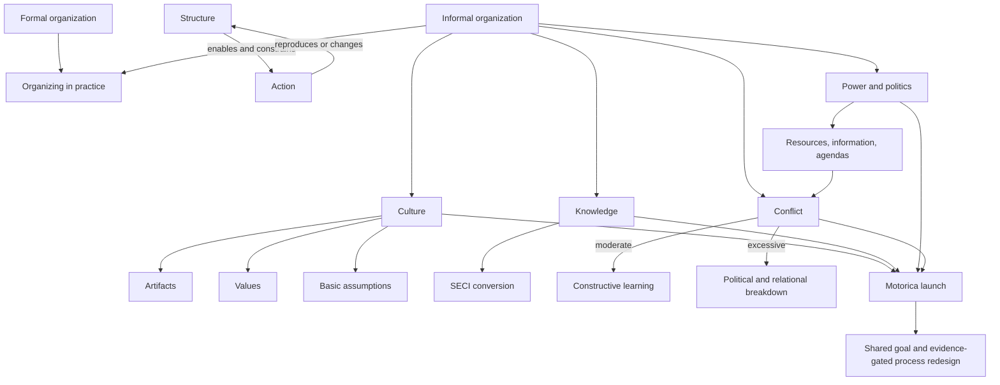

# Sessions 07-08: Informal Organization

Source files:

- `organization/raw/moodle-export-organization-950938225-s26-20260613/1. Juni - 7. Juni/07_TUM_Informal_Organization_Part_1.pdf`
- `organization/raw/moodle-export-organization-950938225-s26-20260613/8. Juni - 14. Juni/08_TUM_Informal_Organization_Part_2.pdf`
- `organization/raw/moodle-export-organization-950938225-s26-20260613/8. Juni - 14. Juni/08_TUM_Informal_Organization_Motorica_Case_Culture.pdf`
- `organization/raw/moodle-export-organization-950938225-s26-20260613/8. Juni - 14. Juni/08_TUM_Informal_Organization_Motorica_Case_Knowledge.pdf`
- `organization/raw/moodle-export-organization-950938225-s26-20260613/8. Juni - 14. Juni/08_TUM_Informal_Organization_Motorica_Case_Conflict.pdf`

Course: Organization
Processed: 2026-06-13
Wiki note: `organization/wiki/session-07-08-informal-organization/session-07-08-informal-organization.md`

Course logistics checked: the 60-minute exam tests understanding, application, and transfer. The Motorica documents are therefore treated as examinable application material, not optional illustrations.

## 80/20 Exam Summary

Informal organization is the emergent pattern of meanings, relationships, knowledge flows, influence, and conflict through which formal structures are actually enacted. Formal design says how work should happen; informal organization explains how work really happens.

High-yield points:

- Formal and informal organization coexist. Informal organization can support, modify, bypass, or oppose formal design.
- Structuration is a recursive process: structure enables and constrains action, while action reproduces or changes structure.
- Culture operates through shared meanings, artifacts, values, basic assumptions, stories, norms, and subcultures.
- Strong culture increases clarity and coordination but can also suppress criticism, learning, and flexibility.
- Knowledge moves from signs and data toward action, competence, and competitive advantage only when meaning, context, motivation, and application are added.
- Tacit knowledge is difficult to articulate and transfer; explicit knowledge can be codified but still requires interpretation.
- The SECI model explains knowledge creation through socialization, externalization, combination, and internalization.
- Power is the capacity to shape decisions or outcomes. Politics is the mobilization of power around interests. Conflict occurs when actors perceive interference with their goals or outcomes.
- Departmental power rises with resource control, centrality, non-substitutability, dependency, and the ability to cope with uncertainty.
- Conflict has an inverted-U relationship with performance: too little can create passivity, moderate task conflict can improve decisions, and excessive conflict becomes hostile and dysfunctional.
- Motorica is not a personality dispute. It is a combined culture, knowledge, resource, status, process, and political problem.

## Formal And Informal Organization

| Formal organization | Informal organization |
|---|---|
| Deliberately constructed | Emergent and partly unplanned |
| Based on official rules, roles, authority, and sanctions | Based on relationships, norms, status, influence, and informal sanctions |
| Describes how organizing should happen | Shows how organizing is enacted in practice |
| Seeks logical consistency and clear membership expectations | Coordinates implicitly and may contain contradictions |
| Treats deviation as an exception | Often develops through repeated deviations and workarounds |

Informal organization matters because formal rules never determine action completely. Employees interpret rules, choose communication channels, decide whose judgment they trust, and develop local norms for acceptable behavior.

### Wells Fargo Example

The formal message emphasized customer relationships and needs-based cross-selling. Informal pressure centered on aggressive sales targets and bonus attainment, contributing to unauthorized accounts. The lesson is not that formal structure is irrelevant; it is that incentives and local norms can produce an enacted organization that contradicts official values.

## Structuration: Structure And Action Reproduce Each Other

Giddens' structuration logic rejects two one-sided claims:

```text
Wrong: structure mechanically determines behavior.
Wrong: actors behave independently of structure.

Better: structure enables and constrains action,
        while repeated action reproduces or changes structure.
```

### Recursive Mechanism

| Structural property | How actors encounter it | How action feeds back |
|---|---|---|
| Signification | Shared meaning, categories, language | Communication confirms or changes meaning |
| Domination | Access to resources and influence | Use of power reproduces or shifts control |
| Legitimation | Norms and accepted standards | Sanctions reward conformity or punish deviation |

Structuration unfolds across time and space. A workaround developed in one team can spread to other units, become normalized, and later appear to be the natural way of working.

### Lines Of Flight

Lines of flight are escape routes through tight bureaucracy or hierarchy. They can create experimentation and voice, but they can also become hidden channels that avoid accountability. Diagnose whether the deviation repairs a dysfunctional formal system or merely protects local interests.

## Organizational Culture

Organizational culture is a collective system of meanings that members learn, express symbolically, and enact in practice. It shapes perception, judgment, and action, especially under uncertainty.

Common characteristics:

- shared meanings and interpretations
- learned and transmitted through socialization
- collective rather than purely individual
- expressed through language, rituals, stories, objects, and practices
- guides action and sensemaking
- embedded in everyday routines

### Effects Of Culture

| Potential benefits | Potential costs |
|---|---|
| Reduces complexity and gives orientation | Filters out novel or disconfirming information |
| Speeds communication and decisions | Fixates the organization on past success patterns |
| Supports motivation, loyalty, and reliability | Discourages criticism and reflection |
| Reduces formal control requirements | Creates implementation barriers and inflexibility |

### National Culture: Hofstede's 6D Model

The deck names power distance, individualism, masculinity, uncertainty avoidance, long-term orientation, and indulgence. Use these as broad comparison dimensions, not as deterministic labels for every individual or organization within a country.

### Schein's Three Levels

| Level | Meaning | Diagnostic use |
|---|---|---|
| Artifacts | Visible objects, language, arrangements, rituals, and behavior | Observe patterns, but do not infer culture from one artifact alone |
| Espoused values | Stated principles, goals, and standards | Compare official claims with repeated decisions and rewards |
| Basic assumptions | Taken-for-granted beliefs about reality and proper conduct | Infer from recurring patterns and contradictions |

Artifacts include architecture, logos, dress, tools, jargon, stories, myths, ceremonies, meetings, communication patterns, rewards, punishments, and traditions. Good cultural analysis triangulates several artifacts and asks multiple members what they mean.

### Deal And Kennedy Cultural Types

The framework combines risk/stakes with feedback speed:

| Type | Risk | Feedback | Typical implication |
|---|---:|---:|---|
| Work-hard/play-hard | Low | Fast | Activity, sales energy, customer contact |
| Tough-guy/macho | High | Fast | Individual stars, rapid bets, high pressure |
| Process culture | Low | Slow | Procedure, accuracy, status, bureaucracy |
| Bet-your-company | High | Slow | Large long-term investments and delayed outcomes |

### Strong And Weak Culture

Cultural strength depends on:

1. **Conciseness:** norms are clear and coherent.
2. **Dissemination:** many members share them.
3. **Depth of anchoring:** assumptions are taken for granted and rarely questioned.

Strength is not the same as quality. A strong culture can coordinate well around a harmful assumption.

### Subcultures And Culture Clash

Subcultures form around professions, regions, spaces, technologies, and shared tasks.

| Relationship | Meaning |
|---|---|
| Enhancing subculture | Reinforces dominant organizational values |
| Orthogonal subculture | Maintains distinct values without direct opposition |
| Counterculture | Challenges dominant values and expectations |

Culture clash occurs when groups with different assumptions, evidence standards, identities, or practices must coordinate. It is common in mergers, international expansion, occupational boundaries, and cross-functional work.

### Stories As Cultural Evidence

Stories communicate identity, hierarchy, sanctions, mistakes, and success. The uniqueness paradox means organizations describe themselves through supposedly unique stories that often use common themes.

- 3M's Post-it story signals experimentation, autonomy, tolerance for unexpected outcomes, and informal problem solving.
- Patagonia's "Don't buy this jacket" story signals environmental responsibility while also revealing tension between anti-consumption and commercial success.

## Knowledge In Organizations

### North's Knowledge Stairway

```text
Signs + syntax -> data
Data + meaning -> information
Information + relations/context -> knowledge
Knowledge + motivation -> action
Action + adequacy -> competency
Competency + uniqueness -> competitiveness
```

The managerial lesson is that storing data is not equivalent to creating usable organizational knowledge.

### Three Knowledge-Management Problems

1. **Identification:** Do we know what we know and where it resides?
2. **Articulation:** Can experts explain what they know well enough for others to use it?
3. **Sharing:** Are people willing and able to transfer knowledge across boundaries?

### Tacit And Explicit Knowledge

| Explicit knowledge | Tacit knowledge |
|---|---|
| Articulable and often codified | Intuitive, experiential, and difficult to formalize |
| Relatively transferable | Often learned through observation and participation |
| Can be stored in documents and systems | Can be a source of differentiation and competitive advantage |

The lecture uses **implicit knowledge**. For exam clarity, use **tacit knowledge (called implicit knowledge in the slides)** because the key mechanism is difficulty of articulation.

### SECI Knowledge-Creation Model

| Mode | Conversion | Example |
|---|---|---|
| Socialization | Tacit -> tacit | Apprentice observes an expert handling a client |
| Externalization | Tacit -> explicit | Expert explains judgment criteria in a playbook |
| Combination | Explicit -> explicit | Teams integrate reports, data, and procedures |
| Internalization | Explicit -> tacit | Repeated use turns a documented method into practical skill |

SECI is iterative, not a one-time sequence. Dialogue supports externalization, linking knowledge supports combination, learning by doing supports internalization, and team building supports socialization.

### Knowledge-Management Functions

The deck connects knowledge goals, identification, acquisition, development, sharing, use, retention, appraisal, and feedback. A complete system must connect these functions; a repository without use, feedback, or retention is not effective knowledge management.

## Power, Politics, And Conflict

```text
Power shapes whether conflict becomes visible and how it is resolved.
Politics mobilizes power to influence decisions and reproduce authority.
Conflict creates political stakes; politics can channel conflict into negotiation.
```

### Power In Organizations

Organizations combine cooperation and competition. Scarce resources and conflicting interests make power unavoidable. Marxism provides a critical starting point by emphasizing ownership, labor dependence, managerial control, and continuing tension between capital and labor.

Informal sources of power:

- personal characteristics and credibility
- expertise
- control of resources or information
- normative sanctions
- physical or psychological threat
- access to people with formal authority

Horizontal departmental power increases through:

- creating dependency
- controlling financial resources
- occupying a central workflow position
- being difficult to substitute
- coping with important uncertainty

Power becomes visible through information control, committee membership, agenda setting, alliances, promotions, external experts, salary, titles, office location, decor, and spatial boundaries. Territorial markers can strengthen identity but also reinforce silos.

### Cybernetic Control System

The deck's control diagram links environment, strategy, organizational goals, unit goals, individual/group goals, measures, rewards, attention, intention, action, outcomes, and performance feedback.

```text
Environment -> strategy -> organizational goals -> unit goals
-> individual/group goals -> measures and rewards
-> attention -> intention -> action -> outcomes
-> performance feedback and resource reallocation
```

Control is not neutral: measures and rewards direct attention, shape intentions, and privilege some outcomes over others. This can create local optimization or political struggles over what gets measured.

## Organizational Conflict

Conflict exists when actors perceive others' efforts or outcomes as interfering with their own. It can occur between individuals, groups, or organizations.

### Conflict And Performance

| Conflict level | Typical state | Managerial response |
|---|---|---|
| Too low | Poor focus, weak motivation, low integration | Stimulate constructive disagreement |
| Moderate | Cohesive, productive, cooperative | Maintain task-focused conflict |
| Too high | Distracted, politicized, hostile, uncooperative | Reduce escalation and repair relationships/processes |

Do not claim that all conflict is good. Task conflict can improve decisions under psychological safety; relationship, status, or identity conflict often damages cooperation.

### Conflict-Management Strategies

| Action | Strategy | Main tradeoff |
|---|---|---|
| Physical separation or more resources | Avoidance | Buys time but may leave causes intact |
| Create superordinate goals or emphasize similarities | Collaboration | Integrates interests but requires trust and time |
| Negotiate | Compromise | Produces agreement but may split differences mechanically |
| Appeal to higher authority | Suppression | Fast but may create compliance without cooperation |
| Increase proximity and direct discussion | Confrontation | Surfaces issues but can escalate without facilitation |

Inter-unit conflict can originate in environment, strategy, technology, structure, culture, physical layout, goal incompatibility, task interdependence, rewards, common resources, status incongruity, jurisdictional ambiguity, and communication barriers.

The lecture's marketing-versus-manufacturing example shows how legitimate functional priorities can still conflict:

| Issue | Marketing priority | Manufacturing priority |
|---|---|---|
| Product line | Variety for customer segments | Longer economical production runs |
| New products | Frequent introduction and market response | Stable designs and lower change cost |
| Scheduling | Fast response and short lead times | Realistic, reliable production commitments |
| Distribution | Product availability | Avoid excessive inventory |
| Quality | Customer utility at acceptable cost | Manufacturability and process consistency |

The conflict is structural, not necessarily evidence of bad personalities.

### Win-Win Versus Win-Lose Negotiation

Win-win frames the conflict as a mutual problem, pursues joint goals, shares information honestly, avoids threats, and keeps positions flexible. Win-lose treats outcomes as fixed, pursues unilateral gain, uses threats or selective information, and signals rigidity.

Volkswagen and IG Metall illustrate institutionalized cooperation through codetermination, worker representation, employment-security bargains, and works councils. Cooperation remains vulnerable to globalization and cost pressure.

## Motorica Integrated Case

### Case Router

| Lens | Evidence | Diagnosis |
|---|---|---|
| Formal design | Brand Strategy defines narrative; Digital Growth tests variants; Product Marketing checks accuracy | The intended sequence is unclear under time and budget pressure |
| Culture | Heritage displays, executive proximity, "protecting the badge," senior voice norms | Brand stewardship has higher status and digital evidence is easier to dismiss |
| Subcultures | Brand values coherence and reputation; Digital values speed and measurable learning | Different legitimacy standards create a culture clash |
| Knowledge | Tacit brand judgment, explicit analytics, technical product knowledge, local dealer knowledge | Knowledge is distributed but not translated or integrated |
| Power | Brand controls agency/board access; Digital controls dashboards requested by CFO/sales | Both units hold non-substitutable resources and agenda-setting power |
| Conflict | Task, resource, status, political, and process conflict | Personality framing would miss structural and informal causes |

### Recommended Intervention

Jonas should redesign the launch process rather than simply choose a winner.

1. Create a shared superordinate goal: credible premium demand generation, not "brand versus clicks."
2. Define decision gates linking brand hypothesis, early digital test, technical validation, and regional/dealer evidence.
3. Use a cross-functional evidence board with Brand, Digital, Product Marketing, and Sales; specify which evidence can revise which decision.
4. Externalize tacit brand criteria into examples and red flags without pretending judgment can be fully codified.
5. Require Digital Growth to document sample, channel, timing, and causal limitations of tests.
6. Protect constructive dissent: junior and specialist objections must be evaluated on evidence, not status.
7. Review outcomes after launch and feed learning into the next cycle.

This solution preserves useful task conflict while reducing status, resource, and political escalation.

## Visual Knowledge Map



## Subject Knowledge Graph

### Nodes

| Node | Meaning | Exam relevance |
|---|---|---|
| Informal organization | Emergent norms, relations, knowledge flows, and influence | Main topic and case lens |
| Structuration | Recursive reproduction/change of structure through action | Explains how informal patterns persist |
| Culture | Shared meanings enacted through symbols and practices | Diagnose behavior beyond formal rules |
| Tacit knowledge | Experiential knowledge difficult to articulate | Explains expertise and transfer barriers |
| SECI | Four modes of knowledge conversion | Design knowledge-management interventions |
| Informal power | Influence beyond formal authority | Identify hidden decision control |
| Organizational politics | Mobilization of power around interests | Explain agenda setting and coalitions |
| Functional conflict | Moderate disagreement that improves performance | Distinguish useful from destructive conflict |
| Cybernetic control | Goals, measures, rewards, action, feedback | Explain how control directs attention |

### Edges

| From | Relationship | To | Why it matters |
|---|---|---|---|
| Formal organization | is enacted through | Informal organization | Design never translates mechanically into action |
| Structure | enables and constrains | Action | Avoid structural determinism |
| Action | reproduces or changes | Structure | Repetition can stabilize or transform rules |
| Artifacts | indicate but do not prove | Basic assumptions | Cultural interpretation requires triangulation |
| Subcultures | may create | Culture clash | Cross-functional conflict can be cultural |
| Tacit knowledge | becomes explicit through | Externalization | Makes expertise discussable and shareable |
| Resource control | creates | Departmental power | Explains influence beyond hierarchy |
| Measures and rewards | direct | Attention and action | Control systems shape behavior and politics |
| Moderate task conflict | can improve | Decision quality | Preserve useful disagreement |
| Status and relationship conflict | can damage | Cooperation | Requires process and relational repair |

## Exam Relevance

Likely prompts:

- Distinguish formal and informal organization and apply the distinction to a case.
- Explain structuration and show how action reproduces structure.
- Diagnose artifacts, values, assumptions, subcultures, and stories.
- Apply SECI to onboarding, customer complaints, or product development.
- Identify informal sources of departmental power.
- Explain why conflict can improve or damage performance.
- Diagnose Motorica using culture, knowledge, power, politics, and conflict.

Common traps:

- Calling every unofficial behavior "informal organization" without explaining its coordinating mechanism.
- Treating artifacts as direct proof of basic assumptions.
- Equating strong culture with good culture.
- Treating tacit knowledge as secret information rather than difficult-to-articulate know-how.
- Confusing power with formal authority.
- Treating the Motorica case as a personality conflict only.
- Recommending "better communication" without redesigning decisions, knowledge flows, or incentives.

High-scoring case structure:

```text
1. Identify the formal arrangement.
2. Show the informal mechanism using case evidence.
3. Apply the relevant theory precisely.
4. Explain the performance consequence.
5. Recommend an intervention and state its limitation.
```

## Retrieval Prompts

1. Why can formal organization never fully determine enacted behavior?
2. Explain structuration using communication, power, and sanctions.
3. Distinguish artifact, espoused value, and basic assumption.
4. Why can a strong culture become strategically dangerous?
5. Route one work practice through all four SECI modes.
6. Name five sources of horizontal departmental power.
7. Explain the inverted-U relationship between conflict and performance.
8. Diagnose Motorica without using the phrase "they should communicate better."

## Practice Tasks

1. Analyze a university rule using structuration: interpretation, reproduction, deviation, and structural change.
2. Select three artifacts from a real organization and propose two competing cultural interpretations for each.
3. Design a SECI cycle for transferring expert customer-service judgment to new employees.
4. Compare Brand Strategy and Digital Growth using dependency, centrality, non-substitutability, and uncertainty coping.
5. Write a 250-word Motorica answer: issue, theory, evidence, recommendation, limitation.

## Connections

- [Session 01: Definitional Basics](../session-01-definitional-basics-of-organization/session-01-definitional-basics-of-organization.md): natural-system and open-system views anticipate informal organization.
- [Session 02: Formal Organizational Design](../session-02-formal-organizational-design/session-02-formal-organizational-design.md): rules, roles, incentives, and structures create the formal baseline.
- [Session 03: Organization And Environment](../session-03-organization-and-environment/session-03-organization-and-environment.md): dependency and uncertainty connect environmental conditions to power.
- [Session 05: Technology And Organization](../session-05-technology-and-organization/session-05-technology-and-organization.md): technology-in-use depends on informal interpretation and routines.
- [Session 06: AI And Organization](../session-06-ai-and-organization/session-06-ai-and-organization.md): algorithmic control, expertise, and accountability are informal as well as technical issues.
- [Session 09: Dynamic Perspectives](../session-09-dynamic-perspectives-on-organizing/session-09-dynamic-perspectives-on-organizing.md): changing an organization requires changing formal arrangements and informal meanings together.

Cross-course link: the Motorica case also connects to Marketing because Brand Strategy and Digital Growth disagree about customer evidence, brand consistency, and experimentation.

## Open Uncertainties

- The lecture labels difficult-to-articulate knowledge as "implicit knowledge." This note uses the more common canonical term **tacit knowledge** while preserving the lecture wording as an alias.
- The Motorica cases are fictional teaching cases. Use their evidence for theory application, not as factual claims about a real manufacturer.
