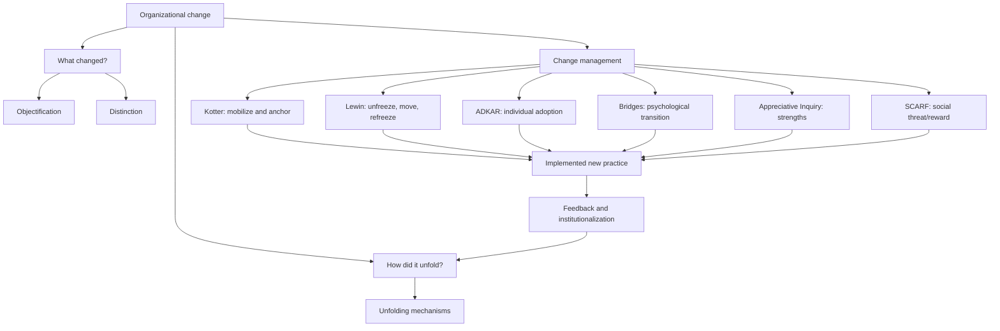

# Session 09: Dynamic Perspectives On Organizing

Source file: `organization/raw/moodle-export-organization-950938225-s26-20260613/15. Juni - 21. Juni/09_TUM_Dynamic_Perspectives.pdf`

Course: Organization
Processed: 2026-06-13
Wiki note: `organization/wiki/session-09-dynamic-perspectives-on-organizing/session-09-dynamic-perspectives-on-organizing.md`

Course logistics checked: the exam tests understanding, application, and transfer. The deck's gallery walk names six change-management concepts but does not define them in detail, so this note provides standalone, exam-ready explanations and comparison logic.

## 80/20 Exam Summary

Organizations are not static structures. Organizational change concerns differences across time and the mechanisms through which those differences emerge. Change management attempts to steer those processes, but no framework guarantees implementation success.

High-yield points:

- Organizational change includes both changed states and the process that produces them.
- The Iceberg Model distinguishes objectification, distinction, and unfolding perspectives.
- Snapshot comparisons can show that change occurred; process explanations show how and why it occurred.
- Change initiatives commonly fail because technical installation is confused with behavioral adoption, political support, capability development, and identity transition.
- Kotter focuses on organization-wide mobilization and institutionalization.
- Lewin focuses on destabilizing the status quo, moving, and restabilizing; Force Field Analysis compares driving and restraining forces.
- ADKAR diagnoses individual adoption through awareness, desire, knowledge, ability, and reinforcement.
- Bridges separates external change from internal psychological transition.
- Appreciative Inquiry builds change from organizational strengths through Discover, Dream, Design, and Destiny.
- SCARF explains social threat and reward through status, certainty, autonomy, relatedness, and fairness.
- Good managers combine frameworks rather than treating one model as a universal recipe.

## Defining Organizational Change

```text
Organizational change = differences in an entity's state, form, or properties
across two or more points in time, plus the processes and mechanisms through
which those differences emerge.
```

Two questions must be separated:

1. **What changed?** Compare states, structures, routines, identities, or outcomes.
2. **How did it change?** Trace mechanisms, sequences, interactions, and feedback over time.

## Iceberg Model Of Change

The lecture presents three increasingly process-sensitive perspectives.

| Perspective | Core view | Typical representation | Strength | Limitation |
|---|---|---|---|---|
| Objectification | Change as an object, variable, or symbolic representation | Labels, themes, dependent/independent variables | Makes change discussable and measurable | Can hide temporal mechanisms |
| Distinction | Change as differences between states or phases | Before/after comparison, phase model | Clarifies sequence and milestones | Can imply clean stages and linearity |
| Unfolding | Change as interacting mechanisms developing over time | Trajectories, process maps, feedback loops | Explains emergence, reversals, and interaction | More complex to analyze and manage |

Exam-safe comparison:

```text
Objectification names change.
Distinction compares change.
Unfolding explains change as process.
```

## Why Change Management Is Difficult

The deck cites transformation surveys with different success rates. Treat these figures as illustrative evidence that implementation is difficult, not as one universal failure rate.

| Source cited in deck | Reported result |
|---|---|
| Bain | 12% of business transformations achieve the original ambition |
| Gartner | 48% of digital initiatives meet or exceed targets |
| BCG | 30% of large-scale technology implementations meet time, budget, and scope |

The denominators and definitions differ, so these percentages should not be averaged or directly ranked.

Recurring failure mechanisms:

- unclear problem definition or strategic purpose
- weak coalition and political sponsorship
- technical readiness without user adoption
- threatened status, autonomy, identity, or expertise
- insufficient capability, time, or resources
- incentives and measures that reward old behavior
- local workarounds that preserve the old routine
- premature declaration of success
- failure to embed learning in structures, norms, and staffing

## Six Change-Management Frameworks

### Kotter's 8-Step Model

Kotter is an organization-level mobilization and implementation sequence.

1. Establish a sense of urgency.
2. Build a guiding coalition with authority and credibility.
3. Form a clear vision and change strategy.
4. Communicate the vision and enlist broad support.
5. Remove barriers and enable action.
6. Generate short-term wins.
7. Sustain acceleration and extend change.
8. Anchor new approaches in culture and systems.

Use when a large initiative needs visible sponsorship, coordinated momentum, and institutionalization.

Limitations:

- often interpreted too linearly
- can privilege top-down leadership
- urgency can become fear or overload
- does not diagnose individual adoption as precisely as ADKAR

### Lewin's Change Model And Force Field Analysis

Lewin's three phases:

| Phase | Managerial task |
|---|---|
| Unfreeze | Make the current equilibrium discussable; expose the gap and weaken attachment to old routines |
| Change/Move | Experiment, learn, introduce new behavior, and support capability development |
| Refreeze | Stabilize the new pattern through routines, roles, incentives, and norms |

Force Field Analysis maps:

```text
Driving forces -> pressure toward change
Restraining forces -> pressure preserving the status quo
```

Managers should not only increase driving pressure. Reducing restraining forces such as fear, ambiguity, workload, or status loss may be more effective.

Limitations:

- "refreeze" can sound too static for continuous change
- force lists can oversimplify political and interacting mechanisms
- does not itself specify a detailed implementation sequence

### ADKAR

ADKAR diagnoses individual adoption.

| Element | Diagnostic question | Intervention |
|---|---|---|
| Awareness | Do people understand why change is needed? | Explain problem, evidence, and consequences |
| Desire | Are they willing to participate? | Address incentives, identity, trust, and perceived costs |
| Knowledge | Do they know what to do? | Training, guidance, examples, process clarity |
| Ability | Can they perform in real conditions? | Practice, coaching, resources, system access |
| Reinforcement | Will the behavior persist? | Feedback, recognition, measures, accountability |

ADKAR is useful because a technically complete rollout can still fail at Desire or Ability.

Limitations:

- individual focus can underplay power, structure, and coalitions
- may imply a neat sequence even when elements interact
- does not replace strategic design of the change itself

### Bridges Transition Model

Bridges distinguishes external **change** from internal **transition**.

| Transition phase | Experience | Managerial need |
|---|---|---|
| Ending, losing, letting go | Loss of old role, routine, status, or identity | Acknowledge losses and clarify what ends/continues |
| Neutral zone | Ambiguity, experimentation, reduced certainty | Provide temporary structure, communication, and learning space |
| New beginning | New identity, purpose, and commitment | Reinforce meaning, competence, and early success |

Useful when resistance reflects loss, identity, or uncertainty rather than lack of information.

Limitations:

- phases may overlap and differ between people
- psychological framing can underplay structural interests and resource conflict
- does not specify technical project tasks

### Appreciative Inquiry

Appreciative Inquiry is a strengths-based, participative approach.

| 4D phase | Core question |
|---|---|
| Discover | When are we already at our best? |
| Dream | What future could build on those strengths? |
| Design | What structures and practices would support that future? |
| Destiny/Deploy | How do participants experiment, learn, and sustain action? |

Useful for engagement, identity renewal, and co-created change where existing strengths can be scaled.

Limitations:

- can suppress conflict, failure, injustice, or urgent risk if positivity becomes avoidance
- depends on genuine participation
- less suitable as the only tool in a crisis requiring direct correction

### SCARF Model

SCARF explains social threat and reward in change.

| Domain | Threat during change | Managerial response |
|---|---|---|
| Status | Loss of expertise, prestige, or rank | Recognize contribution and define valued future roles |
| Certainty | Unclear process or future | Clarify decisions, milestones, and known unknowns |
| Autonomy | Feeling controlled or monitored | Provide meaningful choice and local discretion |
| Relatedness | Reduced trust or belonging | Build safe cross-group interaction and peer support |
| Fairness | Unequal burden, opaque decisions, inconsistent rules | Explain criteria and use transparent procedures |

SCARF is a diagnostic lens, not a complete change program.

Limitations:

- can individualize problems caused by structure or politics
- domains can conflict, such as more certainty requiring less autonomy
- does not determine the strategic direction of change

## Framework Comparison

| Framework | Primary level | Best diagnostic use | Main blind spot |
|---|---|---|---|
| Kotter | Organization and leadership coalition | Mobilization, momentum, institutionalization | Can become linear and top-down |
| Lewin/Force Field | System equilibrium and forces | Understand support and resistance | Can oversimplify continuous change |
| ADKAR | Individual adoption | Locate adoption bottleneck | Underplays politics and structure |
| Bridges | Psychological transition | Diagnose loss, ambiguity, identity | Underplays technical and structural design |
| Appreciative Inquiry | Collective strengths and participation | Build engagement and future vision | Can avoid negative evidence and conflict |
| SCARF | Social threat/reward | Diagnose emotional and relational resistance | Not an implementation roadmap |

## AI Project-Management Tool Case

Case facts:

- medium-sized technology firm introduces an AI project-management tool
- intended benefits: transparency, automated reporting, earlier delay detection
- employees fear surveillance
- team leads fear loss of autonomy
- IT says the tool is technically ready
- teams continue using old spreadsheets
- senior management wants visible progress within three months

### Multi-Framework Diagnosis

| Framework | Diagnosis | First action | Likely blind spot |
|---|---|---|---|
| Kotter | Weak coalition and insufficiently shared vision | Build coalition including team leads and credible users | May not surface individual fear precisely |
| Lewin/Force Field | Old spreadsheets remain a stable equilibrium | Reduce restraining forces: surveillance fear, workload, unclear data use | May oversimplify identity and politics |
| ADKAR | Awareness may exist, but Desire and Ability are weak | Diagnose each element by role; pilot and coach | May miss power over monitoring data |
| Bridges | Leads experience loss of autonomy and role identity | Acknowledge loss and define the future leadership role | Does not specify system configuration |
| Appreciative Inquiry | Existing good project routines can guide design | Discover where transparency already works and co-design around it | May understate legitimate privacy risk |
| SCARF | Status, certainty, autonomy, relatedness, and fairness are threatened | Clarify governance and provide bounded choice | Not a full implementation plan |

### Recommended Blended Intervention

1. Define the operational problem and limits of tool use, especially monitoring and data access.
2. Build a guiding coalition with IT, team leads, employees, and data/privacy representation.
3. Map driving and restraining forces; prioritize reducing fear and duplicate-work burden.
4. Diagnose ADKAR by stakeholder group rather than treating "employees" as one category.
5. Run a bounded pilot with explicit autonomy, fairness, and surveillance safeguards.
6. Use existing high-performing project routines as Appreciative Inquiry input.
7. Generate short-term wins based on useful outcomes, not login counts.
8. Retire old spreadsheets only after ability and trust are demonstrated.
9. Reinforce the new practice through measures, support, role design, and feedback.

## Visual Knowledge Map



## Subject Knowledge Graph

### Nodes

| Node | Meaning | Exam relevance |
|---|---|---|
| Organizational Change | Difference across time plus emergence mechanism | Main topic definition |
| Objectification | Change treated as a named object or variable | Lowest process sensitivity |
| Distinction | Change treated as state or phase differences | Common before/after analysis |
| Unfolding | Change treated as interacting temporal mechanisms | Strongest process explanation |
| Kotter Model | Organization-wide mobilization and anchoring | Implementation sequence |
| Force Field Analysis | Driving versus restraining forces | Resistance diagnosis |
| ADKAR | Individual adoption conditions | Bottleneck diagnosis |
| Transition | Internal psychological response to external change | Identity and loss analysis |
| Appreciative Inquiry | Strengths-based co-created change | Participation and engagement |
| SCARF | Social threat/reward domains | Resistance and trust diagnosis |

### Edges

| From | Relationship | To | Why it matters |
|---|---|---|---|
| Distinction | compares | Organizational states | Shows that change occurred |
| Unfolding | explains | Change mechanisms | Shows how and why change occurred |
| Restraining forces | preserve | Current equilibrium | Pressure alone may increase resistance |
| Awareness | precedes but does not guarantee | Desire | Understanding is not commitment |
| Change | triggers | Transition | External events create internal adjustment |
| Status/autonomy threat | can reduce | Adoption | Social risk affects implementation |
| Short-term wins | support | Momentum | Evidence can sustain coalition and effort |
| Reinforcement | stabilizes | New behavior | Adoption must persist beyond rollout |

## Exam Relevance

Likely prompts:

- Define organizational change and distinguish state from process views.
- Explain the Iceberg Model and compare objectification, distinction, and unfolding.
- Apply one change model to the AI project-management case.
- Compare two models and identify what each overlooks.
- Recommend a combined change approach under a three-month deadline.

Common traps:

- Treating change as a one-time announcement or software installation.
- Listing Kotter steps without linking them to case facts.
- Assuming resistance is irrational or caused only by poor communication.
- Treating Lewin's phases as rigid calendar stages.
- Confusing ADKAR Awareness with Desire or Knowledge with Ability.
- Using Bridges' **transition** as a synonym for the external change event.
- Applying Appreciative Inquiry so positively that legitimate harm or conflict disappears.
- Presenting SCARF as a complete project plan.

High-scoring answer structure:

```text
1. Diagnose the change problem and level of analysis.
2. Select a framework and justify the fit.
3. Apply each element to concrete case evidence.
4. State the intervention sequence.
5. Identify the framework's blind spot and add a complementary lens.
```

## Retrieval Prompts

1. Define organizational change without using the word "different" alone.
2. Distinguish objectification, distinction, and unfolding.
3. State Kotter's eight steps as a causal implementation logic.
4. Use Force Field Analysis on the AI project-management case.
5. Diagnose the case through all five ADKAR elements.
6. Explain change versus transition using Bridges.
7. Give one risk of Appreciative Inquiry and one risk of SCARF.
8. Choose two complementary frameworks and explain why they fit together.

## Practice Tasks

1. Create a force-field map with at least four driving and four restraining forces for the AI tool.
2. Write an ADKAR diagnosis for employees, team leads, IT, and senior management separately.
3. Compare Kotter and Bridges in 150 words: level, mechanism, strength, blind spot.
4. Redesign the three-month rollout so that progress measures do not reward superficial adoption.
5. Draw an unfolding process map showing how surveillance fear could create spreadsheet workarounds and misleading performance data.

## Connections

- [Session 02: Formal Organizational Design](../session-02-formal-organizational-design/session-02-formal-organizational-design.md): change must be embedded in rules, roles, incentives, and structures.
- [Session 04: Strategic Organization Design](../session-04-strategic-organization-design/session-04-strategic-organization-design.md): change requires strategic purpose and may involve exploration/exploitation tensions.
- [Session 05: Technology And Organization](../session-05-technology-and-organization/session-05-technology-and-organization.md): technology is enacted and adapted rather than simply installed.
- [Session 06: AI And Organization](../session-06-ai-and-organization/session-06-ai-and-organization.md): AI changes task division, expertise, control, and accountability.
- [Sessions 07-08: Informal Organization](../session-07-08-informal-organization/session-07-08-informal-organization.md): informal norms, knowledge, power, and conflict explain implementation resistance.

Cross-course link: Marketing campaign implementation and digital transformation both require behavioral adoption, stakeholder alignment, and credible measurement rather than technical rollout alone.

## Open Uncertainties

- The lecture deck assigns the six models through a gallery walk and does not provide the student groups' resulting flipcharts. Framework definitions and limitations in this note are enriched from standard management knowledge.
- Survey success percentages use different definitions and samples. Treat them as motivation for implementation analysis, not as directly comparable universal probabilities.
