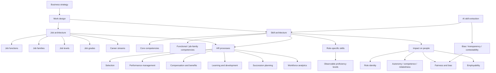

# Session 10: Skills As The New Currency Of Organizations

Source file: `organization/raw/moodle-export-organization-950938225-s26-20260711/22. Juni - 28. Juni/10_Mmmake_Guest_Lecture.pdf`

Course: Organization
Processed: 2026-07-11
Wiki note: `organization/wiki/session-10-skills-as-new-currency-of-organizations/session-10-skills-as-new-currency-of-organizations.md`

Course logistics checked: the guest lecture by Felix Ehrenfels, mmmake, is explicitly part of the examinable Organization course content. The exam tests understanding, application, and transfer, so this note treats the deck as an applied organization-design topic rather than an HR-only guest talk.

## 80/20 Exam Summary

A skills-powered organization redesigns work and people systems around observable capabilities rather than only around historical job titles. The core managerial problem is not "make a skills database." It is how to create a transparent job and skill architecture that supports fair pay, career mobility, talent allocation, learning, and strategy implementation without turning employees into surveilled data profiles.

High-yield points:

- **Job architecture** organizes roles into functions, families, levels, grades, and career streams.
- **Skill architecture** organizes what people must know and do through core competencies, functional or job-family competencies, and role-specific skills.
- The two architectures only create value when linked to HR processes: selection, performance management, compensation, learning, succession, workforce analytics, and career development.
- The practical design challenge is translation: business strategy becomes work design, role profiles, skill profiles, proficiency levels, pay criteria, and learning paths.
- Skills can support flexibility and fairness, but they can also threaten identity, autonomy, motivation, and trust.
- The exam-relevant tension is **empowerment versus surveillance**: the same transparency can enable career growth or become algorithmic control.

## Why Skills Become Strategically Important

The guest lecture frames skills as a structural shift driven by three forces.

| Driver | Organizational implication | Exam use |
|---|---|---|
| Evolution of work | Jobs change faster than static job titles; organizations need talent agility. | Explain why role titles alone are too coarse for workforce planning. |
| AI impact | Technology changes required capabilities and can automate skill extraction or matching. | Link this topic to Session 06 AI: AI is not deterministic; implementation choices shape outcomes. |
| Regulation and fairness pressure | Transparent, objective criteria become more important for pay, career, and reporting decisions. | Discuss why "objective" criteria still need human design and bias checks. |

The strategic claim is:

```text
If work changes faster than job titles, organizations need a capability language
that can describe people, roles, development paths, and talent decisions more precisely.
```

## Job Architecture

A **job architecture** is a structured framework for defining and organizing roles, their hierarchy, and their relationship to other positions. It standardizes job titles, responsibilities, levels, and pay ranges across teams.

Core elements:

| Element | Meaning | Example |
|---|---|---|
| Job function | Broad category of work types | Engineering, HR, Legal, Sales |
| Job family / sub-family | Group of jobs based on similar capabilities | Backend engineering, HR business partnering |
| Job level | Hierarchical responsibility, complexity, and influence | Entry, professional, senior, executive |
| Job grade | Compensation classification within or across levels | M1 team lead, M2 department head |
| Career stream | Path type for progression | Expert, management, project, support |

Managerial value:

- reduces title chaos after fast growth
- makes similar work comparable across departments
- supports pay transparency and promotion decisions
- creates visible career paths
- anchors workforce analytics and succession planning

Exam trap:

```text
Do not equate job architecture with an organization chart.
An organization chart shows reporting lines.
A job architecture classifies work, responsibility, value, and progression.
```

## Skill And Competence Architecture

The deck distinguishes **skills** from **competencies**.

| Concept | Practical meaning | Example |
|---|---|---|
| Skill | Specific practical knowledge or ability acquired through education, training, or experience | API design, data analysis, stakeholder communication |
| Competency | Broader ability to perform a role successfully by combining skills, behavior, and knowledge | Leadership, customer orientation, intercultural competence |

Skill architecture typically has three layers:

1. **Core competencies** apply to all employees and express the organization's shared behavioral expectations.
2. **Functional or job-family competencies** define what people in a function or role family must be good at.
3. **Role-specific skills** define the concrete capabilities required for one role.

The guest lecture warns against overload: core competencies should be limited so they remain memorable and usable. A framework with too many generic items creates noise, not orientation.

## Proficiency Levels

A skill framework becomes useful only when it defines depth. The deck links this to the Dreyfus model of skill acquisition and practical HR scales.

| Level | What it means behaviorally | Useful exam wording |
|---|---|---|
| Novice / Basic | Follows rules under close guidance. | "Can perform standard tasks with supervision." |
| Advanced beginner | Recognizes recurring patterns but still relies on guidance. | "Handles routine cases and asks for support when context shifts." |
| Competent | Plans, chooses among options, and works independently in normal conditions. | "Independently applies the skill to deliver role outcomes." |
| Proficient | Sees situations holistically, adapts, and mentors others. | "Adapts the skill across contexts and supports others." |
| Expert | Acts from deep pattern recognition and may redefine the field. | "Shapes standards and strategy for the capability." |

Exam-safe rule:

```text
A proficiency level must describe observable behavior, not vague understanding.
Bad: "understands API design."
Better: "independently designs versioned APIs that meet security and integration requirements."
```

## PayStream Exercise Logic

The PayStream case is an applied design exercise.

Case facts:

- Berlin FinTech, founded in 2016.
- Grew from 40 to 800 employees in six years.
- Job titles developed historically and inconsistently.
- Teams created role names partly to justify salary increases.
- Two pressures now force clean-up: pay transparency and turnover from unclear career paths.

### Exercise 1: Cluster Job Families

The 15 titles can be clustered in different defensible ways. The point is not one perfect answer; the point is to justify classification logic.

Possible family logic:

| Family | Included roles | Reasoning |
|---|---|---|
| Engineering and platform | Senior Backend Engineer, Full-Stack Developer, DevOps / SRE Engineer, Machine Learning Engineer | Shared software/system-building capability |
| Product and design | Product Manager - Payments, Technical Product Manager, UX/UI Designer | Customer problem, product discovery, interface, roadmap |
| Risk, legal, compliance | Risk Analyst, Compliance Officer, Legal Counsel | Regulation, control, risk governance |
| Growth and customer | Growth Marketing Manager, Account Executive (B2B), Customer Success Manager | Market acquisition, customer relationship, adoption |
| Leadership and executive support | Engineering Manager, Assistant to the Board | Coordination and organizational leadership/support |

Titles that are hard to place reveal boundary problems. For example, a Technical Product Manager could sit between product and engineering; a Customer Success Manager could be sales-adjacent or product-feedback-adjacent.

### Exercise 2: Build A Skill Profile

Example: Backend Engineer.

| Layer | Skills / competencies | Why it fits |
|---|---|---|
| Core competencies | Learning agility, collaboration, customer orientation | Applies across PayStream and supports growth/change |
| Job-family skills | Software architecture, secure coding, systems thinking | Shared across engineering roles |
| Role-specific skills | API design, payment-platform reliability, database performance | Distinguishes backend payment work |

### Exercise 3: Define Proficiency In Action

Example skill: API design.

| Level | Observable behavior |
|---|---|
| Basic | Implements simple endpoints from a provided specification and follows existing naming/versioning rules. |
| Proficient | Designs secure, documented APIs for payment workflows and coordinates integration with product and frontend teams. |
| Expert | Defines API governance standards, resolves cross-system tradeoffs, and mentors teams on scalable integration architecture. |

## HR Process Linkages

Job and skill architecture should not be a standalone taxonomy. It becomes organizational design when connected to decisions.

| HR process | How the architecture helps | Risk if poorly designed |
|---|---|---|
| Recruiting and selection | Derive future requirements and clearer job profiles. | Hiring clones of existing profiles; biased criteria. |
| Performance management | Use uniform and behavior-based criteria. | Reducing performance to checkbox scoring. |
| Compensation and benefits | Link pay to role value, skill depth, and evidence. | Opaque or unfair pay if criteria are inconsistent. |
| Learning and development | Connect training to skill gaps, career paths, and business needs. | Development burden shifts to employees without support. |
| Succession planning | Identify critical capabilities and potential successors. | Overlooking informal knowledge and hidden contributors. |
| Workforce planning | Forecast headcount and future skill gaps. | Treating the skill inventory as static. |
| Talent deployment | Match people to projects, gigs, or roles. | Algorithmic matching without consent, context, or appeal. |

## Impact On People

The guest lecture becomes strongly exam-relevant because it connects organization design to human consequences.

### Identity And Role

Employees often describe themselves through roles: "I am a software engineer." A skill-based language can fragment that identity into many capability labels. This can make value visible, but it can also feel like identity loss.

Managerial implication:

- explain why skill language is introduced
- co-create skill definitions with employees
- frame skills as making the role visible, not replacing the person

### Motivation

Self-Determination Theory gives a useful diagnosis.

| Need | Positive implementation | Negative implementation |
|---|---|---|
| Autonomy | Employees see growth options and manage their careers. | Skills are imposed top-down and feel controlling. |
| Competence | Employees know how to develop and demonstrate mastery. | Skill gaps become public deficits without support. |
| Relatedness | Shared language helps collaboration across teams. | Skill rankings create internal competition and mistrust. |

### Fairness And Bias

Skill systems sound objective, but they depend on value choices:

- Which skills count?
- Who defines them?
- Are care, coordination, communication, and invisible work valued?
- Are AI matching tools trained on biased historical data?
- Can employees challenge or correct their profile?

Design principles:

- involve diverse groups in defining relevant skills
- use transparent and appealable criteria
- audit AI-based matching or scoring systems
- connect pay decisions to behaviorally defined evidence

### Employability

Skills can become personal capital. Employees can move laterally and show value beyond one title. But if organizations expose skill gaps without investing in learning, responsibility shifts from organization to individual.

Exam-safe formulation:

```text
Skill visibility creates employability only when paired with learning investment,
career paths, and fair decision rules. Otherwise it becomes a burden and a control device.
```

## AI As An Enabler

The live demo shows AI as a tool for extracting role and skill profiles, mapping career paths, and identifying connections between roles based on skills.

Connect this to Session 06 AI:

- AI can classify work and suggest skills.
- AI does not remove the need for human governance.
- Bias, transparency, accountability, and privacy remain central.
- The relevant design question is not "Can AI extract skills?" but "Who trusts the output, who can contest it, and how is it used?"

## Real-Life Example

A fast-growing SaaS company has 30 different titles for customer-facing roles: customer success specialist, onboarding consultant, solution advisor, technical account partner, and more. Employees do not understand promotion paths, and managers cannot explain pay differences. A skills-powered redesign could identify shared job families, define levels, map role-specific skills, and create lateral paths from customer success into product operations. The design only works if employees help define the criteria and if skill gaps trigger coaching rather than punishment.

## Exam Relevance

Likely question forms:

- Explain job architecture and skill architecture and how they differ.
- Apply the PayStream exercise to cluster job families and justify your criteria.
- Explain why proficiency levels must be behavioral.
- Discuss how a skill-based organization affects identity, motivation, fairness, and employability.
- Compare skills-powered organization with AI and formal design topics from earlier sessions.
- Evaluate whether skill transparency empowers employees or increases control.

Common mistakes:

- Treating skills as an HR database rather than an organization-design language.
- Confusing job levels with job grades.
- Defining proficiency with vague words such as "knows" or "understands."
- Ignoring employee identity and motivation.
- Calling AI skill extraction objective without discussing bias and governance.

## Practice Questions

1. PayStream asks whether `Technical Product Manager` belongs in Engineering or Product. How would you decide?
   - Short answer: define the classification criterion first. If the job family is based on core capability, product discovery and roadmap ownership may place it in Product; if based on technical system responsibility, it may be engineering-adjacent. The key is consistency and transparency.

2. Why is a skill framework without proficiency levels weak?
   - Short answer: it lists capabilities but cannot distinguish junior, independent, senior, and expert performance. It cannot reliably support pay, promotion, or development decisions.

3. Use Self-Determination Theory to diagnose a failed skill rollout.
   - Short answer: top-down skill scoring may reduce autonomy, visible gaps may threaten competence, and ranking may damage relatedness.

4. What is the difference between job architecture and skill architecture?
   - Short answer: job architecture classifies roles and their relative value; skill architecture classifies capabilities and depth required to perform work.

## Visual Knowledge Map



## Subject-Level Knowledge Graph

### Nodes

| Node | Type | Definition |
|---|---|---|
| Skills-powered organization | Design concept | Organization that uses skill visibility as a basis for work, careers, talent allocation, and people decisions. |
| Job architecture | Structural device | Framework for classifying roles, levels, grades, career streams, and pay-related role value. |
| Skill architecture | Capability device | Framework for classifying competencies, skills, and proficiency levels required for work. |
| Job family | Job architecture element | Group of jobs requiring related capabilities. |
| Job level | Job architecture element | Responsibility and complexity tier. |
| Job grade | Compensation element | Pay/value classification attached to a role or level. |
| Proficiency level | Skill-depth element | Behavioral description of how deeply a skill is performed. |
| Role identity | Psychological mechanism | Professional self-concept attached to a role label. |
| Self-Determination Theory | Motivation theory | Motivation depends on autonomy, competence, and relatedness. |
| Fairness and bias | Governance issue | Skill criteria and AI tools may reproduce or reduce inequity depending on design. |
| Employability | Career outcome | Capacity to show and use skills across roles or organizations. |
| AI skill extraction | Technology enabler | AI-assisted generation of role profiles, skill profiles, and career-path connections. |

### Edges

| From | Relationship | To |
|---|---|---|
| Business strategy | is translated into | Job architecture |
| Business strategy | is translated into | Skill architecture |
| Job architecture | anchors | Career paths |
| Job architecture | supports | Compensation and benefits |
| Skill architecture | defines | Role-specific skills |
| Proficiency level | makes | Skill depth measurable |
| Skill architecture | supports | Learning and development |
| Skill architecture | may threaten | Role identity |
| Skill transparency | can increase | Employability |
| Skill transparency | can become | Surveillance |
| Self-Determination Theory | diagnoses | Motivation effects of skill systems |
| AI skill extraction | enables | Skill architecture |
| Fairness and bias | constrains | AI skill extraction |

## Open Uncertainties

- The slide deck cites several business statistics; treat them as directional motivation for the guest lecture unless the exam asks for exact numbers.
- Regulatory references are used as contextual drivers. For Organization exam answers, focus on why transparent criteria matter for organizing, not legal technicalities.
- The PayStream clustering exercise has multiple defensible answers; the grading logic is likely the quality of criteria and justification, not a single official cluster.
