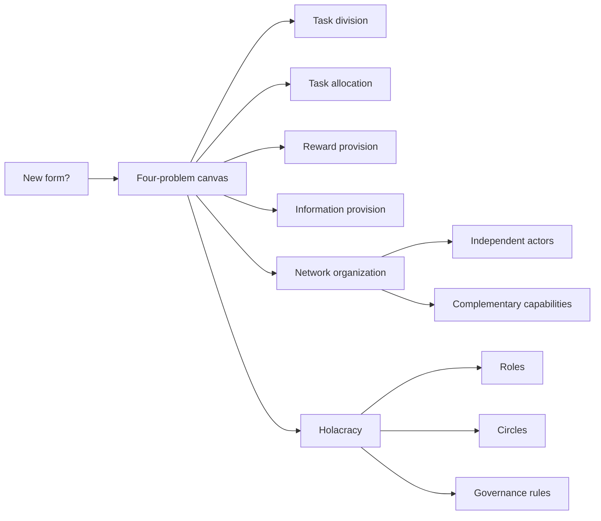

# CONTEXT: Session 11 Trends In Organizational Design - New Forms

Source note: `organization/wiki/session-11-trends-in-organizational-design-new-forms/session-11-trends-in-organizational-design-new-forms.md`

Purpose: standalone terminology, comparison rules, and exam language for assessing whether contemporary organizational forms are actually new.

## Novelty And Design Diagnosis

| Term | Definition | Aliases to avoid |
|---|---|---|
| **New organizational form** | A bundle of design solutions that solves one or more universal organizing problems differently from comparable organizations. | Trend label; fashionable structure |
| **Comparable organization** | Reference group used to judge novelty while holding the organizational goal as stable as possible. | Any old company |
| **Bundle of solutions** | Combined set of structural, motivational, coordination, governance, digital, and cultural elements that make a form work. | One design feature |
| **Trend label** | Broad name such as agile, network, platform, or self-management that may hide different design mechanisms. | Explanation by itself |
| **Design element** | Specific part of organizing, such as formal structure, coordination mechanism, governance system, motivation pattern, digital infrastructure, or cultural values. | Buzzword |

## Four-Problem Canvas

| Term | Definition | Aliases to avoid |
|---|---|---|
| **Task division** | How the organizational goal is decomposed into tasks and subtasks. | Work allocation |
| **Task allocation** | Who performs which tasks and how that assignment is decided. | Task division |
| **Reward provision** | Why actors contribute effort, including pay, reputation, intrinsic motivation, ownership, and mission. | Compensation only |
| **Information provision** | How actors receive the information needed to accomplish and coordinate work. | Communication in general |
| **Novelty test** | Compare how a form solves task division, task allocation, reward provision, and information provision relative to a comparable form. | "Is this trendy?" |

## Contemporary Form Terms

| Term | Definition | Aliases to avoid |
|---|---|---|
| **Agile** | Organizing pattern emphasizing short-cycle learning, customer feedback, interaction, and adaptability. | Scrum only |
| **Self-management** | Formal decentralization of authority to roles, teams, or circles with explicit rules and peer coordination. | No structure; everyone does what they want |
| **Network organization** | Organization design where legally independent actors coordinate through relationships, trust, mutual adjustment, and complementary capabilities. | Outsourcing only |
| **Ecosystem** | Multi-actor value system where participants collaborate around flows, outcomes, or value propositions. | Network synonym in all contexts |
| **Hybrid network** | Design combining exploitative efficiency areas and explorative innovation areas, often across organizational boundaries. | Simple partnership |
| **Holacracy** | Self-management framework using roles, circles, governance meetings, tactical meetings, and a constitution-like rule system. | Holocracy; flat organization |
| **Role** | Purpose-bound bundle of accountabilities and authority domains; not identical with a person. | Job title |
| **Circle** | Semi-autonomous unit containing roles and governed by Holacracy rules. | Department if hierarchy is conventional |
| **Governance meeting** | Formal meeting for changing roles, policies, and authority structure. | Status meeting |
| **Tactical meeting** | Operational meeting for projects, next actions, and tensions. | Governance meeting |

## Relationships Between Canonical Terms

- **Four-problem canvas** is the main tool for judging **new organizational form**.
- **Agile** and **self-management** are broad design patterns; **Scrum** and **Holacracy** are more specific frameworks.
- **Network organization** externalizes capability access; **holacracy** internalizes distributed authority through formal roles.
- **Self-management** still requires **governance meetings**, **roles**, and **decision rules**.
- **Ecosystem** extends network thinking from bilateral collaboration to multi-actor value creation.

## Compact Visual



## Example Dialogue

Student: "Holacracy is new because there are no managers."

Professor: "Careful. The better answer is that authority is allocated to explicit roles and circles through formal governance rules. It is not structureless. Now apply the four-problem canvas: how are tasks divided, allocated, rewarded, and informed?"

Student: "So the novelty is the authority structure and governance process, not just being flat."

Professor: "Exactly. The label is only the starting point."

## Exam Traps And Correction Rules

| Trap | Correction rule |
|---|---|
| "It is new because it is agile." | Specify which organizing problem is solved differently. |
| Comparing forms without a reference group | State the comparable organization and stable goal. |
| Calling self-management structureless | Say authority is formally distributed through rules, roles, and peer coordination. |
| Treating networks as free coordination | Explain trust, communication, governance, and accountability costs. |
| Treating ecosystem and network as identical | Use ecosystem for broader multi-actor value systems; use network for relationship-based coordination among actors. |

## Cheat-Sheet Language

```text
Newness test:
same goal + comparable organization + four problems + bundle of solutions.

Network:
independent actors + complementary capabilities + relationship-based coordination.

Holacracy:
roles and circles + governance meetings + tactical meetings + formal distributed authority.
```
