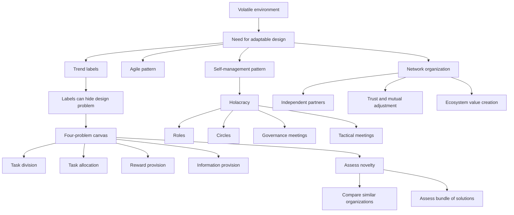

# Session 11: Trends In Organizational Design - New Forms

Source file: `organization/raw/moodle-export-organization-950938225-s26-20260711/6. Juli - 12. Juli/11_TUM_Trends_Part_1.pdf`

Course: Organization
Processed: 2026-07-11
Wiki note: `organization/wiki/session-11-trends-in-organizational-design-new-forms/session-11-trends-in-organizational-design-new-forms.md`

Course logistics checked: this is part one of the two-session "Trends in organization design" block. The exam tests application and transfer, so the central skill is applying the four-problem canvas to decide whether a form is actually new.

## 80/20 Exam Summary

"New organizational form" is not a label. A form is new when it solves one or more universal organizing problems in a new way relative to comparable organizations. The session's key move is to look behind trendy labels such as agile, network, ecosystem, or holacracy and ask what changed in task division, task allocation, reward provision, and information provision.

High-yield points:

- Environmental volatility, digitalization, social demands, geopolitical shocks, and crises pressure organizations to use more flexible designs.
- Labels can hide the actual design problem: the label might refer to structure, coordination, governance, motivation, digital infrastructure, or culture.
- Puranam, Alexy, and Reitzig's four universal organizing problems provide the exam-safe novelty test.
- Agile and self-management are broad contemporary patterns, not one fixed form.
- Network organizations coordinate legally independent actors through relationships, trust, and complementary capabilities.
- Holacracy distributes authority through roles, circles, and formal governance processes. It is less hierarchical, but not structureless.

## Environmental Conditions Behind New Forms

The deck links design trends to volatile and uncertain environmental conditions:

- volatile markets
- financial crises and pandemics
- digital technologies, intelligent systems, and disintermediation
- decline or shifts in global leadership and rise of China
- economic nationalism and identity politics
- climate change, natural disasters, and ecological pressure
- social demands for responsibility, ethics, fairness, and meaning

Exam meaning:

```text
New forms are usually responses to coordination, adaptability, legitimacy,
and capability problems created by turbulent environments.
```

## Labels Can Hide The Design Problem

The lecture warns that labels such as "agile," "network," or "platform" are ambiguous. A label may refer to different design elements.

| Design element | Question to ask | Example |
|---|---|---|
| Formal structure | What units, roles, or reporting lines exist? | Circles in holacracy |
| Coordination mechanism | How is interdependent work synchronized? | Daily Scrum, mutual adjustment |
| Governance system | How are authority and decisions allocated? | Holacracy constitution |
| Motivation pattern | Why do actors contribute? | Reputation in open source |
| Digital infrastructure | What tools make work visible and connect actors? | Jira, GitHub, wiki platform |
| Cultural values | What norms make the form usable? | Transparency, peer accountability |

Exam trap:

```text
Do not answer "it is new because it is agile."
Answer which organizing problem is solved differently and how.
```

## Four Universal Problems Of Organizing

From Puranam, Alexy, and Reitzig (2014), every organization must solve four problems.

| Problem | Core question | Simple example |
|---|---|---|
| Task division | How is the goal decomposed into tasks? | A software product split into frontend, backend, design, and QA work |
| Task allocation | Who performs which tasks? | Contributors self-select GitHub issues or managers assign tickets |
| Reward provision | Why do actors contribute? | Pay, reputation, intrinsic motivation, ownership, mission |
| Information provision | How do actors receive the information needed to accomplish work? | Stand-ups, dashboards, documentation, platform visibility |

Novelty test:

1. Hold the organizational goal as stable as possible.
2. Compare to similar organizations.
3. Identify which of the four problems is solved differently.
4. Assess the bundle of solutions, not one isolated feature.

## Open-Source Software And Wikipedia

The deck uses open-source software and Wikipedia to illustrate the four-problem canvas.

| Form | Task division | Task allocation | Reward provision | Information provision |
|---|---|---|---|---|
| Open-source software | Founder shapes initial architecture; contributions evolve it. | Contributors self-select tasks. | Use value, intrinsic motivation, reputation, signaling. | Virtual tools and visible artifacts coordinate work. |
| Wikipedia | No centralized editor defines the full table of contents. | Contributors self-select topics and edits. | Mainly intrinsic and reputational rewards. | Online platform enables contribution and coordination. |

Why this matters:

- These forms shift allocation away from managerial assignment.
- Motivation relies heavily on intrinsic/reputational mechanisms.
- Information provision depends on transparent digital artifacts.

## Contemporary Design Patterns

### Agile

The deck identifies agile as a central contemporary pattern. It emphasizes:

- individuals and interactions over processes and tools
- working outputs over comprehensive documentation
- customer collaboration over contract negotiation
- responding to change over following a plan

Agile's organizing logic:

```text
Stable long-term planning is replaced by short-cycle learning,
cross-functional collaboration, and customer feedback.
```

### Self-Management

Self-management decentralizes authority in a formal and systematic way.

Typical elements:

- authority distributed to roles, teams, or circles
- reduced reliance on managerial hierarchy
- explicit decision rules
- peer coordination
- transparency around responsibilities
- formal tension-resolution processes

Important correction:

```text
Self-management does not mean absence of structure.
It means authority is structured differently.
```

## Network Organization

A **network organization** is a form in which legally independent organizations collaborate through relationships rather than hierarchy.

Characteristics:

- collaboration across legally independent actors
- coordination through trust, communication, and mutual adjustment
- flexible partnerships around shared goals or opportunities
- complementary capabilities and resources
- value creation distributed across partners

### Complementary Core Competence

Network organizations can combine "best of everything" capabilities. One organization does not need to own all resources internally if it can orchestrate partners.

Real-life example:

A pharma company partners with biotech labs, university researchers, data-analysis firms, and contract manufacturers. The value lies in orchestration and integration, not one permanent hierarchy containing every capability.

### Ecosystems

The deck distinguishes ecosystem categories such as industrial, urban, knowledge, entrepreneurial, and innovation/platform/business ecosystems. The common logic is that value is produced through collaboration among multiple participants.

For exam answers, use this compact distinction:

```text
Network organization = relationship-based coordination among independent actors.
Ecosystem = broader value system around flows, participants, and outcomes.
```

### Hybrid Networks

Hybrid networks combine exploitative and explorative areas:

- exploitative areas focus on efficiency, reliability, and existing business
- explorative areas focus on innovation, experimentation, and new opportunities

This connects to Session 04 ambidexterity.

### Network Organization Pros And Cons

| Pros | Cons |
|---|---|
| Access to distributed expertise | Coordination costs rise |
| Flexibility and scalability | Accountability can become unclear |
| Innovation through complementarity | Dependence on partners |
| Lower need for internal ownership | Trust and knowledge leakage risks |
| Faster opportunity assembly | Governance and conflict resolution become harder |

## Holacracy

Holacracy is a self-management framework that replaces conventional top-down management with a formal system of roles, circles, and governance rules.

Core elements:

| Element | Meaning |
|---|---|
| Role | Defined purpose, accountabilities, and domains of authority. One person can hold multiple roles. |
| Circle | Semi-autonomous unit containing roles. |
| Lead Link | Assigns roles within the circle. |
| Rep Link | Represents the circle in the higher circle. |
| Facilitator | Runs meetings according to the process. |
| Secretary | Documents decisions and maintains records. |
| Governance meeting | Valid process for changing roles, policies, and formal authority. |
| Tactical meeting | Operational meeting for project updates, next actions, and tensions. |

### Mercedes-Benz.io Example

MB.io adopted Holacracy to increase adaptability, speed, transparency, and decentralized decision-making for digital transformation.

Case details:

- central purpose: create experiences people love and are proud of
- organization built from circles or holons
- roughly 45 circles and 500 roles in the case description
- roles defined by function rather than by person
- constitution acts as formal rulebook and power-holder
- tactical meetings replace much traditional supervision
- GlassFrog-like tools codify roles and accountabilities
- daily product work can still use Scrum and Kanban

### Holacracy Pros And Cons

| Pros | Cons |
|---|---|
| Decentralized decision-making | High process complexity |
| Clear role accountabilities | Role overload and meeting burden |
| Transparency of authority | Difficult for people used to hierarchy |
| Adaptability through governance meetings | Informal power may still persist |
| Peer accountability | External stakeholders may not understand authority structure |

Exam-safe comparison:

```text
Holacracy reduces managerial hierarchy but increases formal governance.
It is less boss-centered, not less structured.
```

## Applying The Four-Problem Canvas

### Network Organization

| Problem | Network answer |
|---|---|
| Task division | Split work across specialized independent partners. |
| Task allocation | Allocate tasks to partners with complementary competencies. |
| Reward provision | Partners contribute for revenue, access, reputation, strategic learning, or shared value. |
| Information provision | Use contracts, relationship routines, platforms, boundary spanners, and shared artifacts. |
| Novelty | More externalized and relationship-based than classic hierarchy, but not automatically new in every industry. |

### Holacracy

| Problem | Holacracy answer |
|---|---|
| Task division | Decompose work into explicit roles and circles. |
| Task allocation | Assign roles through circle governance and lead-link mechanisms; one person may hold multiple roles. |
| Reward provision | Contribution is tied to role purpose, peer accountability, autonomy, and organizational purpose. |
| Information provision | Meetings, role records, governance decisions, and digital tools make authority and responsibilities transparent. |
| Novelty | Authority is distributed formally through roles and governance rather than managerial hierarchy. |

## Exam Relevance

Likely question forms:

- Explain the four universal problems of organizing.
- Assess whether a named form is "new."
- Apply the canvas to open source, Wikipedia, networks, or holacracy.
- Compare agile and self-management.
- Explain why self-management still requires structure.
- Discuss pros and cons of networks or holacracy.

Common mistakes:

- Treating all trendy labels as new forms.
- Ignoring the comparison group.
- Saying networks have no hierarchy or governance.
- Saying holacracy has no managers and therefore no structure.
- Forgetting motivation and information provision.

## Practice Questions

1. Why is "network organization" not automatically a new form?
   - Short answer: novelty depends on whether it solves task division, task allocation, reward provision, or information provision differently from comparable organizations. Interorganizational networks have existed for a long time; the specific bundle may still be new in a given context.

2. Why does holacracy not mean absence of structure?
   - Short answer: authority is formalized through roles, circles, governance meetings, tactical meetings, and a constitution-like rule system. It replaces managerial hierarchy with another formal governance system.

3. Apply the canvas to Wikipedia.
   - Short answer: task division emerges through pages and topics; task allocation is contributor self-selection; rewards are intrinsic and reputational; information is provided by the online platform, edit history, rules, and visible artifacts.

## Visual Knowledge Map



## Subject-Level Knowledge Graph

### Nodes

| Node | Type | Definition |
|---|---|---|
| New organizational form | Evaluation concept | Form that solves one or more universal organizing problems in a new way relative to comparable organizations. |
| Four-problem canvas | Diagnostic framework | Task division, task allocation, reward provision, and information provision. |
| Task division | Organizing problem | How the goal is decomposed into tasks. |
| Task allocation | Organizing problem | Who performs which task. |
| Reward provision | Organizing problem | Why actors contribute. |
| Information provision | Organizing problem | How actors receive information needed for work. |
| Agile | Design pattern | Short-cycle, customer-oriented, interaction-heavy organizing pattern. |
| Self-management | Design pattern | Formal decentralization of authority to roles, teams, or circles. |
| Network organization | Organizational form | Coordination among legally independent actors through relationships and complementary capabilities. |
| Ecosystem | Value system | Multi-actor system producing flows and outcomes through collaboration. |
| Holacracy | Self-management framework | Formal system of roles, circles, governance meetings, tactical meetings, and distributed authority. |
| Mercedes-Benz.io | Case example | Digital-transformation subsidiary using Holacracy with agile product methods. |

### Edges

| From | Relationship | To |
|---|---|---|
| Environmental volatility | pressures | Organizational design |
| Four-problem canvas | tests | New organizational form |
| New organizational form | depends on | Comparable organizations |
| Agile | emphasizes | Customer feedback and adaptability |
| Self-management | decentralizes | Authority |
| Network organization | coordinates through | Relationships |
| Network organization | combines | Complementary capabilities |
| Ecosystem | expands | Network organization logic |
| Holacracy | distributes authority through | Roles |
| Holacracy | changes authority through | Governance meetings |
| Tactical meetings | coordinate | Operational tensions |
| Mercedes-Benz.io | illustrates | Holacracy |

## Open Uncertainties

- The deck asks students to generate one-slide group-work analyses. No official solution is included, so the worked applications here are inferred from the lecture framework.
- The spelling "Holocracy" appears in the slides; the widely used framework spelling is "Holacracy." This note uses **Holacracy** as the canonical term and treats "Holocracy" as a source spelling variant.
