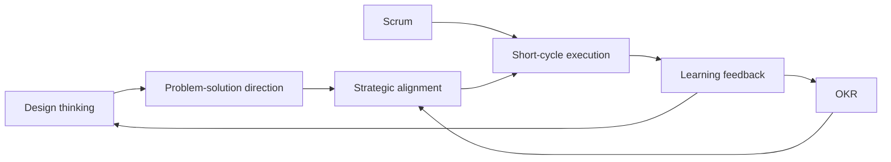

# CONTEXT: Session 12 Trends - Scrum, Design Thinking, And OKR

Source note: `organization/wiki/session-12-trends-scrum-design-thinking-okr/session-12-trends-scrum-design-thinking-okr.md`

Purpose: standalone language layer for Scrum, design thinking, OKR, and the four-problem novelty analysis.

## Scrum Terms

| Term | Definition | Aliases to avoid |
|---|---|---|
| **Scrum** | Agile framework that structures team-level work through roles, events, artifacts, and sprint cycles. | Generic agile; project management in general |
| **Product Owner** | Role responsible for product value and ordering the product backlog. | Project manager |
| **Scrum Master** | Role responsible for supporting the Scrum process and helping remove impediments. | Team boss |
| **Developers** | People who create the product increment during the sprint. | Coders only |
| **Sprint** | Time-boxed work cycle that produces a usable increment. | Deadline period |
| **Product Backlog** | Ordered list of product work and improvement items. | Task dump |
| **Sprint Backlog** | Selected work and plan for the sprint. | Personal to-do list |
| **Product Increment** | Usable output created during a sprint. | Status report |
| **Sprint Retrospective** | Event for improving how the team works. | Blame meeting |
| **Scaling Scrum** | Design challenge created when several teams share product, technical, or priority dependencies. | Bigger Scrum ceremonies only |

## Scaling Scrum Practices

| Term | Definition | Aliases to avoid |
|---|---|---|
| **Analyzing interdependencies** | Mapping how tasks, people, or components depend on each other across teams. | Dependency awareness only |
| **Reconfiguring resources** | Changing shared resources so multiple teams can use them more flexibly. | Adding more resources |
| **Mitigating interferences** | Buffering disruptions caused by cross-team dependencies. | Avoiding collaboration |
| **Reconfiguring schedules** | Adjusting timing so teams can access shared people, resources, or components. | Calendar cleanup |

## Design Thinking Terms

| Term | Definition | Aliases to avoid |
|---|---|---|
| **Design thinking** | User-centered, iterative problem-solving method using collaboration, visualization, prototyping, and testing. | Brainstorming only |
| **User need** | Problem, job, pain point, or aspiration experienced by the target user. | Management assumption |
| **Prototype** | Early tangible representation used to learn from users and test assumptions. | Finished product |
| **Iteration** | Repeated cycle of learning, revising, and testing. | Rework due to failure |
| **Workshop** | Structured collaborative setting for discovery, ideation, or testing. | Meeting without method |

## OKR Terms

| Term | Definition | Aliases to avoid |
|---|---|---|
| **OKR** | Objectives and Key Results method for translating strategic intent into short-cycle priorities and measurable progress. | KPI list |
| **Objective** | Qualitative, meaningful desired future state: where do we want to be? | Metric |
| **Key result** | Measurable outcome showing whether progress toward the objective occurred. | Activity; task |
| **Task** | Concrete work item chosen because it supports a key result. | Key result |
| **Roofshot** | Achievable, binding target where 100% completion is expected. | Easy moonshot |
| **Moonshot** | Ambitious innovation target where 60-70% can indicate valuable progress. | Unrealistic promise |
| **Top-down OKR input** | Strategic direction defined by management. | Command-only planning |
| **Bottom-up OKR input** | Team or employee contribution to defining feasible and meaningful objectives. | Lack of strategy |

## Relationships Between Canonical Terms

- **Design thinking** is strongest for discovering and testing user-centered solutions.
- **OKR** is strongest for aligning strategy, focus, and measurable progress.
- **Scrum** is strongest for executing interdependent product work in short cycles.
- **Scaling Scrum** requires interdependency management, not just more meetings.
- **Key results** are not tasks; tasks are chosen because they move key results.

## Compact Comparison Table

| Method | Question it answers | Main artifact | Biggest trap |
|---|---|---|---|
| **Design thinking** | What user problem should we solve and how might we solve it? | Prototype / tested insight | Workshop theater without implementation |
| **OKR** | What strategic outcome matters now and how do we know progress? | Objective + key results | KPI overload or metric gaming |
| **Scrum** | How do we complete product work while learning quickly? | Increment | Rituals without adaptation |

## Four-Problem Canvas Cheat Sheet

```text
Scrum:
task division = backlog/sprint items
task allocation = Product Owner prioritization + team self-organization
reward provision = ownership, progress, customer value
information provision = boards, events, artifacts, reviews

Design thinking:
task division = discover/define/ideate/prototype/test
task allocation = cross-functional workshop roles
reward provision = creativity, user impact, participation
information provision = user research, prototypes, test feedback

OKR:
task division = objective -> key results -> tasks
task allocation = top-down direction + bottom-up team planning
reward provision = meaning, focus, ownership, visible progress
information provision = OKR check-ins, dashboards, progress metrics
```

## Example Dialogue

Student: "OKR is just KPIs."

Professor: "Not quite. KPI language measures performance, but OKR starts with a desired future state. A key result tells us whether we are approaching that objective; a task is only the activity chosen to move the key result."

Student: "So 'launch a dashboard' is a task, not necessarily a key result?"

Professor: "Exactly. A stronger key result might be 'reduce weekly planning time from 4 hours to 1.5 hours.'"

## Exam Traps And Correction Rules

| Trap | Correction rule |
|---|---|
| Scrum = agile = any flexible work | Define Scrum by roles, events, artifacts, and sprint cycle. |
| Scrum scales automatically | Explain interdependencies and the four scaling practices. |
| Design thinking = creative brainstorming | Include user needs, prototypes, testing, and iteration. |
| OKR = KPI | Objective is qualitative direction; key results measure progress; tasks are actions. |
| Moonshot for everything | Use roofshots for operations and moonshots for innovation. |

## Mini Visual


