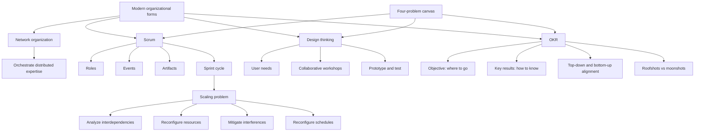

# Session 12: Trends In Organizational Design - Scrum, Design Thinking, And OKR

Source file: `organization/raw/moodle-export-organization-950938225-s26-20260711/13. Juli - 19. Juli/12_TUM_Trends_Part_2.pdf`

Course: Organization
Processed: 2026-07-11
Wiki note: `organization/wiki/session-12-trends-scrum-design-thinking-okr/session-12-trends-scrum-design-thinking-okr.md`

Course logistics checked: this is the second Trends session and continues the "new organizational forms" learning goals. The session applies the novelty lens to Scrum, design thinking, and OKR.

## 80/20 Exam Summary

Session 12 extends the contemporary design-form discussion into concrete methods: Scrum, design thinking, and OKR. The exam-relevant move is not merely defining the method. The task is to show how each method solves task division, task allocation, reward provision, and information provision, then assess its pros, cons, and novelty.

High-yield points:

- **Scrum** structures work completion at team level through roles, events, artifacts, and sprint cycles.
- Scrum works well for one autonomous team, but scaling creates interdependencies that must be managed deliberately.
- **Design thinking** organizes problem solving around user needs, iteration, visualization, and early testing.
- **OKR** translates strategic intent into visible short-cycle objectives and measurable key results.
- Methods become organizational forms only when they systematically reshape coordination, decision-making, motivation, and information flows.
- The final trend block connects back to earlier topics: environment, formal design, technology, AI, informal organization, and dynamic change.

## Network Organization Example: Eden McCallum

The session opens with Eden McCallum as a network-organization example.

Core logic:

- client problem is defined by an internal partner
- experts are selected from a large external consultant network
- a temporary project team is assembled around the task
- the team dissolves after completion
- new projects use new expert combinations
- capability comes from accessing distributed expertise
- value lies in orchestration, not permanent hierarchy

Four-problem interpretation:

| Problem | Eden McCallum-style network solution |
|---|---|
| Task division | Split consulting work around client problem modules. |
| Task allocation | Match external experts to project needs. |
| Reward provision | Experts receive project income, flexibility, reputation, and access to interesting work. |
| Information provision | Internal partners, project routines, client briefs, and shared deliverables coordinate temporary teams. |

## Scrum

Scrum is a team-level agile framework for completing work through repeated sprint cycles.

### Scrum Roles, Events, And Artifacts

| Category | Elements | Organizational function |
|---|---|---|
| Roles | Product Owner, Scrum Master, Developers | Distribute responsibility for value, process, and product work. |
| Events | Sprint Planning, Daily Scrum, Sprint Review, Sprint Retrospective | Create rhythm, feedback, coordination, and learning. |
| Artifacts | Product Goal, Product Backlog, Sprint Goal, Sprint Backlog, Product Increment | Make priorities, work, and progress visible. |

Scrum cycle:

```text
Backlog refinement -> Sprint planning -> Daily Scrum -> Increment
-> Sprint review -> Retrospective -> next sprint
```

### Scrum As Organization Design

| Four-problem canvas | Scrum answer |
|---|---|
| Task division | Product backlog and sprint backlog break product work into manageable items. |
| Task allocation | Developers self-organize around sprint work; Product Owner orders value priorities. |
| Reward provision | Progress, customer value, team ownership, and visible increments motivate contribution. |
| Information provision | Daily Scrum, boards, artifacts, reviews, and retrospectives make work visible. |

### Scaling Scrum

Scaling becomes necessary when several teams work on one product, share technical dependencies, or face conflicting product priorities.

The high-tech manufacturing case from Mahringer and Danner-Schroder identifies four practices for scaling across interdependent routine clusters.

| Practice | Meaning | Example |
|---|---|---|
| Analyzing interdependencies | Identify how tasks, people, or technical components depend on each other. | Map shared software components across teams. |
| Reconfiguring resources | Modify shared resources so multiple teams can use them. | Adapt code components for flexible shared use. |
| Mitigating interferences | Buffer disruptions caused by interdependent competencies. | Postpone tasks dependent on another team's configuration work. |
| Reconfiguring schedules | Adjust timing so teams can access shared resources. | Stagger meetings so a key person can support both teams. |

Scrum pros and cons:

| Pros | Cons |
|---|---|
| Frequent feedback and adaptation | Can become ritualistic if events lose purpose |
| Clear roles and artifacts | Scaling creates coordination burden |
| Visible work and priorities | Product Owner bottleneck risk |
| Team learning through retrospectives | Hard in highly regulated or hardware-dependent contexts |
| Customer-value orientation | Backlog pressure may crowd out strategic reflection |

## Design Thinking

Design thinking is a user-centered method for solving problems and developing new ideas.

Core elements:

- starts with a problem or challenge
- focuses on user needs
- uses collaborative workshops
- relies on iteration, visualization, and early testing
- develops ideas through user feedback rather than abstract planning alone

Common process logic:

```text
Understand / empathize -> define problem -> ideate -> prototype -> test -> iterate
```

### Design Thinking As Organization Design

| Four-problem canvas | Design-thinking answer |
|---|---|
| Task division | Divide innovation work into discovery, definition, ideation, prototyping, and testing. |
| Task allocation | Cross-functional participants contribute different user, technical, and business knowledge. |
| Reward provision | Motivation comes from user impact, creativity, participation, and visible prototypes. |
| Information provision | User research, visual artifacts, prototypes, and test feedback provide information. |

Pros and cons:

| Pros | Cons |
|---|---|
| Strong user orientation | Can become workshop theater without implementation |
| Supports creativity and cross-functional learning | May underplay constraints such as cost, regulation, or scalability |
| Tests assumptions early | User insights can be overgeneralized from small samples |
| Makes tacit ideas visible through prototypes | Requires psychological safety and time |

## OKR

OKR stands for **Objectives and Key Results**. It is a strategy-implementation method for dynamic environments.

The core problem:

- organizations struggle to implement strategy
- classic long planning becomes weak when the environment changes
- OKR translates strategic intent into short, visible cycles of priorities and measurable progress

### Objective

An **objective** describes the desired future state.

Good objective:

- qualitative
- understandable
- meaningful
- directional
- connected to strategy or value creation

Question:

```text
Where do we want to be?
```

### Key Results

**Key results** define how progress is recognized.

Good key results:

- measurable
- outcome-oriented
- levers for the objective
- usually two to four per objective

Question:

```text
How do we know we are there?
```

### OKR As Organization Design

| Four-problem canvas | OKR answer |
|---|---|
| Task division | Break strategic intent into objectives, key results, and tasks. |
| Task allocation | Corporate, department, team, and individual priorities align through top-down and bottom-up cycles. |
| Reward provision | Motivation comes from focus, meaning, progress visibility, and ownership. |
| Information provision | OKR cycles, check-ins, dashboards, and progress metrics make priorities visible. |

### Roofshots And Moonshots

| Type | Meaning | Use |
|---|---|---|
| Roofshot | 100% achievable and binding; measures are clear. | Operations, reliability, compliance. |
| Moonshot | 60-70% success can count as progress; encourages new solutions. | Innovation and exploration. |

Exam trap:

```text
Do not make every OKR a moonshot.
Use roofshots for operational commitments and moonshots for innovation learning.
```

OKR pros and cons:

| Pros | Cons |
|---|---|
| Connects local work to strategy | Poor key results can create metric gaming |
| Increases transparency and focus | Too many OKRs destroy focus |
| Supports dynamic learning cycles | Can become performance-control theater |
| Balances top-down and bottom-up planning | Requires honest review culture |

## Comparing Scrum, Design Thinking, And OKR

| Method | Primary level | Core purpose | Best used for | Main blind spot |
|---|---|---|---|---|
| Scrum | Team execution | Complete work in short cycles | Product development and interdependent team work | Scaling and external dependencies |
| Design thinking | Problem discovery and innovation | Understand users and prototype solutions | Ambiguous user problems and innovation | Implementation and operational discipline |
| OKR | Strategy implementation | Align priorities and measure progress | Dynamic strategy execution | Metric gaming and overload |

Compact comparison:

```text
Design thinking finds and tests the problem-solution direction.
OKR aligns the strategic priorities.
Scrum executes product work in short learning cycles.
```

## Exam Relevance

Likely question forms:

- Explain Scrum roles/events/artifacts and how they structure coordination.
- Apply the four-problem canvas to Scrum, design thinking, or OKR.
- Explain why scaling Scrum creates coordination problems.
- Compare roofshots and moonshots.
- Discuss pros and cons of contemporary organizational designs.
- Evaluate whether Scrum, design thinking, or OKR is a new form of organizing.

Common mistakes:

- Defining Scrum only as a project-management tool without organizational implications.
- Ignoring scaling and interdependency problems.
- Treating design thinking as brainstorming only.
- Defining OKR as a KPI system; OKR connects strategic direction to learning and progress, not just measurement.
- Using moonshots for operational commitments.

## Practice Questions

1. Apply the four-problem canvas to Scrum.
   - Short answer: work is divided into backlog and sprint items; tasks are allocated through Product Owner prioritization and team self-organization; contribution is motivated by ownership and visible value; information comes through boards, events, artifacts, and reviews.

2. Why does Scrum scaling create a design problem?
   - Short answer: multiple teams create technical, priority, and timing interdependencies. The organization must analyze dependencies, reconfigure resources, mitigate interferences, and reconfigure schedules.

3. How is OKR different from a simple KPI list?
   - Short answer: OKR begins with a meaningful future state and links local work to strategic intent; key results show progress toward that objective. KPI lists often measure ongoing performance without creating focus or learning.

4. When would design thinking be weak?
   - Short answer: when the problem is already known and implementation discipline, regulation, scale, or operational reliability matters more than user discovery and ideation.

## Visual Knowledge Map



## Subject-Level Knowledge Graph

### Nodes

| Node | Type | Definition |
|---|---|---|
| Scrum | Agile framework | Team-level framework using roles, events, artifacts, and sprints to structure work completion. |
| Product Owner | Scrum role | Owns product value and backlog ordering. |
| Scrum Master | Scrum role | Supports the Scrum process and removes impediments. |
| Developers | Scrum role | People doing the product work in the sprint. |
| Sprint | Scrum cycle | Time-boxed work cycle producing an increment. |
| Scaling Scrum | Design problem | Coordination challenge when multiple teams share product, technical, or priority interdependencies. |
| Design thinking | Innovation method | User-centered iterative method for solving problems and developing ideas. |
| Prototype | Design-thinking artifact | Early tangible representation used to test assumptions. |
| OKR | Strategy method | Objectives and key results method for short-cycle strategy implementation. |
| Objective | OKR element | Qualitative desired future state. |
| Key result | OKR element | Measurable outcome showing progress toward the objective. |
| Roofshot | OKR type | Achievable, binding target for operational reliability. |
| Moonshot | OKR type | Ambitious target where partial progress can be valuable in innovation contexts. |

### Edges

| From | Relationship | To |
|---|---|---|
| Scrum | structures | Team execution |
| Product Owner | orders | Product backlog |
| Sprint | produces | Product increment |
| Daily Scrum | provides | Coordination information |
| Scaling Scrum | creates | Interdependency management need |
| Design thinking | starts from | User needs |
| Prototype | tests | Assumptions |
| OKR | translates | Strategic intent |
| Objective | is measured by | Key results |
| Roofshot | fits | Operations |
| Moonshot | fits | Innovation |
| Four-problem canvas | evaluates | Scrum, design thinking, and OKR |

## Open Uncertainties

- The deck asks for group-work applications to Scrum, design thinking, and OKR but does not include official solution slides. The applications here are inferred from the lecture framework.
- The Scrum Guide quotation in the source emphasizes Scrum's completeness; exam answers should still analyze how real organizations hybridize Scrum with other designs.
