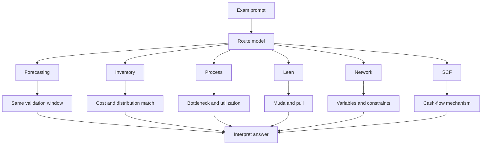

# Ubiquitous Language: Sample Examinations Exam Practice

Source note: `sample-examinations-exam-practice.md`
Course: Supply Chain Management
Definition sources: SS20, SS21, WS22/23, and SS23 sample examinations; enriched with standard SCM exam-solving terminology where needed.

This file is a standalone companion for exam command language, model-routing terms, formula traps, and recurring SCM exam phrasing.

## Exam Command Language

| Term | Definition | Aliases to avoid |
|---|---|---|
| **Calculate** | Produce a numerical answer with correct formula, units, and rounding. | discuss only |
| **Explain Quantitatively** | Use numbers to justify a recommendation or comparison. | opinion only |
| **Comment On The Statement** | State whether the statement is true, false, or incomplete, then explain the missing condition. | paraphrase |
| **Select All Correct Statements** | Each selected statement must be entirely true, including its explanation. | choose likely ideas |
| **Formulate As MILP/LP** | Define variables, objective, constraints, domains, and non-negativity/binary restrictions. | solve only |
| **Introduce Decision Variables** | State what each variable means and its units/domain. | list parameters |
| **Apply The Heuristic** | Follow the lecture algorithm step by step; do not jump to an intuitive answer. | optimize exactly |
| **Provide A Proof** | Give a general argument, not only one numerical example. | calculate one case |
| **Recommend** | State decision, evidence, and risk/limitation. | list pros and cons only |

## Model-Routing Language

| Term | Definition | Aliases to avoid |
|---|---|---|
| **Forecasting Problem** | Future-demand estimation and error evaluation. | inventory optimization |
| **Inventory Problem** | Quantity or replenishment-level decision under demand/cost assumptions. | process capacity |
| **Process Analysis Problem** | Capacity, bottleneck, utilization, waiting, and flow-time problem. | network design |
| **Lean Problem** | Waste, flow, pull, Kanban, improvement, or mistake-proofing problem. | simple cost reduction |
| **Coordination Problem** | Bullwhip, order variability, information sharing, incentives, or supply-chain policy problem. | facility location |
| **Network Design Problem** | Facility, shipment, covering, routing, TSP, shortest path, or knapsack problem. | process flow |
| **SCF Problem** | Payment timing, reverse factoring, working capital, supplier liquidity, or financing-cost problem. | inventory only |
| **Case Problem** | Managerial prompt requiring diagnosis, calculation, and recommendation. | definition recall |

## Formula Trap Language

| Term | Definition | Aliases to avoid |
|---|---|---|
| **Same Validation Window** | Forecast methods must be compared on the same periods. | any available errors |
| **MAD** | Mean absolute deviation; average absolute forecast miss. | squared-error criterion |
| **MSE** | Mean squared error; penalizes large errors more strongly. | average absolute error |
| **Control Limits** | Forecast-monitoring bounds, often `+/- z*sqrt(MSE)`. | confidence interval of demand |
| **Basic EOQ Balance** | At basic EOQ, annual setup/order cost equals annual holding cost. | production equals demand |
| **Square-Root Sensitivity** | EOQ/EPQ quantities change with square roots of cost/demand parameters. | one-for-one change |
| **Finite-Horizon Integer Check** | Check floor and ceiling of continuous order count. | automatic rounding |
| **Demand Over `l+1` Periods** | Order-up-to exposure horizon in the course model. | lead time only |
| **Smallest Integer Meeting Service Level** | For discrete demand, choose the first `S` with `F(S) >= SL`. | closest CDF |
| **Expected Backorder Quantity** | Expected number of units short, not probability. | stockout probability |
| **In-Transit Capital Cost** | Cost of capital tied up while goods are transported. | freight cost |

## Recurring MCQ Contrast Language

| Contrast | Canonical Distinction |
|---|---|
| **Normal vs Poisson** | Normal is continuous with `mu` and `sigma`; Poisson is discrete with `lambda`, variance `lambda`. |
| **PDF vs CDF** | CDF is cumulative and bounded by 1; continuous PDF values are densities, not probabilities. |
| **Newsvendor vs Order-Up-To** | Newsvendor is single-period `Q`; order-up-to is multi-period `S` with lead time and inventory position. |
| **Dijkstra vs TSP** | Dijkstra solves one shortest path; TSP solves one tour visiting all nodes. |
| **Kaizen vs Kaikaku** | Kaizen is incremental continuous improvement; Kaikaku is radical change. |
| **Transport vs Motion Waste** | Transport moves materials; motion moves workers. |
| **Factoring vs Reverse Factoring** | Factoring is supplier-led receivable financing; reverse factoring is buyer-led approved-invoice financing. |
| **Capacity vs Utilization** | Capacity is maximum sustainable rate; utilization is actual flow rate divided by capacity. |

## Relationships Between Canonical Terms

- **Exam routing** comes before **formula selection**.
- **Same validation window** makes **MAD/MSE** comparisons fair.
- **Square-root sensitivity** explains EOQ changes from setup or demand changes.
- **Demand over `l+1` periods** feeds **order-up-to level `S`**.
- **Expected backorder quantity** and **stockout probability** answer different questions.
- **Lean problem** terms often connect **muda**, **pull**, **Kanban**, and **Poka-yoke**.
- **SCF problem** terms connect **working capital**, **DPO/DSO**, and **reverse factoring**.

## Visual Memory Aid



## Example Dialogue

> **Student:** "The problem asks for optimal inventory, so I will use EOQ."
>
> **Professor:** "Route first. Is demand deterministic and replenishment immediate, or is demand random with lead time?"
>
> **Student:** "Random weekly demand and a three-week lead time."
>
> **Professor:** "Then this is an **order-up-to** problem. Aggregate demand over **`l+1` periods**, compute the service level, and find `S`."

## Flagged Ambiguities

| Ambiguous Phrase | Canonical Recommendation |
|---|---|
| "Best forecast" | State whether criterion is MAD or MSE and compare on the same periods. |
| "Capacity of process" | State resource capacities and bottleneck, not total task times. |
| "Service level" | Identify Newsvendor critical fractile or order-up-to in-stock probability. |
| "Optimal quantity" | Say `Q*` for EOQ/Newsvendor; say `S` for order-up-to. |
| "Improve production" | Specify capacity, lead time, quality, waste, demand, or flexibility. |
| "SCF benefit" | Separate buyer, supplier, and funder benefits. |
| "Proof check" | For small network problems, enumerate alternatives or compare heuristic result with lower bound. |

## Exam Trap Corrections

| Trap | Correction |
|---|---|
| Starting calculation before model choice. | Write the model name first. |
| Rounding EOQ order count automatically. | Check both neighboring integer order counts. |
| Treating waiting as bottleneck capacity. | Waiting affects lead time and WIP, not resource capacity. |
| Selecting all partially true MCQ options. | A statement must be entirely true to select. |
| Confusing stockout probability and expected backorders. | Probability is `1-F(S)`; expected backorders are units. |
| Applying Dijkstra to TSP. | TSP needs tour constraints and subtour elimination. |
| Calling unilateral payment delay SCF. | SCF requires a structured buyer-supplier-funder mechanism. |

## Compact Answer Language

```text
First, route the problem.
Second, state the model assumptions and formula.
Third, align units and compute.
Fourth, interpret the result as a capacity, inventory, cost, service, or risk consequence.
For MCQs, reject any answer that is only partly true.
For case answers, use diagnosis -> calculation -> recommendation -> risk.
```
