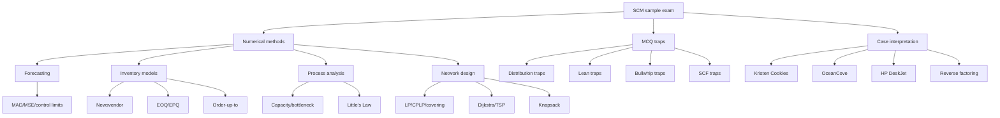

# Sample Examinations: SCM Exam Practice Synthesis

Source files:

- `supply-chain-management/raw/moodle-export-operations-950888956-s26-20260604/Sample Examinations/Sample Examination from SS20.pdf`
- `supply-chain-management/raw/moodle-export-operations-950888956-s26-20260604/Sample Examinations/Sample Examination from SS21.pdf`
- `supply-chain-management/raw/moodle-export-operations-950888956-s26-20260604/Sample Examinations/Sample Examination from SS23.pdf`
- `supply-chain-management/raw/moodle-export-operations-950888956-s26-20260604/Sample Examinations/Sample Examination from WS2223.pdf`

Course: Supply Chain Management
Processed: 2026-06-04
Wiki note: `supply-chain-management/wiki/sample-examinations-exam-practice/sample-examinations-exam-practice.md`

Administrative exam details from these files are preserved in `../_course-logistics.md`. This note focuses on examinable content patterns, solution routines, and practice strategy.

## 80/20 Exam Summary

The sample exams show that SCM is tested as an applied methods course. The dominant pattern is:

```text
short MCQ traps + numerical setup + case interpretation
```

The highest-yield preparation is not rereading slides. It is being able to route a prompt quickly:

```text
forecasting -> error metrics / smoothing / regression
inventory -> Newsvendor / EOQ / EPQ / order-up-to
process -> capacity / bottleneck / Little's Law / utilization
lean -> waste / pull / Kanban / Kaizen / Kaikaku / Poka-yoke
coordination -> bullwhip causes, consequences, mitigations
network design -> LP/CPLP/covering/Dijkstra/TSP/knapsack
SCF/resilience -> reverse factoring, working capital, supplier onboarding, disruption bottlenecks
cases -> Kristen, OceanCove, HP, Superb Flowers-style reasoning
```

The exam repeatedly rewards:

- choosing the correct model before calculating
- matching units across time periods
- interpreting what the number means operationally
- distinguishing similar concepts
- proving or explaining model logic in short paragraphs

## Coverage Pattern Across Sample Exams

| Source | Main Production Topics | Main Logistics Topics | Case Emphasis |
|---|---|---|---|
| SS20 | Capacity, EOQ/EPQ, forecasting, process analysis, lean, Kristen/OceanCove | Bullwhip, distribution networks, probability, order-up-to, network design, SCF/HP | Kristen technologies, OceanCove delivery, HP modern technology |
| SS21 | Random variables, EOQ, capacity utilization, production systems, order-up-to, lean, forecasting, process/resource mix, EOQ pooling, Kristen/OceanCove | Bullwhip, EDLP, knapsack, Newsvendor/EOQ/order-up-to, SCF, operations strategy, network design, reverse factoring, HP | Kristen capacity/demand, OceanCove pandemic/delivery, HP KPIs |
| WS22/23 | EOQ setup-cost sensitivity, finite-horizon EOQ, batch-and-queue, Little's Law, lean, forecasting, process analysis, EOQ, Kristen/OceanCove | Bullwhip, facility location, Hotelling, TSP, order-up-to, shortage gaming, SCF, HP transport | Kristen order timing, OceanCove flow, reverse factoring |
| SS23 | HP service level/product lifecycle, bullwhip, SCF, lean, EOQ/EPQ, forecasting, inventory, capacity, facility location, Kristen/OceanCove | Integrated into one exam set | HP, restaurant flow, knapsack/TSP/location covering |

Topic frequency signal:

```text
Forecasting, inventory, capacity/process analysis, EOQ/EPQ, bullwhip, lean, network design, and cases appear repeatedly.
SCF and HP-style logistics questions appear in the newer samples.
```

## Question-Type Patterns

### MCQ Traps

The MCQs are often concept-comparison questions. They test whether a statement is fully true.

Common traps:

- Normal vs Poisson: normal is continuous; Poisson is discrete.
- PDF vs CDF: CDF is weakly increasing and bounded by 1; PDF values can exceed 1 for continuous distributions.
- EOQ: at `Q*`, annual holding and ordering/setup costs are equal under basic EOQ assumptions.
- Setup-cost sensitivity: because `Q*` uses a square root, a 19% setup-cost decrease means `Q*` decreases by 10%.
- Lean: Poka-yoke and pull are lean; over-processing, large inventory, and larger batches are not automatically lean.
- Order-up-to: multi-period, random demand, fixed lead time; end-of-period inventory level equals `S - demand over l+1 periods`.
- Newsvendor: single-period; leftovers usually do not carry to next season.
- TSP vs shortest path: TSP is a tour visiting all nodes; Dijkstra solves shortest path, not TSP.
- Bullwhip: EDLP mitigates; seasonal discounts, shortage gaming, inflated orders, and long lead times can contribute.

### Numerical Open Questions

These usually require a short chain:

```text
identify model -> write formula -> align units -> calculate -> interpret
```

The most common numerical families:

- forecasting: naive, naive with trend, moving average, exponential smoothing, regression, MAD, MSE, control limits
- process: capacity by resource, bottleneck, utilization, Little's Law
- EOQ/EPQ: batch size, order frequency, finite-horizon integer checks, warehouse pooling
- order-up-to: service level, demand over `l+1`, Poisson/normal quantile, stockout probability, expected backorders
- Newsvendor: critical fractile and quantile for normal or uniform demand
- network design: LP objective, covering heuristic, knapsack choice, TSP subtour logic
- SCF/HP: financing cost, transportation/in-transit capital cost, reverse factoring sequence

### Case Interpretation

Cases test whether you can turn operations language into a managerial recommendation.

Repeated case logic:

| Case | What To Diagnose | Typical Answer Shape |
|---|---|---|
| Kristen Cookies | Capacity, bottleneck, make-to-order, freshness/customization, technology impacts. | Identify bottleneck, protect value proposition, propose capacity or demand-side improvement. |
| OceanCove | Customer value, capacity, lead time, dining/seating restrictions, delivery platforms. | Compute capacity impact, then discuss operational benefits and risks. |
| HP DeskJet | Localization/postponement, inventory, transportation lead time, cost of capital, service level. | Link uncertainty, product variety, lead time, and inventory cost. |
| SCF / reverse factoring | Buyer-supplier-bank process, supplier onboarding, working capital. | Explain mechanism and benefits/risks for all parties. |

## High-Yield Solution Routines

### Forecasting Routine

1. List actual demand by period.
2. Compute each forecast only using information available at that time.
3. Evaluate on the same comparison window.
4. Use `MAD` for typical absolute miss.
5. Use `MSE` when large misses are especially costly.
6. Control limits usually use:

```text
UCL/LCL = +/- z * sqrt(MSE)
```

Trap:

```text
Do not compare one method on periods 3-7 and another on periods 2-7.
```

### Process Capacity Routine

1. Define flow unit.
2. List required tasks and processing times.
3. Convert each resource to common time units.
4. Compute each resource capacity.
5. Bottleneck is the lowest required resource capacity.
6. Use Little's Law only when average inventory, flow rate, and flow time are linked.

Formula:

```text
capacity = number of parallel resources / processing time per unit
utilization = flow rate / capacity
I = R * T
```

Trap:

```text
Waiting time affects flow time and Little's Law inventory, but waiting is not itself a capacity activity unless a constrained resource performs it.
```

### EOQ / EPQ Routine

Basic EOQ:

```text
Q* = sqrt(2*K*lambda / h)
```

EPQ:

```text
Q*_EPQ = sqrt(2*K*lambda / h) * sqrt(p/(p-lambda))
```

Finite horizon:

```text
compute continuous optimum number of orders
check floor and ceiling integer options
choose the lower total cost
```

Warehouse pooling:

```text
If n identical warehouses are pooled without extra costs:
savings share = 1 - 1/sqrt(n)
```

Setup-cost sensitivity:

```text
K decreases by 19% -> K_new = 0.81K -> Q_new = sqrt(0.81)Q = 0.90Q
```

Trap:

```text
If production rate p approaches demand rate lambda from above, the EPQ multiplier grows, so batch size and average inventory logic change sharply.
```

### Newsvendor Routine

```text
SL* = c_u / (c_u + c_o)
Q* = F^-1(SL*)
```

Uniform demand on `[A, B]`:

```text
Q* = A + SL*(B-A)
```

Normal demand:

```text
Q* = mu + z*sigma
```

Trap:

```text
Profit margin is usually the underage cost if a missed sale loses that margin. Purchase cost minus salvage is usually the overage cost.
```

### Order-Up-To Routine

```text
demand horizon = l + 1 periods
SL* = backorder cost / (backorder cost + holding cost)
S = F^-1(SL*)
in-stock probability = F(S)
stockout probability = 1 - F(S)
B(S) = expected units short
I(S) = S - mu + B(S)
```

For Poisson demand:

```text
aggregate lambda over l+1 periods
choose smallest integer S with F(S) >= SL
```

For normal approximation:

```text
mu_period = mu_week * (l+1)
sigma_period = sigma_week * sqrt(l+1)
```

Trap:

```text
Changing the demand distribution does not change the cost-based service level; it changes the quantile/order-up-to level needed to reach that service level.
```

### Bullwhip Routine

Diagnose:

```text
customer demand change -> retailer order response -> manufacturer/supplier amplification
```

Common causes:

- order batching and synchronization
- forward buying and seasonal discounts
- shortage gaming / inflated orders
- long lead times
- behavioral overreaction
- information distortion

Mitigations:

- POS/EDI information sharing
- VMI/CPFR
- EDLP
- pull and lean flow
- return policy and incentive redesign

Trap:

```text
Always classify the cause before choosing a mitigation. EDLP helps promotions/forward buying; POS data helps information distortion; VMI changes replenishment ownership.
```

### Network Design Routine

Model routing:

| Prompt | Model |
|---|---|
| Ship quantities from fixed plants to customers | Transportation LP |
| Open plants and ship | CPLP |
| Cover every customer at least once | Location covering |
| Shortest path from A to B | Dijkstra |
| Visit every node exactly once in one tour | TSP |
| Choose items under capacity | Knapsack |

Location covering model:

```text
min sum_i f_i y_i
subject to sum_i a_ij y_i >= 1 for every customer j
y_i in {0,1}
```

Knapsack model:

```text
max sum_i v_i x_i
subject to sum_i w_i x_i <= W
x_i in {0,1}
```

Trap:

```text
TSP is not "many shortest paths." The subtour-elimination issue is what makes it structurally harder.
```

### SCF / Reverse Factoring Routine

Reverse factoring sequence:

```text
supplier delivers and invoices buyer
buyer approves invoice and confirms to bank/platform
bank pays supplier early
buyer pays bank at maturity
```

Financing cost:

```text
financing cost = annual spend * interest rate * days/360
annual spend = financing cost / (interest rate * days/360)
```

Trap:

```text
SCF adoption is not automatic. Supplier onboarding is a major program risk.
```

### HP / Transportation-Cost Routine

Use total cost logic:

```text
transport cost + in-transit capital cost + inventory/warehouse implications
```

In-transit capital cost:

```text
value in transit * WACC * transit time / year
```

Managerial interpretation:

```text
Slower transport may be cheaper per shipment but ties up more capital and increases response time.
```

## Content Heat Map

| Topic | Frequency Signal | Preparation Priority |
|---|---|---|
| Forecasting | Appears in every sample. | Very high |
| Inventory models | Appears in every sample. | Very high |
| Process/capacity/Little's Law | Appears in every sample. | Very high |
| EOQ/EPQ/production systems | Appears repeatedly. | Very high |
| Lean | Appears in MCQs and EOQ/production sections. | High |
| Bullwhip/coordination | Appears in logistics sections. | High |
| Network design | Appears repeatedly. | High |
| SCF/reverse factoring | Appears in newer and logistics samples. | High |
| Kristen/OceanCove/HP | Appears repeatedly as practice/case problems. | High |
| Hotelling/TSP proof | Appears as conceptual extension. | Medium |

## Exam Practice Plan

Use this three-layer practice structure:

1. **MCQ Trap Sprint**: 12 questions in 10 minutes. For each answer, explain why the other options are false.
2. **Numerical Routing Sprint**: 5 prompts in 25 minutes. First write the model name before any formula.
3. **Case Recommendation Sprint**: 1 case in 15 minutes. Use `diagnosis -> calculation -> recommendation -> risk`.

Recommended first exam-practice block:

```text
Forecasting + Inventory + Process
```

Reason:

```text
These three appear in every sample and together train most formula-routing errors.
```

Recommended second block:

```text
EOQ/EPQ + Lean + Bullwhip
```

Reason:

```text
This trains the recurring tradeoff between local efficiency, flow, batch size, and system variability.
```

Recommended third block:

```text
Network Design + SCF + HP/OceanCove/Kristen cases
```

Reason:

```text
This trains model formulation and managerial interpretation.
```

## Visual Knowledge Map



## Subject Knowledge Graph

| Node | Meaning | Exam Relevance |
|---|---|---|
| Exam Routing | Choosing the correct model before calculating. | Core exam skill. |
| MCQ Trap | Statement designed to confuse similar concepts. | Frequent first exercise. |
| Forecasting Block | Time-series forecasts plus error metrics. | Repeated numerical task. |
| Inventory Block | Newsvendor, EOQ, EPQ, and order-up-to models. | Repeated numerical task. |
| Process Block | Capacity, bottleneck, utilization, Little's Law. | Repeated numerical task. |
| Lean Block | Waste, pull, Kanban, Kaizen, Kaikaku, Poka-yoke. | MCQ and transformation questions. |
| Bullwhip Block | Causes, consequences, mitigation. | Logistics MCQ and short answer. |
| Network Design Block | LP, CPLP, covering, TSP, Dijkstra, knapsack. | Formulation and algorithm questions. |
| SCF Block | Reverse factoring, working capital, supplier onboarding. | Newer logistics case questions. |
| Case Block | Kristen, OceanCove, HP, SCF cases. | Managerial interpretation. |

| From | Relationship | To |
|---|---|---|
| Exam Routing | precedes | Formula use |
| Forecasting Block | uses | MAD/MSE/control limits |
| Inventory Block | requires | Distribution and cost matching |
| Process Block | identifies | Bottleneck |
| Lean Block | diagnoses | Muda |
| Bullwhip Block | connects | Local ordering and upstream volatility |
| Network Design Block | requires | Variables and constraints |
| SCF Block | explains | Buyer-supplier-bank mechanism |
| Case Block | requires | Calculation plus recommendation |

## Open Uncertainties

- The sample examinations do not include official answer keys in the provided folder. The solution routines above reflect the lecture notes and standard SCM methods, not an official solution sheet.
- Some sample questions include placeholders or ranges, such as `{24-30}%` or `{4-8}`. Treat these as Moodle-randomized variants and solve with the value shown in the actual exam instance.
