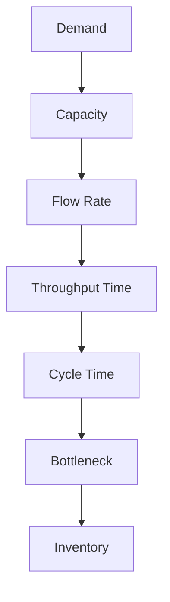

# Ubiquitous Language: Topic 01: Kristen Cookies Company Case

Source note: `topic-01-kristen-cookie-case.md`
Course: Supply Chain Management
Definition sources: local topic note and raw material for term discovery; enriched with standard domain knowledge where the local note names a term without fully defining it.

This file is a standalone terminology and formula companion. It follows Matt Pocock style: canonical terms, aliases to avoid, relationships, example dialogue, and flagged ambiguities.

## Operations Language

| Term | Definition | Aliases to avoid |
|---|---|---|
| **Demand** | The quantity customers want during a defined period or decision horizon. | sales, forecast |
| **Capacity** | The maximum output a process or resource can produce in a period under stated assumptions. | inventory, demand |
| **Flow Rate** | The number of units completed by a process per unit of time. | speed, capacity without time |
| **Throughput Time** | The elapsed time for one unit or order to pass through the process from start to finish. | cycle time, waiting time only |
| **Cycle Time** | The time between successive completed units from a process. | throughput time |
| **Bottleneck** | The resource or step with the lowest effective capacity that limits total process output. | slow step only |
| **Inventory** | Material, work-in-process, or finished goods held between process steps or before demand is known. | stock only |

## Decision Language

| Term | Definition | Aliases to avoid |
|---|---|---|
| **Service Level** | The probability that available stock or capacity fully covers demand in the defined setting. | fill rate, customer satisfaction |
| **Tradeoff** | A decision tension where improving one objective worsens another, such as stockout risk versus leftover inventory. | problem, compromise only |
| **Decision Rule** | A formula or logic that converts input data into an operational action. | formula without interpretation |

## Process Analysis

| Term | Definition | Aliases to avoid |
|---|---|---|
| **Process Flow** | The ordered sequence of activities that transforms inputs into outputs. | workflow drawing only |
| **Gantt Chart** | A time-based visual schedule showing when tasks start, overlap, and finish. | flowchart |
| **Setup Time** | Time required to prepare a resource before productive processing can occur. | processing time |
| **Labor Utilization** | The share of available labor time actually spent on productive tasks. | labor cost |
| **Strategic Fit** | Alignment between operating choices and the value proposition or competitive strategy. | strategy alone |

## Relationships

- **Demand** should be distinguished from **Capacity** when writing exam answers.
- **Capacity** should be distinguished from **Flow Rate** when writing exam answers.
- **Flow Rate** should be distinguished from **Throughput Time** when writing exam answers.
- **Throughput Time** should be distinguished from **Cycle Time** when writing exam answers.
- **Cycle Time** should be distinguished from **Bottleneck** when writing exam answers.
- **Bottleneck** should be distinguished from **Inventory** when writing exam answers.
- A strong answer defines the canonical term, applies the rule or formula, and states the managerial, legal, or analytical implication.

## Visual Memory Aid



## Example Dialogue

> **Student:** "I see **Demand** and **Capacity** in the note. Are they interchangeable?"
>
> **Professor:** "No. Use **Demand** for its precise technical meaning, and use **Capacity** only when the facts match that definition."
>
> **Student:** "So in an exam answer I should name the exact term first?"
>
> **Professor:** "Yes. Name the canonical term, apply the decision rule or mechanism, then state the implication."

## Flagged Ambiguities

- Do not use broad labels like "concept", "factor", or "thing" when a canonical term above fits.
- Do not use aliases listed in the tables unless you are explicitly explaining why they are misleading.
- If a formula symbol appears, define its unit, timing, and decision role before calculating.
- If a legal, theoretical, or framework term has a common everyday meaning, use the technical course meaning in exam answers.

## Exam Trap Corrections

| Trap | Correction |
|---|---|
| Naming a term without applying it. | Define it briefly, then apply it to the facts, formula, or decision. |
| Treating examples as definitions. | Use examples only after the canonical definition is clear. |
| Mixing related terms. | State the boundary between the terms before comparing them. |
| Copying a formula without variable meaning. | Define each variable and unit before substitution. |

## Cheat-Sheet Language

```text
Name the operational decision, identify the constraint or uncertainty, choose the metric/formula, then interpret the managerial implication.
For every technical term: define it, identify when it applies, and state the common confusion to avoid.
```
