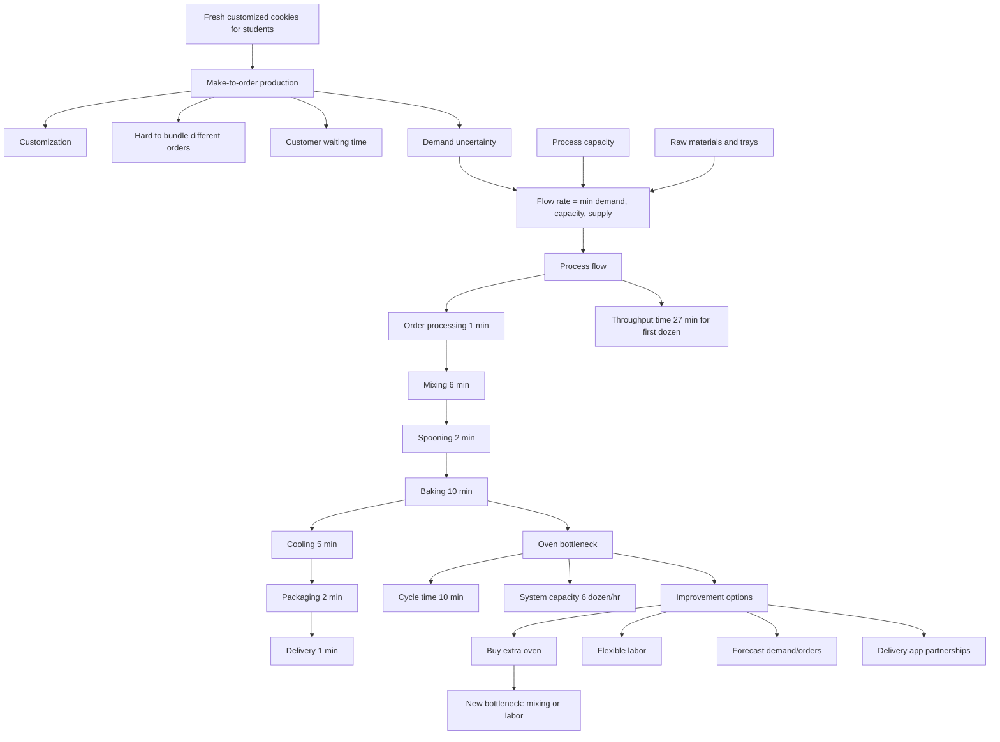

# Topic 01: Kristen Cookies Company Case

Source: `supply-chain-management/raw/TUM_PL_2026_01_KristenCookie_MIM_1.pdf`
Course: Supply Chain Management
Processed: 2026-05-14
Wiki note: `supply-chain-management/wiki/topic-01-kristen-cookie-case/topic-01-kristen-cookie-case.md`

Course logistics checked: SCM case discussions require upfront preparation. This case should be treated as high-priority because it teaches process-flow, capacity, bottlenecks, throughput time, cycle time, and improvement logic.

## 80/20 Exam Summary

Kristen Cookies is the operational foundation case: how a simple make-to-order cookie business reveals process flow, bottlenecks, capacity, labor allocation, and strategic fit.

High-yield points:

- Strategy must fit operations. Customized fresh cookies imply make-to-order production, but that creates capacity and waiting-time constraints.
- Flow rate is limited by the minimum of demand rate, process capacity, and supply rate.
- Bottleneck determines cycle time and system capacity.
- For one-dozen orders, throughput time is 27 minutes and system capacity is 6 dozen/hour because baking takes 10 minutes per dozen.
- Adding capacity at a non-bottleneck does not improve system capacity.
- Buying another oven increases oven capacity but shifts the bottleneck to mixing or labor, depending on labor flexibility.
- Labor cost per tray depends on both direct labor time and idle time caused by bottleneck cycle time.
- Improvement ideas must target the current bottleneck or demand/order-flow uncertainty.

## Case Situation

Kristen Cookies is a small make-to-order cookie operation for hungry students.

Key characteristics:

- fresh cookies
- customized cookies
- make-to-order production
- student target segment
- limited labor: two staff and no backup
- limited oven capacity
- limited trays
- raw material availability matters
- risks include oven failure and order cancellation

If payment is collected only at delivery, cancellation is a risk because the process may already have consumed labor, oven capacity, and ingredients.

## Strategy And Strategic Fit

Strategy is the management action plan for running the business, attracting customers, competing, and reaching performance targets.

Kristen Cookies appears to compete through:

- differentiation: fresh and customized cookies
- focus: hungry students as a particular segment

Strategic fit means operations must support the chosen strategy. A fresh/customized product can please customers, but it creates operational complexity:

- orders cannot easily be pooled
- production starts only after demand is known
- customers may wait
- process capacity becomes visible very quickly

Exam intuition: a good strategy can fail operationally if the process cannot deliver the promised value proposition.

## Drivers Of Production Issues

The deck lists these drivers:

- different orders cannot be bundled easily
- limited system capacity, especially oven capacity
- limited labor: two workers, no backup
- number of trays on hand
- order size per customer
- customer demand
- raw material supply constraints

Core flow-rate formula:

```text
Flow rate = min{demand rate, process capacity, supply rate}
```

Meaning:

- If demand is too low, demand limits output.
- If process capacity is too low, capacity limits output.
- If ingredients/trays are unavailable, supply limits output.

## Process Flow For One-Dozen Order

Process steps for one dozen:

| Step | Time | Implied Capacity |
|---|---:|---:|
| Order processing | 1 min | 60 dozen/hr |
| Mixing | 6 min | 10 dozen/hr |
| Spooning | 2 min | 30 dozen/hr |
| Loading tray to oven | 0 min | effectively unlimited |
| Baking | 10 min | 6 dozen/hr |
| Unloading tray from oven | 0 min | effectively unlimited |
| Cooling | 5 min | effectively unlimited |
| Packaging | 2 min | 30 dozen/hr |
| Delivery | 1 min | 60 dozen/hr |

Throughput time for the first one-dozen order:

```text
1 + 6 + 2 + 0 + 10 + 0 + 5 + 2 + 1 = 27 minutes
```

System capacity:

```text
min step capacity = baking = 6 dozen/hr
```

Cycle time:

```text
10 minutes per dozen
```

The bottleneck is the oven/baking step.

## Throughput Time vs Cycle Time

Throughput time is how long one order takes from start to finish.

Cycle time is the time between completed units/orders once the system is running at steady state.

For one-tray orders:

- first order throughput time: 27 minutes
- steady-state cycle time: 10 minutes
- bottleneck: oven

Real-life analogy: in a coffee shop, the first coffee may take several minutes from ordering to handoff, but once the barista line is running, drinks may come out every 60 seconds if the espresso machine is the bottleneck.

## Gantt Chart Logic

The Gantt chart shows overlapping work:

- first order takes 27 minutes
- later orders can overlap with earlier orders
- cycle time becomes 10 minutes because baking is the bottleneck
- two trays are enough for one-tray order operation
- dough may wait for trays because spooning requires a tray

Exam point: do not confuse first-order completion time with long-run capacity.

## Labor Time And Cost

For one-tray order:

Your time:

```text
mixing + spooning = 6 + 2 = 8 minutes
```

Roommate's time:

```text
order processing + loading + unloading + packaging + delivery
= 1 + 0 + 0 + 2 + 1 = 4 minutes
```

Direct labor time:

```text
8 + 4 = 12 minutes per tray
```

Labor cost assumption:

```text
$12/hour = $0.20/minute
```

Performance table from deck:

| Order Size | Throughput Time | Cycle Time | Direct Labor Time | Direct Labor Time / Tray | Direct Labor Cost / Tray | Labor Cost / Tray incl. Idle |
|---:|---:|---:|---:|---:|---:|---:|
| 1 tray | 27 | 10 | 12 | 12.00 | $2.40 | $4 |
| 2 trays | 37 | 10 | 16 | 8.00 | $1.60 | $4 |
| 3 trays | 47 | 10 | 20 | 6.66 | $1.33 | $4 |
| 4 trays | 57 | 10 | 30 | 7.50 | $1.50 | $4 |

Why direct labor cost per tray falls at first:

- some tasks are fixed per order, such as order processing and delivery
- spreading fixed labor over more trays reduces direct labor per tray

Why labor cost including idle stays at $4 per tray:

- if the bottleneck cycle time remains 10 minutes and two workers are paid through that cycle, idle labor still costs money
- unless flow rate increases or one worker is removed/reallocated, idle time remains economically relevant

## Improvement Logic

### Extra Oven

Buying an extra oven increases baking capacity:

```text
one oven: 6 dozen/hr
two ovens: 12 dozen/hr
```

But overall system capacity does not automatically become 12 dozen/hr.

If oven is no longer the bottleneck, the bottleneck shifts:

- mixing takes 6 minutes -> 10 dozen/hr
- if labor is inflexible, "you" may be the bottleneck with mixing + spooning = 8 minutes -> 7.5 dozen/hr

Therefore:

- with flexible labor, system capacity may rise to 10 dozen/hr
- if you remain the labor bottleneck, system capacity may only rise to 7.5 dozen/hr

Core lesson: improve the bottleneck, then re-evaluate because the bottleneck may move.

### Flexible Labor

Flexible labor matters because if one person is stuck doing mixing and spooning, that person can become the bottleneck after oven capacity improves.

Managerial interpretation: cross-training and flexible task allocation can increase capacity without buying expensive equipment.

### Digital And Demand Improvements

The deck suggests:

- digital technologies to forecast customer orders
- partnerships with delivery apps such as Lieferando or Uber Eats

These improvements address demand uncertainty, order arrival patterns, and market access. They connect naturally to the Forecasting topic.

## Visual Knowledge Map



## Subject Knowledge Graph

| Node | Meaning | Exam Relevance |
|---|---|---|
| Make-To-Order | Production starts after order arrives | Explains waiting and customization tradeoff |
| Strategic Fit | Operations must support strategy | Links strategy to process design |
| Flow Rate | Output per time unit | Core operations metric |
| Bottleneck | Resource limiting system capacity | Main case concept |
| Throughput Time | Time for one order from start to finish | Often confused with cycle time |
| Cycle Time | Time between outputs in steady state | Determines capacity |
| System Capacity | Maximum flow rate of process | Exam calculation likely |
| Direct Labor Time | Active labor minutes per order/tray | Cost calculation |
| Idle Labor Cost | Paid time not actively producing | Explains cost/tray including idle |
| Flexible Labor | Workers can shift tasks | Improvement lever |

| From | Relationship | To | Why It Matters |
|---|---|---|---|
| Customization | reduces | Order Pooling | Makes operations harder |
| Oven Baking | determines | Bottleneck | 10-minute step limits capacity |
| Bottleneck | determines | Cycle Time | Long-run output spacing |
| Cycle Time | determines | System Capacity | 10 min/dozen = 6 dozen/hr |
| Throughput Time | differs from | Cycle Time | First order time vs steady-state output |
| Extra Oven | shifts | Bottleneck | Capacity improvement must be re-evaluated |
| Flexible Labor | can relieve | Labor Bottleneck | Cross-training improves capacity |
| Forecasting | reduces | Demand Uncertainty | Links to next SCM topic |

## Exam Relevance

Likely exam prompts:

- Draw or interpret the process flow.
- Compute throughput time for one order.
- Identify the bottleneck.
- Compute cycle time and system capacity.
- Explain why adding a second oven may not double system capacity.
- Compare throughput time and cycle time.
- Calculate direct labor time and labor cost per tray.
- Recommend operational improvements and justify them through bottleneck logic.

Common traps:

- Treating throughput time as system cycle time.
- Improving a non-bottleneck and expecting system capacity to rise.
- Forgetting idle labor cost.
- Ignoring order size effects on labor per tray.
- Assuming extra oven solves everything.
- Ignoring strategic fit between customization and process complexity.

## Cheat-Sheet Candidates

```text
Flow rate = min{demand rate, process capacity, supply rate}

Capacity of a step = 60 / processing time in minutes

System capacity = capacity of bottleneck

Cycle time = processing time of bottleneck

Throughput time = sum of process times for first unit/order path

One-dozen Kristen case:
Throughput time = 27 min
Bottleneck = oven/baking, 10 min
Cycle time = 10 min
System capacity = 6 dozen/hr
Direct labor time per 1-tray order = 12 min
```

## Retrieval Prompts

1. What is the difference between throughput time and cycle time?
2. Why is the oven the bottleneck in the one-dozen process?
3. Why does adding a second oven not automatically double system capacity?
4. What does `flow rate = min{demand, capacity, supply}` mean in business terms?
5. Why does customization make order pooling difficult?
6. Why can labor cost per tray including idle stay at $4 even when direct labor per tray falls?
7. What improvement would you test first: extra oven, flexible labor, or forecasting? Explain using bottleneck logic.

## Practice Tasks

### Task 1: Capacity

A process step takes 12 minutes per unit. What is its capacity per hour?

Short answer guide:

```text
60 / 12 = 5 units/hour
```

### Task 2: Bottleneck

Steps take 1, 6, 2, 10, 5, 2, and 1 minutes. Which processing step is the bottleneck if each handles one dozen at a time?

Short answer guide:

```text
Baking at 10 minutes, because it has the lowest capacity: 6 dozen/hr.
```

### Task 3: Improvement

If the oven bottleneck is removed and mixing is now the longest capacity-constraining step at 6 minutes, what is the new capacity?

Short answer guide:

```text
60 / 6 = 10 dozen/hr.
```

## Connections

Next SCM notes:

- `topic-02-forecasting/topic-02-forecasting.md`: demand uncertainty and digital forecasting can improve order planning.
- `topic-03-newsvendor-model/topic-03-newsvendor-model.md`: ordering under uncertain demand uses forecast distribution and cost tradeoffs.

## Weakness Flags

- Pending active-recall session.

## Open Uncertainties

- The deck does not include the full original Harvard-style case text, only the lecture discussion slides. If the complete case is later provided, update this note with the original case facts and any additional quantitative assumptions.

