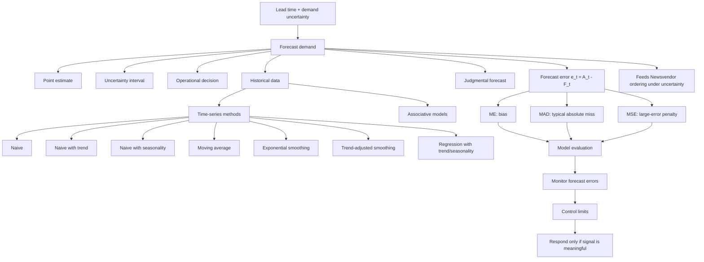

# Topic 02: Forecasting

Source files:

- `supply-chain-management/raw/TUM_PL_2026_02_Forecasting.pdf`
- `supply-chain-management/raw/1.PL-Forecasting-Exercise.xlsx`
- `supply-chain-management/raw/1.PL-Forecasting-Solutions.xlsx`

Course: Supply Chain Management
Processed: 2026-05-14
Wiki note: `supply-chain-management/wiki/topic-02-forecasting/topic-02-forecasting.md`

Course logistics checked: the SCM exam is closed-book, includes numerical/open-ended questions, allows a one-sided handwritten A4 cheat sheet, and may include any lecture/Moodle content. Forecasting formulas and model-selection logic are therefore high-priority cheat-sheet candidates.

## 80/20 Exam Summary

Forecasting is about converting historical demand and judgment into a usable estimate of future demand, then checking whether the forecast is accurate enough for operational decisions.

High-yield points:

- Forecasting exists because supply decisions must often be made before demand is known.
- A forecast can be a point estimate plus uncertainty interval, not just one number.
- Forecast errors are `e_t = A_t - F_t`.
- `ME` measures bias, `MAD` measures average absolute error, and `MSE` heavily penalizes large errors.
- Time-series methods differ in what pattern they assume: level, trend, seasonality, smoothing, regression.
- Model selection is empirical: compare MAD/MSE on comparable periods.
- Monitoring forecasts requires control limits and action only when errors indicate a meaningful change.
- Forecasting feeds directly into Newsvendor: forecast mean and forecast-error uncertainty become ordering decisions under uncertain demand.

## Core Concepts

### Why Forecasting Matters

Production and logistics must match supply and demand despite lead time and demand uncertainty. If you order, produce, or staff too early, you must rely on a forecast. A forecast is useful only if it supports a decision.

Real examples:

- A retailer forecasts weekly demand before ordering inventory.
- A manufacturer forecasts component demand before supplier lead time expires.
- A logistics provider forecasts parcel volume before scheduling drivers.

### Elements Of A Good Forecast

A good forecast should be:

- timely
- accurate
- reliable
- in meaningful units
- written down
- simple to understand and use
- cost-effective

Exam trap: the "best" forecast is not necessarily the most complex. It must be useful for the decision and worth its cost.

### Forecasting Process

1. Determine the purpose of the forecast.
2. Establish the time horizon.
3. Obtain, clean, and analyze appropriate data.
4. Select a forecasting technique.
5. Make the forecast.

Decision logic: purpose and horizon come before method. A one-week staffing forecast and a five-year capacity forecast should not automatically use the same method.

### Forecasting Approaches

The lecture distinguishes:

- time series: use past values of the variable itself
- associative models: use explanatory variables
- judgmental forecasts: use expert or managerial judgment

### Point Estimate And Confidence Interval

A forecast may include:

- point estimate: the expected value
- confidence or uncertainty interval: range around the estimate

This matters because operations decisions often depend on risk. A forecast of 1,000 with low uncertainty is different from 1,000 with high uncertainty.

## Forecast Errors And Evaluation Metrics

Definitions:

- `A_t`: actual observation in period `t`
- `F_t`: forecast for period `t`
- `e_t = A_t - F_t`: forecast error

### Mean Error

```text
ME = (1/T) * sum(e_t)
```

Interpretation:

- positive ME: actuals tend to exceed forecasts, underforecasting bias
- negative ME: forecasts tend to exceed actuals, overforecasting bias
- near zero ME does not imply accuracy, because positive and negative errors can cancel

### Mean Absolute Deviation

```text
MAD = (1/T) * sum(|e_t|)
```

Interpretation:

- average absolute size of error
- easy to interpret in original units
- less sensitive to very large errors than MSE

### Mean Squared Error

```text
MSE = (1/T) * sum(e_t^2)
```

Interpretation:

- penalizes large errors more heavily
- useful when large misses are especially costly
- less intuitive because units are squared

Cheat-sheet candidate:

```text
ME = bias.
MAD = typical absolute miss.
MSE = large-error penalty.
```

## Time-Series Forecasting Methods

### Naive Forecast

Tomorrow is the same as today:

```text
F_t = A_{t-1}
```

Use when demand is stable and simple benchmark is needed.

### Naive Forecast With Trend

Same trend as last period:

```text
F_t = A_{t-1} + (A_{t-1} - A_{t-2})
```

Starts at period 3.

This can overshoot if recent changes are noisy rather than true trend.

### Naive Forecast With Seasonality

Same as last same season:

```text
F_t = A_{t-n}
```

Starts at period `n + 1`, where `n` is the season length.

Use when seasonal pattern dominates.

### Moving Average

Average of the last `n` periods:

```text
F_t = (1/n) * sum(A_tau) for tau = t-n to t-1
```

Use when smoothing noise around a relatively stable level. Larger `n` gives smoother but slower response.

### Exponential Smoothing

```text
F_t = F_{t-1} + alpha * (A_{t-1} - F_{t-1})
```

Equivalent intuition: update the old forecast by a fraction of the last error.

- high `alpha`: reacts quickly, noisier
- low `alpha`: reacts slowly, smoother

### Trend-Adjusted Exponential Smoothing

The lecture uses:

```text
TAF_t = S_{t-1} + T_{t-1}
S_t = TAF_t + alpha * (A_t - TAF_t)
T_t = T_{t-1} + beta * (TAF_t - TAF_{t-1} - T_{t-1})
```

Purpose: separately track level and trend.

### Regression With Trend And Seasonality

The lecture model:

```text
Y_t = beta_0 + beta_1 * t
      + delta_1 * Season1
      + delta_2 * Season2
      + delta_3 * Season3
      + delta_4 * Season4
```

Use when data has trend plus seasonality. In the lecture example, regression had the lowest MAD and MSE among the compared methods.

## Exercise Findings

The Forecasting exercise asks students to apply multiple methods to monthly demand data from 2023-2025, compare MAD/MSE, choose a method, forecast 2026-2027, and monitor errors with control limits.

Methods included:

- Naive
- Naive with trend
- Naive with seasonality
- Moving average
- Exponential smoothing
- Linear regression

Solution comparison from the workbook, comparing January 2024 to December 2025:

| Method | MAD | MSE |
|---|---:|---:|
| Naive | 2.96 | 14.29 |
| Naive with trend | 4.13 | 25.29 |
| Naive with seasonality | 6.33 | 50.25 |
| Moving average | 3.96 | 23.17 |
| Exponential smoothing | 3.44 | 18.27 |
| Linear regression | 3.93 | 22.56 |

Based on this solution table, naive forecasting has the lowest MAD and MSE for the comparable exercise period.

Important nuance: in the lecture example, regression performed best because the synthetic data contained clear trend and seasonality. In the exercise dataset, naive performed best over the specified comparison window. The right method depends on the data pattern and evaluation period.

### Forecast Monitoring From Exercise

The solution workbook uses a 95% control limit with `z = 1.96`.

Two variants appear:

Assuming mean error is zero:

```text
MSE = 14.43
RMSE = 3.80
UCL = 1.96 * RMSE = 7.45
LCL = -1.96 * RMSE = -7.45
```

Using sample mean error:

```text
sample mean error = 0.60
sample standard deviation = 3.75
UCL = 7.95
LCL = -6.75
```

Exam interpretation: if errors stay inside control limits, do not overreact. If errors break limits or show systematic pattern, investigate and update the forecasting process.

## Visual Knowledge Map



## Subject Knowledge Graph

| Node | Meaning | Exam Relevance |
|---|---|---|
| Forecast | Estimate of future demand | Foundation for supply-demand matching |
| Forecast Error | `A_t - F_t` | Basis of evaluation |
| ME | Average signed error | Bias metric |
| MAD | Average absolute error | Common model-selection metric |
| MSE | Average squared error | Penalizes large errors |
| Naive Forecast | Last actual equals next forecast | Simple benchmark |
| Moving Average | Average of recent actuals | Smoothing method |
| Exponential Smoothing | Updates forecast by alpha times last error | High-probability formula |
| Regression | Uses trend and seasonal variables | Captures systematic patterns |
| Control Limits | Thresholds for forecast-error monitoring | Determines when to react |

| From | Relationship | To | Why It Matters |
|---|---|---|---|
| Demand Uncertainty | requires | Forecasting | Supply decisions precede demand realization |
| Forecast Error | is measured by | ME / MAD / MSE | Evaluation drives model selection |
| MAD | supports | Comparable method ranking | Easy to interpret |
| MSE | penalizes | Large misses | Important when large errors are costly |
| Forecasting | feeds | Newsvendor Model | Mean and uncertainty drive order quantity |
| Control Limits | prevent | Overreaction to noise | Only meaningful signals should trigger action |

## Exam Relevance

Likely exam prompts:

- Calculate `e_t`, ME, MAD, or MSE from a small table.
- Choose a forecasting method based on MAD/MSE.
- Explain why ME alone is insufficient.
- Calculate a naive, seasonal naive, moving average, or exponential smoothing forecast.
- Interpret alpha in exponential smoothing.
- Explain how control limits are used to monitor forecasts.
- Identify which method fits level/trend/seasonality.

Common traps:

- Confusing actual-minus-forecast with forecast-minus-actual.
- Using ME as if it measured accuracy rather than bias.
- Comparing MAD/MSE over different time windows.
- Forgetting that MSE is in squared units.
- Overreacting to normal forecast noise.
- Choosing the most complex method without checking performance.

## Cheat-Sheet Candidates

```text
e_t = A_t - F_t
ME = average(e_t)
MAD = average(|e_t|)
MSE = average(e_t^2)
Naive: F_t = A_{t-1}
Naive trend: F_t = A_{t-1} + (A_{t-1} - A_{t-2})
Seasonal naive: F_t = A_{t-n}
Moving average: F_t = average(last n actuals)
Exp smoothing: F_t = F_{t-1} + alpha(A_{t-1} - F_{t-1})
95% control limit: mean error +/- 1.96 * error standard deviation/RMSE
```

## Retrieval Prompts

1. Why does forecasting matter in supply chain management?
2. What is the difference between point estimate and confidence interval?
3. What does ME measure that MAD does not?
4. Why does MSE punish large misses more strongly than MAD?
5. When would seasonal naive be more appropriate than simple naive?
6. What does a higher alpha do in exponential smoothing?
7. Why should control limits stop managers from overreacting?
8. In the exercise solution, which method performed best over Jan 2024-Dec 2025?

## Practice Tasks

### Task 1: Error Metrics

Actual demand is 100, 120, 110. Forecast is 90, 130, 100. Compute errors, ME, MAD, and MSE.

Short answer guide:

```text
errors = 10, -10, 10
ME = 3.33
MAD = 10
MSE = 100
```

### Task 2: Exponential Smoothing

If `F_t = 100`, `A_t = 120`, and `alpha = 0.5`, what is the next forecast?

Short answer guide:

```text
F_{t+1} = 100 + 0.5 * (120 - 100) = 110
```

### Task 3: Control Limits

If RMSE is 4 and mean error is 0, what are approximate 95% control limits?

Short answer guide:

```text
UCL = 1.96 * 4 = 7.84
LCL = -7.84
```

## Connections

Previous SCM notes:

- None yet.

Next SCM topic:

- Newsvendor uses forecasted demand distribution and forecast-error uncertainty to decide order quantity under underage/overage cost tradeoffs.

## Weakness Flags

- Pending active-recall session.

## Open Uncertainties

- The workbook contains images/charts that were not reproduced as images in this note. The formulas, metrics, and solution logic were extracted and preserved.

