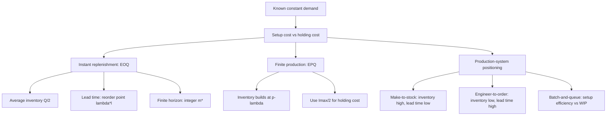

# Ubiquitous Language: Topic 05 EOQ, Production Systems, And Batching

Source note: `topic-05-eoq-production-systems-batching.md`
Course: Supply Chain Management
Definition sources: local topic note, Topic 05 slides, EOQ and EPQ exercise workbooks, EOQ answer key; enriched with standard operations-management terminology where needed.

This file is a standalone terminology, formula, and notation companion. Use it to keep EOQ, EPQ, production-system, and batching language precise in exam answers.

## Model Selection Language

| Term | Definition | Aliases to avoid |
|---|---|---|
| **Deterministic Demand** | Demand is known, constant, and represented by a fixed rate `lambda` over time. Use EOQ/EPQ only when this assumption is given or defensible. | uncertain demand, forecast error |
| **Recurring Replenishment Decision** | A repeated ordering or production decision over time, not a one-time stocking choice. | one-shot order, Newsvendor case |
| **Single-Period Uncertain Decision** | A one-time order before random demand is known, usually handled by Newsvendor. | EOQ problem |
| **Model Router** | The short exam step where you identify the fact pattern before choosing EOQ, finite-horizon EOQ, EPQ, or a stochastic model. | formula guessing |

## EOQ Formula Language

| Term | Definition | Aliases to avoid |
|---|---|---|
| **Economic Order Quantity (EOQ)** | The order quantity `Q*` that minimizes annual setup/order plus holding cost under known constant demand and instantaneous replenishment. | average demand, reorder point |
| **Demand Rate (`lambda`)** | The number of units demanded per time period, usually units/year in this topic. It must use the same time unit as `h` and `K lambda/Q`. | sales without time unit, probability |
| **Setup Cost / Order Cost (`K`)** | Fixed cost incurred once per order or setup, independent of the order size. | unit cost, purchase price |
| **Holding Cost (`h`)** | Cost of carrying one unit in inventory for one time period, usually EUR/unit/year. | total inventory cost, setup cost |
| **Order Quantity (`Q`)** | Units ordered or produced each cycle. In EOQ the inventory peak equals `Q`; in EPQ it does not. | demand, reorder level |
| **Average Inventory (`Q/2`)** | Mean inventory level in the basic EOQ sawtooth, because inventory falls linearly from `Q` to zero. | maximum inventory |
| **Order Frequency (`N = lambda/Q`)** | Number of orders per year. It rises when `Q` is smaller. | cycle time |
| **Cycle Length (`T = Q/lambda`)** | Time between consecutive order arrivals in the deterministic EOQ cycle. | throughput time |
| **Total Annual Cost (`TC(Q)`)** | Annual holding cost plus annual setup/order cost: `hQ/2 + K lambda/Q`. | purchase cost, revenue |

## Timing And Horizon Language

| Term | Definition | Aliases to avoid |
|---|---|---|
| **Initial Inventory (`I0`)** | Inventory available at time zero. Under deterministic EOQ it delays the first order. | safety stock |
| **Lead Time (`l`)** | Time between placing an order and its arrival. Under deterministic EOQ it affects reorder timing. | cycle length |
| **Reorder Point (`lambda l`)** | Inventory level at which to place an order so it arrives when inventory reaches zero. | EOQ, order quantity |
| **First-Order Timing** | When to place the first order given current inventory and lead time. With lead time, use `(I0/lambda) - l` if units are consistent. | first cycle length only |
| **Finite Planning Horizon (`t`)** | A limited selling or planning interval, such as a season. | infinite EOQ |
| **Continuous Order Count (`m_hat`)** | The non-integer cost-minimizing number of orders before rounding: `t sqrt(h lambda/(2K))`. | final order count |
| **Integer Order Count (`m*`)** | The feasible number of orders, found by testing `floor(m_hat)` and `ceil(m_hat)`. | rounded EOQ |

## EPQ Formula Language

| Term | Definition | Aliases to avoid |
|---|---|---|
| **Economic Production Quantity (EPQ)** | The optimal production batch size when production is finite and demand continues while production runs. | EOQ without changes |
| **Production Rate (`p`)** | Units produced per time period. EPQ requires `p > lambda`. | capacity without time unit |
| **Net Build Rate (`p - lambda`)** | Rate at which inventory increases during production because demand is simultaneously consuming output. | production rate |
| **Production-Run Duration (`T0 = Q/p`)** | Time spent producing one batch. | cycle length |
| **Maximum Inventory (`Imax`)** | EPQ inventory peak: `((p - lambda)/p)Q`. It is lower than `Q` because demand occurs during production. | batch size |
| **EPQ Average Inventory (`Imax/2`)** | Mean inventory in EPQ. Use this in holding cost, not `Q/2`. | EOQ average inventory |
| **Non-Production Duration** | Part of the EPQ cycle after production stops and inventory is only consumed by demand. | downtime only |

## Production-System Language

| Term | Definition | Aliases to avoid |
|---|---|---|
| **Customer-Order Decoupling Point** | Boundary where operations switch from forecast-driven push to customer-order-driven pull. | bottleneck |
| **Make-To-Stock (MTS)** | Finished goods are produced before orders; low customer lead time but high inventory investment. | make-to-order |
| **Assemble-To-Order (ATO)** | Components are stocked and final assembly starts after order; balances variety and lead time. | engineer-to-order |
| **Make-To-Order (MTO)** | Production starts after a customer order; lower finished-goods inventory but longer customer lead time. | zero inventory |
| **Engineer-To-Order (ETO)** | Product design/engineering starts after order; highest customization and longest lead time. | make-to-stock |
| **Push Production** | Production triggered by forecast or plan before actual customer order. | pull |
| **Pull Production** | Production triggered by actual demand/order signal. | push |

## Batching And Flow Language

| Term | Definition | Aliases to avoid |
|---|---|---|
| **Batch-And-Queue** | Producing in batches and letting work wait between process steps or work centers. | lean flow |
| **Setup Frequency** | Number of setups per period. Larger batches reduce setup frequency. | setup cost |
| **Work-In-Process (WIP)** | Units started but not yet completed; often grows under batch-and-queue systems. | finished-goods inventory |
| **Job Shop / Work-Center Layout** | Similar machines are grouped into departments; jobs may require different routes and setups between batches. | flow shop |
| **Local Efficiency** | Utilization or productivity at one resource, which may conflict with system-wide flow. | total system performance |

## Relationships Between Canonical Terms

- **EOQ** balances **setup/order cost** and **holding cost** under **deterministic demand**.
- **Reorder point** uses **lead time** and **demand rate**; it is not an order quantity.
- **Finite planning horizon** changes the problem from choosing only `Q` to choosing an **integer order count**.
- **EPQ** modifies **EOQ** because **production rate** is finite, creating **net build rate** and **maximum inventory**.
- **Customer-order decoupling point** explains why **make-to-stock** has low customer lead time and high inventory investment, while **engineer-to-order** has the opposite profile.
- **Batch-and-queue** reduces **setup frequency** but increases **WIP** and waiting risk.

## Clarification Language: How The Models Diverge

| Canonical distinction | Precise interpretation |
|---|---|
| **Forecasting versus EOQ** | Forecasting estimates the current demand rate; EOQ uses that rate to choose a recurring lot size. If the forecast is refitted, recalculate EOQ. |
| **Newsvendor versus EOQ** | Newsvendor controls one-time mismatch risk under uncertain demand; EOQ controls recurring ordering and holding costs under stable demand. |
| **EOQ plus uncertainty** | Use EOQ for how much and reorder point plus safety stock for when and for lead-time protection. Do not automatically insert Newsvendor. |
| **Constant demand** | A local planning assumption for the current horizon, not a claim that real demand can never change. |
| **Initial inventory** | Changes first-order timing, not the normal recurring batch size. |
| **Lead time** | Changes reorder timing through `lambda l`, not basic deterministic `Q*`. |
| **Finite horizon** | Changes the feasible number of orders because order count must be an integer. |
| **Finite production** | Changes the inventory path because units arrive gradually while demand continues; use EPQ. |

## Analogy Set

| Concept | Analogy |
|---|---|
| **Basic EOQ** | Choose the best size for regular supermarket trips: large trips reduce travel frequency but increase storage. |
| **Initial inventory** | Groceries already at home delay the next trip. |
| **Lead time** | Reorder medicine early enough for delivery before the current supply is exhausted. |
| **Finite horizon** | A ten-day holiday permits only a whole number of shopping trips. |
| **EPQ** | A bathtub fills while the drain remains open; inventory rises at inflow minus outflow. |

## Formula Cheat Sheet

| Decision | Formula | Unit Check |
|---|---|---|
| EOQ | `Q* = sqrt(2K lambda / h)` | `lambda` and `h` must share the same time basis. |
| EOQ annual cost | `TC(Q) = hQ/2 + K lambda/Q` | annual cost if `h` is per year and `lambda` is per year |
| Orders per year | `N = lambda/Q` | orders/year |
| Cycle length | `T = Q/lambda` | years or converted weeks |
| Reorder point | `lambda l` | units consumed during lead time |
| First order with initial inventory and lead time | `(I0/lambda) - l` | time until order placement |
| Finite-horizon continuous orders | `m_hat = t sqrt(h lambda/(2K))` | non-integer starting point |
| Finite-horizon order quantity | `Q* = t lambda / m*` | units/order |
| EPQ | `Q* = sqrt(2K lambda / h) * sqrt(p/(p-lambda))` | requires `p > lambda` |
| EPQ maximum inventory | `Imax = ((p-lambda)/p)Q` | units |
| EPQ production run | `T0 = Q/p` | time |

## Visual Memory Aid



## Example Dialogue

> **Student:** "The supplier has a two-week lead time. Should I change the EOQ?"
>
> **Professor:** "Not under deterministic demand and no shortages. Keep **EOQ** for `Q*`, then use **reorder point** `lambda l` for timing."
>
> **Student:** "For EPQ, can I use `Q/2` as average inventory?"
>
> **Professor:** "No. In **EPQ**, production is finite and demand consumes units during the run, so holding cost uses **maximum inventory** `Imax`, then `Imax/2`."

## Flagged Ambiguities

| Ambiguous Phrase | Canonical Recommendation |
|---|---|
| "Demand" | State whether it is deterministic `lambda` or random demand `D`. |
| "Optimal quantity" | Specify EOQ `Q*`, EPQ batch `Q*`, Newsvendor `Q*`, or finite-horizon `Q*`. |
| "Lead time changes inventory" | Say lead time changes **when to order** through **reorder point**. |
| "Production capacity" | Use **production rate `p`** when applying EPQ formulas. |
| "Batching improves efficiency" | Add the system-level cost: more WIP, waiting, and lead-time risk. |
| "Make-to-order has no inventory" | Correct to: lower finished-goods inventory, but possible raw-material and WIP inventory. |

## Exam Trap Corrections

| Trap | Correction |
|---|---|
| Mixing time units. | Convert weeks/months/years before substituting into formulas. |
| Using EOQ for uncertain single-period demand. | Use Newsvendor when demand is random and the order is one-shot. |
| Changing `Q*` because lead time exists. | Under deterministic EOQ, lead time changes `lambda l`, not `Q*`. |
| Treating `m_hat` as feasible. | Test `floor(m_hat)` and `ceil(m_hat)`. |
| Using `Q/2` in EPQ. | Use `Imax/2`. |
| Forgetting `p > lambda`. | EPQ requires production faster than demand. |

## Compact Answer Language

```text
The operational decision is lot size under known constant demand.
Because replenishment is instantaneous/finite production, use EOQ/EPQ.
Define lambda, K, h, and p with units.
Compute Q*, then interpret setup frequency, average inventory, timing, and cost.
```
