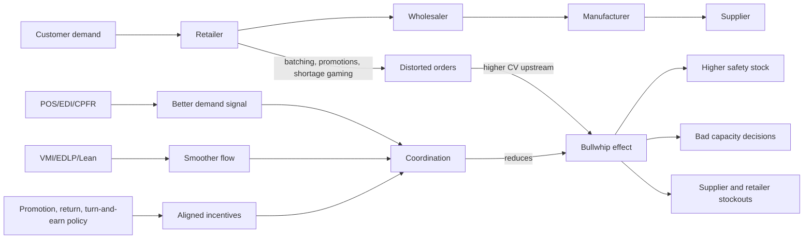

# Ubiquitous Language: Topic 06 Supply Chain Coordination And The Bullwhip Effect

Source note: `topic-06-supply-chain-coordination-bullwhip-effect.md`
Course: Supply Chain Management
Definition sources: local Topic 06 note, supply-chain coordination slides, MCQ deck; enriched with standard operations and supply-chain terminology where needed.

This file is a standalone terminology companion for bullwhip, coordination, information-sharing, incentives, and mitigation language.

## Bullwhip Measurement Language

| Term | Definition | Aliases to avoid |
|---|---|---|
| **Bullwhip Effect** | Amplification of demand/order variability as signals move upstream in a supply chain. In the lecture, it is prevalent when upstream stages have higher coefficient of variation. | demand growth, higher average demand |
| **Upstream Stage** | A supply-chain actor farther from the final customer, such as supplier or manufacturer. | lower stream |
| **Downstream Stage** | A supply-chain actor closer to final customer demand, such as retailer or consumer-facing channel. | upstream |
| **Coefficient Of Variation (CV)** | Standard deviation divided by mean; a normalized variability measure used to compare demand/order variability across stages. | variance only, average demand |
| **Order Volatility** | Fluctuation in orders over time. Bullwhip means this volatility increases upstream. | total order volume |
| **Demand Signal** | Information about what customers actually buy or need. | any order number |
| **Shipment / Production Signal** | What upstream firms ship or produce, which can fluctuate more than final demand. | true demand |

## Cause Language

| Term | Definition | Aliases to avoid |
|---|---|---|
| **Order Synchronization** | Multiple downstream firms place orders at similar times, creating aggregate upstream spikes. | collaboration |
| **Order Batching** | Firms accumulate demand and place larger periodic orders instead of smooth small orders. | EOQ only |
| **Trade Promotion** | Temporary price discount or sales incentive that changes ordering behavior. | everyday price |
| **Forward Buying** | Buying extra during a promotion to cover future demand, creating an order spike now and low orders later. | true demand increase |
| **Shortage Gaming** | Inflating orders during scarcity to receive a larger allocation. | safety stock |
| **Reactive Ordering** | Ordering based on recent observed shortages, delays, or order signals without understanding true demand. | responsive planning |
| **Information Distortion** | Upstream firms see distorted orders rather than final customer demand. | no information |
| **Pathological Incentive** | Incentive that makes local behavior rational but damages system-wide coordination. | bad behavior only |
| **Long Lead Time** | Delay between ordering and receiving, which increases uncertainty and overreaction risk. | cycle time |

## Mitigation Language

| Term | Definition | Aliases to avoid |
|---|---|---|
| **Supply Chain Coordination** | Aligning information, incentives, and product flow across firms to reduce system-level inefficiency. | each firm optimizes alone |
| **POS Data** | Point-of-sale data showing actual customer purchases. | distributor orders |
| **EDI** | Electronic data interchange; structured electronic exchange of business documents and order information. | email only |
| **CPFR** | Collaborative planning, forecasting, and replenishment; partners jointly plan demand and replenishment. | independent forecasting |
| **VMI** | Vendor managed inventory; the supplier manages replenishment based on shared demand/inventory data. | supplier guessing |
| **EDLP** | Everyday low pricing; stable pricing policy that reduces promotion-driven forward buying. | seasonal discount |
| **Lean Management** | Management philosophy centered on value, value stream, flow, pull, and perfection. In this topic it supports smoother product flow. | cost cutting only |
| **Turn-And-Earn Policy** | Allocation or purchasing policy that rewards real sell-through/turnover rather than inflated orders. | order inflation reward |

## Consequence Language

| Term | Definition | Aliases to avoid |
|---|---|---|
| **Suboptimal Capacity Decision** | Capacity is sized to distorted order spikes rather than true demand, creating too much or too little capacity. | high demand only |
| **Capacity Utilization** | Share of available capacity actually used. Bullwhip can lower utilization after overbuilt capacity or demand swings. | capacity |
| **Safety Stock** | Extra inventory held to protect against uncertainty. Bullwhip increases perceived uncertainty and raises safety-stock needs. | cycle stock |
| **Supplier Stockout** | Upstream supplier lacks inventory/capacity, causing downstream shortages. | retailer-only stockout |
| **Upstream Logistics Cost** | Transportation, handling, and shipment cost incurred farther upstream; rises with spikes and emergency flows. | customer delivery only |

## Relationships Between Canonical Terms

- **Bullwhip effect** is about **order volatility** and **coefficient of variation**, not necessarily higher average demand.
- **Order batching** can be locally rational but creates **information distortion** for upstream stages.
- **Trade promotions** create **forward buying**, which makes current orders exceed current consumer demand.
- **Shortage gaming** is an **individual incentive** problem because each buyer overorders to protect allocation.
- **POS data**, **EDI**, and **CPFR** reduce bullwhip by improving the **demand signal**.
- **EDLP**, **VMI**, and **Lean management** reduce bullwhip by smoothing flow and reducing artificial order lumps.
- **Turn-and-earn policies** attack **pathological incentives** by rewarding real sell-through.

## Visual Memory Aid



## Example Dialogue

> **Student:** "Demand went up upstream, so that is bullwhip?"
>
> **Professor:** "Careful. **Bullwhip effect** is about upstream **variability amplification**, often measured through **coefficient of variation**, not simply a higher average."
>
> **Student:** "If retailers batch orders to save shipping costs, is that good?"
>
> **Professor:** "It may be locally rational, but **order batching** can distort the upstream **demand signal**. A coordination answer must state both sides."

## Flagged Ambiguities

| Ambiguous Phrase | Canonical Recommendation |
|---|---|
| "Demand increases upstream" | Say **order variability increases upstream**. |
| "Better forecasting fixes it" | Specify **POS data**, **EDI**, **CPFR**, or another demand-signal mechanism. |
| "Discounts are always good" | Mention **forward buying** and order spikes. |
| "Batching is efficient" | Add the bullwhip risk from lumpy orders. |
| "Lean means low inventory" | In this topic, use Lean as **value, value stream, flow, pull, perfection** to smooth product flow. |
| "Shortage gaming is safety stock" | Correct: it is inflated ordering during scarcity to influence allocation. |

## Exam Trap Corrections

| Trap | Correction |
|---|---|
| Calling EDLP a bullwhip cause. | EDLP is a mitigation against promotion-driven spikes. |
| Saying bullwhip only exists in the Beer Game. | The Beer Game illustrates it; empirical evidence compares real demand and shipments/production. |
| Ignoring lead time. | Longer lead times amplify uncertainty and overreaction. |
| Treating retailer orders as true demand. | Upstream firms need POS or shared demand data to separate orders from demand. |
| Listing causes without mechanisms. | Explain how the cause distorts information or incentives. |

## Compact Answer Language

```text
Bullwhip means order variability amplifies upstream.
The cause here is [batching/promotion/shortage gaming/long lead time/etc.].
It distorts the demand signal because [mechanism].
Consequences include inventory, capacity, logistics, and stockout costs.
Mitigate by aligning information, incentives, and product flow.
```
