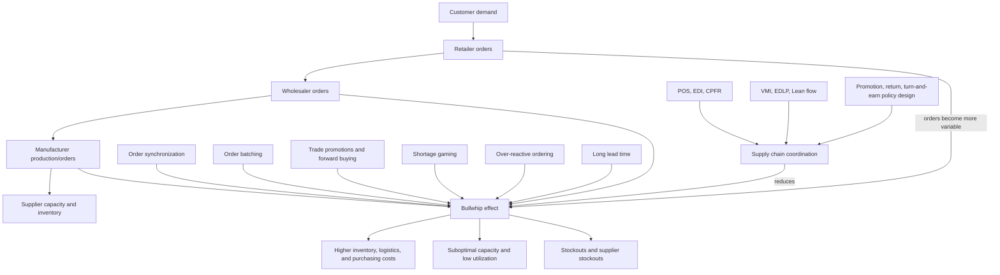

# Topic 06: Supply Chain Coordination And The Bullwhip Effect

Source files:

- `supply-chain-management/raw/moodle-export-operations-950888956-s26-20260604/06 Supply Chain Coordination  Beer Game/Slides SC Coordination.pdf`
- `supply-chain-management/raw/moodle-export-operations-950888956-s26-20260604/06 Supply Chain Coordination  Beer Game/Exercise SC Coordination MCQs.pptx`

Course: Supply Chain Management
Processed: 2026-06-04
Wiki note: `supply-chain-management/wiki/topic-06-supply-chain-coordination-bullwhip-effect/topic-06-supply-chain-coordination-bullwhip-effect.md`

Course logistics checked: the SCM exam may include numerical/open-ended tasks and multiple-selection questions. Topic 06 is more conceptual than formula-heavy, but the MCQ deck makes cause/effect/mitigation distinctions high-yield.

## 80/20 Exam Summary

The bullwhip effect is demand or order variability amplification upstream in a supply chain.

Lecture definition:

```text
The bullwhip effect is prevalent if the coefficient of variation of demand is higher at upstream stages of a supply chain.
```

Managerial translation:

```text
Small customer-demand movements can become much larger supplier orders, production swings, capacity mistakes, and inventory costs upstream.
```

The exam-relevant chain is:

```text
local decisions + distorted information + misaligned incentives
-> amplified order variability upstream
-> worse capacity, inventory, service, and logistics performance
-> coordination mechanisms reduce amplification
```

Core causes:

- order synchronization
- order batching
- trade promotions and forward buying
- shortage gaming
- reactive and over-reactive ordering
- longer lead times and uncertainty
- behavioral factors, individual incentives, and information distortion

Core mitigation levers:

- share information: POS, EDI, CPFR
- smooth product flow: VMI, EDLP, Lean principles
- eliminate pathological incentives: coordinate promotions, restructure returns, use turn-and-earn policies

## Where This Fits In SCM

Earlier topics often assume one decision-maker has the right demand signal:

- [Topic 02 Forecasting](../topic-02-forecasting/topic-02-forecasting.md): estimate demand.
- [Topic 04 Random Variables](../topic-04-modeling-uncertain-demand-random-variables/topic-04-modeling-uncertain-demand-random-variables.md): model demand uncertainty.
- [Topic 05 EOQ/EPQ](../topic-05-eoq-production-systems-batching/topic-05-eoq-production-systems-batching.md): order or produce efficiently under deterministic demand.

Topic 06 adds the supply-chain coordination problem:

```text
Even if final customer demand is stable, each stage may see distorted orders from the next downstream stage.
```

That is why a supplier can face high order volatility even when consumer demand is not highly volatile.

## Core Concepts

### Bullwhip Effect

The bullwhip effect is the amplification of demand/order variability as information moves upstream from customer to retailer, wholesaler, distributor, manufacturer, and supplier.

The slide definition focuses on coefficient of variation:

```text
CV = standard deviation / mean
```

If upstream orders or shipments have a higher CV than downstream demand, the supply chain is exhibiting bullwhip.

Empirical-evidence slides compare demand with shipments or production. The exam-relevant takeaway is not the exact chart values; it is the pattern:

```text
shipment/production signals fluctuate more than the underlying demand signal.
```

### Consequences

The lecture lists these problems:

- suboptimal capacity decisions
- too frequent stockouts
- too low capacity utilization
- increased safety stocks
- increased upstream logistics costs, leading to higher purchasing costs
- supplier stockouts that create downstream stockouts

Managerial interpretation:

```text
Bullwhip makes firms pay for capacity and inventory that do not match true consumer demand.
```

It creates both shortage and excess problems: too little product in some periods, too much inventory or unused capacity in others.

## Causes Of The Bullwhip Effect

### Order Synchronization

When multiple retailers order at the same time, their orders synchronize into upstream spikes.

Visual intuition from the slide:

- each retailer has relatively small order movements
- the wholesaler sees an aggregated pattern with larger peaks

Exam wording:

```text
Order synchronization converts dispersed downstream orders into lumpy upstream demand.
```

### Order Batching

Order batching means firms wait and order in larger batches instead of ordering every unit immediately.

The slide contrasts:

- no batching: order amount stays closer to demand
- batching with batch size 15: orders become large spikes and zeros

Managerial reason:

- batching may reduce fixed order/setup/transportation cost
- batching increases variability seen by upstream stages

Connection to Topic 05:

```text
EOQ-style batching can be locally cost-efficient but can amplify upstream variability if every stage batches independently.
```

### Trade Promotions And Forward Buying

Trade promotions temporarily lower price. Buyers respond by buying ahead of real demand.

Visual intuition:

- constant price: order roughly follows demand
- discount in period 2: huge order spike in period 2, then near-zero orders later

Exam wording:

```text
Forward buying shifts future orders into the promotion period, so orders no longer represent current consumer demand.
```

### Shortage Gaming

Shortage gaming occurs when buyers inflate orders during scarcity because they expect rationing.

Example:

```text
If a retailer needs 100 units but expects to receive only 50% of the order, it may order 200.
```

This makes upstream demand look much larger than actual downstream need.

### Reactive And Over-Reactive Ordering

Firms often react to observed orders rather than true point-of-sale demand. If they overcorrect after shortages, delays, or forecast misses, variability becomes amplified.

This is especially severe when lead times are long, because decision-makers respond to stale information.

### Cause Categories

The lecture groups causes into:

- behavioral factors
- individual incentives
- information distortion

High-scoring answers connect individual examples to these categories:

| Example Cause | Category Logic |
|---|---|
| Retailers inflate orders in shortage | individual incentives |
| Firms see orders instead of POS demand | information distortion |
| Managers panic-order after a shortage | behavioral factor |
| Promotions encourage forward buying | individual incentives plus distorted signal |

## Mitigating The Bullwhip Effect

### Sharing Information

The slides list:

- POS: point-of-sale data
- EDI: electronic data interchange
- CPFR: collaborative planning, forecasting, and replenishment

Mechanism:

```text
Upstream firms see closer-to-real demand instead of only distorted downstream orders.
```

### Smooth Product Flow

The slides list:

- VMI: vendor managed inventory
- EDLP: everyday low pricing
- Lean Management

Lean principles named in the slide:

- value
- value stream
- flow
- pull
- perfection

Mechanism:

```text
Reduce artificial lumps, stabilize replenishment, and trigger activity from real demand where possible.
```

### Eliminate Pathological Incentives

The slides list:

- coordinate sales promotions
- restructure return policies
- turn-and-earn policies

Mechanism:

```text
Stop rewarding behavior that makes private local sense but damages the supply chain signal.
```

## MCQ Answer Guide

The MCQ deck does not mark answers, but the lecture content implies the following high-yield answer logic.

| MCQ Topic | Correct Exam Logic |
|---|---|
| Bullwhip truth statement | Bullwhip can increase inventory-related supply-chain costs. |
| Upstream order quantities | Order volatility increases from customers toward suppliers. |
| NOT a bullwhip cause | Everyday low pricing is a mitigation lever, not a cause. |
| Bullwhip problem | Suboptimal capacity decisions. |
| Lead-time role | Longer lead times amplify uncertainty and bullwhip. |
| Empirical evidence | Compare demand with shipments/production. |
| Shortage gaming | Buyers overorder during scarcity to receive a larger allocation. |
| Coordination logic | Align information, incentives, and product flow to reduce demand amplification. |

## Diagrams, Tables, And Visuals

### Empirical Evidence Charts

The empirical slides compare demand with shipments or production. The key visual lesson is the mismatch between the end-demand signal and the upstream operational signal. Bullwhip is a variability ratio, not a statement that average demand necessarily rises.

### Order Synchronization Chart

Three retailers may each show moderate variation, but synchronized ordering makes the wholesaler's aggregate order pattern spike. The upstream stage sees lumpy demand caused by timing, not by actual consumer demand changes.

### Order Batching Chart

Without batching, orders are smoother. With batch size 15, the order series becomes spikes followed by zeros. This is the clearest visual bridge from Topic 05 batching to Topic 06 coordination.

### Promotion And Forward-Buying Chart

The discount period creates a large order spike followed by no orders. The supplier may misread this as real demand unless it knows the promotion/inventory context.

## Visual Knowledge Map



## Subject Knowledge Graph

| Node | Meaning | Exam Relevance |
|---|---|---|
| Bullwhip Effect | Upstream amplification of demand/order variability | Central concept of Topic 06. |
| Coefficient Of Variation | Standard deviation divided by mean | Used in the lecture definition of bullwhip prevalence. |
| Order Synchronization | Multiple downstream actors ordering in the same periods | Creates aggregate upstream spikes. |
| Order Batching | Ordering in lumps instead of continuously | Converts smooth demand into volatile orders. |
| Forward Buying | Buying more during promotions than current demand requires | Distorts order signal. |
| Shortage Gaming | Inflating orders during scarcity to influence allocation | Creates artificial demand. |
| Information Distortion | Upstream stages see orders, not true final demand | Root coordination problem. |
| POS | Point-of-sale data | Demand-signal sharing mitigation. |
| EDI | Electronic data interchange | Faster structured information sharing. |
| CPFR | Collaborative planning, forecasting, and replenishment | Joint planning mitigation. |
| VMI | Vendor managed inventory | Supplier manages replenishment with better visibility. |
| EDLP | Everyday low pricing | Reduces promotion-driven order spikes. |
| Lean Management | Value, value stream, flow, pull, perfection | Smooths flow and reduces artificial queues. |
| Pathological Incentives | Rules that reward local behavior damaging the chain | Promotions, returns, allocation, and sales targets can cause bullwhip. |

| From | Relationship | To | Why It Matters |
|---|---|---|---|
| Bullwhip Effect | increases | Safety Stock | Variability creates inventory buffers. |
| Bullwhip Effect | causes | Suboptimal Capacity Decisions | Upstream firms may build wrong capacity. |
| Order Batching | amplifies | Upstream Order Variability | Large batches create spikes and zeros. |
| Trade Promotions | cause | Forward Buying | Temporary discounts shift future orders into one period. |
| Shortage Gaming | inflates | Orders During Scarcity | Orders no longer represent true demand. |
| Information Distortion | prevents | Accurate Forecasting | Upstream stages forecast from bad signals. |
| POS / EDI / CPFR | reduce | Information Distortion | Better visibility lowers amplification. |
| VMI / EDLP / Lean | smooth | Product Flow | Less lumpiness and fewer artificial demand spikes. |
| Incentive Redesign | reduces | Pathological Ordering | Coordination changes behavior. |

## Real Business Examples

- A grocery retailer buys extra detergent during a trade promotion, making the manufacturer believe demand has surged.
- A car-parts supplier receives highly variable weekly orders because dealers batch orders to save transaction costs.
- During a shortage, retailers overorder semiconductors to secure allocation, making the shortage appear larger than real demand.
- A manufacturer using POS data from retailers can distinguish actual consumer purchases from a retailer's temporary inventory build.
- Everyday low pricing can smooth purchases because customers and retailers have less reason to buy ahead.

## Exam Relevance

Likely prompts:

- Define the bullwhip effect using coefficient of variation and upstream amplification.
- Identify a cause from a mini-case.
- Explain why order batching, promotions, or shortage gaming distort the signal.
- Name consequences for capacity, inventory, service, and costs.
- Choose a mitigation lever and explain its mechanism.
- Answer multiple-selection questions distinguishing causes from mitigations.

Common traps:

- Saying bullwhip means "demand increases upstream." The issue is variability, not necessarily average demand.
- Treating everyday low pricing as a cause. It is a mitigation against promotion-driven forward buying.
- Saying the effect exists only in the Beer Game. The Beer Game illustrates it; empirical evidence shows it in real industries.
- Focusing only on inventory and missing capacity, logistics, purchasing, and supplier-stockout consequences.
- Recommending "better forecasting" without specifying information sharing or incentive alignment.

High-scoring answer structure:

1. Define bullwhip as upstream variability amplification.
2. Identify the specific cause in the facts.
3. Explain the signal distortion mechanism.
4. State operational consequences.
5. Propose a coordination lever that attacks the cause.

## Retrieval Prompts

Closed-book questions:

1. Define the bullwhip effect using coefficient of variation.
2. Why does order batching create upstream variability?
3. Why do trade promotions create forward buying?
4. What is shortage gaming?
5. Name three consequences of the bullwhip effect.
6. Distinguish POS, EDI, CPFR, VMI, and EDLP.

Application prompts:

1. A retailer orders triple volume in a discount period and then orders nothing for two periods. Identify the cause and mitigation.
2. A supplier sees large spikes although consumer purchases are stable. Which bullwhip causes could explain this?
3. During scarcity, buyers overorder to improve their allocation. What is the supply-chain coordination problem?
4. A manufacturer only observes distributor orders, not store sales. Which information-sharing mechanisms would help?

## Practice Tasks

1. Mini-case: A wholesaler receives all retailer orders every Friday because retailers synchronize order placement. Explain the bullwhip mechanism and one mitigation.
2. Multiple selection: Which are causes of bullwhip: seasonal discounts, everyday low pricing, inflated orders, long lead time? Explain each.
3. Compare Topic 05 batching with Topic 06 order batching: when is batching locally rational, and why can it damage the chain?
4. Explain how VMI reduces information distortion but may require trust and data-sharing discipline.
5. Write a 5-sentence exam answer for a shortage-gaming case.

## Connections

Previous notes from this lecture:

- [Topic 02 Forecasting](../topic-02-forecasting/topic-02-forecasting.md): bullwhip makes upstream forecasting harder because the observed order signal is distorted.
- [Topic 05 EOQ, Production Systems, And Batching](../topic-05-eoq-production-systems-batching/topic-05-eoq-production-systems-batching.md): batching can be locally cost-efficient but increase upstream variability.

Future related topics from the downloaded Moodle export:

- Topic 10 Multi-Period Inventory Management: likely connects replenishment rules to repeated demand signals.
- Topic 12 Supply Chain Finance and Resilience: bullwhip increases working-capital and resilience problems.
- Topic 13 Lean Management / Lean Simulation: lean flow and pull are listed as bullwhip mitigation mechanisms.

Cross-course links:

- Organization: coordination failures are also incentive and information-design failures.
- Marketing: trade promotions can improve short-term sales but distort supply-chain demand signals.
- Finance: bullwhip ties up working capital in safety stock and wrong capacity.

## Open Uncertainties

- The folder name mentions the Beer Game, but the available slide PDF focuses on supply-chain coordination and bullwhip concepts; the separate MCQ deck provides retrieval questions rather than a full Beer Game rule walkthrough.
- The MCQ deck does not explicitly mark correct answers. The answer guide is inferred from the lecture slides and standard SCM logic.

## Weakness Flags

- Pending active recall: no first-pass retrieval has been completed yet.
- Highest-risk distinctions: cause versus mitigation, variability versus average demand, and local batching logic versus system-wide bullwhip.
