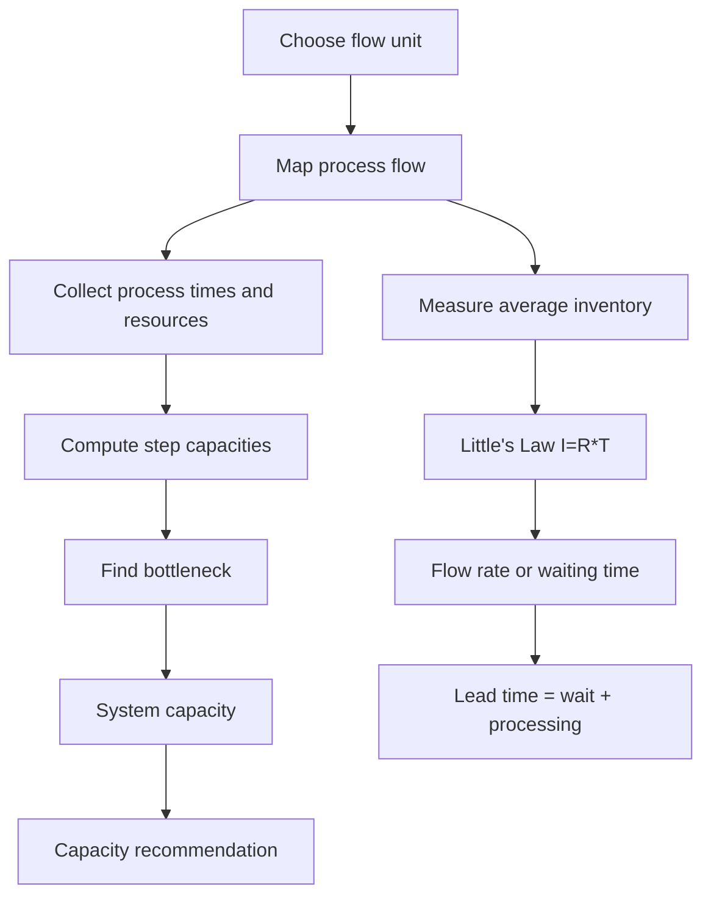

# Ubiquitous Language: Topic 08 OceanCove Process Analysis And Capacity Management

Source note: `topic-08-oceancove-process-analysis-capacity-management.md`
Course: Supply Chain Management
Definition sources: OceanCove slides, capacity-management workbook, answer key; enriched with standard operations-management terminology where needed.

This file is a standalone terminology and formula companion for process analysis, Little's Law, capacity, utilization, bottlenecks, queues, and Gantt charts.

## Process Language

| Term | Definition | Aliases to avoid |
|---|---|---|
| **Flow Unit** | The entity moving through the process, such as a customer, meal, order, ton of iron ore, or project activity. | resource, worker |
| **Process Flow Diagram** | Visual or textual map of activities, queues, decision points, and flows. | org chart |
| **Physical Flow** | Movement of the actual unit, such as food or material. | information flow |
| **Information Flow** | Movement of signals or orders, such as waiter tickets to the kitchen. | physical product |
| **Queue** | Units waiting before being processed. | inventory only |
| **Work-In-Process (WIP)** | Units started but not completed; in service cases, orders/customers waiting or being processed. | finished output |
| **Flow Time** | Average time a flow unit spends in the process. | processing time only |
| **Lead Time** | Time from request/order start to delivery/completion, including waiting and processing. | fastest processing time |

## Capacity Language

| Term | Definition | Aliases to avoid |
|---|---|---|
| **Capacity** | Maximum sustainable output rate of a resource or process under stated assumptions. | demand, inventory |
| **Flow Rate (`R`)** | Average output or throughput per time period. | capacity |
| **Average Inventory (`I`)** | Average number of flow units in the process. | storage only |
| **Bottleneck** | Resource with the smallest required-process capacity; it constrains system output. | slow-looking step |
| **Utilization** | `flow rate / capacity`; the share of capacity being used. | capacity |
| **Parallel Resources** | Multiple identical or substitutable resources performing the same step, increasing capacity. | sequential resources |
| **System Capacity** | Capacity of the entire process, usually the minimum capacity among required steps. | sum of all capacities |
| **Mix Constraint** | Product mix relationship that affects effective capacity, such as grilled fish being twice as popular as fried fish. | average demand |

## Formula Language

| Term | Definition | Aliases to avoid |
|---|---|---|
| **Little's Law** | `I = R * T`; average inventory equals flow rate times flow time. | bottleneck formula |
| **Resource Capacity** | `number of parallel resources / processing time per unit`. | utilization |
| **Waiting Time From Queue** | `average waiting inventory / average flow rate`. | processing time |
| **Capacity Utilization** | `flow rate / capacity`, usually reported as a percentage. | total capacity |
| **Project Duration** | Calendar time from project start to completion, respecting precedence and resource availability. | sum of task durations |

## Project Scheduling Language

| Term | Definition | Aliases to avoid |
|---|---|---|
| **Gantt Chart** | Calendar-based schedule showing when activities occur and which resources are assigned. | process flow diagram |
| **Predecessor Activity** | Activity that must be completed before another starts. | parallel task |
| **Resource Availability** | Calendar weeks or periods when a worker/resource can perform a task. | capacity rate |
| **Renovation On Hold** | A calendar gap where no task progresses despite the project not being complete. | normal waiting inside a process |

## Relationships Between Canonical Terms

- **Flow unit** must be defined before using **Little's Law**.
- **Capacity** is a maximum rate; **flow rate** is the actual or implied rate.
- **Bottleneck** determines **system capacity** only for required process steps.
- **Lead time** includes **queue** time and processing time.
- **Gantt chart** uses **predecessor activity** and **resource availability**, not only task duration.
- **Mix constraint** can turn multiple resource capacities into one effective menu or product capacity.

## Visual Memory Aid



## Example Dialogue

> **Student:** "OceanCove has 160 seats after expansion, so lunch capacity is 213 customers per hour."
>
> **Professor:** "That is dining-area capacity. The **system capacity** at lunch is still constrained by **assembly** at 144 meals/hour unless assembly capacity changes."
>
> **Student:** "So capacity is not the same as demand or seats?"
>
> **Professor:** "Correct. Calculate each required resource, then let the **bottleneck** decide the process capacity."

## Flagged Ambiguities

| Ambiguous Phrase | Canonical Recommendation |
|---|---|
| "Customers in the restaurant" | Use **average inventory** if applying Little's Law. |
| "How fast the restaurant is" | Specify **flow rate**, **capacity**, or **lead time**. |
| "Waiting time" | State whether it is queue waiting or full lead time. |
| "Kitchen capacity" | Specify fish, fries, assembly, expediting, or the minimum of all required steps. |
| "Project takes 12 weeks because the calendar shows 12 weeks" | Use **project duration** from actual start to completion, respecting task timing. |

## Exam Trap Corrections

| Trap | Correction |
|---|---|
| Adding capacities across sequential steps. | The bottleneck, not the sum, determines system capacity. |
| Forgetting parallel resources. | Multiply by the number of parallel resources. |
| Mixing time units. | Convert minutes to hours before calculating customers/hour. |
| Using processing time as lead time. | Add waiting time when the case includes a queue. |
| Ignoring product mix. | Use the mix ratio to compute effective capacity. |
| Treating non-bottleneck expansion as automatically useful. | Check whether the bottleneck changes. |

## Compact Answer Language

```text
Define the flow unit.
Draw the process and identify queues/resources.
Compute each resource capacity in the same time unit.
The bottleneck is the minimum required capacity.
Use Little's Law when inventory, flow time, and flow rate are linked.
Interpret the result as a customer-service and profitability consequence.
```
