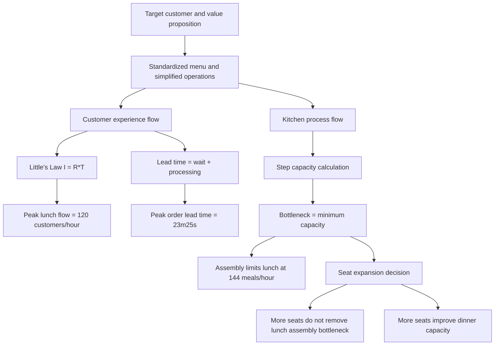

# Topic 08: OceanCove Process Analysis And Capacity Management

Source files:

- `supply-chain-management/raw/moodle-export-operations-950888956-s26-20260604/08 Case Study - OceanCove  Process Analysis/Slides OceanCove.pdf`
- `supply-chain-management/raw/moodle-export-operations-950888956-s26-20260604/08 Case Study - OceanCove  Process Analysis/Exercise Capacity Management.xlsx`
- `supply-chain-management/raw/moodle-export-operations-950888956-s26-20260604/08 Case Study - OceanCove  Process Analysis/Exercise Answer Key.pdf`

Course: Supply Chain Management
Processed: 2026-06-04
Wiki note: `supply-chain-management/wiki/topic-08-oceancove-process-analysis-capacity-management/topic-08-oceancove-process-analysis-capacity-management.md`

Course logistics checked: the SCM exam may include open numerical tasks and multiple-selection questions. Topic 08 is high-yield because it combines case interpretation, process-flow diagrams, Little's Law, bottleneck analysis, capacity utilization, and managerial recommendations.

## 80/20 Exam Summary

Topic 08 teaches how to turn a service operation into a process model.

The high-yield method is:

```text
map the process -> define the flow unit -> calculate flow rate and capacity -> find the bottleneck -> interpret the managerial consequence
```

Core formulas:

```text
Little's Law: I = R * T
Flow rate: R = I / T
Capacity of one resource = number of parallel resources / processing time per unit
Utilization = flow rate / capacity
System capacity = minimum capacity among required resources
```

OceanCove's main quantitative conclusions:

- Peak lunch dining flow: `120 customers/hour`.
- Fish menu capacity under 2:1 grilled-to-fried mix: `270 fish meals/hour`.
- Lunch bottleneck: assembly at `144 meals/hour`.
- Lunch dining-area capacity with 120 seats: `160 customers/hour`.
- Dinner dining-area capacity with 120 seats: `87 customers/hour`.
- Fastest possible grilled fish lead time: `10 minutes 25 seconds`.
- Peak non-rushed grilled order lead time: `23 minutes 25 seconds` because average waiting is `13 minutes`.
- Increasing seats from 120 to 160 raises dining-area capacity, but lunch is still constrained by assembly at `144 meals/hour`.

## Where This Fits In SCM

Earlier SCM topics built models for demand and inventory:

- [Topic 01 Kristen Cookie Case](../topic-01-kristen-cookie-case/topic-01-kristen-cookie-case.md): process flow, bottleneck, cycle time, capacity.
- [Topic 05 EOQ/EPQ](../topic-05-eoq-production-systems-batching/topic-05-eoq-production-systems-batching.md): production capacity and batching under deterministic demand.
- [Topic 06 Bullwhip](../topic-06-supply-chain-coordination-bullwhip-effect/topic-06-supply-chain-coordination-bullwhip-effect.md): coordination and distorted demand signals.

Topic 08 brings the process logic back into a service setting:

```text
Capacity is not "how many seats exist" or "how many customers arrive."
Capacity is the limiting rate of the whole process.
```

## Case Questions From The Deck

The OceanCove case asks the student to:

1. Describe the target market, customer values, internal goals, and operational activities.
2. Draw a customer experience process flow.
3. Draw the kitchen process flow with process times, capacities, and queues.
4. Calculate peak lunch customer flow and order-ticket flow.
5. Calculate step capacities, utilization, bottleneck, and total restaurant capacity.
6. Calculate fastest possible grilled fish lead time.
7. Calculate lead time if the customer arrives at peak and the order is not rushed.
8. Evaluate increasing seats from 120 to 160, opening a new restaurant, and strategic implications.

## OceanCove Value Map

| Layer | Case Content | Exam Interpretation |
|---|---|---|
| Target customer | Young adults, 18 to 30 years old | Price-sensitive but still value food/service quality. |
| Customer values | Good food, low prices, good service, convenience | Operations must support speed, affordability, and repeatable quality. |
| Internal objectives | Consistent food quality, low ingredient/preparation cost, low overhead, high table turnover, fast service, pleasant casual environment, accessible locations | Strategy is operationalized through standardization and high volume. |
| Operations activities | Simplified standardized menus and recipes, fresh basic ingredients, simple cooking methods, simplified kitchen operations, shopping-area sites, coordinated decor, corporate bulk purchasing | The operating system is designed for fast, low-cost, repeatable service. |

Exam trap:

```text
Do not discuss "good service" only as a marketing promise. Link it to process speed, queue control, and table turnover.
```

## Customer Experience Process Flow

Lunch customer flow:

```text
Enter restaurant
-> if dining area full: enter bar area and order drinks
-> enter dining area
-> order meal
-> eat appetizers
-> eat main dish
-> optionally order and eat dessert
-> pay bill
-> depart
```

Key target times in the slide:

- order meal: `3 minutes`
- appetizer target: `5 minutes`
- main-dish target: `7-8 minutes`
- dessert target: `5 minutes`
- pay bill: `3 minutes`
- main-dish eating time: `20-30 minutes`
- appetizer/dessert eating time: `8-12 minutes`

## Kitchen Process Flow

Kitchen operations contain parallel cooking resources and final assembly.

```text
Waiter order ticket
-> expeditor
-> fish frying / fish grilling / french-fry frying / vegetarian-sides-dessert stream
-> assembly
-> waiter delivery
```

Important kitchen data:

| Resource | Slide Data | Capacity Logic |
|---|---:|---|
| Fish frying | 1 fryer, 4 minutes, max 6 pieces | `6 * 60/4 = 90 fish/hour` |
| Fish grilling | 4 minutes, max 20 pieces | `20 * 60/4 = 300 fish/hour` |
| French-fry frying | 2 fryers, 200 portions/hour each | `400 portions/hour` |
| Assembly | 25 seconds/meal | `60 / (25/60) = 144 meals/hour` |
| Waiters | 6 waiters, 6 minutes per table for order/delivery/billing | `60 tables/hour`, about `180 customers/hour` if 3 customers/table |
| Lunch dining area | 120 seats, 45-minute stay | `120 / 0.75 = 160 customers/hour` |
| Dinner dining area | 120 seats, 82.5-minute stay | `120 / (82.5/60) = 87 customers/hour` |

## Little's Law In OceanCove

Little's Law:

```text
Average inventory = Average flow time * Average flow rate
I = R * T
```

At peak lunch:

```text
Average inventory = 30 tables * 3 customers/table = 90 customers
Average flow time = 45 minutes = 0.75 hours
Flow rate = 90 / 0.75 = 120 customers/hour
```

Interpretation:

```text
OceanCove's observed number of customers in the dining process and their average stay imply the actual peak flow rate.
```

## Bottleneck And Capacity Analysis

The restaurant's capacity is the minimum of:

```text
kitchen capacity, waiter capacity, table capacity
```

Lunch capacities:

| Step | Capacity |
|---|---:|
| Fish menu, using 2:1 grilled-to-fried mix | `270 meals/hour` |
| French-fry frying | `400 portions/hour` |
| Expediting | plenty |
| Assembly | `144 meals/hour` |
| Order taking, delivery, billing | `180 customers/hour` |
| Lunch dining area | `160 customers/hour` |

Lunch bottleneck:

```text
Assembly = 144 meals/hour
```

The fish menu itself is not the bottleneck because fried fish capacity is 90 meals/hour and grilled fish is twice as popular:

```text
90 fried meals + 180 grilled meals = 270 fish meals/hour
```

Dinner bottleneck:

```text
Dinner dining area = 87 customers/hour
```

At dinner the table-stay time is longer, so seating becomes more constraining.

## Lead-Time Analysis

### Fastest Possible Grilled Fish Meal

For a rushed first customer:

| Activity | Duration |
|---|---:|
| Order taking | 3 minutes |
| Grilling, assuming precooked | 4 minutes |
| Assembly | 25 seconds |
| Delivery | 3 minutes |
| Total | 10 minutes 25 seconds |

### Peak Non-Rushed Order

At peak:

```text
Average flow rate = 2 meals/minute
Average orders waiting in kitchen = 26 orders
Average waiting time = 26 / 2 = 13 minutes
```

Customer order lead time:

```text
13 minutes waiting + 10 minutes 25 seconds processing = 23 minutes 25 seconds
```

Exam trap:

```text
Do not confuse processing time with lead time. Lead time includes waiting.
```

## Seat Expansion From 120 To 160

### Base Case: 120 Seats

| Measure | Value |
|---|---:|
| Lunch capacity | `144 meals/hour` |
| Lunch flow rate | `120 meals/hour` |
| Lunch revenue | `$6 * 120 * 3 = $2160` |
| Dinner capacity | `87 meals/hour` |
| Dinner flow rate | `65 meals/hour` |
| Dinner revenue | `$14 * 65 * 4 = $3640` |
| Daily revenue | `$5800` |

### New Case: 160 Seats

| Measure | Value |
|---|---:|
| Lunch seat capacity | `213 customers/hour` |
| Lunch actual capacity | `144 meals/hour` because assembly still limits lunch |
| Lunch revenue | `$6 * 144 * 3 = $2592` |
| Dinner dining capacity | `116 meals/hour` |
| Dinner flow rate | `87 meals/hour` |
| Dinner revenue | `$14 * 87 * 4 = $4872` |
| Daily revenue | `$7464` |

Assumptions on the later slide:

- capacity utilization: `70%`
- net profit margin: `15%`

At those assumptions:

| Seats | Daily Contribution |
|---:|---:|
| 120 | `$609` |
| 160 | `$784` |

Incremental daily contribution:

```text
$784 - $609 = $175/day
```

Managerial implication:

```text
Adding seats helps dinner more than lunch. At lunch, assembly remains the bottleneck, so capacity expansion should also consider kitchen/assembly improvement.
```

## Exercise Answer Guides

### Task 1: ProfiCutZ Hairdresser

Key data:

- check-in: 2 minutes
- wait: 7 minutes
- hair washing: 10 minutes
- wait: 3 minutes
- hairdressing: 30 minutes
- wait: 5 minutes
- checkout: 3 minutes
- resources: 5 hairdressers, 2 hair washers, 1 administrator

Answer key:

```text
Capacity = 10 customers/hour
Bottleneck = hairdressing
Customers in steady state over 1 hour = 10 customers
Maximum possible capacity after hiring 2 bottleneck-capable employees = 13 customers/hour
```

Method:

```text
capacity = number of parallel workers / time per customer
system capacity = minimum resource capacity
```

Exam trap: if the bottleneck is relieved, capacity may shift to another resource. Do not stop after increasing only the old bottleneck.

### Task 2: Circored Plant

Process capacities:

| Process | Capacity Logic |
|---|---:|
| Preheater | `120 tons/hour` |
| Lock hoppers | `110 tons/hour` |
| CFB reactor | `28 tons / 0.25 hour = 112 tons/hour` |
| SFB reactor | `400 tons / 4 hours = 100 tons/hour` |
| Flash heater | `135 tons/hour` |
| Pressure let-down system | `118 tons/hour` |
| Briquetting | `3 * 55 = 165 tons/hour` |

Answer key:

```text
Overall capacity = 100 tons/hour
Time for 25,000 tons at demand flow = 333.33 hours
Average capacity utilization reported = 75%
```

Important interpretation:

The system bottleneck is the stationary fluid bed reactor at `100 tons/hour`. The `333.33 hours` result uses the annual demand flow rate:

```text
657000 tons/year / 8760 hours/year = 75 tons/hour
25000 / 75 = 333.33 hours
```

Exam trap: capacity and demand flow are different. Use capacity for maximum output; use demand flow when the task asks about production under the given demand rate.

### Task 3: Renovation Gantt Chart

Activities:

| Activity | Predecessor | Duration |
|---|---|---:|
| Demolition | none | 1 week |
| Electricals | Demolition | 2 weeks |
| Plumbing | Demolition | 2 weeks |
| Drywall | Electricals and Plumbing | 3 weeks |
| Painting | Drywall | 1 week |
| Installing doors/windows | Painting | 1 week |
| Flooring/tiling | Painting | 2 weeks |
| Complete cleaning | Flooring/tiling | 1 week |

Worker availability:

- Worker 1: Demolition CW1-CW2, Drywall CW5-CW8, doors/windows CW10.
- Worker 2: Electricals CW1-CW3, flooring/tiling CW7-CW11, doors/windows.
- Worker 3: Plumbing CW3-CW5, painting CW8-CW12, cleaning.

Answer key:

```text
Project duration = 11 weeks
Renovation on hold = No
```

Exam trap: a Gantt chart must respect both precedence and worker availability.

## Diagrams, Tables, And Visuals

### Value Map

OceanCove's value map shows strategy-to-operations alignment:

```text
young adults -> good food/low price/good service/convenience -> high volume and fast service -> standardized menu and simplified operations
```

### Customer Process Flow

The customer process includes waiting, ordering, eating, dessert, billing, and possible bar waiting. This matters because customer lead time includes both visible service and queue/wait states.

### Kitchen Process Flow

The kitchen diagram separates physical flow from information flow:

- order tickets flow from waiters to expeditor
- fish, fries, sides, and desserts flow through cooking/prep
- assembly combines items into meals
- waiters deliver meals

### Capacity Table

The capacity table teaches that parallel resources increase capacity and that the bottleneck is not necessarily the most visible operation.

## Visual Knowledge Map



## Subject Knowledge Graph

| Node | Meaning | Exam Relevance |
|---|---|---|
| Value Map | Links target customers to operational activities | Use to connect strategy and operations. |
| Flow Unit | Entity moving through the process, such as customer, meal, order, ton, or project activity | Must be defined before applying Little's Law. |
| Little's Law | `I = R*T` | Core formula for flow rate, inventory, and waiting. |
| Process Flow Diagram | Ordered map of activities, queues, and decision points | Required in case analysis. |
| Capacity | Maximum sustainable output rate under stated assumptions | Central calculation target. |
| Bottleneck | Resource with smallest required-process capacity | Determines system capacity. |
| Utilization | Flow rate divided by capacity | Shows how heavily a resource is loaded. |
| Lead Time | Time from customer/order start to completion, including waiting | Distinguish from processing time. |
| Gantt Chart | Time schedule respecting precedence and resource availability | Exercise method for project flow. |

| From | Relationship | To | Why It Matters |
|---|---|---|---|
| Value Map | guides | Process Design | Operations should support target values. |
| Average Inventory | equals | Flow Rate times Flow Time | Little's Law setup. |
| Capacity Table | identifies | Bottleneck | The lowest process capacity limits output. |
| Bottleneck | constrains | System Capacity | Adding non-bottleneck capacity may not improve flow. |
| WIP / Waiting Orders | increases | Lead Time | Waiting is part of customer experience. |
| Seat Expansion | changes | Dining Capacity | But may not fix kitchen bottlenecks. |
| Precedence Constraints | shape | Gantt Chart | Project timing needs dependency logic. |

## Real Business Examples

- A fast-casual restaurant with many seats can still have slow service if meal assembly is the bottleneck.
- A hairdresser can add chairs and mirrors, but capacity will not rise if skilled hairdressers remain the bottleneck.
- A chemical plant may have high-capacity equipment in most steps, but a reactor with long residence time can limit the whole process.
- A renovation project can be delayed by worker availability even when the technical sequence is clear.

## Exam Relevance

Likely prompts:

- Draw a process flow and identify queues, resources, and information flow.
- Use Little's Law to infer flow rate, inventory, or waiting time.
- Calculate step capacities with parallel resources.
- Identify the bottleneck and total system capacity.
- Calculate utilization.
- Distinguish fastest processing time from lead time with waiting.
- Evaluate whether capacity expansion makes operational sense.
- Create or interpret a Gantt chart.

Common traps:

- Treating demand or seats as capacity without checking the bottleneck.
- Mixing customers/hour, meals/hour, tables/hour, and orders/minute.
- Forgetting to convert minutes to hours.
- Ignoring mix constraints, such as 2:1 grilled-to-fried fish.
- Treating waiting time as non-operational.
- Increasing capacity at a non-bottleneck and expecting system output to rise.

How to structure a high-scoring answer:

1. Define the flow unit.
2. Draw or describe the process.
3. List step times and parallel resources.
4. Convert every step to a capacity rate.
5. Identify the bottleneck.
6. Use Little's Law where inventory, flow, and time are linked.
7. Interpret the recommendation through customer value and profitability.

## Retrieval Prompts

Closed-book questions:

1. State Little's Law and define each symbol.
2. What is the difference between capacity and flow rate?
3. What is the OceanCove lunch bottleneck?
4. Why does the fastest grilled fish lead time differ from peak lead time?
5. Why does increasing seats not fully solve lunch capacity?
6. What must a Gantt chart respect besides task durations?

Application prompts:

1. A restaurant has 100 seats and an average stay of 50 minutes. Estimate dining-area capacity.
2. A kitchen has a grill capacity of 240 meals/hour and an assembly capacity of 150 meals/hour. Which step constrains output?
3. A queue has 36 orders waiting and releases 3 orders/minute. What is average waiting time?
4. A project task can start technically but the assigned worker is unavailable. How does this affect the Gantt chart?

## Practice Tasks

1. Recompute OceanCove's lunch dining-area capacity if average stay rises to 60 minutes.
2. Recompute assembly capacity if a second assembly chef is added and each meal still takes 25 seconds.
3. For Circored, compute each individual resource utilization at demand flow `75 tons/hour`.
4. For ProfiCutZ, explain why hairdressing is the bottleneck before the hiring decision.
5. Write a five-sentence recommendation on whether OceanCove should add seats, improve assembly, or open a new store.

## Connections

Previous notes from this lecture:

- [Topic 01 Kristen Cookie Case](../topic-01-kristen-cookie-case/topic-01-kristen-cookie-case.md): same bottleneck and process-flow logic in a simple production/service case.
- [Topic 05 EOQ, Production Systems, And Batching](../topic-05-eoq-production-systems-batching/topic-05-eoq-production-systems-batching.md): capacity and production-rate thinking.
- [Topic 06 Supply Chain Coordination And Bullwhip Effect](../topic-06-supply-chain-coordination-bullwhip-effect/topic-06-supply-chain-coordination-bullwhip-effect.md): queues, batching, and distorted flows can create system-wide inefficiency.

Cross-course links:

- Marketing: OceanCove's target customer and customer values explain why speed and price matter.
- Finance: capacity expansion should be evaluated through incremental contribution and investment cost.
- Organization: process roles, worker availability, and coordination shape operational performance.

## Open Uncertainties

- The ProfiCutZ answer key reports `13 customers/hour` after adding two employees to the bottleneck-capable resource pool. A simple "add both only to hairdressing" calculation would shift the bottleneck to other resources; use the answer-key result in exam practice and explain that resource redeployment can matter.
- The OceanCove seat-expansion slides provide revenue/contribution comparisons but not investment cost, so a final investment decision would require payback or NPV data.

## Weakness Flags

- Pending active recall: no first-pass retrieval has been completed yet.
- Highest-risk calculations: Little's Law unit conversion, parallel-resource capacity, bottleneck shifts, and lead time versus processing time.
