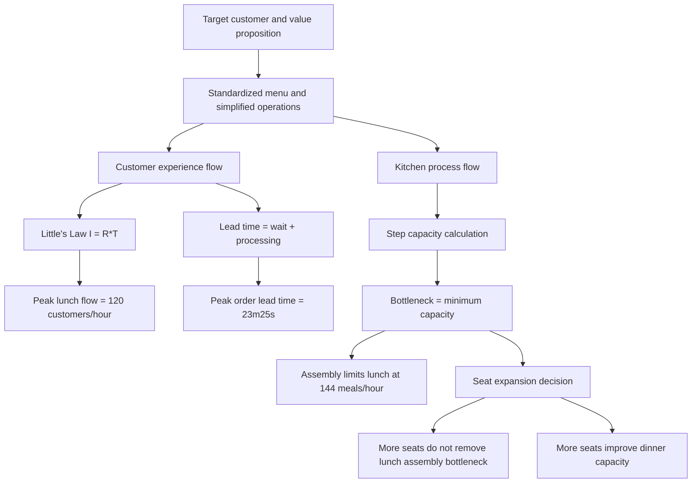

# Topic 08: OceanCove Process Analysis And Capacity Management

Source files:

- `supply-chain-management/raw/moodle-export-operations-950888956-s26-20260604/08 Case Study - OceanCove  Process Analysis/Slides OceanCove.pdf`
- `supply-chain-management/raw/moodle-export-operations-950888956-s26-20260604/08 Case Study - OceanCove  Process Analysis/Exercise Capacity Management.xlsx`
- `supply-chain-management/raw/moodle-export-operations-950888956-s26-20260604/08 Case Study - OceanCove  Process Analysis/Exercise Answer Key.pdf`

Course: Supply Chain Management
Processed: 2026-06-04
Wiki note: `supply-chain-management/wiki/topic-08-oceancove-process-analysis-capacity-management/topic-08-oceancove-process-analysis-capacity-management.md`

Course logistics checked: the SCM exam may include open numerical tasks and multiple-selection questions. Topic 08 is high-yield because it combines case interpretation, process-flow diagrams, Little's Law, bottleneck analysis, capacity utilization, and managerial recommendations.

## 80/20 Exam Summary

Topic 08 teaches how to turn a service operation into a process model.

The high-yield method is:

```text
map the process -> define the flow unit -> calculate flow rate and capacity -> find the bottleneck -> interpret the managerial consequence
```

Core formulas:

```text
Little's Law: I = R * T
Flow rate: R = I / T
Capacity of one resource = number of parallel resources / processing time per unit
Utilization = flow rate / capacity
System capacity = minimum capacity among required resources
```

Worked-calculation standard used below:

```text
define flow unit -> choose formula -> convert time units -> substitute values -> calculate result -> attach unit -> interpret bottleneck/decision
```

OceanCove's main quantitative conclusions:

- Peak lunch dining flow: `120 customers/hour`.
- Fish menu capacity under 2:1 grilled-to-fried mix: `270 fish meals/hour`.
- Lunch bottleneck: assembly at `144 meals/hour`.
- Lunch dining-area capacity with 120 seats: `160 customers/hour`.
- Dinner dining-area capacity with 120 seats: `87 customers/hour`.
- Fastest possible grilled fish lead time: `10 minutes 25 seconds`.
- Peak non-rushed grilled order lead time: `23 minutes 25 seconds` because average waiting is `13 minutes`.
- Increasing seats from 120 to 160 raises dining-area capacity, but lunch is still constrained by assembly at `144 meals/hour`.

## Where This Fits In SCM

Earlier SCM topics built models for demand and inventory:

- [Topic 01 Kristen Cookie Case](../topic-01-kristen-cookie-case/topic-01-kristen-cookie-case.md): process flow, bottleneck, cycle time, capacity.
- [Topic 05 EOQ/EPQ](../topic-05-eoq-production-systems-batching/topic-05-eoq-production-systems-batching.md): production capacity and batching under deterministic demand.
- [Topic 06 Bullwhip](../topic-06-supply-chain-coordination-bullwhip-effect/topic-06-supply-chain-coordination-bullwhip-effect.md): coordination and distorted demand signals.

Topic 08 brings the process logic back into a service setting:

```text
Capacity is not "how many seats exist" or "how many customers arrive."
Capacity is the limiting rate of the whole process.
```

## Case Questions From The Deck

The OceanCove case asks the student to:

1. Describe the target market, customer values, internal goals, and operational activities.
2. Draw a customer experience process flow.
3. Draw the kitchen process flow with process times, capacities, and queues.
4. Calculate peak lunch customer flow and order-ticket flow.
5. Calculate step capacities, utilization, bottleneck, and total restaurant capacity.
6. Calculate fastest possible grilled fish lead time.
7. Calculate lead time if the customer arrives at peak and the order is not rushed.
8. Evaluate increasing seats from 120 to 160, opening a new restaurant, and strategic implications.

## OceanCove Value Map

| Layer | Case Content | Exam Interpretation |
|---|---|---|
| Target customer | Young adults, 18 to 30 years old | Price-sensitive but still value food/service quality. |
| Customer values | Good food, low prices, good service, convenience | Operations must support speed, affordability, and repeatable quality. |
| Internal objectives | Consistent food quality, low ingredient/preparation cost, low overhead, high table turnover, fast service, pleasant casual environment, accessible locations | Strategy is operationalized through standardization and high volume. |
| Operations activities | Simplified standardized menus and recipes, fresh basic ingredients, simple cooking methods, simplified kitchen operations, shopping-area sites, coordinated decor, corporate bulk purchasing | The operating system is designed for fast, low-cost, repeatable service. |

Exam trap:

```text
Do not discuss "good service" only as a marketing promise. Link it to process speed, queue control, and table turnover.
```

## Customer Experience Process Flow

Lunch customer flow:

```text
Enter restaurant
-> if dining area full: enter bar area and order drinks
-> enter dining area
-> order meal
-> eat appetizers
-> eat main dish
-> optionally order and eat dessert
-> pay bill
-> depart
```

Key target times in the slide:

- order meal: `3 minutes`
- appetizer target: `5 minutes`
- main-dish target: `7-8 minutes`
- dessert target: `5 minutes`
- pay bill: `3 minutes`
- main-dish eating time: `20-30 minutes`
- appetizer/dessert eating time: `8-12 minutes`

## Kitchen Process Flow

Kitchen operations contain parallel cooking resources and final assembly.

```text
Waiter order ticket
-> expeditor
-> fish frying / fish grilling / french-fry frying / vegetarian-sides-dessert stream
-> assembly
-> waiter delivery
```

Important kitchen data:

| Resource | Slide Data | Capacity Logic |
|---|---:|---|
| Fish frying | 1 fryer, 4 minutes, max 6 pieces | `6 * 60/4 = 90 fish/hour` |
| Fish grilling | 4 minutes, max 20 pieces | `20 * 60/4 = 300 fish/hour` |
| French-fry frying | 2 fryers, 200 portions/hour each | `400 portions/hour` |
| Assembly | 25 seconds/meal | `60 / (25/60) = 144 meals/hour` |
| Waiters | 6 waiters, 6 minutes per table for order/delivery/billing | `60 tables/hour`, about `180 customers/hour` if 3 customers/table |
| Lunch dining area | 120 seats, 45-minute stay | `120 / 0.75 = 160 customers/hour` |
| Dinner dining area | 120 seats, 82.5-minute stay | `120 / (82.5/60) = 87 customers/hour` |

## Little's Law In OceanCove

Little's Law:

```text
Average inventory = Average flow time * Average flow rate
I = R * T
R = I / T
T = I / R
```

### Peak Lunch Customer Flow

Decision problem:

```text
Use the observed number of customers in the dining process and the average stay time to infer the peak flow rate.
```

Known inputs:

```text
Average occupied tables = 30 tables
Average customers per table = 3 customers/table
Average flow time = 45 minutes/customer stay
```

Unit conversion:

```text
45 minutes = 45/60 hours = 0.75 hours
```

Average inventory:

```text
I = 30 tables x 3 customers/table
I = 90 customers
```

Formula:

```text
R = I / T
```

Substitution:

```text
R = 90 customers / 0.75 hours
R = 120 customers/hour
```

Equivalent minute rate:

```text
120 customers/hour / 60 minutes/hour = 2 customers/minute
```

Interpretation:

```text
OceanCove has about 120 customers per hour flowing through lunch at peak.
If the kitchen treats one meal order as one customer order, order tickets enter the kitchen at about 120 meal orders/hour, or 2 meal orders/minute.
```

Exam trap: do not say "30 tables" is the flow rate. Thirty tables is part of average inventory. Flow rate needs the time denominator.

## Bottleneck And Capacity Analysis

The restaurant's system capacity is the minimum of all required resource capacities:

```text
restaurant capacity = min(kitchen capacity, waiter capacity, table capacity)
```

Use one common unit before comparing steps. The slides compare lunch in `customers/hour` or `meals/hour`; in this case one customer is treated as one meal order for the main flow.

### Step Capacity Calculations

| Step | Formula | Substitution | Capacity | Interpretation |
|---|---|---|---:|---|
| Fish frying | `batch size / batch time` | `6 fish / (4/60 hours)` | `90 fish/hour` | One fryer can complete 6 fried fish every 4 minutes. |
| Fish grilling | `batch size / batch time` | `20 fish / (4/60 hours)` | `300 fish/hour` | Grill capacity is much larger than fried fish capacity. |
| French-fry frying | `number of fryers x capacity per fryer` | `2 x 200 portions/hour` | `400 portions/hour` | Not constraining under the main meal flow. |
| Assembly | `1 / processing time per meal` | `1 / (25/3600 hours/meal)` | `144 meals/hour` | One chef can assemble 144 meals per hour. |
| Waiters | `number of waiters / time per table` | `6 waiters / (6/60 hours/table)` | `60 tables/hour` | With 3 customers/table, this is `180 customers/hour`. |
| Lunch dining area | `seats / average stay` | `120 seats / (45/60 hours)` | `160 seat-turns/hour` | At 3 of 4 seats occupied, actual customer flow is `160 x 0.75 = 120 customers/hour`. |
| Dinner dining area | `seats / average stay` | `120 seats / (82.5/60 hours)` | `87.27 seat-turns/hour` | Rounded to `87 customers/hour` in the slides. |

Assembly detail:

```text
25 seconds/meal = 25/60 minutes/meal = 0.4167 minutes/meal
25 seconds/meal = 25/3600 hours/meal = 0.006944 hours/meal
capacity = 1 meal / 0.006944 hours
capacity = 144 meals/hour
```

Waiter detail:

```text
6 minutes/table = 6/60 hours/table = 0.10 hours/table
capacity = 6 waiters / 0.10 hours/table
capacity = 60 tables/hour
customer capacity = 60 tables/hour x 3 customers/table
customer capacity = 180 customers/hour
```

### Effective Fish Menu Capacity With 2:1 Mix

Case statement:

```text
Grilled seafood is about twice as popular as fried seafood.
```

Define the mix:

```text
For every 1 fried fish meal, there are 2 grilled fish meals.
Let x = fried fish meals/hour.
Then grilled fish meals/hour = 2x.
Total fish meals/hour = x + 2x = 3x.
```

Capacity constraints:

```text
Fried fish: x <= 90
Grilled fish: 2x <= 300  ->  x <= 150
```

Binding constraint:

```text
x <= min(90, 150)
x <= 90
```

Substitution:

```text
fried meals/hour = x = 90
grilled meals/hour = 2x = 2 x 90 = 180
total fish menu capacity = 90 + 180 = 270 fish meals/hour
```

Interpretation:

```text
The fried-fish fryer limits the mixed fish menu. The grill has spare capacity at the required 2:1 grilled-to-fried mix.
```

### Lunch Bottleneck And Utilization

At peak lunch, actual flow is `120 meals/hour`.

Flow split for the fish mix:

```text
fried demand = 1/3 x 120 = 40 fried meals/hour
grilled demand = 2/3 x 120 = 80 grilled meals/hour
```

Utilization formula:

```text
utilization = actual flow rate / capacity
```

Lunch utilization table:

| Resource | Actual Flow | Capacity | Utilization Calculation | Utilization |
|---|---:|---:|---|---:|
| Fried fish | `40 fried meals/hour` | `90 fried meals/hour` | `40 / 90 = 0.4444` | `44.44%` |
| Grilled fish | `80 grilled meals/hour` | `300 grilled meals/hour` | `80 / 300 = 0.2667` | `26.67%` |
| Effective fish menu | `120 fish meals/hour` | `270 fish meals/hour` | `120 / 270 = 0.4444` | `44.44%` |
| French fries | `120 portions/hour` | `400 portions/hour` | `120 / 400 = 0.3000` | `30.00%` |
| Assembly | `120 meals/hour` | `144 meals/hour` | `120 / 144 = 0.8333` | `83.33%` |
| Waiters | `120 customers/hour` | `180 customers/hour` | `120 / 180 = 0.6667` | `66.67%` |
| Lunch dining area | `120 customers/hour` | `160 seat-turns/hour` | `120 / 160 = 0.7500` | `75.00%` |

Lunch system capacity:

```text
restaurant capacity = min(270, 400, 144, 180, 160)
restaurant capacity = 144 meals/hour
```

Bottleneck:

```text
Assembly = 144 meals/hour
```

Interpretation:

```text
At lunch, adding more grill or dining capacity does not raise total output unless assembly is also improved, because assembly is the lowest required capacity.
```

### Dinner Bottleneck

Dinner dining time is longer:

```text
Average dinner stay = 82.5 minutes = 82.5/60 hours = 1.375 hours
dining capacity = 120 seats / 1.375 hours
dining capacity = 87.27 customers/hour
```

Dinner system capacity:

```text
restaurant capacity = min(270 fish meals/hour, 400 fries/hour, 144 assembly/hour, 180 waiter customers/hour, 87.27 dining customers/hour)
restaurant capacity = 87.27 customers/hour
```

Bottleneck:

```text
Dinner dining area = about 87 customers/hour
```

Interpretation:

```text
At dinner, longer stays make seating the bottleneck. The same restaurant can have different bottlenecks at lunch and dinner.
```

## Lead-Time Analysis

Lead time includes waiting plus processing. Processing time alone is only the fastest possible case.

### Fastest Possible Grilled Fish Meal

Decision problem:

```text
Assume the customer is first at lunch or receives a rushed order, so there is no queue waiting.
```

Known processing times:

| Activity | Duration |
|---|---:|
| Order taking | `3 minutes` |
| Grilling | `4 minutes` |
| Assembly | `25 seconds` |
| Delivery | `3 minutes` |

Convert seconds:

```text
25 seconds = 25/60 minutes = 0.4167 minutes
```

Formula:

```text
fastest lead time = order taking + grilling + assembly + delivery
```

Substitution:

```text
fastest lead time = 3 minutes + 4 minutes + 25 seconds + 3 minutes
fastest lead time = 10 minutes + 25 seconds
```

Equivalent decimal form:

```text
10 minutes + 25 seconds = 10 + 25/60 minutes = 10.4167 minutes
```

Interpretation:

```text
If no queue exists, a grilled fish meal can be delivered in 10 minutes 25 seconds.
```

### Peak Non-Rushed Order

Decision problem:

```text
At peak lunch, the customer is not rushed and joins the kitchen queue.
```

Known inputs from the slides:

```text
Average flow rate = 2 meals/minute
Average inventory waiting in kitchen = 26 orders
Fastest processing lead time = 10 minutes 25 seconds
```

Formula from Little's Law:

```text
I = R x T
T = I / R
```

Substitution:

```text
average waiting time = 26 orders / 2 orders per minute
average waiting time = 13 minutes
```

Full lead time:

```text
customer order lead time = waiting time + processing time
customer order lead time = 13 minutes + 10 minutes 25 seconds
customer order lead time = 23 minutes 25 seconds
```

Interpretation:

```text
The physical process is only 10 minutes 25 seconds, but the customer experiences 23 minutes 25 seconds because peak congestion adds 13 minutes of queue waiting.
```

Exam trap:

```text
Do not confuse processing time with lead time. Lead time includes waiting.
```

## Seat Expansion From 120 To 160

The seat-expansion slides combine three ideas:

1. Dining-area capacity depends on seats and stay time.
2. Actual meal/customer flow is lower when only 3 of 4 seats are occupied on average.
3. System capacity still cannot exceed the current bottleneck, especially assembly at lunch.

### Base Case: 120 Seats

#### Lunch Revenue

Dining seat-turn capacity:

```text
seats = 120
average lunch stay = 45 minutes = 45/60 hours = 0.75 hours
dining seat-turn capacity = 120 / 0.75
dining seat-turn capacity = 160 seat-turns/hour
```

Occupancy adjustment:

```text
average occupied seats per 4-seat table = 3
occupancy factor = 3/4 = 0.75
customer flow = 160 x 0.75 = 120 customers/hour
```

Lunch revenue:

```text
revenue = price per meal x customer flow x lunch duration
revenue = $6/meal x 120 meals/hour x 3 hours
revenue = $2160
```

#### Dinner Revenue

Dining seat-turn capacity:

```text
average dinner stay = 82.5 minutes = 82.5/60 hours = 1.375 hours
dinner dining capacity = 120 seats / 1.375 hours
dinner dining capacity = 87.27 seat-turns/hour
```

Occupancy adjustment:

```text
dinner flow = 87.27 x 0.75
dinner flow = 65.45 customers/hour
dinner flow rounded in slide = 65 customers/hour
```

Dinner revenue:

```text
revenue = $14/meal x 65 meals/hour x 4 hours
revenue = $3640
```

Daily revenue:

```text
daily revenue = lunch revenue + dinner revenue
daily revenue = $2160 + $3640
daily revenue = $5800
```

### New Case: 160 Seats

#### Lunch Revenue

Dining seat-turn capacity:

```text
seats = 160
average lunch stay = 45 minutes = 0.75 hours
dining seat-turn capacity = 160 / 0.75
dining seat-turn capacity = 213.33 seat-turns/hour
```

Occupancy-adjusted dining flow:

```text
occupancy-adjusted flow = 213.33 x 0.75
occupancy-adjusted flow = 160 customers/hour
```

System capacity check:

```text
assembly capacity = 144 meals/hour
occupancy-adjusted dining flow = 160 customers/hour
lunch system flow after expansion = min(144, 160)
lunch system flow after expansion = 144 meals/hour
```

Lunch revenue:

```text
revenue = $6/meal x 144 meals/hour x 3 hours
revenue = $2592
```

#### Dinner Revenue

Dining capacity:

```text
dinner dining capacity = 160 seats / 1.375 hours
dinner dining capacity = 116.36 seat-turns/hour
```

Occupancy-adjusted dinner flow:

```text
dinner flow = 116.36 x 0.75
dinner flow = 87.27 customers/hour
dinner flow rounded in slide = 87 customers/hour
```

Dinner revenue:

```text
revenue = $14/meal x 87 meals/hour x 4 hours
revenue = $4872
```

Daily revenue:

```text
daily revenue = $2592 + $4872
daily revenue = $7464
```

### Contribution With 70% Capacity Utilization And 15% Net Margin

Assumptions:

```text
capacity utilization = 70% = 0.70
net profit margin = 15% = 0.15
contribution = full-capacity revenue x 0.70 x 0.15
```

Base case, 120 seats:

```text
lunch revenue at 70% utilization = $2160 x 0.70 = $1512
lunch contribution = $1512 x 0.15 = $226.80 ~= $227

dinner revenue at 70% utilization = $3640 x 0.70 = $2548
dinner contribution = $2548 x 0.15 = $382.20 ~= $382

daily contribution = $227 + $382 = $609
```

New case, 160 seats:

```text
lunch revenue at 70% utilization = $2592 x 0.70 = $1814.40
lunch contribution = $1814.40 x 0.15 = $272.16 ~= $272

dinner revenue at 70% utilization = $4872 x 0.70 = $3410.40
dinner contribution = $3410.40 x 0.15 = $511.56 ~= $512

daily contribution = $272 + $512 = $784
```

Incremental contribution:

```text
incremental daily contribution = $784 - $609
incremental daily contribution = $175/day
```

Managerial interpretation:

```text
Adding seats creates about $175 additional daily contribution under the slide assumptions.
It helps dinner more directly because dinner is seating-constrained.
It helps lunch only until assembly binds at 144 meals/hour.
Final investment approval still needs the cost of adding seats, payback, or NPV.
```

## Exercise Answer Guides

### Task 1: ProfiCutZ Hairdresser

Key data:

- check-in: `2 minutes/customer`
- waiting after check-in: `7 minutes`
- hair washing: `10 minutes/customer`
- waiting after hair washing: `3 minutes`
- hairdressing: `30 minutes/customer`
- waiting after hairdressing: `5 minutes`
- checkout: `3 minutes/customer`
- resources: `5` professional hairdressers, `2` hair washers, `1` administrator

#### Total Flow Time

Formula:

```text
flow time = processing times + waiting times
```

Substitution:

```text
flow time = 2 + 7 + 10 + 3 + 30 + 5 + 3
flow time = 60 minutes
flow time = 1 hour
```

Interpretation:

```text
One customer spends about 1 hour inside the process from check-in to checkout.
```

#### Capacity Before Hiring

Administration handles both check-in and checkout:

```text
admin time/customer = check-in + checkout
admin time/customer = 2 + 3 = 5 minutes/customer
admin capacity = 1 administrator / (5/60 hours/customer)
admin capacity = 1 / 0.08333
admin capacity = 12 customers/hour
```

Hair washing:

```text
hair-washing capacity = 2 hair washers / (10/60 hours/customer)
hair-washing capacity = 2 / 0.1667
hair-washing capacity = 12 customers/hour
```

Hairdressing:

```text
hairdressing capacity = 5 hairdressers / (30/60 hours/customer)
hairdressing capacity = 5 / 0.50
hairdressing capacity = 10 customers/hour
```

System capacity:

```text
system capacity = min(admin capacity, hair-washing capacity, hairdressing capacity)
system capacity = min(12, 12, 10)
system capacity = 10 customers/hour
```

Bottleneck:

```text
hairdressing capacity = 10 customers/hour
```

Interpretation:

```text
Hairdressing is the bottleneck because it has the smallest capacity.
```

#### Customers In Steady State

Formula:

```text
I = R x T
```

Known inputs:

```text
R = 10 customers/hour
T = 1 hour
```

Substitution:

```text
I = 10 customers/hour x 1 hour
I = 10 customers
```

Interpretation:

```text
At steady state, about 10 customers are in the system at the same time.
```

#### Capacity After Hiring 2 Bottleneck-Capable Employees

If the two new employees were used only for hairdressing:

```text
hairdressers = 5 + 2 = 7
hairdressing capacity = 7 / (30/60)
hairdressing capacity = 7 / 0.50
hairdressing capacity = 14 customers/hour
```

But the system capacity is not automatically 14:

```text
admin capacity = 12 customers/hour
hair-washing capacity = 12 customers/hour
hairdressing-only capacity = 14 customers/hour
simple bottleneck shift = min(12, 12, 14) = 12 customers/hour
```

Why the answer key reports `13 customers/hour`:

```text
Professional hairdressers can perform any task.
After hiring 2 more bottleneck-capable employees, there are 7 flexible professional employees.
Those flexible employees can support hairdressing and small overloads in administration / washing.
```

Feasibility check at `13 customers/hour`:

```text
admin workload = 13 customers/hour x 5 minutes/customer = 65 minutes/hour
admin staff capacity = 1 x 60 = 60 minutes/hour
admin overload needing flexible help = 65 - 60 = 5 minutes/hour

hair-washing workload = 13 x 10 = 130 minutes/hour
washer capacity = 2 x 60 = 120 minutes/hour
washing overload needing flexible help = 130 - 120 = 10 minutes/hour

hairdressing workload = 13 x 30 = 390 minutes/hour

flexible professional workload = hairdressing + admin overload + washing overload
flexible professional workload = 390 + 5 + 10 = 405 minutes/hour
flexible professional capacity = 7 x 60 = 420 minutes/hour
```

Conclusion:

```text
405 minutes/hour <= 420 minutes/hour
13 customers/hour is feasible.
```

Why `14 customers/hour` is not feasible:

```text
admin workload = 14 x 5 = 70 minutes/hour -> 10 minutes flexible help
washing workload = 14 x 10 = 140 minutes/hour -> 20 minutes flexible help
hairdressing workload = 14 x 30 = 420 minutes/hour

flexible professional workload = 420 + 10 + 20 = 450 minutes/hour
flexible professional capacity = 420 minutes/hour
```

Conclusion:

```text
450 minutes/hour > 420 minutes/hour
14 customers/hour is not feasible.
Answer-key maximum whole-customer capacity = 13 customers/hour.
```

Exam trap: when a bottleneck is relieved, recompute the whole system. The bottleneck may shift, and flexible workers may need to cover more than one overloaded step.

### Task 2: Circored Plant

Flow unit:

```text
1 ton of iron ore / DRI briquettes moving through the plant
```

#### Process Capacities

| Process | Formula | Substitution | Capacity |
|---|---|---|---:|
| Preheater | given | `120 tons/hour` | `120 tons/hour` |
| Lock hoppers | given | `110 tons/hour` | `110 tons/hour` |
| CFB reactor | `inventory / flow time` | `28 tons / 0.25 hours` | `112 tons/hour` |
| SFB reactor | `inventory / flow time` | `400 tons / 4 hours` | `100 tons/hour` |
| Flash heater | given | `135 tons/hour` | `135 tons/hour` |
| Pressure let-down system | given | `118 tons/hour` | `118 tons/hour` |
| Briquetting | `parallel machines x machine capacity` | `3 x 55 tons/hour` | `165 tons/hour` |

CFB unit conversion:

```text
15 minutes = 15/60 hours = 0.25 hours
CFB capacity = 28 tons / 0.25 hours
CFB capacity = 112 tons/hour
```

SFB calculation:

```text
SFB capacity = 400 tons / 4 hours
SFB capacity = 100 tons/hour
```

Briquetting calculation:

```text
briquetting capacity = 3 machines x 55 tons/hour per machine
briquetting capacity = 165 tons/hour
```

Overall plant capacity:

```text
overall capacity = min(120, 110, 112, 100, 135, 118, 165)
overall capacity = 100 tons/hour
```

Bottleneck:

```text
stationary fluid bed reactor (SFB) = 100 tons/hour
```

#### Time To Produce 25,000 Tons

The answer key uses the demand flow rate, not the maximum technical capacity.

Annual demand conversion:

```text
annual demand = 657000 tons/year
hours per year = 365 days/year x 24 hours/day = 8760 hours/year
demand flow rate = 657000 / 8760
demand flow rate = 75 tons/hour
```

Formula:

```text
time = required quantity / flow rate
```

Substitution:

```text
time = 25000 tons / 75 tons/hour
time = 333.33 hours
```

Interpretation:

```text
At the demand flow rate of 75 tons/hour, producing 25,000 tons takes 333.33 hours.
```

Boundary check:

```text
If the task asked for fastest possible production at maximum capacity:
time = 25000 tons / 100 tons/hour = 250 hours.
But the answer key's 333.33 hours uses demand flow, not full capacity.
```

#### Capacity Utilization

Formula:

```text
utilization = flow rate / capacity
```

Using demand flow `75 tons/hour`, the bottleneck / overall capacity utilization is:

```text
overall utilization = 75 / 100
overall utilization = 0.75
overall utilization = 75%
```

Individual resource utilizations:

| Resource | Demand Flow | Capacity | Calculation | Utilization |
|---|---:|---:|---|---:|
| Preheater | `75 tons/hour` | `120 tons/hour` | `75 / 120 = 0.6250` | `62.50%` |
| Lock hoppers | `75 tons/hour` | `110 tons/hour` | `75 / 110 = 0.6818` | `68.18%` |
| CFB reactor | `75 tons/hour` | `112 tons/hour` | `75 / 112 = 0.6696` | `66.96%` |
| SFB reactor | `75 tons/hour` | `100 tons/hour` | `75 / 100 = 0.7500` | `75.00%` |
| Flash heater | `75 tons/hour` | `135 tons/hour` | `75 / 135 = 0.5556` | `55.56%` |
| Pressure let-down | `75 tons/hour` | `118 tons/hour` | `75 / 118 = 0.6356` | `63.56%` |
| Briquetting | `75 tons/hour` | `165 tons/hour` | `75 / 165 = 0.4545` | `45.45%` |

Interpretation:

```text
The answer-key headline of 75% corresponds to utilization of the bottleneck / overall plant capacity at the demand flow rate.
Individual non-bottleneck resources have lower utilization because they have spare capacity.
```

Exam trap: capacity and demand flow are different. Use capacity for maximum output; use demand flow when the task asks about production under the given demand rate.

### Task 3: Renovation Gantt Chart

Activities:

| Activity | Predecessor | Duration |
|---|---|---:|
| Demolition | none | `1 week` |
| Electricals | Demolition | `2 weeks` |
| Plumbing | Demolition | `2 weeks` |
| Drywall | Electricals and Plumbing | `3 weeks` |
| Painting | Drywall | `1 week` |
| Installing doors/windows | Painting | `1 week` |
| Flooring/tiling | Painting | `2 weeks` |
| Complete cleaning | Flooring/tiling | `1 week` |

Worker availability:

| Worker | Can Do | Availability |
|---|---|---|
| Worker 1 | Demolition; Drywall; Installing doors/windows | Demolition `CW1-CW2`; Drywall `CW5-CW8`; doors/windows `CW10` |
| Worker 2 | Electricals; Flooring/tiling; Installing doors/windows | Electricals `CW1-CW3`; flooring/tiling `CW7-CW11` |
| Worker 3 | Plumbing; Painting; Complete cleaning | Plumbing `CW3-CW5`; painting/cleaning `CW8-CW12` |

Scheduling rule:

```text
start each activity as early as possible,
but only if all predecessors are finished and a qualified worker is available.
```

Step-by-step schedule:

| Activity | Reasoning | Scheduled Weeks |
|---|---|---|
| Demolition | No predecessor; Worker 1 available from CW1. | `CW1` |
| Electricals | Needs Demolition complete; Worker 2 available through CW3. | `CW2-CW3` |
| Plumbing | Needs Demolition complete; Worker 3 available from CW3. | `CW3-CW4` |
| Drywall | Needs Electricals and Plumbing complete; Worker 1 available CW5-CW8. | `CW5-CW7` |
| Painting | Needs Drywall complete; Worker 3 available CW8-CW12. | `CW8` |
| Flooring/tiling | Needs Painting complete; Worker 2 available CW7-CW11. | `CW9-CW10` |
| Installing doors/windows | Needs Painting complete; Worker 1 available CW10. | `CW10` |
| Complete cleaning | Needs Flooring/tiling complete; Worker 3 available CW8-CW12. | `CW11` |

Compact Gantt view:

| Activity | CW1 | CW2 | CW3 | CW4 | CW5 | CW6 | CW7 | CW8 | CW9 | CW10 | CW11 |
|---|---|---|---|---|---|---|---|---|---|---|---|
| Demolition | W1 |  |  |  |  |  |  |  |  |  |  |
| Electricals |  | W2 | W2 |  |  |  |  |  |  |  |  |
| Plumbing |  |  | W3 | W3 |  |  |  |  |  |  |  |
| Drywall |  |  |  |  | W1 | W1 | W1 |  |  |  |  |
| Painting |  |  |  |  |  |  |  | W3 |  |  |  |
| Flooring/tiling |  |  |  |  |  |  |  |  | W2 | W2 |  |
| Installing doors/windows |  |  |  |  |  |  |  |  |  | W1 |  |
| Complete cleaning |  |  |  |  |  |  |  |  |  |  | W3 |

Project duration:

```text
project starts = CW1
project completes = end of CW11
project duration = 11 weeks
```

Renovation on hold?

```text
There is at least one scheduled activity in every week from CW1 through CW11.
Therefore, renovation on hold = No.
```

Exam trap: do not sum all activity durations. The project duration is the calendar span after respecting precedence, parallel work, and worker availability.

## Diagrams, Tables, And Visuals

### Value Map

OceanCove's value map shows strategy-to-operations alignment:

```text
young adults -> good food/low price/good service/convenience -> high volume and fast service -> standardized menu and simplified operations
```

### Customer Process Flow

The customer process includes waiting, ordering, eating, dessert, billing, and possible bar waiting. This matters because customer lead time includes both visible service and queue/wait states.

### Kitchen Process Flow

The kitchen diagram separates physical flow from information flow:

- order tickets flow from waiters to expeditor
- fish, fries, sides, and desserts flow through cooking/prep
- assembly combines items into meals
- waiters deliver meals

### Capacity Table

The capacity table teaches that parallel resources increase capacity and that the bottleneck is not necessarily the most visible operation.

## Visual Knowledge Map



## Subject Knowledge Graph

| Node | Meaning | Exam Relevance |
|---|---|---|
| Value Map | Links target customers to operational activities | Use to connect strategy and operations. |
| Flow Unit | Entity moving through the process, such as customer, meal, order, ton, or project activity | Must be defined before applying Little's Law. |
| Little's Law | `I = R*T` | Core formula for flow rate, inventory, and waiting. |
| Process Flow Diagram | Ordered map of activities, queues, and decision points | Required in case analysis. |
| Capacity | Maximum sustainable output rate under stated assumptions | Central calculation target. |
| Bottleneck | Resource with smallest required-process capacity | Determines system capacity. |
| Utilization | Flow rate divided by capacity | Shows how heavily a resource is loaded. |
| Lead Time | Time from customer/order start to completion, including waiting | Distinguish from processing time. |
| Gantt Chart | Time schedule respecting precedence and resource availability | Exercise method for project flow. |

| From | Relationship | To | Why It Matters |
|---|---|---|---|
| Value Map | guides | Process Design | Operations should support target values. |
| Average Inventory | equals | Flow Rate times Flow Time | Little's Law setup. |
| Capacity Table | identifies | Bottleneck | The lowest process capacity limits output. |
| Bottleneck | constrains | System Capacity | Adding non-bottleneck capacity may not improve flow. |
| WIP / Waiting Orders | increases | Lead Time | Waiting is part of customer experience. |
| Seat Expansion | changes | Dining Capacity | But may not fix kitchen bottlenecks. |
| Precedence Constraints | shape | Gantt Chart | Project timing needs dependency logic. |

## Real Business Examples

- A fast-casual restaurant with many seats can still have slow service if meal assembly is the bottleneck.
- A hairdresser can add chairs and mirrors, but capacity will not rise if skilled hairdressers remain the bottleneck.
- A chemical plant may have high-capacity equipment in most steps, but a reactor with long residence time can limit the whole process.
- A renovation project can be delayed by worker availability even when the technical sequence is clear.

## Exam Relevance

Likely prompts:

- Draw a process flow and identify queues, resources, and information flow.
- Use Little's Law to infer flow rate, inventory, or waiting time.
- Calculate step capacities with parallel resources.
- Identify the bottleneck and total system capacity.
- Calculate utilization.
- Distinguish fastest processing time from lead time with waiting.
- Evaluate whether capacity expansion makes operational sense.
- Create or interpret a Gantt chart.

Common traps:

- Treating demand or seats as capacity without checking the bottleneck.
- Mixing customers/hour, meals/hour, tables/hour, and orders/minute.
- Forgetting to convert minutes to hours.
- Ignoring mix constraints, such as 2:1 grilled-to-fried fish.
- Treating waiting time as non-operational.
- Increasing capacity at a non-bottleneck and expecting system output to rise.

How to structure a high-scoring answer:

1. Define the flow unit.
2. Draw or describe the process.
3. List step times and parallel resources.
4. Convert every step to a capacity rate.
5. Identify the bottleneck.
6. Use Little's Law where inventory, flow, and time are linked.
7. Interpret the recommendation through customer value and profitability.

## Retrieval Prompts

Closed-book questions:

1. State Little's Law and define each symbol.
2. What is the difference between capacity and flow rate?
3. What is the OceanCove lunch bottleneck?
4. Why does the fastest grilled fish lead time differ from peak lead time?
5. Why does increasing seats not fully solve lunch capacity?
6. What must a Gantt chart respect besides task durations?

Application prompts:

1. A restaurant has 100 seats and an average stay of 50 minutes. Estimate dining-area capacity.
2. A kitchen has a grill capacity of 240 meals/hour and an assembly capacity of 150 meals/hour. Which step constrains output?
3. A queue has 36 orders waiting and releases 3 orders/minute. What is average waiting time?
4. A project task can start technically but the assigned worker is unavailable. How does this affect the Gantt chart?

## Practice Tasks

1. Recompute OceanCove's lunch dining-area capacity if average stay rises to 60 minutes.
2. Recompute assembly capacity if a second assembly chef is added and each meal still takes 25 seconds.
3. For Circored, compute each individual resource utilization at demand flow `75 tons/hour`.
4. For ProfiCutZ, explain why hairdressing is the bottleneck before the hiring decision.
5. Write a five-sentence recommendation on whether OceanCove should add seats, improve assembly, or open a new store.

## Connections

Previous notes from this lecture:

- [Topic 01 Kristen Cookie Case](../topic-01-kristen-cookie-case/topic-01-kristen-cookie-case.md): same bottleneck and process-flow logic in a simple production/service case.
- [Topic 05 EOQ, Production Systems, And Batching](../topic-05-eoq-production-systems-batching/topic-05-eoq-production-systems-batching.md): capacity and production-rate thinking.
- [Topic 06 Supply Chain Coordination And Bullwhip Effect](../topic-06-supply-chain-coordination-bullwhip-effect/topic-06-supply-chain-coordination-bullwhip-effect.md): queues, batching, and distorted flows can create system-wide inefficiency.

Cross-course links:

- Marketing: OceanCove's target customer and customer values explain why speed and price matter.
- Finance: capacity expansion should be evaluated through incremental contribution and investment cost.
- Organization: process roles, worker availability, and coordination shape operational performance.

## Open Uncertainties

- The ProfiCutZ answer key reports `13 customers/hour` after adding two employees to the bottleneck-capable resource pool. A simple "add both only to hairdressing" calculation would shift the bottleneck to other resources; use the answer-key result in exam practice and explain that resource redeployment can matter.
- The OceanCove seat-expansion slides provide revenue/contribution comparisons but not investment cost, so a final investment decision would require payback or NPV data.

## Weakness Flags

- Pending active recall: no first-pass retrieval has been completed yet.
- Highest-risk calculations: Little's Law unit conversion, parallel-resource capacity, bottleneck shifts, and lead time versus processing time.
