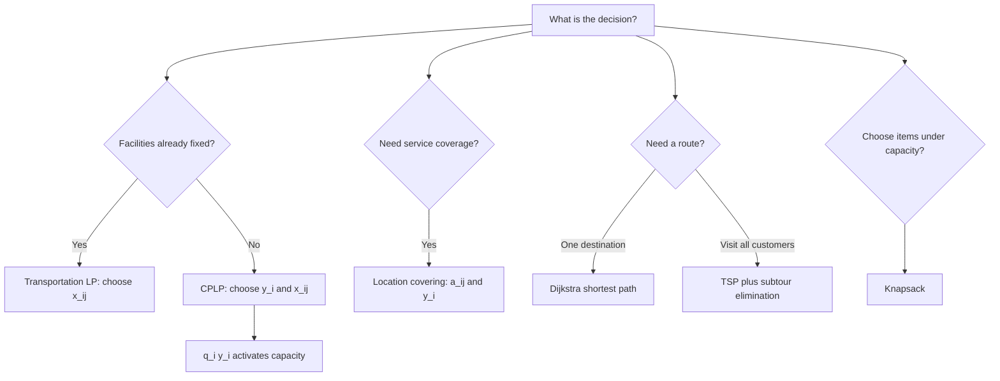

# Ubiquitous Language: Topic 09 Facility Location, Transportation, And Shipping

Source note: `topic-09-facility-location-transportation-shipping.md`
Course: Supply Chain Management
Definition sources: Topic 09 facility-location slides, transportation/shipping slides, exercise workbook; enriched with standard operations-research terminology where needed.

This file is a standalone terminology, notation, and model-selection companion for facility location, transportation LPs, covering, shortest path, TSP, and knapsack.

## Model Selection Language

| Term | Definition | Aliases to avoid |
|---|---|---|
| **Transportation / Plant Location LP** | Continuous optimization model choosing shipment amounts from fixed plants to customers at minimum cost. | facility opening model |
| **Capacitated Plant Location Problem (CPLP)** | Model choosing which plants to open and how much to ship while respecting capacities and fixed opening costs. | transportation model only |
| **Two-Echelon Plant Location Model** | Network design model with two facility tiers before customers. | single warehouse model |
| **Location Covering Problem** | Binary model choosing facilities so every customer/demand point is covered at least once. | shortest path |
| **Shortest Path Problem** | Find the minimum-cost path from one origin to one destination. | TSP |
| **Traveling Salesman Problem (TSP)** | Find the shortest tour visiting every customer exactly once. | shortest path |
| **Knapsack Problem** | Choose items to maximize value subject to capacity. | routing problem |

## Linear Programming Language

| Term | Definition | Aliases to avoid |
|---|---|---|
| **Decision Variable** | Quantity the model chooses, such as `x_ij` shipment amount or `y_i` open/closed decision. | parameter |
| **Parameter** | Given input, such as demand, capacity, cost, or distance. | decision |
| **Objective Function** | Expression the model minimizes or maximizes. | constraint |
| **Constraint** | Required condition the solution must satisfy. | objective |
| **Feasible Region** | Set of all solutions satisfying every constraint. | optimal solution |
| **Corner Solution** | Feasible-region corner where an LP optimum may occur. | heuristic result |
| **Shadow Price** | Change in objective from one additional unit of a binding constraint's RHS, within valid range. | route cost |
| **Simplex LP** | Solver method for linear programming problems. | integer solver |

## Facility Location Notation

| Term | Definition | Aliases to avoid |
|---|---|---|
| **Plant Set (`M`)** | Set of possible plant or facility locations. | customer set |
| **Customer Set (`R`)** | Set of customer or demand locations. | plant set |
| **Demand (`D_j` or `d_j`)** | Required quantity for customer `j`. | capacity |
| **Capacity (`K_i` or `q_i`)** | Maximum quantity plant `i` can produce or ship. | demand |
| **Route Cost (`c_ij`)** | Cost per unit shipped from plant `i` to customer `j`. | fixed cost |
| **Shipment Variable (`x_ij`)** | Amount shipped from plant `i` to customer `j`. Usually continuous. | binary open decision |
| **Fixed Opening Cost (`f_i`)** | Cost incurred if facility `i` is opened. | variable shipping cost |
| **Open Variable (`y_i`)** | Binary variable equal to 1 if facility `i` opens and 0 otherwise. | shipment quantity |
| **Capacity Activation (`q_i y_i`)** | Constraint logic allowing capacity only if facility `i` is open. | demand satisfaction |

## Covering Language

| Term | Definition | Aliases to avoid |
|---|---|---|
| **Coverage Matrix (`a_ij`)** | Binary input equal to 1 if facility `i` can serve customer `j`; 0 otherwise. | shipment amount |
| **Covering Constraint** | `sum_i a_ij y_i >= 1`, requiring customer `j` to be served by at least one open facility. | capacity constraint |
| **Coverage Heuristic** | Rule-based method selecting facilities using zero-cost openings and `f_i/n_i` ratios. | guaranteed optimum |
| **Coverage Count (`n_i`)** | Number of remaining constraints/customers facility `i` can cover in the heuristic. | demand amount |

## Routing And Shipping Language

| Term | Definition | Aliases to avoid |
|---|---|---|
| **Node / Vertex (`V`)** | Location in a network, such as plant, customer, or intersection. | edge |
| **Edge (`E`)** | Connection between two nodes with a cost/distance. | node |
| **Tentative Distance** | Current best known distance label in Dijkstra's algorithm. | final route |
| **Visited Node** | Node whose shortest distance is finalized in Dijkstra's algorithm. | unvisited candidate |
| **Tour** | Closed route visiting all required nodes and returning to the start. | path |
| **Degree Constraint** | TSP condition requiring each node to have exactly two selected incident edges. | capacity constraint |
| **Subtour** | Disconnected cycle that visits only a subset of nodes. | valid tour |
| **Subtour-Elimination Constraint** | Constraint requiring selected edges to connect subsets to the rest of the tour. | route cost |
| **Binary Edge Variable (`x_ij`)** | In TSP, 1 if edge `(i,j)` is selected, 0 otherwise. | shipment amount |

## Relationships Between Canonical Terms

- **Transportation LP** uses **shipment variable `x_ij`** but no **open variable `y_i`** if all facilities are already available.
- **CPLP** adds **fixed opening cost** and **open variable `y_i`**.
- **Capacity activation** `q_i y_i` prevents shipments from closed facilities.
- **Location covering problem** uses **coverage matrix `a_ij`**, not route quantities.
- **Dijkstra** solves one-origin-to-one-destination **shortest path** problems.
- **TSP** solves one full **tour** visiting all customers and needs **subtour-elimination constraints**.
- **Knapsack** is a selection model, not a network-flow model.

## Formula And Model Cheat Sheet

| Decision | Model Skeleton | Key Interpretation |
|---|---|---|
| Ship from existing facilities | `min sum_i sum_j c_ij x_ij` | Choose shipment amounts. |
| Meet customer demand | `sum_i x_ij >= D_j` or `= d_j` | Customer-side constraint. |
| Respect plant capacity | `sum_j x_ij <= K_i` | Plant-side constraint. |
| Open facilities and ship | `min sum c_ij x_ij + sum f_i y_i` | Fixed plus variable cost. |
| Activate capacity only if open | `sum_j x_ij <= q_i y_i` | Closed plant ships zero. |
| Cover all customers | `sum_i a_ij y_i >= 1` | At least one facility covers each customer. |
| Knapsack | `max sum v_i x_i`, `sum w_i x_i <= W` | Select best feasible item set. |
| TSP degree | Each node has degree 2 | Necessary but not sufficient. |

## Visual Memory Aid



## Example Dialogue

> **Student:** "The model has `x_ij`, so it must be a binary location decision."
>
> **Professor:** "Not necessarily. In a transportation LP, **shipment variable `x_ij`** is continuous. The binary open/closed decision is **`y_i`** in a CPLP."
>
> **Student:** "How do we stop a closed plant from shipping?"
>
> **Professor:** "Use **capacity activation**: `sum_j x_ij <= q_i y_i`. If `y_i = 0`, the right side is zero."

## Flagged Ambiguities

| Ambiguous Phrase | Canonical Recommendation |
|---|---|
| "Facility location problem" | Specify transportation LP, CPLP, covering, two-echelon, or Hotelling-style competition. |
| "Cost" | Distinguish route/variable cost `c_ij` from fixed opening cost `f_i`. |
| "Serve customers" | Specify shipping quantity, covering within range, or visiting in a route. |
| "Route" | Use **path** for origin-destination; **tour** for visiting every customer. |
| "Optimal coverage heuristic" | Say heuristic result; do not call it optimal unless checked. |
| "Binary `x_ij`" | In TSP it is binary edge selection; in transportation it is shipment amount. |

## Exam Trap Corrections

| Trap | Correction |
|---|---|
| Reversing demand and capacity constraints. | Demand is customer-side; capacity is plant-side. |
| Omitting fixed opening costs. | CPLP objective includes `sum f_i y_i`. |
| Allowing shipments from closed facilities. | Add `sum_j x_ij <= q_i y_i`. |
| Treating Solver as the answer. | State the model and interpret variables/constraints. |
| Confusing Dijkstra and TSP. | Dijkstra: one shortest path; TSP: full customer tour. |
| Accepting subtours in TSP. | Add subtour-elimination logic. |
| Treating a heuristic as guaranteed. | Heuristics can be fast but non-optimal. |

## Compact Answer Language

```text
First identify the decision type.
Define sets, parameters, and variables.
Write the objective.
Write demand, capacity, opening, or coverage constraints as needed.
State whether variables are continuous or binary.
Interpret the solution as a network design or routing decision.
```
