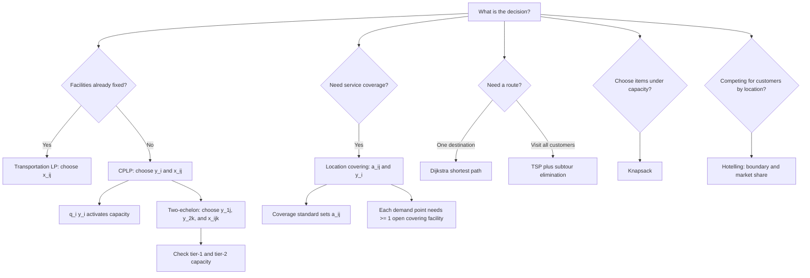

# Ubiquitous Language: Topic 09 Facility Location, Transportation, And Shipping

Source note: `topic-09-facility-location-transportation-shipping.md`
Course: Supply Chain Management
Definition sources: Topic 09 facility-location slides, transportation/shipping slides, exercise workbook; enriched with standard operations-research terminology where needed.

This file is a standalone terminology, notation, and model-selection companion for facility location, transportation LPs, covering, shortest path, TSP, and knapsack.

## Model Selection Language

| Term | Definition | Aliases to avoid |
|---|---|---|
| **Transportation / Plant Location LP** | Continuous optimization model choosing shipment amounts from fixed plants to customers at minimum cost. | facility opening model |
| **Capacitated Plant Location Problem (CPLP)** | Model choosing which plants to open and how much to ship while respecting capacities and fixed opening costs. | transportation model only |
| **Two-Echelon Plant Location Model** | Network design model with two facility tiers before customers. | single warehouse model |
| **Location Covering Problem** | Binary model choosing facilities so every customer/demand point is covered at least once. | shortest path |
| **Shortest Path Problem** | Find the minimum-cost path from one origin to one destination. | TSP |
| **Traveling Salesman Problem (TSP)** | Find the shortest tour visiting every customer exactly once. | shortest path |
| **Knapsack Problem** | Choose items to maximize value subject to capacity. | routing problem |
| **Hotelling Competition** | Competitive location model where customers choose firms based on location/proximity under stated assumptions. | transportation LP |

## Linear Programming Language

| Term | Definition | Aliases to avoid |
|---|---|---|
| **Decision Variable** | Quantity the model chooses, such as `x_ij` shipment amount or `y_i` open/closed decision. | parameter |
| **Parameter** | Given input, such as demand, capacity, cost, or distance. | decision |
| **Objective Function** | Expression the model minimizes or maximizes. | constraint |
| **Constraint** | Required condition the solution must satisfy. | objective |
| **Feasible Region** | Set of all solutions satisfying every constraint. | optimal solution |
| **Feasible Point** | One specific solution inside the feasible region, such as `(x11, x21) = (30, 0)`. | graph coordinate only |
| **Corner Solution** | Feasible-region corner where an LP optimum may occur. | heuristic result |
| **Graphical LP Solution** | Hand method for two-variable LPs: draw constraints, identify the feasible region, evaluate objective values at relevant corners, and choose the best feasible corner. | network map |
| **Binding Constraint** | Constraint that holds exactly at a solution, such as `x11 + x21 = 30` when demand is just met. | important constraint |
| **Shadow Price** | Change in objective from one additional unit of a binding constraint's RHS, within valid range. | route cost |
| **Simplex LP** | Solver method for linear programming problems. | integer solver |

## Facility Location Notation

| Term | Definition | Aliases to avoid |
|---|---|---|
| **Plant Set (`M`)** | Set of possible plant or facility locations. | customer set |
| **Customer Set (`R`)** | Set of customer or demand locations. | plant set |
| **Demand (`D_j` or `d_j`)** | Required quantity for customer `j`. | capacity |
| **Capacity (`K_i` or `q_i`)** | Maximum quantity plant `i` can produce or ship. | demand |
| **Route Cost (`c_ij`)** | Cost per unit shipped from plant `i` to customer `j`. | fixed cost |
| **Shipment Variable (`x_ij`)** | Amount shipped from plant `i` to customer `j`. Usually continuous. | binary open decision |
| **Fixed Opening Cost (`f_i`)** | Cost incurred if facility `i` is opened. | variable shipping cost |
| **Open Variable (`y_i`)** | Binary variable equal to 1 if facility `i` opens and 0 otherwise. | shipment quantity |
| **Capacity Activation (`q_i y_i`)** | Constraint logic allowing capacity only if facility `i` is open. | demand satisfaction |
| **Daily Shipment Unit** | One unit/day assigned to a route. In the workbook CPLP, this is converted into a ten-year present-value route coefficient. | one-time shipment |
| **Route PV Coefficient** | Present value cost of shipping one unit/day on a route for all operating years: `daily route cost * 365 * PV factor`. | daily route cost only |

## Two-Echelon Language

| Term | Definition | Aliases to avoid |
|---|---|---|
| **Tier 0 (`V0`)** | Final demand points, usually retailers or customers, indexed by `i`. | supplier tier |
| **Tier 1 (`V1`)** | Intermediate facilities, such as manufacturing plants or distribution centers, indexed by `j`. | customer tier |
| **Tier 2 (`V2`)** | Upstream facilities or suppliers, indexed by `k`. | retailer tier |
| **Three-Index Flow (`x_ijk`)** | Quantity serving customer `i` through tier-1 facility `j` and tier-2 facility `k`. | pairwise shipment only |
| **Tier-1 Open Variable (`y_1j`)** | Binary variable equal to 1 if tier-1 facility `j` opens. | supplier open variable |
| **Tier-2 Open Variable (`y_2k`)** | Binary variable equal to 1 if tier-2 facility `k` opens. | retailer open variable |
| **All-In Path Cost (`c_ijk`)** | Unit cost of the full path from tier 2 through tier 1 to customer `i`. | separate arc cost unless decomposed |
| **Two-Tier Capacity Check** | For every positive `x_ijk`, capacity is consumed at both tier-1 facility `j` and tier-2 facility `k`. | one-sided capacity check |

## Covering Language

| Term | Definition | Aliases to avoid |
|---|---|---|
| **Coverage Matrix (`a_ij`)** | Binary input equal to 1 if facility `i` can serve customer `j`; 0 otherwise. | shipment amount |
| **Coverage Standard** | Maximum acceptable distance, travel time, or service threshold that defines whether `a_ij = 1`. | capacity |
| **Covered Demand Point** | Customer or neighborhood with at least one open facility satisfying its covering constraint. | fulfilled demand quantity |
| **Uncovered Demand Point** | Customer or neighborhood whose covering constraint is still below 1. | backlog |
| **Covering Constraint** | `sum_i a_ij y_i >= 1`, requiring customer `j` to be served by at least one open facility. | capacity constraint |
| **Mandatory Facility** | Facility forced open because a demand point can be covered only by that facility. | bottleneck facility |
| **Coverage Heuristic** | Rule-based method selecting facilities using zero-cost openings and `f_i/n_i` ratios. | guaranteed optimum |
| **Coverage Count (`n_i`)** | Number of remaining constraints/customers facility `i` can cover in the heuristic. | demand amount |

## Routing And Shipping Language

| Term | Definition | Aliases to avoid |
|---|---|---|
| **Node / Vertex (`V`)** | Location in a network, such as plant, customer, or intersection. | edge |
| **Edge (`E`)** | Connection between two nodes with a cost/distance. | node |
| **Transportation Flow Calculation** | Calculation that assigns quantities `x_ij` from supply nodes to demand nodes and computes total shipment cost. | shortest path |
| **Shipping/Routing Calculation** | Calculation that chooses paths, tours, or item selections in a network/loading problem. | plant-location LP |
| **Shortest Path** | Cheapest path from one origin to one destination. | full delivery tour |
| **Tentative Distance** | Current best known distance label in Dijkstra's algorithm. | final route |
| **Predecessor** | Previous node on the current best known path to a node in Dijkstra's algorithm. | predecessor facility |
| **Visited Node** | Node whose shortest distance is finalized in Dijkstra's algorithm. | unvisited candidate |
| **Unvisited Node** | Node whose shortest distance label can still improve. | closed facility |
| **Tour** | Closed route visiting all required nodes and returning to the start. | path |
| **Tour Length** | Sum of all edge lengths in a closed TSP route, including the return edge to the start. | shortest-path distance |
| **Hamiltonian Tour** | Tour visiting each required node exactly once and returning to the start. | subtour |
| **Degree Constraint** | TSP condition requiring each node to have exactly two selected incident edges. | capacity constraint |
| **Subtour** | Disconnected cycle that visits only a subset of nodes. | valid tour |
| **Subtour-Elimination Constraint** | Constraint requiring selected edges to connect subsets to the rest of the tour. | route cost |
| **Binary Edge Variable (`x_ij`)** | In TSP, 1 if edge `(i,j)` is selected, 0 otherwise. | shipment amount |
| **Knapsack Capacity Use (`w_i`)** | Capacity consumed by item `i`, such as width, weight, or volume. | item value |
| **Knapsack Value (`v_i`)** | Benefit gained if item `i` is selected. | item size |
| **Value Density (`v_i / w_i`)** | Value per unit of capacity; useful intuition but not a proof of 0/1 knapsack optimality. | optimality proof |

## Competitive Location Language

| Term | Definition | Aliases to avoid |
|---|---|---|
| **Market Line** | One-dimensional customer space used in Hotelling examples. | shipping route |
| **Firm Location** | Position chosen by a competing firm on the market line. | plant capacity |
| **Indifferent Customer** | Customer exactly equally attracted to two firms, usually because travel distance/cost is equal. | average customer |
| **Market Boundary** | Cut point separating which customers choose which firm. | capacity constraint |
| **Market Share Length** | Length of the market segment captured by a firm under uniform customer distribution. | shipment volume |
| **Minimum Differentiation Intuition** | Tendency for competing firms to move toward the center under the simplest equal-price Hotelling assumptions. | cost-minimizing warehouse location |

## Relationships Between Canonical Terms

- **Transportation LP** uses **shipment variable `x_ij`** but no **open variable `y_i`** if all facilities are already available.
- **CPLP** adds **fixed opening cost** and **open variable `y_i`**.
- **Capacity activation** `q_i y_i` prevents shipments from closed facilities.
- **Two-echelon models** extend **CPLP** by using **three-index flow `x_ijk`** and capacity activation at two facility tiers.
- **Three-index flow `x_ijk`** consumes both **tier-1 capacity** and **tier-2 capacity**.
- **Location covering problem** uses **coverage matrix `a_ij`**, not route quantities.
- **Coverage standard** determines the entries in the **coverage matrix**.
- A **covered demand point** satisfies `sum_i a_ij y_i >= 1`; it does not mean a certain number of units has been shipped.
- **Dijkstra** solves one-origin-to-one-destination **shortest path** problems.
- **TSP** solves one full **tour** visiting all customers and needs **subtour-elimination constraints**.
- **Knapsack** is a selection model, not a network-flow model.
- **Hotelling competition** is a competitive-location model, not a shipment or covering model.
- **Transportation flow calculations** decide quantities; **shipping/routing calculations** decide paths, tours, or selected loads.
- **Dijkstra** updates **tentative distances** and **predecessors** until the destination's shortest distance is finalized.
- **Tour length** sums every selected edge in the closed route, including the return to the start.
- **Knapsack feasibility** checks total capacity use before comparing value.
- **Hotelling market boundary** separates the customers captured by competing firms.

## Formula And Model Cheat Sheet

| Decision | Model Skeleton | Key Interpretation |
|---|---|---|
| Ship from existing facilities | `min sum_i sum_j c_ij x_ij` | Choose shipment amounts. |
| Meet customer demand | `sum_i x_ij >= D_j` or `= d_j` | Customer-side constraint. |
| Respect plant capacity | `sum_j x_ij <= K_i` | Plant-side constraint. |
| Open facilities and ship | `min sum c_ij x_ij + sum f_i y_i` | Fixed plus variable cost. |
| Activate capacity only if open | `sum_j x_ij <= q_i y_i` | Closed plant ships zero. |
| Convert daily route costs in workbook CPLP | `PV route coefficient = daily cost * 365 * sum(1/(1+r)^n)` | Compare fixed opening cost against discounted operating savings. |
| Two-echelon demand | `sum_j sum_k x_ijk = d_i` | Customer `i` must be fully served through some tier-1/tier-2 path. |
| Two-echelon tier-1 capacity | `sum_i sum_k x_ijk <= q_1j y_1j` | Facility `j` can only handle flow if opened. |
| Two-echelon tier-2 capacity | `sum_i sum_j x_ijk <= q_2k y_2k` | Supplier `k` can only supply flow if opened. |
| Cover all customers | `sum_i a_ij y_i >= 1` | At least one facility covers each customer. |
| Choose by covering heuristic | `f_i / n_i` | Cost per still-uncovered demand point covered by facility `i`. |
| Dijkstra update | `new distance = current node distance + edge cost` | Keep the smaller tentative distance and update the predecessor. |
| TSP tour length | `sum selected edge lengths in closed tour` | Include the return edge to the start. |
| Knapsack | `max sum v_i x_i`, `sum w_i x_i <= W` | Select best feasible item set. |
| Knapsack feasibility | `sum w_i x_i <= W` | Only feasible selections can be compared for maximum value. |
| TSP degree | Each node has degree 2 | Necessary but not sufficient. |
| Hotelling equal-price boundary | `(location A + location B) / 2` | Midpoint customer is indifferent when prices and travel-cost rates are equal. |

## Visual Memory Aid



## Example Dialogue

> **Student:** "The model has `x_ij`, so it must be a binary location decision."
>
> **Professor:** "Not necessarily. In a transportation LP, **shipment variable `x_ij`** is continuous. The binary open/closed decision is **`y_i`** in a CPLP."
>
> **Student:** "How do we stop a closed plant from shipping?"
>
> **Professor:** "Use **capacity activation**: `sum_j x_ij <= q_i y_i`. If `y_i = 0`, the right side is zero."
>
> **Student:** "In the graphical solution, is `(30,0)` a plant location?"
>
> **Professor:** "No. It is a **feasible point** in shipment-decision space: `x11 = 30`, `x21 = 0`. It means ship all 30 units from plant 1 to customer 1."
>
> **Student:** "Why does the two-echelon model need `x_ijk` instead of `x_ij`?"
>
> **Professor:** "Because one unit is no longer just plant-to-customer. It uses a full path: customer `i`, tier-1 facility `j`, and tier-2 supplier `k`. That one unit must be counted against both `j` and `k` capacity."
>
> **Student:** "In a location covering problem, does `y2 = 1` mean station 2 ships to every customer it covers?"
>
> **Professor:** "No. **`y2 = 1`** only means station 2 is opened. If `a_2j = 1`, then station 2 can cover customer `j` under the service standard. The basic model does not decide shipment volumes."
>
> **Student:** "Is transportation and shipping mostly interpretation?"
>
> **Professor:** "It depends on the trigger. If the task gives demands, capacities, and route costs, expect a **transportation flow calculation**. If it gives a weighted network and asks for the shortest route from one node to another, apply **Dijkstra**. If it asks why a model or Solver output makes sense, then interpret the variables, constraints, and route choice."
>
> **Student:** "For TSP, can I use Dijkstra repeatedly?"
>
> **Professor:** "No. **Dijkstra** finds one shortest path between two nodes. **TSP** needs one closed tour visiting every required node exactly once. For a small exam case, add full tour lengths and check for subtours."
>
> **Student:** "For knapsack, should I just pick the highest value-density items?"
>
> **Professor:** "Use value density as intuition only. In **0/1 knapsack**, the best density combination can be worse than another feasible combination, so compare feasible sets or use the requested optimization method."
>
> **Student:** "Is Hotelling another shipping-cost model?"
>
> **Professor:** "No. **Hotelling competition** asks how firm location affects customer capture. With equal prices on a line, the market boundary is usually the midpoint between firm locations."

## Flagged Ambiguities

| Ambiguous Phrase | Canonical Recommendation |
|---|---|
| "Facility location problem" | Specify transportation LP, CPLP, covering, two-echelon, or Hotelling-style competition. |
| "Cost" | Distinguish route/variable cost `c_ij` from fixed opening cost `f_i`. |
| "Graphical solution" | Say whether the graph is a variable-space LP graph, not a physical network map. |
| "Two-echelon flow" | Specify the complete `i-j-k` path; do not describe only the DC-to-customer leg. |
| "Serve customers" | Specify shipping quantity, covering within range, or visiting in a route. |
| "Covered customer" | Say reachable within the coverage standard, not necessarily supplied with a quantity. |
| "Route" | Use **path** for origin-destination; **tour** for visiting every customer. |
| "Shipping problem" | Specify shortest path, TSP, or knapsack before choosing a method. |
| "Traveling salesman" | Say full closed tour, not shortest path. |
| "Best items" | Say highest-value feasible combination, not highest individual value. |
| "Hotelling location" | Say competitive market position and customer boundary, not logistics facility cost. |
| "Optimal coverage heuristic" | Say heuristic result; do not call it optimal unless checked. |
| "Binary `x_ij`" | In TSP it is binary edge selection; in transportation it is shipment amount. |

## Exam Trap Corrections

| Trap | Correction |
|---|---|
| Reversing demand and capacity constraints. | Demand is customer-side; capacity is plant-side. |
| Omitting fixed opening costs. | CPLP objective includes `sum f_i y_i`. |
| Allowing shipments from closed facilities. | Add `sum_j x_ij <= q_i y_i`. |
| Comparing daily route costs only in the workbook CPLP. | Convert daily route costs into present-value coefficients, then add fixed opening costs. |
| Reading graphical LP axes as physical locations. | Axes are decision variables such as `x11` and `x21`, not map coordinates. |
| Checking only one tier in a two-echelon model. | Every `x_ijk` consumes capacity at both tier 1 and tier 2. |
| Treating `c_ijk` like ordinary `c_ij`. | `c_ijk` is the full path cost for customer `i` through facility `j` and supplier `k`. |
| Treating covering variables as shipment quantities. | Interpret `y_i` as selected facility and `a_ij` as yes/no reachability. |
| Forgetting the coverage standard. | `a_ij` comes from a distance, time, or service rule; it is not chosen by the optimizer. |
| Treating Solver as the answer. | State the model and interpret variables/constraints. |
| Confusing Dijkstra and TSP. | Dijkstra: one shortest path; TSP: full customer tour. |
| Applying Dijkstra as local cheapest-edge choice. | Dijkstra chooses the unvisited node with the smallest total tentative distance from the start. |
| Accepting subtours in TSP. | Add subtour-elimination logic. |
| Forgetting the return edge in TSP. | A TSP tour is closed; include the edge returning to the start. |
| Choosing knapsack items by value density without checking combinations. | Density is heuristic intuition; compare feasible total values for 0/1 knapsack. |
| Treating Hotelling as transportation shipping. | Hotelling is competitive customer capture; calculate the indifferent customer only when line assumptions are given. |
| Treating a heuristic as guaranteed. | Heuristics can be fast but non-optimal. |

## Compact Answer Language

```text
First identify the decision type.
Define sets, parameters, and variables.
Write the objective.
Write demand, capacity, opening, or coverage constraints as needed.
State whether variables are continuous or binary.
Interpret the solution as a network design or routing decision.
```
