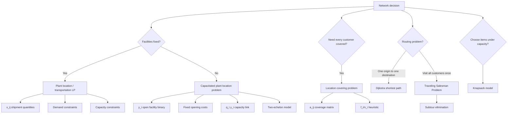

# Topic 09: Facility Location, Transportation, And Shipping

Source files:

- `supply-chain-management/raw/moodle-export-operations-950888956-s26-20260604/09 Facility Location Problems  Transportation and Shipping/Slides Facility Location Problems.pdf`
- `supply-chain-management/raw/moodle-export-operations-950888956-s26-20260604/09 Facility Location Problems  Transportation and Shipping/Slides Transportation  Shipping.pdf`
- `supply-chain-management/raw/moodle-export-operations-950888956-s26-20260604/09 Facility Location Problems  Transportation and Shipping/Exercise Facility Location, and Transportation  Shipping.xlsx`

Course: Supply Chain Management
Processed: 2026-06-04
Wiki note: `supply-chain-management/wiki/topic-09-facility-location-transportation-shipping/topic-09-facility-location-transportation-shipping.md`

Course logistics checked: the SCM exam allows a non-programmable calculator and one handwritten A4 cheat sheet, but no Excel. Topic 09 uses Excel Solver in the slides, so exam preparation should focus on model setup, variables, constraints, interpretation, and small hand-solvable examples.

## 80/20 Exam Summary

Topic 09 is an optimization-modeling block.

The core skill is not memorizing every slide. It is recognizing the decision type:

```text
ship from open facilities -> linear programming transportation model
open facilities and ship -> capacitated plant location problem
cover all customers -> location covering model
find shortest route between two nodes -> Dijkstra
visit every customer exactly once -> TSP
choose items under capacity -> knapsack
```

High-yield model families:

- Plant location linear program: continuous shipment quantities `x_ij`.
- Capacitated plant location problem (CPLP): shipment quantities `x_ij` plus binary facility-open variables `y_i`.
- Two-echelon plant location: facilities at two tiers, with fixed costs and capacities at both tiers.
- Location covering problem: binary variables choose facilities so every customer/constraint is covered.
- Dijkstra's algorithm: shortest path from one node to another.
- Traveling Salesman Problem (TSP): shortest tour visiting each customer exactly once.
- Knapsack: choose products/items to maximize value under container capacity.

## Where This Fits In SCM

Earlier topics answered questions such as:

- How much to order or produce? See [Topic 05 EOQ/EPQ](../topic-05-eoq-production-systems-batching/topic-05-eoq-production-systems-batching.md).
- How much capacity does a process have? See [Topic 08 OceanCove](../topic-08-oceancove-process-analysis-capacity-management/topic-08-oceancove-process-analysis-capacity-management.md).

Topic 09 asks:

```text
Where should facilities be located, which should be opened, and how should goods move through the network?
```

It is the bridge from process-level operations to network design.

## Plant Location Linear Program

### Decision Setting

You have:

- `m` plant facilities
- `n` customer locations
- each plant has capacity `K_i`
- each customer has demand `D_j`
- each route has cost `c_ij`
- decision variable `x_ij`: amount shipped from plant `i` to customer `j`

### Model

```text
min sum_i sum_j c_ij x_ij

subject to:
sum_i x_ij >= D_j        for each customer j
sum_j x_ij <= K_i        for each plant i
x_ij >= 0
```

Interpretation:

- Demand constraints make sure every customer is served.
- Capacity constraints make sure plants do not ship more than they can produce.
- The objective minimizes production-and-shipping cost.

Exam trap:

```text
Demand constraints are customer-side; capacity constraints are plant-side.
```

### Graphical Solution Logic

The graphical example has two plants and one customer:

```text
K1 = 100, K2 = 50, D1 = 30
c11 = 80, c21 = 120
```

The feasible region is defined by:

```text
x11 + x21 >= 30
x11 <= 100
x21 <= 50
x11 >= 0
x21 >= 0
```

The low-cost solution is to use the cheaper plant first:

```text
x11 = 30, x21 = 0
cost = 80*30 + 120*0 = 2400
```

Graphical solutions work only for two or maybe three variables. The deck uses this to motivate solvers.

## Solvers And Sensitivity

For larger linear programs, the slides introduce Excel Solver and IBM CPLEX.

Solver workflow:

1. Insert parameters.
2. Create empty cells for decision variables.
3. Write the objective function as a spreadsheet formula.
4. Write constraints using formulas.
5. Tell Solver the objective cell, decision-variable cells, and constraints.
6. Keep non-negativity activated.
7. Use Simplex LP for linear problems.
8. Request a sensitivity report when useful.

Sensitivity report:

```text
The shadow price column is usually the most useful.
```

Interpretation:

```text
A shadow price tells how much the objective changes if the right-hand side of a binding constraint increases by one unit, within the allowable range.
```

Exam trap: a shadow price is not the same as the unit shipping cost `c_ij`.

## Capacitated Plant Location Problem

### Single-Echelon CPLP

CPLP adds a fixed-cost decision:

```text
y_i = 1 if plant i is opened, 0 otherwise
x_ij = amount shipped from plant i to customer j
```

Model:

```text
min sum_i sum_j c_ij x_ij + sum_i f_i y_i

subject to:
sum_i x_ij = d_j             for each customer j
sum_j x_ij <= q_i y_i        for each plant i
x_ij >= 0
y_i in {0,1}
```

Interpretation:

- If `y_i = 0`, then `q_i y_i = 0`, so plant `i` cannot ship anything.
- If `y_i = 1`, plant `i` can ship up to capacity `q_i`.
- Fixed costs make the model a mixed-integer problem.

### Exercise 1b: Two-Plant CPLP

Workbook facts:

- Plant 1 capacity: `100 units/day`.
- Plant 2 capacity: `80 units/day`.
- Customer 1 demand: `40 units/day`.
- Customer 2 demand: `50 units/day`.
- Opening either plant costs `EUR 1,000,000`.
- Production cost: `EUR 15/unit`.
- Logistics cost: `EUR 0.20 per unit per km`.
- Shipping occurs `365 days/year`.
- Stable demand for `10 years`.
- Discount rate: `10%`.
- Costs occur at year end.

Distances:

| Route | Distance | Daily Unit Cost |
|---|---:|---:|
| P1 -> C1 | 60 km | `15 + 0.20*60 = EUR 27` |
| P1 -> C2 | 70 km | `15 + 0.20*70 = EUR 29` |
| P2 -> C1 | 40 km | `15 + 0.20*40 = EUR 23` |
| P2 -> C2 | 30 km | `15 + 0.20*30 = EUR 21` |

Discount factor for ten end-of-year operating costs:

```text
sum_{n=1}^{10} 1/(1.10)^n = 6.1446
```

Feasible plans:

| Plan | Flow | Total Present Cost |
|---|---|---:|
| Open P1 only | P1 supplies C1=40, C2=50 | `EUR 6,674,200` |
| Open P2 only | infeasible because capacity 80 < demand 90 | infeasible |
| Open both | P2 supplies all C2=50 and C1=30; P1 supplies remaining C1=10 | `EUR 6,507,962` |

Best plan from these data:

```text
Open both plants.
```

Reason:

```text
Opening P2 adds fixed cost, but its lower route costs save enough discounted operating cost to offset the extra EUR 1,000,000.
```

## Two-Echelon Plant Location Model

The two-echelon model adds another tier:

```text
Tier 2 suppliers -> Tier 1 manufacturing plants -> Tier 0 retailers/customers
```

Sets in the slide:

- `V0`: retailers/customers
- `V1`: tier-1 facilities
- `V2`: tier-2 facilities

Decision variables:

- `x_ijk`: flow serving customer `i` through tier-1 facility `j` and tier-2 facility `k`
- `y_1j`: whether tier-1 facility `j` opens
- `y_2k`: whether tier-2 facility `k` opens

Model structure:

```text
min sum_i sum_j sum_k c_ijk x_ijk + sum_j f_1j y_1j + sum_k f_2k y_2k

subject to:
sum_j sum_k x_ijk = d_i             for each customer i
sum_i sum_k x_ijk <= q_1j y_1j      for each tier-1 facility j
sum_i sum_j x_ijk <= q_2k y_2k      for each tier-2 facility k
x_ijk >= 0
y_1j, y_2k in {0,1}
```

Managerial interpretation:

```text
Network design decisions compound across tiers. Opening too little capacity at either tier constrains the whole supply network.
```

## Location Covering Problem

### Model

Use this model when the question is:

```text
Which facilities should be opened so every customer is covered at least once?
```

Variables:

- `y_i`: 1 if facility `i` opens, 0 otherwise
- `f_i`: fixed cost of opening facility `i`
- `a_ij`: 1 if facility `i` can serve customer `j`, 0 otherwise

Model:

```text
min sum_i f_i y_i

subject to:
sum_i a_ij y_i >= 1        for each customer j
y_i in {0,1}
```

### Lecture Heuristic

1. Open all plants with `f_i = 0`.
2. Set `y_i = 0` if plant `i` does not appear in any remaining constraint.
3. For remaining plants, compute `f_i / n_i`, where `n_i` is the number of remaining constraints covered by plant `i`.
4. Open the plant with the smallest `f_i / n_i`; if tied, choose the smallest index.
5. Remove all constraints covered by the selected plant.
6. Repeat until all constraints are covered.

Important warning:

```text
A heuristic may be fast and intuitive but not necessarily optimal.
```

### Workbook Covering Exercise

Workbook task 2b uses:

```text
min 2y1 + 0y2 + 1y3 + 4y4
```

Subject to:

```text
y1 + y2 + y3 + y4 >= 1
y1 + y3 + y4 >= 1
y1 + y2 + y4 >= 1
y2 + y4 >= 1
y1 + y4 >= 1
```

Heuristic solution:

```text
Step 1: open y2 because f2 = 0.
Remaining constraints require coverage by y1, y3, or y4.
Choose y1 because f1/n1 = 2/2 = 1 ties y3/n3 = 1/1 = 1, and lower index wins.
Solution: y1 = 1, y2 = 1, y3 = 0, y4 = 0.
Cost = 2.
```

This workbook instance appears optimal because `y2` is free and the remaining uncovered constraint needs either `y1` or `y4`, with `y1` cheaper.

The lecture slide example uses a different zero-cost facility and explicitly shows that the heuristic can be non-optimal. Keep both ideas:

```text
The heuristic can work on a small instance but is not guaranteed to be optimal.
```

## Transportation And Shipping

### Shortest Path Problem

Question:

```text
What is the shortest path from a plant to one customer?
```

Use:

```text
Dijkstra's algorithm
```

### Dijkstra's Algorithm

The deck's algorithm:

1. Mark all nodes unvisited.
2. Set the initial node's tentative distance to zero and all others to infinity.
3. From the current node, compute tentative distances through it for all unvisited neighbors.
4. Keep the smaller distance if the new route improves the current label.
5. Mark the current node as visited.
6. Stop when the destination is visited or all reachable nodes are done.
7. Otherwise choose the unvisited node with the smallest tentative distance and repeat.

Slide example result:

```text
Shortest path from node 0 to node 3 is via node 2.
Total length = 10.
```

Running time:

```text
O(V^2)
```

The deck notes faster implementations are possible with more advanced data structures, but those are outside the course scope.

## Traveling Salesman Problem

Question:

```text
Find the shortest tour that visits each customer exactly once.
```

The symmetric TSP slide uses:

- `V`: set of vertices/nodes, including the plant
- `E`: set of edges/connections
- `c_ij`: length of edge `(i,j)`
- `x_ij`: binary decision variable, 1 if edge `(i,j)` is used

Model structure:

```text
min sum_(i,j in E) c_ij x_ij
```

Degree constraint:

```text
each node must have degree 2
```

Subtour warning:

```text
Degree constraints alone can produce disconnected cycles.
```

Therefore, TSP needs subtour-elimination constraints ensuring every selected cycle connects into one full tour.

Exam trap:

```text
A solution can have the correct degree at every node and still be invalid because it contains subtours.
```

## Knapsack Problem

Question:

```text
Which products should be placed in one container to maximize value?
```

Variables and parameters:

- `v_i`: value of product `i`
- `w_i`: width or capacity consumption of product `i`
- `W`: container width/capacity
- `x_i`: 1 if product `i` is selected, 0 otherwise

Model:

```text
max sum_i v_i x_i

subject to:
sum_i w_i x_i <= W
x_i in {0,1}
```

The deck emphasizes that this is a combinatorial problem. The number of possible item combinations grows quickly.

## Hotelling Competition

The facility-location slides close with Hotelling competition visuals. The core conceptual point:

```text
Facility location is not only a cost-minimization problem. If firms compete for customers along a market line, strategic interaction can pull locations toward competitors or toward the market center.
```

Use this as a qualitative extension, not as a main calculation method unless the exam prompt gives explicit Hotelling assumptions.

## Diagrams, Tables, And Visuals

### Plant-Location Network

The network diagram maps plants to customers, with capacities at plants, demands at customers, and route costs. This visual translates directly into `x_ij` variables.

### Graphical LP

The graph shows constraints carving out a feasible region. The objective is evaluated at corners. For higher-dimensional problems, checking all corners becomes infeasible, motivating Simplex/Solver.

### CPLP Network

The CPLP diagram adds fixed opening costs and binary open/closed decisions. It is the shift from "how much to ship" to "which facilities exist and how much to ship."

### Dijkstra Network

Nodes are locations and edge labels are distances/costs. Tentative distance labels update until the shortest path is locked in.

### TSP Network

The TSP diagram shows why local edge choices can create subtours. The model needs constraints that force one connected route.

## Visual Knowledge Map



## Subject Knowledge Graph

| Node | Meaning | Exam Relevance |
|---|---|---|
| Plant Location LP | Min-cost shipment model with fixed facilities | Core continuous optimization setup. |
| Shipment Variable `x_ij` | Amount shipped from plant `i` to customer `j` | Main decision variable in transportation models. |
| Demand Constraint | Ensures each customer demand is served | Common sign error risk. |
| Capacity Constraint | Ensures each plant does not exceed capacity | Common sign error risk. |
| Solver | Tool for larger LP/MIP problems | Know setup and interpretation, not button memorization. |
| Shadow Price | Objective change from one extra unit of RHS in a binding constraint | Sensitivity-report concept. |
| CPLP | Facility-opening plus shipment model | Adds binary variables and fixed costs. |
| Binary Open Variable `y_i` | 1 if facility opens, 0 otherwise | Links fixed cost and usable capacity. |
| Two-Echelon Model | Network design across two facility tiers | Shows multi-tier capacity and fixed-cost logic. |
| Location Covering Problem | Choose facilities so every customer is covered | Binary coverage model. |
| Dijkstra's Algorithm | Shortest-path algorithm | Routing calculation method. |
| TSP | Shortest tour visiting each customer once | Requires degree and subtour constraints. |
| Knapsack | Select items to maximize value under capacity | Binary combinatorial model. |

| From | Relationship | To | Why It Matters |
|---|---|---|---|
| Plant Location LP | minimizes | Shipping/production cost | Basic network-cost model. |
| Demand Constraint | protects | Customer service | Every customer must be served. |
| Capacity Constraint | limits | Plant shipments | Plants cannot ship above capacity. |
| CPLP | adds | Fixed opening costs | Facility decisions are strategic and binary. |
| `y_i` | activates | Capacity `q_i y_i` | Closed facilities cannot ship. |
| Location Covering | uses | Coverage matrix `a_ij` | Encodes who can serve whom. |
| Heuristic | approximates | Covering solution | Fast but not always optimal. |
| Dijkstra | solves | Shortest path | One origin-to-destination route. |
| TSP | solves | Shortest full tour | Visit every customer once. |
| Subtour Elimination | prevents | Disconnected cycles | Degree constraints alone are insufficient. |
| Knapsack | chooses | Highest-value feasible item set | Container/loading abstraction. |

## Real Business Examples

- A manufacturer deciding which German warehouse should serve Munich and Hamburg customers is solving a plant-location/shipping problem.
- An e-commerce company deciding whether to open a second fulfillment center faces a CPLP-style fixed-cost versus shipping-cost tradeoff.
- A pharmacy chain ensuring every neighborhood is within a service radius is a location covering problem.
- A courier selecting the shortest path to one delivery address uses shortest-path logic.
- A delivery route visiting many customers before returning to the depot resembles TSP.
- A freight forwarder choosing which products fit in a container resembles knapsack.

## Exam Relevance

Likely prompts:

- Formulate a plant-location LP from a network.
- Identify decision variables, objective, demand constraints, and capacity constraints.
- Explain when `y_i` is needed.
- Interpret `q_i y_i`.
- Explain why graphical LP does not scale and why solvers are used.
- Apply Dijkstra's algorithm to a small network.
- Distinguish shortest path from TSP.
- Explain subtour elimination.
- Apply or critique a covering heuristic.

Common traps:

- Using `x_ij` as binary in a transportation LP when shipment amounts are continuous.
- Forgetting fixed opening costs in CPLP.
- Allowing shipments from a closed plant by omitting `q_i y_i`.
- Reversing demand and capacity constraint signs.
- Treating a heuristic as guaranteed optimal.
- Confusing shortest path with TSP.
- Accepting a TSP solution with disconnected subtours.
- Forgetting to discount operating costs in a multi-year facility decision.

How to structure a high-scoring answer:

1. Name the decision type.
2. Define sets, parameters, and variables.
3. Write the objective.
4. Write demand, capacity, and binary/opening constraints.
5. State what the solution means operationally.
6. If using an algorithm, show the step logic, not only the final number.

## Retrieval Prompts

Closed-book questions:

1. What does `x_ij` mean in a plant-location LP?
2. What does `y_i` mean in a CPLP?
3. Why does `sum_j x_ij <= q_i y_i` prevent shipments from a closed plant?
4. What is a shadow price?
5. What is the difference between Dijkstra and TSP?
6. Why are subtour-elimination constraints needed?
7. What does `a_ij` mean in a location covering problem?

Application prompts:

1. A plant can serve two customers but has limited capacity. Write the capacity constraint.
2. A customer must be served by at least one open facility within 30 minutes. Write the covering constraint.
3. A facility has high fixed cost but low shipping cost. Explain the CPLP tradeoff.
4. A route visits all nodes but splits into two cycles. What TSP constraint family is violated?
5. A container has limited width and products have values. Which model applies?

## Practice Tasks

1. Formulate a two-plant, three-customer transportation LP with capacities and demands.
2. Add fixed opening costs to that model and convert it to a CPLP.
3. Using the workbook CPLP facts, explain why opening both plants can beat opening only plant 1.
4. Apply the location covering heuristic to the workbook constraints and show the chosen facilities.
5. Run Dijkstra by hand on a four-node network and keep a tentative-distance table.
6. Give one example of a subtour and explain why it is invalid for TSP.

## Connections

Previous notes from this lecture:

- [Topic 05 EOQ, Production Systems, And Batching](../topic-05-eoq-production-systems-batching/topic-05-eoq-production-systems-batching.md): local lot sizing versus network cost decisions.
- [Topic 08 OceanCove Process Analysis](../topic-08-oceancove-process-analysis-capacity-management/topic-08-oceancove-process-analysis-capacity-management.md): process capacity becomes a facility/network capacity constraint.
- [Topic 06 Bullwhip](../topic-06-supply-chain-coordination-bullwhip-effect/topic-06-supply-chain-coordination-bullwhip-effect.md): network design can reduce or worsen coordination problems.

Cross-course links:

- Finance: the CPLP exercise uses discounted multi-year operating costs plus fixed investment cost.
- Marketing: Hotelling competition links customer location, competition, and market coverage.
- Organization: multi-tier network design creates coordination and control problems.

## Open Uncertainties

- The workbook's Dijkstra exercise network is embedded as a drawing/EMF-style object that could not be reliably extracted as a clean solved path. The note therefore includes the slide example result and the algorithm, but does not invent a numeric answer for workbook Task 1a.
- Excel Solver screenshots are operational instructions, not exam concepts. They are summarized only to the extent needed to understand model setup and sensitivity interpretation.

## Weakness Flags

- Pending active recall: no first-pass retrieval has been completed yet.
- Highest-risk distinctions: continuous `x_ij` versus binary `y_i`, capacity versus demand constraints, shortest path versus TSP, and heuristic versus optimal solution.
