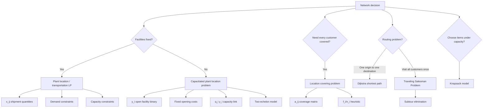

# Topic 09: Facility Location, Transportation, And Shipping

Source files:

- `supply-chain-management/raw/moodle-export-operations-950888956-s26-20260604/09 Facility Location Problems  Transportation and Shipping/Slides Facility Location Problems.pdf`
- `supply-chain-management/raw/moodle-export-operations-950888956-s26-20260604/09 Facility Location Problems  Transportation and Shipping/Slides Transportation  Shipping.pdf`
- `supply-chain-management/raw/moodle-export-operations-950888956-s26-20260604/09 Facility Location Problems  Transportation and Shipping/Exercise Facility Location, and Transportation  Shipping.xlsx`

Course: Supply Chain Management
Processed: 2026-06-04
Wiki note: `supply-chain-management/wiki/topic-09-facility-location-transportation-shipping/topic-09-facility-location-transportation-shipping.md`

Course logistics checked: the SCM exam allows a non-programmable calculator and one handwritten A4 cheat sheet, but no Excel. Topic 09 uses Excel Solver in the slides, so exam preparation should focus on model setup, variables, constraints, interpretation, and small hand-solvable examples.

## 80/20 Exam Summary

Topic 09 is an optimization-modeling block.

The core skill is not memorizing every slide. It is recognizing the decision type:

```text
ship from open facilities -> linear programming transportation model
open facilities and ship -> capacitated plant location problem
cover all customers -> location covering model
find shortest route between two nodes -> Dijkstra
visit every customer exactly once -> TSP
choose items under capacity -> knapsack
```

High-yield model families:

- Plant location linear program: continuous shipment quantities `x_ij`.
- Capacitated plant location problem (CPLP): shipment quantities `x_ij` plus binary facility-open variables `y_i`.
- Two-echelon plant location: facilities at two tiers, with fixed costs and capacities at both tiers.
- Location covering problem: binary variables choose facilities so every customer/constraint is covered.
- Dijkstra's algorithm: shortest path from one node to another.
- Traveling Salesman Problem (TSP): shortest tour visiting each customer exactly once.
- Knapsack: choose products/items to maximize value under container capacity.

## Where This Fits In SCM

Earlier topics answered questions such as:

- How much to order or produce? See [Topic 05 EOQ/EPQ](../topic-05-eoq-production-systems-batching/topic-05-eoq-production-systems-batching.md).
- How much capacity does a process have? See [Topic 08 OceanCove](../topic-08-oceancove-process-analysis-capacity-management/topic-08-oceancove-process-analysis-capacity-management.md).

Topic 09 asks:

```text
Where should facilities be located, which should be opened, and how should goods move through the network?
```

It is the bridge from process-level operations to network design.

## Plant Location Linear Program

### Decision Setting

You have:

- `m` plant facilities
- `n` customer locations
- each plant has capacity `K_i`
- each customer has demand `D_j`
- each route has cost `c_ij`
- decision variable `x_ij`: amount shipped from plant `i` to customer `j`

### Model

```text
min sum_i sum_j c_ij x_ij

subject to:
sum_i x_ij >= D_j        for each customer j
sum_j x_ij <= K_i        for each plant i
x_ij >= 0
```

Interpretation:

- Demand constraints make sure every customer is served.
- Capacity constraints make sure plants do not ship more than they can produce.
- The objective minimizes production-and-shipping cost.

Exam trap:

```text
Demand constraints are customer-side; capacity constraints are plant-side.
```

### Graphical Solution Logic

The graphical example has two plants and one customer:

```text
K1 = 100, K2 = 50, D1 = 30
c11 = 80, c21 = 120
```

Notation:

```text
x11 = amount shipped from plant 1 to customer 1
x21 = amount shipped from plant 2 to customer 1
```

The graph is therefore not a physical map. It is a graph of possible shipment plans:

```text
horizontal axis = x11
vertical axis   = x21
```

If a slide label shows `x12` in this one-customer example, read it as the second route variable in the graph. With `n = 1`, the mathematically relevant second shipment variable is `x21`.

The feasible region is defined by:

```text
x11 + x21 >= 30
x11 <= 100
x21 <= 50
x11 >= 0
x21 >= 0
```

Interpret each constraint:

| Constraint | Meaning | Visual effect |
|---|---|---|
| `x11 + x21 >= 30` | Customer 1 must receive at least 30 units. | Feasible area is on/above the demand line. |
| `x11 <= 100` | Plant 1 cannot ship more than 100 units. | Right boundary. |
| `x21 <= 50` | Plant 2 cannot ship more than 50 units. | Upper boundary. |
| `x11 >= 0`, `x21 >= 0` | Negative shipping is impossible. | Only first quadrant is allowed. |

Every point in the feasible region is a candidate shipping plan:

| Point | Operational meaning | Feasible? |
|---|---|---|
| `(30, 0)` | Ship 30 from plant 1 and 0 from plant 2. | Yes, total shipment is 30. |
| `(10, 20)` | Ship 10 from plant 1 and 20 from plant 2. | Yes, total shipment is 30. |
| `(0, 30)` | Ship 0 from plant 1 and 30 from plant 2. | Yes, total shipment is 30. |
| `(10, 10)` | Ship 10 from plant 1 and 10 from plant 2. | No, total shipment is only 20. |

The low-cost solution is to use the cheaper plant first:

```text
x11 = 30, x21 = 0
cost = 80*30 + 120*0 = 2400
```

Full corner-check intuition:

```text
Candidate on demand line: (30, 0)
z = 80*30 + 120*0
z = 2400

Candidate on demand line: (10, 20)
z = 80*10 + 120*20
z = 800 + 2400
z = 3200

Candidate on demand line: (0, 30)
z = 80*0 + 120*30
z = 3600
```

Because `c11 = 80` is cheaper than `c21 = 120`, the cheapest feasible plan uses plant 1 first. The economic logic is:

```text
Every unit moved from plant 2 to plant 1 saves 120 - 80 = 40 cost units.
```

Graphical solutions work only for two or maybe three variables. The deck uses this to motivate solvers.

## Solvers And Sensitivity

For larger linear programs, the slides introduce Excel Solver and IBM CPLEX.

Solver workflow:

1. Insert parameters.
2. Create empty cells for decision variables.
3. Write the objective function as a spreadsheet formula.
4. Write constraints using formulas.
5. Tell Solver the objective cell, decision-variable cells, and constraints.
6. Keep non-negativity activated.
7. Use Simplex LP for linear problems.
8. Request a sensitivity report when useful.

Sensitivity report:

```text
The shadow price column is usually the most useful.
```

Interpretation:

```text
A shadow price tells how much the objective changes if the right-hand side of a binding constraint increases by one unit, within the allowable range.
```

Exam trap: a shadow price is not the same as the unit shipping cost `c_ij`.

## Capacitated Plant Location Problem

### Single-Echelon CPLP

CPLP adds a fixed-cost decision:

```text
y_i = 1 if plant i is opened, 0 otherwise
x_ij = amount shipped from plant i to customer j
```

Model:

```text
min sum_i sum_j c_ij x_ij + sum_i f_i y_i

subject to:
sum_i x_ij = d_j             for each customer j
sum_j x_ij <= q_i y_i        for each plant i
x_ij >= 0
y_i in {0,1}
```

Interpretation:

- If `y_i = 0`, then `q_i y_i = 0`, so plant `i` cannot ship anything.
- If `y_i = 1`, plant `i` can ship up to capacity `q_i`.
- Fixed costs make the model a mixed-integer problem.

### Exercise 1b: Two-Plant CPLP

The workbook asks for a **Capacitated Plant Location Problem (CPLP)**, not a simple transportation LP.

Managerial question:

```text
Which plant(s) should be opened, and how should daily demand be allocated to open plants?
```

Why this is CPLP:

```text
Transportation LP = all plants already exist; choose xij only.
CPLP = plants may or may not be opened; choose yi and xij.
```

Decision variables:

| Variable | Meaning | Type |
|---|---|---|
| `x11` | units/day shipped from plant 1 to customer 1 | continuous |
| `x12` | units/day shipped from plant 1 to customer 2 | continuous |
| `x21` | units/day shipped from plant 2 to customer 1 | continuous |
| `x22` | units/day shipped from plant 2 to customer 2 | continuous |
| `y1` | 1 if plant 1 opens, 0 otherwise | binary |
| `y2` | 1 if plant 2 opens, 0 otherwise | binary |

Workbook facts:

- Plant 1 capacity: `100 units/day`.
- Plant 2 capacity: `80 units/day`.
- Customer 1 demand: `40 units/day`.
- Customer 2 demand: `50 units/day`.
- Opening either plant costs `EUR 1,000,000`.
- Production cost: `EUR 15/unit`.
- Logistics cost: `EUR 0.20 per unit per km`.
- Shipping occurs `365 days/year`.
- Stable demand for `10 years`.
- Discount rate: `10%`.
- Costs occur at year end.

Distances:

| Route | Distance | Daily Unit Cost |
|---|---:|---:|
| P1 -> C1 | 60 km | `15 + 0.20*60 = EUR 27` |
| P1 -> C2 | 70 km | `15 + 0.20*70 = EUR 29` |
| P2 -> C1 | 40 km | `15 + 0.20*40 = EUR 23` |
| P2 -> C2 | 30 km | `15 + 0.20*30 = EUR 21` |

Full daily variable-cost calculations:

```text
c11 = production cost + logistics cost per km * distance
c11 = 15 + 0.20*60
c11 = 15 + 12
c11 = EUR 27 per unit per day-route

c12 = 15 + 0.20*70
c12 = 15 + 14
c12 = EUR 29 per unit per day-route

c21 = 15 + 0.20*40
c21 = 15 + 8
c21 = EUR 23 per unit per day-route

c22 = 15 + 0.20*30
c22 = 15 + 6
c22 = EUR 21 per unit per day-route
```

Discount factor for ten end-of-year operating costs:

```text
PV factor = sum_{n=1}^{10} 1/(1.10)^n
PV factor = 1/1.10 + 1/1.10^2 + ... + 1/1.10^10
PV factor = 6.144567
```

Convert one daily shipment unit into a ten-year present-value route coefficient:

```text
PV route coefficient = daily route cost * 365 * PV factor
```

| Route | Formula | Substitution | Result |
|---|---|---|---:|
| P1 -> C1 | `c11 * 365 * PV factor` | `27 * 365 * 6.144567` | `EUR 60,554.71` |
| P1 -> C2 | `c12 * 365 * PV factor` | `29 * 365 * 6.144567` | `EUR 65,040.24` |
| P2 -> C1 | `c21 * 365 * PV factor` | `23 * 365 * 6.144567` | `EUR 51,583.64` |
| P2 -> C2 | `c22 * 365 * PV factor` | `21 * 365 * 6.144567` | `EUR 47,098.11` |

Numerical objective:

```text
min z =
60554.71*x11 + 65040.24*x12
+ 51583.64*x21 + 47098.11*x22
+ 1000000*y1 + 1000000*y2
```

Demand constraints:

```text
x11 + x21 = 40      customer 1 demand
x12 + x22 = 50      customer 2 demand
```

Capacity activation constraints:

```text
x11 + x12 <= 100*y1     plant 1 capacity
x21 + x22 <= 80*y2      plant 2 capacity
```

Why `Ki*yi` matters:

```text
If y1 = 0, then x11 + x12 <= 100*0 = 0, so plant 1 ships nothing.
If y1 = 1, then x11 + x12 <= 100, so plant 1 can ship up to capacity.
```

Variable restrictions:

```text
xij >= 0
y1, y2 in {0,1}
```

Because there are only two plants, the opening combinations can be checked by hand.

#### Plan A: Open Plant 1 Only

Decision:

```text
y1 = 1, y2 = 0
```

Capacity check:

```text
total demand = 40 + 50 = 90 units/day
plant 1 capacity = 100 units/day
90 <= 100, so feasible
```

Shipment plan:

```text
x11 = 40
x12 = 50
x21 = 0
x22 = 0
```

Variable present cost:

```text
variable PV = 60554.71*40 + 65040.24*50
variable PV = 2,422,188.35 + 3,252,012.14
variable PV = EUR 5,674,200.49
```

Fixed opening cost:

```text
fixed cost = 1000000*y1 + 1000000*y2
fixed cost = 1000000*1 + 1000000*0
fixed cost = EUR 1,000,000
```

Total present cost:

```text
total PV = variable PV + fixed cost
total PV = 5,674,200.49 + 1,000,000
total PV = EUR 6,674,200.49
```

#### Plan B: Open Plant 2 Only

Decision:

```text
y1 = 0, y2 = 1
```

Capacity check:

```text
total demand = 90 units/day
plant 2 capacity = 80 units/day
90 > 80, so infeasible
```

Conclusion:

```text
Plant 2 alone cannot serve all daily demand.
```

#### Plan C: Open Both Plants

Decision:

```text
y1 = 1, y2 = 1
```

Capacity check:

```text
total capacity = 100 + 80 = 180 units/day
total demand = 90 units/day
180 >= 90, so feasible
```

Route-choice logic:

```text
P2 is cheaper for C1: 23 < 27, saving 4 EUR/unit/day-route.
P2 is cheaper for C2: 21 < 29, saving 8 EUR/unit/day-route.
```

Because plant 2 is cheaper for both customers but has only 80 units/day capacity, allocate plant 2 first to the customer where it saves the most:

```text
saving on C2 = 29 - 21 = 8
saving on C1 = 27 - 23 = 4
```

So:

```text
Use plant 2 for all C2 demand first: x22 = 50.
Remaining plant 2 capacity = 80 - 50 = 30.
Use remaining plant 2 capacity for C1: x21 = 30.
C1 still needs 40 - 30 = 10 from plant 1: x11 = 10.
Plant 1 sends nothing to C2: x12 = 0.
```

Shipment plan:

```text
x11 = 10
x12 = 0
x21 = 30
x22 = 50
```

Demand check:

```text
C1: x11 + x21 = 10 + 30 = 40 -> demand met
C2: x12 + x22 = 0 + 50 = 50 -> demand met
```

Capacity check:

```text
P1: x11 + x12 = 10 + 0 = 10 <= 100*y1 = 100
P2: x21 + x22 = 30 + 50 = 80 <= 80*y2 = 80
```

Variable present cost:

```text
variable PV =
60554.71*10 + 65040.24*0 + 51583.64*30 + 47098.11*50

variable PV =
605,547.09 + 0 + 1,547,509.23 + 2,354,905.34

variable PV = EUR 4,507,961.66
```

Fixed opening cost:

```text
fixed cost = 1000000*y1 + 1000000*y2
fixed cost = 1000000*1 + 1000000*1
fixed cost = EUR 2,000,000
```

Total present cost:

```text
total PV = variable PV + fixed cost
total PV = 4,507,961.66 + 2,000,000
total PV = EUR 6,507,961.66
```

Comparison:

| Plan | Flow | Total Present Cost |
|---|---|---:|
| Open P1 only | P1 supplies C1=40, C2=50 | `EUR 6,674,200.49` |
| Open P2 only | infeasible because capacity 80 < demand 90 | infeasible |
| Open both | P2 supplies all C2=50 and C1=30; P1 supplies remaining C1=10 | `EUR 6,507,961.66` |

Best plan from these data:

```text
Open both plants.
```

Reason:

```text
Opening P2 adds EUR 1,000,000 fixed cost.
But variable-cost savings versus P1-only are:

5,674,200.49 - 4,507,961.66 = EUR 1,166,238.84

Because EUR 1,166,238.84 > EUR 1,000,000, opening both plants is cheaper overall.
```

Managerial interpretation:

```text
Plant 2 is operationally cheaper but not large enough alone. The optimal network uses plant 2 fully on the best-saving routes and keeps plant 1 open for the remaining demand.
```

Exam trap:

```text
Do not compare only daily route costs. CPLP compares fixed opening cost plus discounted multi-year operating cost.
```

## Two-Echelon Plant Location Model

The two-echelon model adds another tier:

```text
Tier 2 suppliers -> Tier 1 manufacturing plants -> Tier 0 retailers/customers
```

Sets in the slide:

- `V0`: retailers/customers
- `V1`: tier-1 facilities
- `V2`: tier-2 facilities

Decision variables:

- `x_ijk`: flow serving customer `i` through tier-1 facility `j` and tier-2 facility `k`
- `y_1j`: whether tier-1 facility `j` opens
- `y_2k`: whether tier-2 facility `k` opens

Model structure:

```text
min sum_i sum_j sum_k c_ijk x_ijk + sum_j f_1j y_1j + sum_k f_2k y_2k

subject to:
sum_j sum_k x_ijk = d_i             for each customer i
sum_i sum_k x_ijk <= q_1j y_1j      for each tier-1 facility j
sum_i sum_j x_ijk <= q_2k y_2k      for each tier-2 facility k
x_ijk >= 0
y_1j, y_2k in {0,1}
```

Managerial interpretation:

```text
Network design decisions compound across tiers. Opening too little capacity at either tier constrains the whole supply network.
```

### Constructed Two-Echelon Worked Example

This example is constructed for study and recall. The Moodle workbook does not provide a numeric two-echelon exercise like the CPLP workbook task, so this example is a small hand-solvable version of the slide model.

Use case:

```text
An e-commerce company can source products from suppliers, move them through distribution centers, and serve retailers.
The decision is which suppliers and distribution centers to open, and which full path each retailer's demand should use.
```

Network layers:

```text
Tier 2: suppliers S1, S2
Tier 1: distribution centers A, B
Tier 0: retailers R1, R2
```

Demand:

| Retailer | Demand |
|---|---:|
| `R1` (`i=1`) | 30 units/day |
| `R2` (`i=2`) | 20 units/day |

Tier-1 distribution centers:

| DC | Notation | Capacity | Fixed opening cost |
|---|---|---:|---:|
| A | `j=1` | 50 units/day | 70 |
| B | `j=2` | 50 units/day | 50 |

Tier-2 suppliers:

| Supplier | Notation | Capacity | Fixed opening cost |
|---|---|---:|---:|
| S1 | `k=1` | 50 units/day | 40 |
| S2 | `k=2` | 50 units/day | 40 |

All-in unit path costs `c_ijk`:

| Retailer | Via DC A + S1 | Via DC A + S2 | Via DC B + S1 | Via DC B + S2 |
|---|---:|---:|---:|---:|
| R1 | 6 | 11 | 9 | 13 |
| R2 | 10 | 8 | 9 | 5 |

Interpretation of a path:

```text
c_121 = cost to serve retailer i=1 through DC j=2 and supplier k=1.
That is R1 via B and S1.
```

Decision variables:

```text
x111 = flow to R1 through A and S1
x112 = flow to R1 through A and S2
x121 = flow to R1 through B and S1
x122 = flow to R1 through B and S2

x211 = flow to R2 through A and S1
x212 = flow to R2 through A and S2
x221 = flow to R2 through B and S1
x222 = flow to R2 through B and S2
```

Opening variables:

```text
y11 = 1 if DC A opens
y12 = 1 if DC B opens
y21 = 1 if supplier S1 opens
y22 = 1 if supplier S2 opens
```

#### Step 1: Write The Demand Constraints

Each retailer's demand must be fully assigned to one or more paths.

```text
R1 demand:
x111 + x112 + x121 + x122 = 30

R2 demand:
x211 + x212 + x221 + x222 = 20
```

Interpretation:

```text
The model does not care only which DC is open. It must assign every retailer's units to a full supplier-DC-retailer path.
```

#### Step 2: Write Tier-1 Capacity Activation

DC A capacity:

```text
x111 + x112 + x211 + x212 <= 50*y11
```

DC B capacity:

```text
x121 + x122 + x221 + x222 <= 50*y12
```

Interpretation:

```text
If y11 = 0, all flows through DC A must be zero.
If y11 = 1, DC A can handle up to 50 units/day.
```

#### Step 3: Write Tier-2 Capacity Activation

Supplier S1 capacity:

```text
x111 + x121 + x211 + x221 <= 50*y21
```

Supplier S2 capacity:

```text
x112 + x122 + x212 + x222 <= 50*y22
```

Interpretation:

```text
Opening a DC alone is not enough. The supplier tier must also be open and capacitated for the selected path.
```

#### Step 4: Compare Candidate Opening Plans

The three calculations below show the main tradeoff patterns in detail. After that, an exhaustive table checks every feasible open-set combination.

##### Candidate 1: Open A And S1 Only

Opening decision:

```text
y11 = 1, y12 = 0, y21 = 1, y22 = 0
```

Allowed paths:

```text
R1 can only use A + S1.
R2 can only use A + S1.
```

Flow:

```text
x111 = 30
x211 = 20
all other xijk = 0
```

Capacity checks:

```text
DC A flow = 30 + 20 = 50 <= 50*y11 = 50
Supplier S1 flow = 30 + 20 = 50 <= 50*y21 = 50
```

Variable cost:

```text
variable cost = 6*30 + 10*20
variable cost = 180 + 200
variable cost = 380
```

Fixed cost:

```text
fixed cost = 70*y11 + 50*y12 + 40*y21 + 40*y22
fixed cost = 70*1 + 50*0 + 40*1 + 40*0
fixed cost = 110
```

Total cost:

```text
total cost = 380 + 110 = 490
```

##### Candidate 2: Open B And S2 Only

Opening decision:

```text
y11 = 0, y12 = 1, y21 = 0, y22 = 1
```

Flow:

```text
x122 = 30
x222 = 20
all other xijk = 0
```

Variable cost:

```text
variable cost = 13*30 + 5*20
variable cost = 390 + 100
variable cost = 490
```

Fixed cost:

```text
fixed cost = 70*0 + 50*1 + 40*0 + 40*1
fixed cost = 90
```

Total cost:

```text
total cost = 490 + 90 = 580
```

Interpretation:

```text
B + S2 is excellent for R2 but expensive for R1, so the lower fixed cost does not save the plan.
```

##### Candidate 3: Open A, B, S1, And S2

Opening decision:

```text
y11 = 1, y12 = 1, y21 = 1, y22 = 1
```

Now the model can choose the cheapest path for each retailer:

```text
R1 cheapest path = A + S1 at cost 6
R2 cheapest path = B + S2 at cost 5
```

Flow:

```text
x111 = 30
x222 = 20
all other xijk = 0
```

Demand checks:

```text
R1: x111 + x112 + x121 + x122 = 30 + 0 + 0 + 0 = 30
R2: x211 + x212 + x221 + x222 = 0 + 0 + 0 + 20 = 20
```

Tier-1 capacity checks:

```text
DC A flow = x111 + x112 + x211 + x212
DC A flow = 30 + 0 + 0 + 0 = 30 <= 50*y11 = 50

DC B flow = x121 + x122 + x221 + x222
DC B flow = 0 + 0 + 0 + 20 = 20 <= 50*y12 = 50
```

Tier-2 capacity checks:

```text
S1 flow = x111 + x121 + x211 + x221
S1 flow = 30 + 0 + 0 + 0 = 30 <= 50*y21 = 50

S2 flow = x112 + x122 + x212 + x222
S2 flow = 0 + 0 + 0 + 20 = 20 <= 50*y22 = 50
```

Variable cost:

```text
variable cost = 6*30 + 5*20
variable cost = 180 + 100
variable cost = 280
```

Fixed cost:

```text
fixed cost = 70*1 + 50*1 + 40*1 + 40*1
fixed cost = 200
```

Total cost:

```text
total cost = 280 + 200 = 480
```

##### Exhaustive Check Of Feasible Open Sets

With two DCs and two suppliers, every feasible open set can be checked by hand. A feasible set needs at least one open DC and at least one open supplier with enough capacity for total demand of 50 units/day.

| Open facilities | Best flow logic | Variable cost | Fixed cost | Total cost |
|---|---|---:|---:|---:|
| A + S1 | R1 and R2 through A+S1 | `6*30 + 10*20 = 380` | `70 + 40 = 110` | 490 |
| A + S2 | R1 and R2 through A+S2 | `11*30 + 8*20 = 490` | `70 + 40 = 110` | 600 |
| B + S1 | R1 and R2 through B+S1 | `9*30 + 9*20 = 450` | `50 + 40 = 90` | 540 |
| B + S2 | R1 and R2 through B+S2 | `13*30 + 5*20 = 490` | `50 + 40 = 90` | 580 |
| A + B + S1 | R1 through A+S1; R2 through B+S1 | `6*30 + 9*20 = 360` | `70 + 50 + 40 = 160` | 520 |
| A + B + S2 | R1 through A+S2; R2 through B+S2 | `11*30 + 5*20 = 430` | `70 + 50 + 40 = 160` | 590 |
| A + S1 + S2 | R1 through A+S1; R2 through A+S2 | `6*30 + 8*20 = 340` | `70 + 40 + 40 = 150` | 490 |
| B + S1 + S2 | R1 through B+S1; R2 through B+S2 | `9*30 + 5*20 = 370` | `50 + 40 + 40 = 130` | 500 |
| A + B + S1 + S2 | R1 through A+S1; R2 through B+S2 | `6*30 + 5*20 = 280` | `70 + 50 + 40 + 40 = 200` | 480 |

Interpretation:

```text
The cheapest variable-cost design opens every facility, but it also pays the highest fixed cost.
Here, the variable-cost saving is still large enough to justify the extra fixed cost.
```

#### Step 5: Choose The Best Candidate

Best enumerated plan:

```text
Open both DCs and both suppliers.
Serve R1 through A + S1.
Serve R2 through B + S2.
Total cost = 480.
```

Why opening more can be optimal:

```text
Extra fixed cost versus Candidate 1:
200 - 110 = 90

Variable-cost saving versus Candidate 1:
380 - 280 = 100

Net saving:
100 - 90 = 10
```

Managerial interpretation:

```text
Candidate 3 pays more fixed cost, but it lets each retailer use its best supplier-DC path. The variable-cost saving is larger than the additional fixed cost, so opening more nodes is justified.
```

Exam trap:

```text
Do not open a tier-1 facility and forget tier-2 feasibility. Every positive xijk consumes capacity at both the selected DC j and selected supplier k.
```

## Location Covering Problem

### Model

Use this model when the question is:

```text
Which facilities should be opened so every customer is covered at least once?
```

Variables:

- `y_i`: 1 if facility `i` opens, 0 otherwise
- `f_i`: fixed cost of opening facility `i`
- `a_ij`: 1 if facility `i` can serve customer `j`, 0 otherwise

Model:

```text
min sum_i f_i y_i

subject to:
sum_i a_ij y_i >= 1        for each customer j
y_i in {0,1}
```

### How Covering Differs From Transportation, CPLP, And Two-Echelon Models

The location covering problem answers a different managerial question.

| Model | Main question | Main variable | What "serve" means |
|---|---|---|---|
| Transportation LP | How much should each existing plant ship to each customer? | `x_ij` shipment quantity | Customer receives enough units. |
| CPLP | Which plants should open, and how much should they ship? | `y_i` plus `x_ij` | Open plants ship physical quantities. |
| Two-echelon model | Which suppliers and intermediate facilities should open, and which full path should each unit use? | `y_1j`, `y_2k`, `x_ijk` | Flow uses a supplier-facility-customer path. |
| Location covering | Which facilities should open so every demand point is within service range? | `y_i` only | Customer is covered at least once. |

Key difference:

```text
Transportation/CPLP/two-echelon models move quantities.
Location covering models select sites.
```

In a covering model, a customer with demand 1,000 and a customer with demand 10 may both appear only as:

```text
covered or not covered
```

unless the problem explicitly adds weights, capacities, or demand quantities. The basic lecture model is about yes/no service reachability.

Typical use cases:

- emergency station placement: every district must be within 8 minutes
- parcel locker placement: every neighborhood must be within 500 meters
- warehouse promise coverage: every customer region must be within next-day delivery radius
- service technician depot placement: every client site must be within a maximum travel time

### Constructed Location Covering Worked Example

This example is constructed for study and recall. It is separate from the workbook exercise below.

Use case:

```text
A city wants to open emergency response stations.
Every neighborhood must be reachable within 8 minutes by at least one open station.
The city wants minimum fixed station cost.
```

Candidate stations and fixed costs:

| Candidate station | Variable | Fixed cost |
|---|---|---:|
| Station A | `y1` | 5 |
| Station B | `y2` | 4 |
| Station C | `y3` | 6 |
| Station D | `y4` | 3 |

Demand neighborhoods:

```text
C1, C2, C3, C4, C5
```

Coverage matrix `a_ij`:

| Neighborhood | Covered by station A `y1` | Station B `y2` | Station C `y3` | Station D `y4` |
|---|---:|---:|---:|---:|
| C1 | 1 | 0 | 0 | 1 |
| C2 | 1 | 1 | 0 | 0 |
| C3 | 0 | 1 | 0 | 0 |
| C4 | 0 | 1 | 1 | 0 |
| C5 | 0 | 0 | 1 | 1 |

Interpretation:

```text
a_12 = 1 would mean station A covers neighborhood C2.
a_13 = 0 means station A does not cover neighborhood C3.
```

#### Step 1: Define The Decision Variables

```text
y1 = 1 if station A opens, 0 otherwise
y2 = 1 if station B opens, 0 otherwise
y3 = 1 if station C opens, 0 otherwise
y4 = 1 if station D opens, 0 otherwise
```

There is no `x_ij` shipment amount here because the model does not decide how many units move from station to customer.

#### Step 2: Write The Objective

Formula:

```text
min z = 5y1 + 4y2 + 6y3 + 3y4
```

Interpretation:

```text
Minimize the total fixed cost of the opened stations.
```

#### Step 3: Write The Covering Constraints

Each neighborhood must be covered by at least one open station.

Neighborhood C1:

```text
y1 + y4 >= 1
```

Neighborhood C2:

```text
y1 + y2 >= 1
```

Neighborhood C3:

```text
y2 >= 1
```

Neighborhood C4:

```text
y2 + y3 >= 1
```

Neighborhood C5:

```text
y3 + y4 >= 1
```

Binary restriction:

```text
y1, y2, y3, y4 in {0,1}
```

#### Step 4: Solve By Logical Elimination

Constraint C3 is:

```text
y2 >= 1
```

Since `y2` is binary:

```text
y2 = 1
```

So station B must open. Cost so far:

```text
cost = 4
```

Coverage from station B:

```text
Station B covers C2, C3, and C4.
```

Remaining uncovered neighborhoods:

```text
C1 and C5
```

To cover both C1 and C5:

| Candidate add-on | Covers remaining C1? | Covers remaining C5? | Extra cost | Feasible for remaining need? |
|---|---:|---:|---:|---|
| Add station A only | yes | no | 5 | no |
| Add station C only | no | yes | 6 | no |
| Add station D only | yes | yes | 3 | yes |
| Add A and C | yes | yes | 11 | yes but expensive |

Best add-on:

```text
y4 = 1
```

Total solution:

```text
y1 = 0
y2 = 1
y3 = 0
y4 = 1
```

Objective value:

```text
z = 5y1 + 4y2 + 6y3 + 3y4
z = 5*0 + 4*1 + 6*0 + 3*1
z = 0 + 4 + 0 + 3
z = 7
```

Coverage check:

```text
C1: y1 + y4 = 0 + 1 = 1 >= 1
C2: y1 + y2 = 0 + 1 = 1 >= 1
C3: y2      = 1     = 1 >= 1
C4: y2 + y3 = 1 + 0 = 1 >= 1
C5: y3 + y4 = 0 + 1 = 1 >= 1
```

Decision interpretation:

```text
Open station B and station D.
Every neighborhood is within the service standard.
Minimum fixed cost = 7.
```

#### Step 5: Heuristic Check

Initial coverage counts:

| Station | Covers | `n_i` | Fixed cost `f_i` | Ratio `f_i / n_i` |
|---|---|---:|---:|---:|
| A | C1, C2 | 2 | 5 | `5/2 = 2.5` |
| B | C2, C3, C4 | 3 | 4 | `4/3 = 1.33` |
| C | C4, C5 | 2 | 6 | `6/2 = 3` |
| D | C1, C5 | 2 | 3 | `3/2 = 1.5` |

Choose the lowest ratio:

```text
station B: 4/3 = 1.33
so choose y2 = 1
```

Remaining uncovered neighborhoods:

```text
C1 and C5
```

Recompute only for remaining uncovered neighborhoods:

| Station | Remaining neighborhoods covered | `n_i` | Fixed cost `f_i` | Ratio `f_i / n_i` |
|---|---|---:|---:|---:|
| A | C1 | 1 | 5 | `5/1 = 5` |
| C | C5 | 1 | 6 | `6/1 = 6` |
| D | C1, C5 | 2 | 3 | `3/2 = 1.5` |

Choose:

```text
station D: 3/2 = 1.5
so choose y4 = 1
```

Heuristic result:

```text
y2 = 1, y4 = 1
z = 7
```

In this constructed example, the heuristic reaches the optimal solution. In general, it is still a heuristic, so an exam answer should not call it guaranteed optimal unless the solution is checked.

### Lecture Heuristic

1. Open all plants with `f_i = 0`.
2. Set `y_i = 0` if plant `i` does not appear in any remaining constraint.
3. For remaining plants, compute `f_i / n_i`, where `n_i` is the number of remaining constraints covered by plant `i`.
4. Open the plant with the smallest `f_i / n_i`; if tied, choose the smallest index.
5. Remove all constraints covered by the selected plant.
6. Repeat until all constraints are covered.

Important warning:

```text
A heuristic may be fast and intuitive but not necessarily optimal.
```

### Workbook Covering Exercise

Workbook task 2b uses:

```text
min 2y1 + 0y2 + 1y3 + 4y4
```

Subject to:

```text
y1 + y2 + y3 + y4 >= 1
y1 + y3 + y4 >= 1
y1 + y2 + y4 >= 1
y2 + y4 >= 1
y1 + y4 >= 1
```

### Workbook Task 2a: Solver Model

Decision variables:

```text
y1, y2, y3, y4 in {0,1}
```

Objective:

```text
min z = 2y1 + 0y2 + 1y3 + 4y4
```

Interpretation:

```text
Choose facility/opening variables so every coverage constraint is satisfied at minimum fixed cost.
```

Coverage matrix interpretation:

| Constraint/customer | Covered by facilities |
|---|---|
| Constraint 1 | `y1`, `y2`, `y3`, `y4` |
| Constraint 2 | `y1`, `y3`, `y4` |
| Constraint 3 | `y1`, `y2`, `y4` |
| Constraint 4 | `y2`, `y4` |
| Constraint 5 | `y1`, `y4` |

Facility coverage sets:

| Facility | Cost | Covers |
|---|---:|---|
| `y1` | 2 | constraints 1, 2, 3, 5 |
| `y2` | 0 | constraints 1, 3, 4 |
| `y3` | 1 | constraints 1, 2 |
| `y4` | 4 | constraints 1, 2, 3, 4, 5 |

Solver-equivalent reasoning:

```text
y2 is free, so set y2 = 1 unless it creates a conflict.
```

After setting `y2 = 1`, covered constraints are:

```text
constraint 1 covered
constraint 3 covered
constraint 4 covered
```

Remaining uncovered constraints:

```text
constraint 2: y1 + y3 + y4 >= 1
constraint 5: y1 + y4 >= 1
```

The cheapest way to cover both remaining constraints is:

```text
y1 = 1
```

because:

```text
y1 covers constraint 2 and constraint 5 at cost 2.
y4 also covers both but costs 4.
y3 covers constraint 2 but not constraint 5, so it still needs y1 or y4.
```

Solution:

```text
y1 = 1
y2 = 1
y3 = 0
y4 = 0
```

Objective value:

```text
z = 2y1 + 0y2 + 1y3 + 4y4
z = 2*1 + 0*1 + 1*0 + 4*0
z = 2
```

Coverage check:

```text
constraint 1: y1 + y2 + y3 + y4 = 1 + 1 + 0 + 0 = 2 >= 1
constraint 2: y1 + y3 + y4      = 1 + 0 + 0     = 1 >= 1
constraint 3: y1 + y2 + y4      = 1 + 1 + 0     = 2 >= 1
constraint 4: y2 + y4           = 1 + 0         = 1 >= 1
constraint 5: y1 + y4           = 1 + 0         = 1 >= 1
```

### Workbook Task 2b: Heuristic Solution

Heuristic rule:

```text
First open all zero-cost facilities.
Then repeatedly choose the facility with the lowest f_i / n_i,
where n_i is the number of still-uncovered constraints that facility covers.
```

Step 1:

```text
f2 = 0
open y2
y2 = 1
```

Remove constraints covered by `y2`:

```text
y2 appears in constraints 1, 3, and 4.
Remove constraints 1, 3, and 4.
```

Remaining constraints:

```text
constraint 2: y1 + y3 + y4 >= 1
constraint 5: y1 + y4 >= 1
```

Step 2:

```text
y2 is already selected.
Check remaining facilities against remaining constraints.
```

Coverage counts on remaining constraints:

| Facility | Remaining constraints covered | `n_i` | Cost `f_i` | Ratio `f_i / n_i` |
|---|---|---:|---:|---:|
| `y1` | constraints 2 and 5 | 2 | 2 | `2/2 = 1` |
| `y3` | constraint 2 only | 1 | 1 | `1/1 = 1` |
| `y4` | constraints 2 and 5 | 2 | 4 | `4/2 = 2` |

Step 3:

```text
Minimum ratio is tied between y1 and y3.
Lecture tie rule: choose the lower index.
Choose y1.
```

Open `y1`:

```text
y1 = 1
```

Remove constraints covered by `y1`:

```text
y1 covers constraints 2 and 5.
No constraints remain.
```

Set remaining unchosen variables to zero:

```text
y3 = 0
y4 = 0
```

Heuristic solution:

```text
y1 = 1, y2 = 1, y3 = 0, y4 = 0
z = 2
```

Does the heuristic lead to the optimal solution here?

```text
Yes, for this workbook instance.
```

Why:

```text
Constraint 5 is y1 + y4 >= 1, so any feasible solution needs y1 or y4.
If y4 = 1, cost is already 4.
If y1 = 1, cost is 2 and constraint 5 is covered.
Then y2 = 1 is free and covers constraint 4 plus other constraints.
So y1 + y2 achieves total cost 2, and no cheaper feasible solution can cover constraint 5.
```

Graph interpretation:

```text
Read the model as a bipartite coverage graph.
Facility nodes y1..y4 connect to constraint/customer nodes 1..5.
A selected facility covers every constraint node it connects to.
The solution y1 + y2 means facility 1 and facility 2 together touch all five constraint/customer nodes.
```

ASCII sketch:

```text
y1 -- constraints 1,2,3,5
y2 -- constraints 1,3,4
y3 -- constraints 1,2
y4 -- constraints 1,2,3,4,5

Selected: y1 and y2
Covered: 1,2,3,4,5
```

The lecture slide example uses a different zero-cost facility and explicitly shows that the heuristic can be non-optimal. Keep both ideas:

```text
The heuristic can work on a small instance but is not guaranteed to be optimal.
```

## Transportation And Shipping

### Exam Vision: Calculation Or Interpretation?

This part of Topic 09 can be either calculation or interpretation. The trigger words decide the task.

| Exam wording | What you should do | Calculation required? |
|---|---|---|
| "Formulate the transportation problem" | Define `x_ij`, write objective, demand constraints, capacity constraints, non-negativity. | Usually setup, not full numeric solving. |
| "Solve the graphical transportation example" | Draw or reason over the feasible region and compare corner/candidate plans. | Yes, small LP calculation. |
| "Interpret the Solver result" | Explain which routes ship, which constraints bind, and what the objective means. | Mostly interpretation, but check totals. |
| "Find the shortest path from A to B" | Apply Dijkstra's algorithm to a weighted network. | Yes, step-by-step routing calculation. |
| "Find a tour visiting all customers" | Use TSP logic; check degree constraints and subtours. | Could be model setup or route comparison. |
| "Explain why this TSP solution is invalid" | Look for subtours or missing/duplicated node visits. | Mostly interpretation. |
| "Which items fit in a container?" | Use knapsack selection logic. | Usually calculation/comparison. |

The fast exam routing question is:

```text
Am I moving quantities, selecting sites, finding one path, or finding a full tour?
```

Decision guide:

```text
moving quantities from plants to customers
-> transportation LP or CPLP
-> use x_ij and calculate shipment cost

selecting facilities so demand points are reachable
-> location covering
-> use y_i and a_ij, no shipment quantity

finding one cheapest route from origin to destination
-> shortest path
-> apply Dijkstra

visiting every customer and returning to start
-> TSP
-> check tour length and subtours
```

Practical interpretation:

```text
Transportation is about flow allocation.
Shipping/routing is about path or tour selection.
```

### Shortest Path Problem

Question:

```text
What is the shortest path from a plant to one customer?
```

Use:

```text
Dijkstra's algorithm
```

### Dijkstra's Algorithm

The deck's algorithm:

1. Mark all nodes unvisited.
2. Set the initial node's tentative distance to zero and all others to infinity.
3. From the current node, compute tentative distances through it for all unvisited neighbors.
4. Keep the smaller distance if the new route improves the current label.
5. Mark the current node as visited.
6. Stop when the destination is visited or all reachable nodes are done.
7. Otherwise choose the unvisited node with the smallest tentative distance and repeat.

Slide example result:

```text
Shortest path from node 0 to node 3 is via node 2.
Total length = 10.
```

Running time:

```text
O(V^2)
```

The deck notes faster implementations are possible with more advanced data structures, but those are outside the course scope.

### Constructed Dijkstra Worked Example

This example is constructed for study and recall. It demonstrates the algorithmic routine without claiming to solve the workbook's embedded drawing.

Network:

```text
Start node: A
Destination: D

Edges:
A-B = 2
A-C = 5
B-C = 1
B-D = 7
C-D = 3
```

Goal:

```text
Find the shortest path from A to D.
```

Initial labels:

| Node | Tentative distance | Predecessor | Status |
|---|---:|---|---|
| A | 0 | - | current |
| B | infinity | - | unvisited |
| C | infinity | - | unvisited |
| D | infinity | - | unvisited |

Step 1: Visit A and update its neighbors.

```text
Distance to B via A = 0 + 2 = 2
Distance to C via A = 0 + 5 = 5
```

Updated labels:

| Node | Tentative distance | Predecessor | Status |
|---|---:|---|---|
| A | 0 | - | visited |
| B | 2 | A | unvisited |
| C | 5 | A | unvisited |
| D | infinity | - | unvisited |

Choose the unvisited node with smallest tentative distance:

```text
B, because distance 2 is smaller than C = 5 and D = infinity.
```

Step 2: Visit B and update its neighbors.

```text
Distance to C via B = distance(A to B) + cost(B-C)
Distance to C via B = 2 + 1 = 3
```

This improves C:

```text
old C label = 5
new C label = 3
so update C to 3 with predecessor B
```

Check D via B:

```text
Distance to D via B = 2 + 7 = 9
old D label = infinity
so update D to 9 with predecessor B
```

Updated labels:

| Node | Tentative distance | Predecessor | Status |
|---|---:|---|---|
| A | 0 | - | visited |
| B | 2 | A | visited |
| C | 3 | B | unvisited |
| D | 9 | B | unvisited |

Choose:

```text
C, because distance 3 is smaller than D = 9.
```

Step 3: Visit C and update D.

```text
Distance to D via C = distance(A to C) + cost(C-D)
Distance to D via C = 3 + 3 = 6
```

This improves D:

```text
old D label = 9
new D label = 6
so update D to 6 with predecessor C
```

Updated labels:

| Node | Tentative distance | Predecessor | Status |
|---|---:|---|---|
| A | 0 | - | visited |
| B | 2 | A | visited |
| C | 3 | B | visited |
| D | 6 | C | unvisited |

Step 4: Visit D and stop.

```text
D is the destination.
Final shortest distance = 6.
```

Recover the path by following predecessors backward:

```text
D predecessor = C
C predecessor = B
B predecessor = A

Path: A -> B -> C -> D
```

Final answer:

```text
Shortest path = A -> B -> C -> D
Total distance = 2 + 1 + 3 = 6
```

Exam trap:

```text
Do not choose the locally shortest edge at every step.
Dijkstra chooses the unvisited node with the smallest total tentative distance from the start.
```

## Traveling Salesman Problem

Question:

```text
Find the shortest tour that visits each customer exactly once.
```

The symmetric TSP slide uses:

- `V`: set of vertices/nodes, including the plant
- `E`: set of edges/connections
- `c_ij`: length of edge `(i,j)`
- `x_ij`: binary decision variable, 1 if edge `(i,j)` is used

Model structure:

```text
min sum_(i,j in E) c_ij x_ij
```

Degree constraint:

```text
each node must have degree 2
```

Subtour warning:

```text
Degree constraints alone can produce disconnected cycles.
```

Therefore, TSP needs subtour-elimination constraints ensuring every selected cycle connects into one full tour.

Exam trap:

```text
A solution can have the correct degree at every node and still be invalid because it contains subtours.
```

### TSP Exam Vision: Calculation Or Interpretation?

TSP questions can be calculation, formulation, or interpretation.

| Exam wording | What you should do | Calculation required? |
|---|---|---|
| "Find the shortest tour" | Compare candidate tours or solve a small TSP instance. | Yes. |
| "Compute the length of this tour" | Add all edge lengths in the closed route. | Yes. |
| "Formulate the TSP" | Define binary edge variables, objective, degree constraints, and subtour-elimination logic. | Mostly setup. |
| "Why is this solution invalid?" | Check for missed nodes, repeated visits, or disconnected subtours. | Mostly interpretation. |
| "Why are subtour constraints needed?" | Explain why degree 2 at each node is not enough. | Interpretation. |

Core rule:

```text
Dijkstra = one origin-to-destination path.
TSP = one closed tour visiting every required node exactly once.
```

### Constructed TSP Worked Example

This example is constructed for study and recall.

Use case:

```text
A delivery van starts at depot A, visits customers B, C, and D exactly once, and returns to A.
Find the shortest tour.
```

Symmetric distance table:

| Edge | Distance |
|---|---:|
| A-B | 2 |
| A-C | 9 |
| A-D | 10 |
| B-C | 6 |
| B-D | 4 |
| C-D | 3 |

Because the tour starts and ends at A, and reversing a tour gives the same distance, only three unique customer orders need to be checked:

| Tour | Calculation | Total distance |
|---|---|---:|
| A-B-C-D-A | `A-B + B-C + C-D + D-A = 2 + 6 + 3 + 10` | 21 |
| A-B-D-C-A | `A-B + B-D + D-C + C-A = 2 + 4 + 3 + 9` | 18 |
| A-C-B-D-A | `A-C + C-B + B-D + D-A = 9 + 6 + 4 + 10` | 29 |

Best tour:

```text
A -> B -> D -> C -> A
Total distance = 18
```

Decision interpretation:

```text
The best route is not the same as repeatedly choosing the nearest next customer in every possible situation.
For a small exam instance, enumerate candidate tours carefully and add the full closed-loop distance.
```

Subtour interpretation example:

```text
Selected edges create A-B-C-A and D-E-F-D.
Every node has degree 2, but the result is two disconnected cycles.
This violates the TSP requirement of one connected tour.
```

## Knapsack Problem

Question:

```text
Which products should be placed in one container to maximize value?
```

Variables and parameters:

- `v_i`: value of product `i`
- `w_i`: width or capacity consumption of product `i`
- `W`: container width/capacity
- `x_i`: 1 if product `i` is selected, 0 otherwise

Model:

```text
max sum_i v_i x_i

subject to:
sum_i w_i x_i <= W
x_i in {0,1}
```

The deck emphasizes that this is a combinatorial problem. The number of possible item combinations grows quickly.

### Knapsack Exam Vision: Calculation Or Interpretation?

Knapsack questions usually require a small selection calculation or model setup.

| Exam wording | What you should do | Calculation required? |
|---|---|---|
| "Which items should be loaded?" | Compare feasible item combinations. | Yes. |
| "Formulate the knapsack problem" | Define `x_i`, objective, capacity constraint, and binary restriction. | Mostly setup. |
| "Is this selection feasible?" | Add weights/capacity consumption and compare with `W`. | Yes, quick check. |
| "Why is greedy not guaranteed?" | Compare value-density choice against the true best combination. | Interpretation with calculation. |

Core rule:

```text
Knapsack = choose items.
Transportation = choose shipment amounts.
TSP = choose route edges.
```

### Constructed Knapsack Worked Example

This example is constructed for study and recall.

Use case:

```text
A container has capacity W = 10.
Choose products to maximize value without exceeding capacity.
```

Items:

| Item | Capacity use `w_i` | Value `v_i` | Value density `v_i / w_i` |
|---|---:|---:|---:|
| 1 | 6 | 30 | 5.00 |
| 2 | 4 | 24 | 6.00 |
| 3 | 5 | 28 | 5.60 |
| 4 | 3 | 14 | 4.67 |

Model:

```text
max z = 30x1 + 24x2 + 28x3 + 14x4

subject to:
6x1 + 4x2 + 5x3 + 3x4 <= 10
x1, x2, x3, x4 in {0,1}
```

Feasible combination check:

| Selected items | Capacity use | Value | Feasible? |
|---|---:|---:|---|
| 1 + 2 | `6 + 4 = 10` | `30 + 24 = 54` | yes |
| 1 + 3 | `6 + 5 = 11` | `30 + 28 = 58` | no |
| 1 + 4 | `6 + 3 = 9` | `30 + 14 = 44` | yes |
| 2 + 3 | `4 + 5 = 9` | `24 + 28 = 52` | yes |
| 2 + 4 | `4 + 3 = 7` | `24 + 14 = 38` | yes |
| 3 + 4 | `5 + 3 = 8` | `28 + 14 = 42` | yes |
| 1 + 2 + 4 | `6 + 4 + 3 = 13` | `30 + 24 + 14 = 68` | no |
| 2 + 3 + 4 | `4 + 5 + 3 = 12` | `24 + 28 + 14 = 66` | no |

Best feasible selection:

```text
x1 = 1
x2 = 1
x3 = 0
x4 = 0

capacity used = 6 + 4 = 10 <= 10
value = 30 + 24 = 54
```

Greedy trap:

```text
Item 2 has the highest value density: 24/4 = 6.
Item 3 has the second-highest value density: 28/5 = 5.6.

Greedy by density would choose item 2 + item 3:
capacity = 4 + 5 = 9
value = 24 + 28 = 52
```

But the true best feasible set is:

```text
item 1 + item 2
capacity = 10
value = 54
```

Interpretation:

```text
For 0/1 knapsack, density is useful intuition but not a proof of optimality.
Small exam cases should be checked by feasible combinations or a clear dynamic-programming-style table if required.
```

## Hotelling Competition

The facility-location slides close with Hotelling competition visuals. The core conceptual point:

```text
Facility location is not only a cost-minimization problem. If firms compete for customers along a market line, strategic interaction can pull locations toward competitors or toward the market center.
```

Use this as a qualitative extension, not as a main calculation method unless the exam prompt gives explicit Hotelling assumptions.

### Hotelling Exam Vision: Calculation Or Interpretation?

Hotelling is mostly conceptual in this topic, but it can become a small calculation if the prompt gives a market line and firm locations.

| Exam wording | What you should do | Calculation required? |
|---|---|---|
| "Explain Hotelling competition" | Explain location choice under customer proximity and competitive interaction. | Mostly interpretation. |
| "Who serves which customers?" | Find the indifferent customer or market boundary. | Yes, small line calculation. |
| "Why do firms move toward the center?" | Explain strategic capture of customers on a line. | Interpretation. |
| "What happens if one firm relocates?" | Recompute market boundary and market shares. | Yes, if positions are given. |

Core rule:

```text
Cost-minimizing facility location asks: where is cheapest to operate and ship?
Hotelling asks: where should a firm locate when customers choose between competing firms?
```

### Constructed Hotelling Worked Example

This example is constructed for study and recall.

Use case:

```text
Customers are uniformly distributed along a street from position 0 to position 10.
Two shops sell the same product at the same price.
Customers choose the nearer shop.
```

Initial locations:

```text
Shop A at position 3
Shop B at position 7
```

The indifferent customer is exactly halfway between the two shops:

```text
market boundary = (location A + location B) / 2
market boundary = (3 + 7) / 2
market boundary = 5
```

Market shares:

```text
Shop A serves customers from 0 to 5.
Shop A market length = 5 - 0 = 5.

Shop B serves customers from 5 to 10.
Shop B market length = 10 - 5 = 5.
```

Interpretation:

```text
Both shops split the market equally: 50% and 50%.
```

Now suppose Shop A moves from 3 to 4 while Shop B stays at 7.

New boundary:

```text
market boundary = (4 + 7) / 2
market boundary = 5.5
```

New market shares:

```text
Shop A serves 0 to 5.5.
Shop A market length = 5.5.

Shop B serves 5.5 to 10.
Shop B market length = 4.5.
```

Interpretation:

```text
By moving toward the center, Shop A captures more of the market under the simple equal-price, nearest-shop assumption.
```

Exam trap:

```text
Do not treat Hotelling like a transportation LP.
There is no shipment variable x_ij here unless the prompt adds one.
The core decision is competitive location and customer capture.
```

## Diagrams, Tables, And Visuals

### Plant-Location Network

The network diagram maps plants to customers, with capacities at plants, demands at customers, and route costs. This visual translates directly into `x_ij` variables.

### Graphical LP

The graph shows constraints carving out a feasible region. The objective is evaluated at corners. For higher-dimensional problems, checking all corners becomes infeasible, motivating Simplex/Solver.

### CPLP Network

The CPLP diagram adds fixed opening costs and binary open/closed decisions. It is the shift from "how much to ship" to "which facilities exist and how much to ship."

### Dijkstra Network

Nodes are locations and edge labels are distances/costs. Tentative distance labels update until the shortest path is locked in.

### TSP Network

The TSP diagram shows why local edge choices can create subtours. The model needs constraints that force one connected route.

## Visual Knowledge Map



## Subject Knowledge Graph

| Node | Meaning | Exam Relevance |
|---|---|---|
| Plant Location LP | Min-cost shipment model with fixed facilities | Core continuous optimization setup. |
| Shipment Variable `x_ij` | Amount shipped from plant `i` to customer `j` | Main decision variable in transportation models. |
| Demand Constraint | Ensures each customer demand is served | Common sign error risk. |
| Capacity Constraint | Ensures each plant does not exceed capacity | Common sign error risk. |
| Solver | Tool for larger LP/MIP problems | Know setup and interpretation, not button memorization. |
| Shadow Price | Objective change from one extra unit of RHS in a binding constraint | Sensitivity-report concept. |
| CPLP | Facility-opening plus shipment model | Adds binary variables and fixed costs. |
| Binary Open Variable `y_i` | 1 if facility opens, 0 otherwise | Links fixed cost and usable capacity. |
| Two-Echelon Model | Network design across two facility tiers | Shows multi-tier capacity and fixed-cost logic. |
| Location Covering Problem | Choose facilities so every customer is covered | Binary coverage model. |
| Dijkstra's Algorithm | Shortest-path algorithm | Routing calculation method. |
| TSP | Shortest tour visiting each customer once | Requires degree and subtour constraints. |
| Knapsack | Select items to maximize value under capacity | Binary combinatorial model. |

| From | Relationship | To | Why It Matters |
|---|---|---|---|
| Plant Location LP | minimizes | Shipping/production cost | Basic network-cost model. |
| Demand Constraint | protects | Customer service | Every customer must be served. |
| Capacity Constraint | limits | Plant shipments | Plants cannot ship above capacity. |
| CPLP | adds | Fixed opening costs | Facility decisions are strategic and binary. |
| `y_i` | activates | Capacity `q_i y_i` | Closed facilities cannot ship. |
| Location Covering | uses | Coverage matrix `a_ij` | Encodes who can serve whom. |
| Heuristic | approximates | Covering solution | Fast but not always optimal. |
| Dijkstra | solves | Shortest path | One origin-to-destination route. |
| TSP | solves | Shortest full tour | Visit every customer once. |
| Subtour Elimination | prevents | Disconnected cycles | Degree constraints alone are insufficient. |
| Knapsack | chooses | Highest-value feasible item set | Container/loading abstraction. |

## Real Business Examples

- A manufacturer deciding which German warehouse should serve Munich and Hamburg customers is solving a plant-location/shipping problem.
- An e-commerce company deciding whether to open a second fulfillment center faces a CPLP-style fixed-cost versus shipping-cost tradeoff.
- A pharmacy chain ensuring every neighborhood is within a service radius is a location covering problem.
- A courier selecting the shortest path to one delivery address uses shortest-path logic.
- A delivery route visiting many customers before returning to the depot resembles TSP.
- A freight forwarder choosing which products fit in a container resembles knapsack.

## Exam Relevance

Likely prompts:

- Formulate a plant-location LP from a network.
- Identify decision variables, objective, demand constraints, and capacity constraints.
- Explain when `y_i` is needed.
- Interpret `q_i y_i`.
- Explain why graphical LP does not scale and why solvers are used.
- Apply Dijkstra's algorithm to a small network.
- Distinguish shortest path from TSP.
- Explain subtour elimination.
- Apply or critique a covering heuristic.

Common traps:

- Using `x_ij` as binary in a transportation LP when shipment amounts are continuous.
- Forgetting fixed opening costs in CPLP.
- Allowing shipments from a closed plant by omitting `q_i y_i`.
- Reversing demand and capacity constraint signs.
- Treating a heuristic as guaranteed optimal.
- Confusing shortest path with TSP.
- Accepting a TSP solution with disconnected subtours.
- Forgetting to discount operating costs in a multi-year facility decision.

How to structure a high-scoring answer:

1. Name the decision type.
2. Define sets, parameters, and variables.
3. Write the objective.
4. Write demand, capacity, and binary/opening constraints.
5. State what the solution means operationally.
6. If using an algorithm, show the step logic, not only the final number.

## Retrieval Prompts

Closed-book questions:

1. What does `x_ij` mean in a plant-location LP?
2. What does `y_i` mean in a CPLP?
3. Why does `sum_j x_ij <= q_i y_i` prevent shipments from a closed plant?
4. What is a shadow price?
5. What is the difference between Dijkstra and TSP?
6. Why are subtour-elimination constraints needed?
7. What does `a_ij` mean in a location covering problem?

Application prompts:

1. A plant can serve two customers but has limited capacity. Write the capacity constraint.
2. A customer must be served by at least one open facility within 30 minutes. Write the covering constraint.
3. A facility has high fixed cost but low shipping cost. Explain the CPLP tradeoff.
4. A route visits all nodes but splits into two cycles. What TSP constraint family is violated?
5. A container has limited width and products have values. Which model applies?

## Practice Tasks

1. Formulate a two-plant, three-customer transportation LP with capacities and demands.
2. Add fixed opening costs to that model and convert it to a CPLP.
3. Using the workbook CPLP facts, explain why opening both plants can beat opening only plant 1.
4. Apply the location covering heuristic to the workbook constraints and show the chosen facilities.
5. Run Dijkstra by hand on a four-node network and keep a tentative-distance table.
6. Give one example of a subtour and explain why it is invalid for TSP.

## Connections

Previous notes from this lecture:

- [Topic 05 EOQ, Production Systems, And Batching](../topic-05-eoq-production-systems-batching/topic-05-eoq-production-systems-batching.md): local lot sizing versus network cost decisions.
- [Topic 08 OceanCove Process Analysis](../topic-08-oceancove-process-analysis-capacity-management/topic-08-oceancove-process-analysis-capacity-management.md): process capacity becomes a facility/network capacity constraint.
- [Topic 06 Bullwhip](../topic-06-supply-chain-coordination-bullwhip-effect/topic-06-supply-chain-coordination-bullwhip-effect.md): network design can reduce or worsen coordination problems.

Cross-course links:

- Finance: the CPLP exercise uses discounted multi-year operating costs plus fixed investment cost.
- Marketing: Hotelling competition links customer location, competition, and market coverage.
- Organization: multi-tier network design creates coordination and control problems.

## Open Uncertainties

- The workbook's Dijkstra exercise network is embedded as a drawing/EMF-style object that could not be reliably extracted as a clean solved path. The note therefore includes the slide example result and the algorithm, but does not invent a numeric answer for workbook Task 1a.
- Excel Solver screenshots are operational instructions, not exam concepts. They are summarized only to the extent needed to understand model setup and sensitivity interpretation.

## Weakness Flags

- Pending active recall: no first-pass retrieval has been completed yet.
- Highest-risk distinctions: continuous `x_ij` versus binary `y_i`, capacity versus demand constraints, shortest path versus TSP, and heuristic versus optimal solution.
