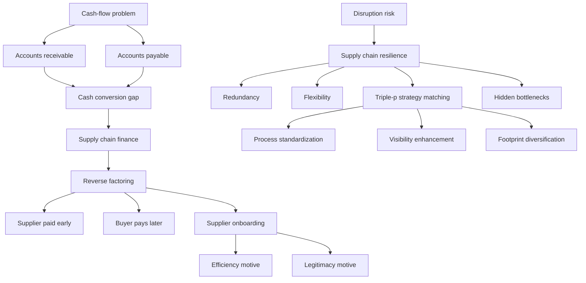

# Ubiquitous Language: Topic 12 Supply Chain Finance And Resilience

Source note: `topic-12-supply-chain-finance-and-resilience.md`
Course: Supply Chain Management
Definition sources: Topic 12 SCF/resilience slides and Superb Flowers case; enriched with standard supply-chain finance, working-capital, and resilience terminology where needed.

This file is a standalone terminology companion for supply chain finance, reverse factoring, supplier adoption, working-capital calculations, resilience frameworks, and hidden bottlenecks.

## Supply Chain Finance Language

| Term | Definition | Aliases to avoid |
|---|---|---|
| **Financial Supply Chain Management (FSCM)** | Management of financial flows, payment timing, trade credit, and risk inside supply-chain relationships. | corporate finance only |
| **Supply Chain Finance (SCF)** | Structured, often platform-enabled approach that improves working capital and supplier liquidity across a buyer-supplier network. | any bank loan |
| **Supply Chain And Finance** | Broad interface between supply-chain decisions and corporate-finance outcomes. | SCF product |
| **Supply Chain Financing** | Financing products used to fund supply-chain transactions or assets. | full SCF program |
| **Factoring** | Supplier-led sale or financing of receivables. | reverse factoring |
| **Reverse Factoring** | Buyer-led financing where approved supplier invoices are paid early by a funder and the buyer pays later. | simply paying suppliers late |
| **Approved Invoice** | Invoice confirmed by the buyer as valid, reducing funder risk. | purchase order |
| **SCF Provider** | Bank or platform/funder that pays suppliers early and collects from buyers later. | supplier |
| **Trade Credit** | Payment delay granted by one firm to another, such as supplier payment terms. | bank loan |
| **Trade Credit Risk** | Risk that the buyer delays or fails to pay. | inventory risk |
| **Supplier Default Risk** | Risk that a supplier fails financially or operationally. | buyer default risk |

## Working-Capital Language

| Term | Definition | Aliases to avoid |
|---|---|---|
| **Working Capital** | Operating capital tied in receivables and inventory, net of payables. | cash balance only |
| **Accounts Receivable (AR)** | Money customers owe the firm for sales already made. | revenue |
| **Accounts Payable (AP)** | Money the firm owes suppliers for purchases already received. | supplier cost |
| **Days Sales Outstanding (DSO)** | Average number of days customers take to pay. | payment term only |
| **Days Payable Outstanding (DPO)** | Average number of days the firm takes to pay suppliers. | supplier lead time |
| **Cost Of Goods Sold (COGS)** | Cost base associated with the goods sold; in the Superb Flowers case, inferred as 90% of revenue. | revenue |
| **Cash Conversion Gap** | Timing gap between paying suppliers and collecting from customers. | profit margin |
| **Drop Shipping** | Fulfillment model where suppliers ship directly to end customers. | zero working capital |
| **Early Payment Discount** | Price reduction offered to make customers pay sooner. | free liquidity |

## Working-Capital Formula Cheat Sheet

```text
AR = revenue * DSO / 360
AP = COGS * DPO / 360
NWC = AR + inventory - AP

If inventory = 0:
NWC = AR - AP

One DSO day impact = revenue / 360
One DPO day impact = COGS / 360

Superb Flowers inferred revenue:
2.5M = R*(60/360) - 0.90R*(30/360)
R = about 27.27M
```

## SCF Adoption Language

| Term | Definition | Aliases to avoid |
|---|---|---|
| **Supplier Adoption Speed** | How quickly a supplier joins and uses an SCF program. | total supplier count |
| **Efficiency Motive** | Adoption reason based on economic gain, especially financing-cost reduction. | legitimacy pressure |
| **Supplier Financing Cost Reduction** | Difference between supplier's old financing cost and cost under SCF. | buyer savings only |
| **Supplier Size** | Supplier's scale, measured in the model by annual revenues. | buyer size |
| **Legitimacy Motive** | Adoption reason based on social or institutional pressure to behave like accepted peers. | direct cost saving |
| **Mimetic Pressure** | Pressure to imitate suppliers in one's industry that already use SCF. | coercion |
| **Normative Pressure** | Pressure from buyer's supplier community or accepted professional practice. | direct threat |
| **Coercive Pressure** | Pressure from dependence on the buyer. In the deck's model, this hypothesis is not supported. | supplier benefit |
| **Supplier Onboarding** | Practical process of getting suppliers to join, understand, and use SCF. | one email invitation |

## Resilience Language

| Term | Definition | Aliases to avoid |
|---|---|---|
| **Supply Chain Resilience** | Ability to absorb, respond to, recover from, and adapt after supply-chain disruptions. | efficiency |
| **Supply Chain Glitch** | Operational disruption visible enough to affect firm performance or market reaction. | minor delay |
| **Vulnerability Map** | Planning tool that compares threat likelihood with relative resilience. | risk register only |
| **Redundancy** | Extra resources or buffers held for protection, such as safety stock, backup suppliers, or spare capacity. | waste by default |
| **Flexibility** | Capability to switch, reconfigure, reroute, or adapt under changed conditions. | extra inventory only |
| **Lean-Resilience Tradeoff** | Tension between minimizing slack in normal operations and preserving disruption buffers. | lean is always bad |
| **Resource Reconfiguration** | Ability to rearrange resources when disruption changes what the system needs. | resource ownership only |
| **Risk-Management Infrastructure** | Processes, routines, systems, and teams that support disruption preparation and response. | insurance |

## Resilience Framework Language

| Term | Definition | Aliases to avoid |
|---|---|---|
| **Blackhurst Enhancers** | Human, organizational/interorganizational, and physical resources that increase resiliency. | generic strengths |
| **Human Capital Resources** | Training, cost-benefit knowledge, and post-disruption learning that improve response quality. | headcount only |
| **Organizational And Interorganizational Capital Resources** | Protocols, teams, contingency plans, relationship management, and cross-firm coordination structures. | internal org chart |
| **Physical Capital Resources** | Safety stock, visibility tools, monitoring tools, and redesign tools. | cash |
| **Blackhurst Reducers** | Flow activities, flow units, and source characteristics that reduce resiliency. | risk mitigations |
| **Flow Activity Reducers** | Network features such as number of nodes, security/customs rules, or port/vessel restrictions that complicate flow. | production volume |
| **Flow Unit Reducers** | Product features such as complexity or storage/quality requirements that make rerouting harder. | customer demand |
| **Source Reducers** | Supplier-location volatility and supplier capacity/labor restrictions that constrain recovery. | supplier relationship |
| **Triple-P Archetypes** | Process, partnership, and product complexity types used to match resilience strategies. | three generic risks |
| **Process Standardization** | Resilience strategy for process complexity: reduce internal process variability. | extra inventory |
| **Visibility Enhancement** | Resilience strategy for partnership complexity: improve cross-firm information visibility. | more suppliers |
| **Footprint Diversification** | Resilience strategy for product complexity: diversify geographic or production footprint. | single-source optimization |
| **Hidden Bottleneck** | Non-obvious constraint that becomes limiting during a disruption or demand shift. | main production bottleneck only |

## Relationships Between Canonical Terms

- **SCF** uses **reverse factoring** when the buyer initiates early supplier financing through approved invoices.
- **Reverse factoring** can improve **supplier liquidity** while extending buyer **DPO**.
- **Working capital** can remain high under **drop shipping** because **AR** and **AP** still create a **cash conversion gap**.
- **Supplier adoption speed** depends on **efficiency motives** and **legitimacy motives**.
- **Lean-resilience tradeoff** explains why very low buffers can increase vulnerability.
- **Redundancy** and **flexibility** are alternative ways to improve **supply chain resilience**.
- **Triple-p archetypes** guide whether to use **process standardization**, **visibility enhancement**, or **footprint diversification**.
- **Hidden bottlenecks** often appear outside the obvious final production step.

## Visual Memory Aid



## Example Dialogue

> **Student:** "Superb Flowers has zero inventory, so working capital should be zero."
>
> **Professor:** "No. Inventory is only one part. Customers pay after 60 days and suppliers are paid after 30 days, so **accounts receivable** exceeds **accounts payable**. That creates a **cash conversion gap**."
>
> **Student:** "So the solution is just pay suppliers later?"
>
> **Professor:** "Only if the supplier side stays healthy. A better answer is buyer-led **SCF/reverse factoring**, where suppliers can receive early cash through a funder while Superb Flowers extends effective **DPO**."

## Flagged Ambiguities

| Ambiguous Phrase | Canonical Recommendation |
|---|---|
| "Finance the supply chain" | Specify **SCF**, **reverse factoring**, **inventory finance**, or **receivables financing**. |
| "Pay later" | State whether it is a unilateral **DPO extension** or an SCF-supported reverse factoring program. |
| "Supplier benefit" | Quantify lower financing cost, earlier cash, or lower default risk. |
| "Working capital" | Break into **AR**, **inventory**, and **AP**. |
| "Zero inventory" | Do not infer zero working capital; check **DSO** and **DPO**. |
| "Resilience" | Say whether the response uses **redundancy**, **flexibility**, **reconfiguration**, or a specific triple-p strategy. |
| "Bottleneck" | Check hidden upstream, downstream, packaging, and distribution constraints. |

## Exam Trap Corrections

| Trap | Correction |
|---|---|
| Treating SCF as a free lunch for the buyer. | Ask who pays, who waits, whose credit rate applies, and who bears risk. |
| Recommending longer supplier terms without supplier perspective. | Consider supplier cost of capital and bid-price reaction. |
| Offering a large customer discount without margin check. | Annualize the discount and compare it to financing cost and profit margin. |
| Equating drop shipping with zero working capital. | Compute AR minus AP. |
| Saying lean always improves performance. | Extreme leanness can increase disruption vulnerability. |
| Choosing redundancy for every resilience case. | Match strategy to process, partnership, or product complexity. |
| Missing hidden bottlenecks. | Trace material form, packaging, distribution, and upstream inputs. |

## Compact Answer Language

```text
For SCF:
Identify the cash-flow gap first: AR, inventory, AP, DSO, and DPO.
Then decide whether the problem is buyer liquidity, supplier liquidity, or both.
Reverse factoring is buyer-led: supplier gets early payment from a funder after buyer approval; buyer pays later.
Evaluate benefits and risks from both buyer and supplier perspectives.

For resilience:
Identify the disruption and the real bottleneck.
Decide whether the case needs redundancy, flexibility, or resource reconfiguration.
Use triple-p logic to match the strategy: process standardization, visibility enhancement, or footprint diversification.
Explain the efficiency-resilience tradeoff.
```
