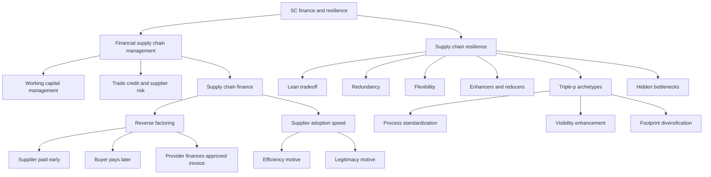

# Topic 12: Supply Chain Finance And Supply Chain Resilience

Source files:

- `supply-chain-management/raw/moodle-export-operations-950888956-s26-20260604/12 Supply Chain Finance  Supply Chain Resilience/Slides SCF and Resilience.pdf`
- `supply-chain-management/raw/moodle-export-operations-950888956-s26-20260604/12 Supply Chain Finance  Supply Chain Resilience/Exercise SCF Task.pdf`

Course: Supply Chain Management
Processed: 2026-06-04
Wiki note: `supply-chain-management/wiki/topic-12-supply-chain-finance-and-resilience/topic-12-supply-chain-finance-and-resilience.md`

Course logistics checked: the SCM exam can ask any lecture/Moodle content and allows only a non-programmable calculator plus one handwritten A4 cheat sheet. For Topic 12, exam preparation should focus on mechanism explanation, working-capital calculations, adoption drivers, resilience tradeoffs, and case recommendation logic.

## 80/20 Exam Summary

Topic 12 has two connected themes:

```text
Supply chain finance: money flows can constrain material flows.
Supply chain resilience: disruption risk can destroy operational and financial value.
```

High-yield supply chain finance logic:

- Working capital is not solved by "zero inventory" if receivables and payables are misaligned.
- Reverse factoring uses the buyer's stronger credit quality to finance suppliers earlier while allowing the buyer to pay later.
- SCF adoption is not only a spreadsheet decision; supplier onboarding speed depends on efficiency and legitimacy motives.
- Payment-term extensions can be value-creating or exploitative depending on who captures the financing benefit and who bears risk.

High-yield resilience logic:

- Lean systems reduce waste but can increase vulnerability when buffers and slack disappear.
- Resilience requires recovery, adaptation, and reconfiguration after disruptions.
- Redundancy and flexibility are the two broad resilience strategies.
- The right resilience strategy depends on the type of complexity: process, partnership, or product.
- Hidden bottlenecks can sit outside the obvious production step.

## Where This Fits In SCM

Earlier SCM topics focused on physical and informational flows:

- batching and coordination in [Topic 06 Bullwhip](../topic-06-supply-chain-coordination-bullwhip-effect/topic-06-supply-chain-coordination-bullwhip-effect.md)
- process capacity in [Topic 08 OceanCove](../topic-08-oceancove-process-analysis-capacity-management/topic-08-oceancove-process-analysis-capacity-management.md)
- network design in [Topic 09 Facility Location](../topic-09-facility-location-transportation-shipping/topic-09-facility-location-transportation-shipping.md)

Topic 12 adds two managerial layers:

```text
cash-flow design and disruption survival
```

An efficient supply chain can still fail if cash conversion is too slow or if a disruption hits an unprotected bottleneck.

## Financial Supply Chain Management

The slide concept map places Financial Supply Chain Management (FSCM) at the overlap of:

- supply chain management
- corporate finance
- risk management

Topics inside the overlap include:

- working capital management
- mutual cash-flow forecasting
- inventory finance
- working capital financing
- trade settlement
- electronic payment platforms
- supply chain finance
- factoring and reverse factoring
- trade credit and trade credit risk
- supplier default risk
- advance payments
- trade enablement

Exam interpretation:

```text
FSCM is not "finance after operations." It is the design of financial flows, credit risk, and payment timing inside supply-chain relationships.
```

## Supply Chain Finance, Supply Chain And Finance, Supply Chain Financing

The deck explicitly asks students to distinguish these terms. Use this exam-safe language:

| Term | Meaning | Practical Example |
|---|---|---|
| Supply Chain Finance | Structured, often platform-enabled approach to improve working capital and supplier liquidity across a buyer-supplier network. | Reverse factoring program for approved supplier invoices. |
| Supply Chain And Finance | Broad interface between supply-chain decisions and corporate finance outcomes. | Inventory policy affects cash conversion cycle and ROIC. |
| Supply Chain Financing | Financing products used to fund supply-chain assets or transactions. | Inventory finance, receivables finance, trade credit. |

The canonical topic in this deck is reverse factoring as a practical SCF mechanism.

## Reverse Factoring Mechanism

Basic setup:

```text
Supplier delivers -> buyer approves invoice -> financing provider pays supplier early -> buyer pays provider later
```

Why this can create value:

- Suppliers often have higher financing costs.
- Large buyers often have stronger credit ratings.
- The provider prices the receivable based partly on the buyer's credit quality.
- Supplier liquidity improves without forcing the buyer to pay immediately from its own cash.
- Buyer can sometimes extend payment terms while keeping suppliers financially healthier.

Cash-flow clarification:

```text
The SCF provider pays the supplier early.
The buyer does not pay the supplier early.
The buyer pays the SCF provider later.
```

So the same program can reduce the supplier's collection time while increasing the buyer's effective payment time. This is the core win-win mechanism:

```text
Supplier DSO decreases.
Buyer effective DPO increases.
The SCF provider bridges the timing gap.
```

If the SCF provider pays at a 5% rate, that 5% is the annualized financing or discount rate, not an extra gift. For an invoice of EUR 100,000 paid 80 days early:

```text
Financing fee = 100,000 * 5% * 80/360 = EUR 1,111
Supplier receives early cash = 100,000 - 1,111 = EUR 98,889
Buyer later pays provider = EUR 100,000
```

The supplier accepts the discount if this is cheaper or less risky than waiting or borrowing independently at a higher supplier financing rate.

The deck's EUR 500,000 spend example:

| Scenario | Supplier Financing Cost | Buyer Cash Benefit | Interpretation |
|---|---:|---:|---|
| Without SCF | EUR 8,333 at 10% for 60 days | EUR 3,750 benefit at 4.5% for 60 days | Supplier waits and finances at a high rate. |
| With SCF | EUR 6,250 at 5% for 90 days | EUR 5,625 benefit at 4.5% for 90 days | Supplier rate falls and buyer payment term lengthens. |

Approximate value improvement in the slide example:

```text
Supplier improves by EUR 2,083.
Buyer improves by EUR 1,875.
Combined improvement is about EUR 3,958.
```

Managerial interpretation:

```text
SCF works when the buyer's credit quality and process discipline reduce total financing friction in the chain.
```

## Factoring, Reverse Factoring, And SCF

| Term | Trigger | Main Logic | Course Emphasis |
|---|---|---|---|
| Factoring | Supplier sells its receivable. | Supplier-led receivables financing. | Pure financing mechanism. |
| Reverse Factoring | Buyer initiates or approves the program. | Financing is triggered by buyer-approved invoices. | Theoretical payment mechanism. |
| Supply Chain Finance | Buyer, supplier, and provider coordinate through process/platform. | Includes automation, onboarding, data, and practical functionality. | Executive/practical perspective. |

Exam trap:

```text
Reverse factoring is not just "paying late." The value comes from using buyer-approved invoices and buyer credit quality to lower financing friction.
```

## Supplier Adoption Of SCF

The deck summarizes an empirical study on SCF adoption. The central outcome is supplier adoption speed.

Driver groups:

| Driver Group | Variables In The Model | Result / Interpretation |
|---|---|---|
| Efficiency motive | Supplier size; supplier financing cost reduction | Supported. Smaller suppliers and suppliers with larger financing cost reductions are faster adoption targets. |
| Legitimacy motive | Mimetic pressure; normative pressure; coercive pressure | Mimetic and normative pressures are supported; coercive pressure is not supported. |
| Controls | Supplier country, supplier industry, GDP, broad money, working-capital reduction, SCF mode | Control background rather than the main managerial lever. |

Interpretation of the hypothesis stamps shown in the deck:

```text
H1, H2, H3, and H4 are supported.
H5 is not supported.
```

Managerial implications:

- Do not underestimate supplier onboarding time.
- Start with smaller suppliers and suppliers with high financing-cost reductions.
- Approach suppliers in industries where SCF is already common to leverage mimetic pressure.
- Do not start only with the largest suppliers.
- Do not focus only on buyer benefits at the beginning.
- Suppliers can use legitimacy arguments to normalize payment-term extensions.
- SCF providers should consider adoption timing, not only portfolio size.

Broader interpretation:

```text
Supplier adoption asks: why would the supplier join and actually use the program?
```

Suppliers adopt faster when the program solves a real financing problem for them. The strongest economic case appears when the supplier's old financing rate is high and the SCF rate based on the buyer-approved invoice is materially lower. A small supplier with weak bank access may adopt quickly; a large supplier with cheap internal financing may see less benefit.

Adoption also has a legitimacy side. Suppliers are more willing to join when SCF already looks normal in their industry or supplier community. They may imitate peers, accept industry practice, or trust the buyer's program because comparable suppliers already use it. Pure pressure from the buyer is weaker as an adoption explanation because a coerced supplier may sign up slowly, resist operationally, or price the pressure back into future bids.

Exam-safe adoption logic:

```text
Efficiency motive = lower financing cost or earlier cash.
Legitimacy motive = SCF looks normal, trusted, and accepted.
Implementation barrier = onboarding effort, platform trust, fees, and process change.
```

## Criticism Of SCF

The deck includes press examples criticizing large buyers that pay suppliers later. The exam-relevant point is ethical and systemic:

```text
SCF can be a win-win financing innovation, but it can also become a tool for powerful buyers to squeeze weaker suppliers.
```

Risk signs:

- Buyer extends terms without sharing financing benefits.
- Suppliers face implementation burden but little gain.
- Supplier liquidity risk is hidden behind a "working capital improvement" story.
- The buyer's accounting metric improves while supplier resilience worsens.

Good answer framing:

```text
Ask who receives earlier cash, who waits longer, whose financing rate applies, and who bears disruption or default risk.
```

## Supply Chain Resilience

The deck motivates resilience with stock-market evidence on supply-chain glitches:

| Study Period | Mean Abnormal Return Of Glitch Announcement |
|---|---:|
| 1989-2000 | -10.28% |
| 2013-2017 | -3.55% |

Interpretation:

```text
Supply-chain disruptions are operational events with financial-market consequences.
```

The deck presents resilience definitions around three ideas:

- recover from disruptive events
- survive, adapt, and grow amid change and uncertainty
- respond to unexpected disruptions and restore normal supply network operations

Compact definition:

```text
Supply chain resilience is the ability to absorb, respond to, recover from, and adapt after disruptions while preserving essential operations.
```

## Lean Management And Resilience

Lean management reduces waste, inventory, and slack. That improves efficiency in normal operations but can reduce resilience.

Tradeoff:

| Lean Benefit | Resilience Risk |
|---|---|
| Less excess inventory | Less buffer against supply interruption. |
| Higher utilization | Less spare capacity for recovery. |
| Fewer suppliers / streamlined flow | More exposure to single-point failures. |
| Tight synchronization | More disruption propagation if one node fails. |

Exam-safe sentence:

```text
Lean is not anti-resilience by definition, but extreme leanness can remove the buffers and flexibility needed during disruption.
```

## Vulnerability Map

Sheffi and Rice's vulnerability map classifies threats by:

- relative likelihood
- relative resilience to the disruption

Use:

```text
Prioritize management attention where threats are likely and resilience is low.
```

This is a planning tool, not a calculation formula.

## Two Broad Resilience Strategies

| Strategy | What It Adds | Examples | Main Cost |
|---|---|---|---|
| Redundancy | Extra capacity or buffers. | Inventory, backup suppliers, lower capacity utilization, longer lead times, additional assets. | Higher normal-operation cost. |
| Flexibility | Ability to switch, reconfigure, and respond. | Supply/procurement flexibility, conversion flexibility, distribution flexibility, control systems, adaptive culture. | Investment in capabilities and coordination. |

Managerial interpretation:

```text
Redundancy buys protection by adding extra resources. Flexibility buys protection by making existing resources easier to redirect.
```

## Blackhurst Framework Of Supply Chain Resilience

The deck's Blackhurst et al. framework separates resilience enhancers from reducers.

Enhancers:

| Resource Type | Examples In The Slide | Resilience Logic |
|---|---|---|
| Human Capital Resources | Education and training; cost-benefit knowledge; post-disruption feedback. | People know how to detect, evaluate, and learn from disruptions. |
| Organizational And Interorganizational Capital Resources | Communication protocols; cross-functional risk-management teams; contingency plans; customs/port diversification plans; supplier relationship management. | The organization and its partners can coordinate under stress. |
| Physical Capital Resources | Safety stock; visibility tools; node monitoring exception tools; redesign tools. | Physical and digital buffers make disruption visible and absorbable. |

Reducers:

| Reducer Type | Examples In The Slide | Resilience Logic |
|---|---|---|
| Flow Activities | Number of nodes; security/customs regulation; port/vessel capacity restrictions. | More complicated activity networks create more failure points. |
| Flow Units | Product complexity; storage/quality requirements. | Hard-to-handle products are harder to reroute or buffer. |
| Sources Of Flow Units | Volatile supplier location; supplier capacity/labor restrictions. | Supply-source fragility constrains recovery options. |

Exam use:

```text
Diagnose whether a case needs enhancers, reducer reduction, or both.
```

## Ambulkar Model Of High-Impact Disruptions

The deck's model emphasizes:

```text
supply chain disruption orientation -> resource reconfiguration -> firm resilience
```

Key interpretation:

- A firm must first notice and take disruptions seriously.
- Resilience improves when the firm can reconfigure resources.
- Risk-management infrastructure shapes how well disruption orientation converts into reconfiguration.
- Firm size and firm experience are controls, not the core resilience mechanism.

Exam phrasing:

```text
Resilience is not only having resources. It is the capability to reconfigure resources when a disruption changes the operating problem.
```

## Triple-P Supply Chain Archetypes

The triple-p framework maps supply chains along two axes:

- degree of homogeneity of supply-chain processes inside the firm
- supply-chain integration across firms

Archetypes and strategies:

| Archetype | Complexity Type | Typical Position | Common Resilience Strategy |
|---|---|---|---|
| Process Complexity | Internal process complexity. | Lower integration, lower process homogeneity. | Process standardization. |
| Partnership Complexity | External coordination complexity. | Middle region. | Visibility enhancement. |
| Product Complexity | Technology/product complexity. | High integration and high process heterogeneity. | Footprint diversification. |

Exam interpretation:

```text
Do not prescribe generic "more inventory" for every resilience case. Match the strategy to the dominant complexity.
```

## Hidden Bottlenecks

Kouvelis' examples show that the obvious production step is not always the true constraint.

| Product | Usual Bottleneck | Hidden / Real Bottleneck In Slide | Managerial Lesson |
|---|---|---|---|
| Toilet paper | Toilet-paper production | Distribution; also raw-material mix between consumer and commercial rolls. | Demand shifts can expose downstream distribution or input-mix limits. |
| Flour | Flour mills | Packaging | The product may exist in bulk but cannot reach retail format fast enough. |
| Disinfectants | Manufacturing brands | Specialty chemicals | Upstream ingredient capacity can constrain branded final output. |

For disinfectants, the slide highlights specialty chemical inputs such as ethanol, isopropyl alcohol, chlorides, viscose rayon, quaternary ammonium, and glutaraldehyde, with final manufacturers such as Reckitt Benckiser, Gojo/Purell, and Clorox.

Exam sentence:

```text
The bottleneck can move when demand changes form, channel, or input mix.
```

## Superb Flowers Case

### Case Diagnosis

Superb Flowers uses drop shipping and daily supplier auctions. It has zero inventory, but still has a working-capital problem:

```text
Customers pay in 60 days.
Suppliers must be paid in 30 days.
Inventory is zero.
Working capital is still tied up in receivables.
```

This is the main conceptual point:

```text
Zero inventory does not imply zero working capital.
```

### Working-Capital Estimate

Given:

```text
Current working capital = USD 2,500,000
Customer payment terms = 60 days
Supplier payment terms = 30 days
Profit margin = 10%
COGS = 90% of revenue
Assume 360-day year
```

Revenue/cash-flow distinction:

```text
Revenue = sales value earned or invoiced.
Cash flow = actual cash received or paid.
Profit = revenue - cost.
```

The working-capital calculation uses revenue for accounts receivable because customers owe the selling price. It uses COGS for accounts payable because the firm owes suppliers the cost side, not the selling price.

Approximate net working capital:

```text
NWC = Accounts receivable - accounts payable
NWC = R*(60/360) - 0.90R*(30/360)
NWC = 0.09167R
```

Narrative interpretation:

```text
AR = 60 days of customer sales not yet collected.
AP = 30 days of supplier cost not yet paid.
NWC = customer cash trapped in AR minus supplier financing through AP.
```

Solve for annual revenue:

```text
R = 2,500,000 / 0.09167 = about USD 27.27 million
```

Reduction targets:

```text
10% reduction = USD 250,000
50% reduction = USD 1,250,000
```

Cash impact of one day:

```text
1 DSO day = R/360 = about USD 75,758
1 DPO day = 0.90R/360 = about USD 68,182
```

Therefore:

```text
10% NWC reduction needs about 3.3 DSO days or 3.7 DPO days.
50% NWC reduction needs about 16.5 DSO days or 18.3 DPO days.
```

These day counts are alternative levers:

```text
DSO reduction = customers pay earlier.
DPO extension = the buyer pays suppliers or the SCF provider later.
```

They are not free. A customer discount can reduce DSO but may destroy margin. A unilateral DPO extension can reduce buyer NWC but may damage suppliers. SCF is attractive because it can increase the buyer's effective DPO while reducing the supplier's DSO.

Entity-perspective rule:

```text
DSO and DPO are firm-specific.
Choose the focal firm first, then use that firm's customers and suppliers.
```

For Superb Flowers:

```text
Superb Flowers DSO = how long customers take to pay Superb Flowers.
Superb Flowers DPO = how long Superb Flowers keeps cash before paying suppliers/provider.
```

For the supplier:

```text
Supplier DSO = how long it takes to receive cash from Superb Flowers or the SCF provider.
Supplier DPO = how long the supplier takes to pay its own upstream suppliers.
```

Do not mix the supplier's DSO into Superb Flowers' NWC calculation.

### Option Assessment

| Option | Benefit | Risk | Assessment |
|---|---|---|---|
| Push customers to pay immediately with 5% discount | Reduces accounts receivable quickly. | 5% discount is large relative to 10% margin and annualizes to roughly 30% for 60-day acceleration. | Rule out as broad default unless customer demand or bad-debt benefits justify it. |
| Negotiate longer supplier payment terms | Increases accounts payable and reduces working capital. | Suppliers have high financing costs and may increase bids or refuse. | Weak standalone option; likely shifts cost/risk to suppliers. |
| Change auction to longest payment terms | Could improve DPO. | One-dimensional payment-term auction ignores purchase price, supplier risk, and resilience. | Do not use alone; include payment terms only in total landed/financial cost. |
| Buyer-led SCF / reverse factoring | Supplier can be paid earlier by funder while buyer pays later; uses buyer's A-rating. | Requires onboarding, platform/process changes, trust, and fair value sharing. | Best primary recommendation. |
| Borrow against receivables / customer receivables financing | Fast liquidity for the buyer. | Financing fees; does not help supplier health. | Useful backup but less supply-chain-oriented than SCF. |
| Shorten customer terms without discount | Directly reduces DSO. | Demand may fall because customer offer is competitive. | Test selectively, not as first blanket move. |

### Recommended Board Proposal

Recommend a buyer-led SCF program:

1. Keep daily auctions price-focused, but add payment-term economics into total cost analysis.
2. Set up reverse factoring for approved supplier invoices.
3. Allow suppliers to receive early payment at a rate linked to Superb Flowers' stronger credit quality.
4. Extend Superb Flowers' effective payment term from 30 days toward 60 days.
5. Pilot with smaller suppliers and high-financing-cost suppliers because adoption research suggests they may adopt faster.
6. Support onboarding to reduce operational resistance.
7. Communicate supplier benefits clearly to avoid the "buyer squeezes supplier" criticism.

Rough impact if effective DPO increases from 30 to 60 days:

```text
Working-capital reduction = COGS * 30/360
= 0.90 * 27.27M * 30/360
= about USD 2.05M
```

This exceeds the 50% target of USD 1.25M.

Full SCF perspective after implementation:

Assume customers still pay Superb Flowers after 60 days, suppliers receive early cash from the SCF provider after 10 days, and Superb Flowers pays the provider after 60 days.

From Superb Flowers' perspective:

```text
DSO remains 60.
Effective DPO becomes 60.

AR = 27.27M * 60/360 = about USD 4.55M
AP/effective payable = 0.90 * 27.27M * 60/360 = about USD 4.09M
NWC = 4.55M - 4.09M = about USD 0.46M
```

From the supplier's perspective:

```text
Supplier DSO falls to about 10 days.
Supplier liquidity improves.
Supplier receives early cash net of the SCF financing fee.
```

So supplier payment after 10 days does not reduce Superb Flowers' DPO. It reduces the supplier's DSO. Superb Flowers' DPO is measured when Superb Flowers' own cash leaves, which is when it pays the provider.

More conservative target for 50% reduction:

```text
Required DPO extension = 1.25M / 68,182 = about 18.3 days
```

So Superb Flowers does not need the full 30-day extension to hit the CFO's "cut it in half" challenge.

Why not the 5% customer discount?

```text
5% of annual revenue = 0.05 * 27.27M = about USD 1.36M per year.
```

That cost is larger than the 50% working-capital reduction target and cuts deeply into a 10% profit margin. It may improve cash but sacrifices too much economics unless the case provides additional demand or collection benefits.

## Exam Relevance

Likely exam tasks:

- Explain reverse factoring in a buyer-supplier-provider triangle.
- Distinguish factoring, reverse factoring, and SCF.
- Compute working-capital effects from DSO, DPO, revenue, and COGS.
- Diagnose why zero inventory can still leave high working capital.
- Select and justify a supply-chain finance option in a case.
- Explain SCF adoption drivers and why onboarding is slow.
- Compare redundancy and flexibility in resilience.
- Use Blackhurst/Triple-P frameworks to classify resilience actions.
- Identify hidden bottlenecks in a disrupted supply chain.

Common mistakes:

- Treating SCF as a pure finance trick rather than a supply-chain relationship design.
- Ignoring supplier cost of capital.
- Counting inventory only and ignoring receivables/payables.
- Recommending payment-term extension without supplier-risk mitigation.
- Equating lean with resilience.
- Prescribing the same resilience strategy for every complexity type.
- Looking only at final assembly and missing upstream or packaging bottlenecks.

## Practice Questions

1. A buyer has a 4% borrowing rate and suppliers borrow at 18%. Why might reverse factoring create total supply-chain value?
   - Answer guide: the supplier receivable can be financed at a lower rate linked to buyer-approved invoices and buyer credit quality.

2. A company has annual revenue of EUR 36M, COGS of 80% of revenue, DSO 50, DPO 20, and no inventory. Approximate NWC.
   - Answer guide: `AR = 36M*50/360 = 5.0M`; `AP = 28.8M*20/360 = 1.6M`; `NWC = 3.4M`.

3. In one sentence, explain the ethical criticism of SCF.
   - Answer guide: SCF is criticized when powerful buyers extend terms and improve their metrics while suppliers bear liquidity pressure or implementation costs.

4. A supply chain is highly integrated across suppliers, and coordination failures are the main disruption risk. Which triple-p archetype is most relevant and what strategy fits?
   - Answer guide: partnership complexity; visibility enhancement.

5. A flour producer has enough milling capacity but cannot pack retail flour fast enough. What type of bottleneck is this?
   - Answer guide: hidden bottleneck in packaging, not the usual production bottleneck.

## Visual Knowledge Map



## Subject Knowledge Graph

| Node | Meaning | Exam Relevance |
|---|---|---|
| Financial Supply Chain Management | Financial-flow, working-capital, and risk-management layer of SCM. | Concept umbrella. |
| Working Capital | Capital tied in receivables, inventory, and payables. | Core case calculation. |
| Supply Chain Finance | Structured approach to improve working capital and supplier liquidity across the supply chain. | Main finance mechanism. |
| Reverse Factoring | Buyer-led financing of approved supplier invoices. | Most likely mechanism explanation. |
| Supplier Adoption Speed | How quickly suppliers join an SCF program. | Empirical model outcome. |
| Efficiency Motive | Adoption driver based on financial benefit, supplier size, and cost reduction. | Managerial onboarding logic. |
| Legitimacy Motive | Adoption driver based on mimetic, normative, or coercive pressures. | Research-model interpretation. |
| Supply Chain Resilience | Ability to absorb, respond to, recover from, and adapt after disruption. | Main resilience concept. |
| Lean-Resilience Tradeoff | Efficiency buffers reduced by extreme leanness can increase vulnerability. | Common essay/comparison point. |
| Redundancy | Extra buffers, suppliers, capacity, or assets. | Resilience strategy. |
| Flexibility | Ability to switch, reconfigure, and adapt resources. | Resilience strategy. |
| Blackhurst Enhancers | Human, organizational, interorganizational, and physical resources that increase resiliency. | Framework application. |
| Blackhurst Reducers | Flow activity, flow unit, and source properties that reduce resiliency. | Framework application. |
| Resource Reconfiguration | Ability to rearrange resources under disruption. | Ambulkar model mechanism. |
| Triple-P Archetypes | Process, partnership, and product complexity categories. | Strategy matching. |
| Hidden Bottleneck | Non-obvious constraint exposed by disruption or demand shifts. | Case diagnosis. |

| From | Relationship | To |
|---|---|---|
| Working Capital | is affected by | DSO and DPO |
| Reverse Factoring | uses | Buyer credit quality |
| Reverse Factoring | can improve | Supplier liquidity |
| Supplier Adoption Speed | is driven by | Efficiency Motive |
| Supplier Adoption Speed | is driven by | Legitimacy Motive |
| Lean Management | can reduce | Redundancy |
| Redundancy | increases | Disruption absorption |
| Flexibility | improves | Resource reconfiguration |
| Blackhurst Enhancers | increase | Supply Chain Resilience |
| Blackhurst Reducers | decrease | Supply Chain Resilience |
| Triple-P Archetypes | determine | Resilience strategy choice |
| Hidden Bottleneck | constrains | Disruption recovery |

## Open Uncertainties

- The Superb Flowers case does not provide actual annual revenue or detailed customer behavior. Revenue is inferred from the stated USD 2.5M working-capital figure, 60-day customer terms, 30-day supplier terms, and 10% margin.
- The case does not specify the risk-free rate or exact SCF provider fee. The recommendation therefore uses directional cost-of-capital logic rather than a precise NPV of the SCF program.
