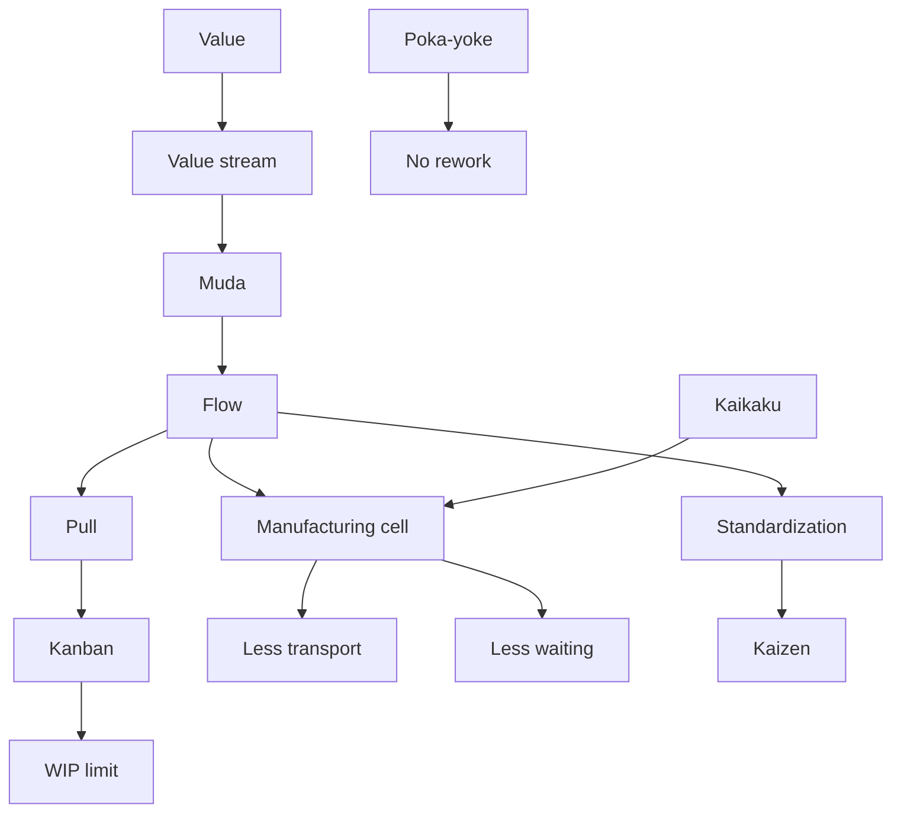

# Ubiquitous Language: Topic 13 Lean Management And Lean Simulation

Source note: `topic-13-lean-management-lean-simulation.md`
Course: Supply Chain Management
Definition sources: Topic 13 Lean Simulation slides; enriched with standard lean and operations-management terminology where needed.

This file is a standalone terminology companion for lean management, muda, push/pull, Kanban, flow, manufacturing cells, Kaizen, Kaikaku, and Poka-yoke.

## Lean System Language

| Term | Definition | Aliases to avoid |
|---|---|---|
| **Lean Management** | Operations approach that maximizes customer value by removing waste and improving flow, pull, quality, and continuous learning. | cost cutting only |
| **Value** | What the customer is willing to pay for or meaningfully cares about. | internal effort |
| **Value Stream** | End-to-end sequence of activities needed to deliver value to the customer. | department chart |
| **Flow** | Smooth movement of work through the value stream without avoidable waiting, piles, or backtracking. | high utilization |
| **Pull** | Work is triggered by downstream/customer demand signals. | forecast-free planning |
| **Perfection** | Ongoing improvement toward less waste, better quality, shorter lead time, and stronger value delivery. | one-time optimization |
| **Lean Transformation** | Change process that redesigns value streams, flow, pull, standards, and improvement routines. | one tool installation |

## Waste Language

| Term | Definition | Aliases to avoid |
|---|---|---|
| **Muda** | Waste: activity or resource use that does not move the product closer to customer-valued completion. | all cost |
| **Overproduction** | Producing earlier or more than needed by actual demand. | good utilization |
| **Transport Waste** | Unnecessary movement of materials or work units. | delivery to customer |
| **Over-Processing** | Doing more work, handling, sorting, or processing than value requires. | quality work |
| **Excess Inventory** | More raw material, WIP, or finished goods than minimally needed for reliable flow. | safety by default |
| **Motion Waste** | Unnecessary worker movement, searching, reaching, or walking. | material transport |
| **Defect Waste** | Errors that require rework, scrap, inspection, or customer correction. | variation only |
| **Waiting Waste** | Idle time for people, materials, information, or orders. | planned queue only |

## Push, Pull, And Kanban Language

| Term | Definition | Aliases to avoid |
|---|---|---|
| **Push Production** | Production triggered by forecast, plan, or mass-production schedule. | always bad |
| **Pull Production** | Production or replenishment triggered by downstream consumption or customer order. | no planning |
| **Kanban** | Visual replenishment signal that controls when upstream work may produce and limits WIP/queues. | whiteboard only |
| **Queue Limiter** | Rule or signal that caps how much WIP can wait between steps. | storage area |
| **Visual Control** | Making status, problems, and needed actions visible at the workplace. | dashboard after the fact |
| **Internal Supermarket** | Controlled intermediate stock where downstream withdrawal triggers upstream replenishment. | unlimited buffer |
| **Self-Directing System** | Work system where visible signals guide local action without constant central scheduling. | unmanaged system |

## Flow Improvement Language

| Term | Definition | Aliases to avoid |
|---|---|---|
| **Standardization** | Agreed best-known method for doing work consistently. | rigidity |
| **Takt Time** | Customer-demand rhythm; available production time divided by required customer demand. | cycle time always |
| **No Rework** | Process design target where quality is built in and loops are avoided. | inspection only |
| **Just-In-Time (JIT)** | Delivering or producing the right item, amount, and timing with minimal inventory. | zero inventory always |
| **Transparency** | Visibility of process state, WIP, problems, and ownership. | reporting only |
| **Manufacturing Cell** | Layout where resources are grouped around product flow instead of separated by function. | department |
| **Work Cell** | Small integrated production unit performing sequential tasks for a product/family. | batch queue |
| **Assembly Line** | Flow-oriented layout with tasks arranged in production sequence and paced output. | random work group |

## Improvement Concept Language

| Term | Definition | Aliases to avoid |
|---|---|---|
| **Kaizen** | Continuous incremental improvement by repeatedly finding and solving small problems. | radical redesign |
| **Kaikaku** | Radical, breakthrough change to process, layout, or operating system. | daily improvement |
| **Poka-yoke** | Mistake-proofing device, design, or method that prevents errors or makes them immediately visible. | inspection after defects |
| **Product Redesign** | Changing product architecture to simplify production, reduce variety burden, or prevent defects. | marketing redesign only |
| **Sales And Operations Planning (S&OP)** | Cross-functional planning process aligning demand, supply, and capacity. | sales forecast only |
| **Postponement** | Delaying final differentiation/customization until demand is clearer. | delaying all work |

## Relationships Between Canonical Terms

- **Lean management** starts with **value** and **value stream** before tools.
- **Muda** is identified inside the **value stream**.
- **Kanban** is a concrete mechanism for **pull production** and **queue limiting**.
- **Manufacturing cells** improve **flow** by reducing **transport**, **waiting**, and **excess inventory**.
- **Standardization** makes **Kaizen** easier because deviations become visible.
- **Poka-yoke** reduces **defect waste** before it creates rework.
- **Kaikaku** may create a new cell layout; **Kaizen** improves it afterward.
- **Postponement** supports lean when variety creates early inventory and rework.

## Visual Memory Aid



## Example Dialogue

> **Student:** "The team should produce larger batches to avoid setup waste."
>
> **Professor:** "That may reduce setup frequency, but it can create **overproduction**, **excess inventory**, and **waiting**. A lean answer asks whether the batch supports **flow** and actual **pull** demand."
>
> **Student:** "So lower setup cost is not automatically lean?"
>
> **Professor:** "Correct. Lean optimizes the value stream, not one local cost driver in isolation."

## Flagged Ambiguities

| Ambiguous Phrase | Canonical Recommendation |
|---|---|
| "Lean means less inventory" | Say **lean removes waste while protecting value and flow**. |
| "Pull means no forecast" | Say **execution is demand-triggered**, but planning can still use forecasts. |
| "Kanban board" | Use **Kanban signal/WIP limiter** if discussing the operating mechanism. |
| "Improvement" | Distinguish **Kaizen** for incremental change and **Kaikaku** for radical redesign. |
| "Movement" | Use **transport** for material movement and **motion** for worker movement. |
| "Quality check" | Use **Poka-yoke** only when the design prevents or immediately exposes errors, not merely when inspection happens later. |

## Exam Trap Corrections

| Trap | Correction |
|---|---|
| Selecting larger batches as the lean answer. | Larger batches can increase WIP and waiting; lean often reduces batches by reducing setup burden. |
| Calling all waste "inventory." | Classify the specific waste: overproduction, transport, over-processing, inventory, motion, defects, or waiting. |
| Treating pull as automatically successful. | Pull needs capacity, standards, visual control, and reliable replenishment. |
| Confusing Kaizen and Kaikaku. | Kaizen is incremental; Kaikaku is radical. |
| Treating Kanban as information sharing only. | Kanban controls replenishment and WIP. |
| Ignoring customer value. | Start with value before redesigning flow. |

## Compact Answer Language

```text
Lean starts with customer value.
I map the value stream and identify muda.
The main wastes here are [name wastes] because [mechanism].
The improvement should create flow and pull, not just local utilization.
Kanban can limit WIP and signal replenishment.
If the change is a radical layout redesign, call it Kaikaku; if it is ongoing small improvement, call it Kaizen.
Use Poka-yoke to prevent defects at the source.
```
