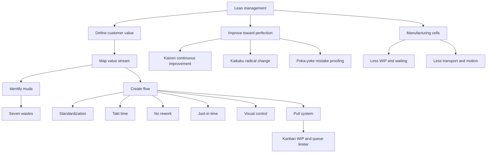

# Topic 13: Lean Management And Lean Simulation

Source file:

- `supply-chain-management/raw/moodle-export-operations-950888956-s26-20260604/13 Lean Management  Lean Simulation/Slides Lean Simulation.pdf`

Course: Supply Chain Management
Processed: 2026-06-04
Wiki note: `supply-chain-management/wiki/topic-13-lean-management-lean-simulation/topic-13-lean-management-lean-simulation.md`

Course logistics checked: the SCM exam is closed-book, allows a non-programmable calculator and one handwritten A4 cheat sheet, and sample exams repeatedly test lean via MCQs plus short case applications. Lean concepts should be learned as operational transformations, not slogans.

## 80/20 Exam Summary

Lean management is a way to redesign operations around customer value, flow, pull, and continuous improvement.

The core exam chain is:

```text
identify value -> map value stream -> remove muda -> create flow -> use pull/Kanban -> improve continuously
```

High-yield concepts:

- Seven wastes of manufacturing: overproduction, transport, over-processing, excess inventory, unnecessary movement, defects, waiting.
- Push vs pull: push produces from expected demand and scale logic; pull produces in response to customer demand.
- Kanban: visual demand signal and queue/WIP limiter.
- Five lean elements: value, value stream, flow, pull, perfection.
- Five flow concepts: standardization, takt time, no rework, just-in-time, transparency/visual control.
- Kaikaku: radical change.
- Kaizen: continuous improvement.
- Poka-yoke: mistake-proofing.
- Manufacturing cells: layout redesign that reduces transport, waiting, handoffs, and WIP.

Exam-safe lean sentence:

```text
Lean is not just "lower inventory"; it is a system for exposing and eliminating waste while preserving customer value and flow reliability.
```

## Where This Fits In SCM

Lean connects several earlier topics:

- [Topic 05 EOQ/EPQ](../topic-05-eoq-production-systems-batching/topic-05-eoq-production-systems-batching.md): larger batches can reduce setup costs but can increase WIP, waiting, and inventory waste.
- [Topic 06 Bullwhip](../topic-06-supply-chain-coordination-bullwhip-effect/topic-06-supply-chain-coordination-bullwhip-effect.md): smoother flow, EDLP, and pull systems can reduce order variability amplification.
- [Topic 08 OceanCove](../topic-08-oceancove-process-analysis-capacity-management/topic-08-oceancove-process-analysis-capacity-management.md): process maps, bottlenecks, queues, and lead time are the diagnostic base for lean improvement.
- [Topic 12 Resilience](../topic-12-supply-chain-finance-and-resilience/topic-12-supply-chain-finance-and-resilience.md): extreme leanness can create vulnerability if all buffers and flexibility disappear.

## Lean Simulation Setup

The slide deck uses a Lego glider simulation with three iterations.

Product economics:

| Item | Value |
|---|---:|
| One glider sold | USD 10,000 |
| Bricks per glider | 44 |
| One brick | USD 100 |
| Margin per glider | USD 5,600 |

Product portfolio:

- Sly Slider, introduced 2009
- Icky Ice Glider, introduced 2011
- Gliderlinski, introduced 2013
- Icomat 2000X, introduced 2016

Past sales mix shown in the deck:

```text
Sly Slider: 60%
Icky Ice Glider: 20%
Gliderlinski: 10%
Icomat 2000X: 10%
```

Simulation structure:

- hands-on production
- three iterations
- improvement between iterations
- results measurement
- debriefing

The repeated run structure is:

```text
take inventory -> produce for 3 minutes -> take inventory
repeat four production runs
```

The deck maps 1 minute of production to 1 real-world week.

## Iteration 1: Conventional Production Process

The first process is a functional, batch-and-queue style layout.

Flow:

```text
Bricks (A)
-> Type sorting by team 1
-> Bricks sorted by type (B)
-> Set sorting by team 2
-> Sets for axes (C1) -> Axis assembly by team 3 -> Finished axes (D1)
-> Sets for chassis (C2) -> Chassis assembly by team 4 -> Finished chassis (D2)
-> Sets for final assembly (C3)
-> Final assembly by team 5
-> Finished gliders (E)
-> Sell glider
-> Sold gliders (F)
```

Operational diagnosis:

- Multiple handoffs create transport and waiting.
- Intermediary piles such as C1, C2, C3, D1, and D2 are WIP.
- Teams can optimize their own station while the system creates excess inventory.
- The process can produce ahead of customer demand.
- Sorting by type and then sorting into sets can create over-processing if the same material is handled too many times.

The debrief question asks whether students observed muda. In an exam answer, do not say only "there is muda." Name the waste and point to the operational mechanism.

## Muda: Seven Wastes Of Manufacturing

| Waste | Meaning | Simulation Example |
|---|---|---|
| Overproduction | Producing ahead of actual demand. | Building glider components before a customer order requires them. |
| Transport | Unnecessary movement of materials. | Bricks and sets move between separated teams. |
| Over-processing | Doing more work or handling than needed. | Sorting in ways that do not directly create customer value. |
| Excess inventory | Inventory above the minimum needed for flow. | Piles of sorted bricks, sets, chassis, or axes. |
| Motion | Unnecessary movement by workers. | Employees reach, search, or move around because the layout is poor. |
| Defects | Incorrect output requiring rework or scrap. | Wrong glider, wrong set, missing parts, incorrect assembly. |
| Waiting | Idle time for people, materials, or orders. | Final assembly waiting for axes or chassis. |

Memory hook:

```text
Waste is anything consuming resources without moving the product closer to customer-valued completion.
```

## Push Versus Pull

Push logic:

```text
expected demand -> mass production -> economies of scale
```

Pull logic:

```text
adaptation -> on-demand production -> customer demand
```

Exam contrast:

| Dimension | Push | Pull |
|---|---|---|
| Trigger | Forecast or plan. | Actual downstream demand signal. |
| Typical benefit | Scale and resource utilization. | Lower WIP and closer demand matching. |
| Typical risk | Overproduction, inventory, bullwhip. | Starvation if signals, capacity, or replenishment are poorly designed. |
| Lean fit | Often the starting point to improve. | Central lean target, but not automatic success. |

Important nuance:

```text
Pull is not "never forecast." Forecasting can still support capacity planning, S&OP, and staffing. Pull means execution is triggered by demand signals rather than producing everything in advance.
```

## Kanban

The deck presents Kanban as a queue limiter.

Kanban functions:

- demand signaling
- queue limiter and WIP limiter
- visual control
- internal supermarket
- self-directing system

Operational intuition:

```text
A Kanban card or signal is permission to replenish. If there is no signal, upstream should not produce more.
```

How Kanban reduces waste:

- Limits WIP and inventory.
- Makes shortages and bottlenecks visible.
- Prevents upstream teams from producing just to stay busy.
- Helps downstream demand pull upstream replenishment.

Exam trap:

```text
Kanban is not merely a board or card. Its operational function is to control replenishment and limit queues.
```

## Iteration 2: Pull With Kanban

The second simulation uses the same visible process structure but introduces pull/Kanban logic.

Why it can still go wrong:

- Pull signals can reveal bottlenecks rather than instantly fixing them.
- If the layout is still functional and separated, transport and handoffs remain.
- If standards are unclear, signals can be misunderstood.
- If batch sizes, WIP limits, or material locations are badly chosen, starvation and waiting can increase.

Learning point:

```text
Pull is a mechanism, not a complete transformation. It works best with flow, standardization, and visual control.
```

## Five Elements Of Lean Management

The deck lists five elements:

```text
Value -> Value Stream -> Flow -> Pull -> Perfection
```

### Value

Value is what the customer is willing to pay for or meaningfully cares about.

Glider example:

```text
The customer pays for a finished correct glider, not for piles of sorted bricks.
```

### Value Stream

The value stream is the full sequence of actions needed to deliver the product.

Use it to classify:

- value-adding steps
- necessary non-value-adding steps
- avoidable waste

### Flow

Flow means the product moves smoothly through value-creating steps without avoidable waits, piles, or backtracking.

### Pull

Pull means downstream demand triggers upstream work.

### Perfection

Perfection is continuous pursuit of less waste, better quality, shorter lead time, and better fit to value.

In exam writing:

```text
Do not stop at naming the five elements. Apply them to the process: what is value, where is waste, how does flow change, and what signal triggers work?
```

## Five Concepts Of Flow

The deck's five flow concepts:

| Concept | Meaning | Practical Lean Role |
|---|---|---|
| Standardization | Common method for performing work. | Reduces variation and makes problems visible. |
| Takt Time | Production rhythm aligned with customer demand rate. | Shows whether the process pace matches demand. |
| No Rework | Build quality into the process. | Prevents hidden loops and defect waste. |
| Just-In-Time | Produce or deliver what is needed, when needed, in the needed amount. | Reduces inventory and waiting. |
| Transparency / Visual Control | Make status and problems visible. | Enables fast local response and self-direction. |

Takt-time intuition:

```text
If customers need one unit every 2 minutes, the process must be designed around a 2-minute rhythm or better.
```

## Iteration 3: Manufacturing Cells

The third simulation redesigns the process into manufacturing cells.

Roles:

- 1 person sorts sets.
- 1 person builds chassis.
- 1 person assembles the glider and builds axes.

Flow:

```text
Bricks (A)
-> Sort sets
-> Sorted sets (C)
-> Build chassis / build axis
-> Finished chassis (D2) and finished axes (D1)
-> Assemble glider after customer order
-> Sold gliders (F)
```

Why manufacturing cells improve the system:

- Shorter material movement.
- Fewer handoffs.
- Less WIP between specialized departments.
- Better visibility of problems.
- Closer connection between order signal and production.
- Easier balancing of work around actual flow.

Exam sentence:

```text
The cell redesign attacks transport, waiting, inventory, and coordination waste by reorganizing resources around the product flow rather than around functional departments.
```

## Central Lean Concepts

| Concept | Meaning | Exam Use |
|---|---|---|
| Kaikaku | Radical, breakthrough change. | A major redesign, such as switching from functional layout to cells. |
| Kaizen | Continuous incremental improvement. | Ongoing small improvements after the new process works. |
| Muda | Waste. | Diagnose the seven waste types. |
| Poka-yoke | Mistake-proofing. | Prevent defects at the source rather than detecting them later. |

Kaikaku versus Kaizen:

```text
Kaikaku changes the system design. Kaizen keeps improving the system every day.
```

Poka-yoke example:

```text
Design a fixture or checklist so a glider cannot be assembled with a missing axis.
```

## Bonus Round: How Lean Can You Get?

The deck closes with possible next improvements:

- product redesign and standardization
- sales and operations planning
- postponement
- factory layout
- work cells and assembly line

Interpretation:

```text
Lean can move beyond shop-floor layout. Product architecture, demand planning, postponement, and facility layout all affect flow and waste.
```

Connections:

- Product standardization reduces complexity and defects.
- S&OP coordinates demand and capacity.
- Postponement keeps products generic longer and customizes later.
- Factory layout reduces motion and transport.
- Work cells and assembly lines support flow and takt.

## Lean And Other SCM Topics

| Lean Concept | Connection |
|---|---|
| Pull | Reduces overproduction and can mitigate bullwhip when paired with information sharing. |
| Kanban | Operationalizes pull through visual WIP limits. |
| Flow | Requires bottleneck and process analysis from Topic 08. |
| Batch reduction | Reduces waiting/WIP but may increase setup frequency unless setup is improved. |
| Standardization | Supports quality, capacity predictability, and takt. |
| Postponement | Links lean with product variety and supply-chain design. |
| Extreme leanness | Can reduce resilience if buffers and flexibility are removed blindly. |

## Exam Relevance

Likely exam tasks:

- Identify which statement describes lean transformation.
- Distinguish push and pull.
- Recognize Kanban as visual control and queue/WIP limiter.
- Classify waste examples into the seven muda categories.
- Explain Kaizen, Kaikaku, and Poka-yoke.
- Recommend a lean transformation for a process/case.
- Explain why producing in larger batches is not automatically lean.
- Connect lean to bullwhip mitigation and process-flow improvement.

Common mistakes:

- Equating lean with "always lower inventory."
- Calling any improvement Kaizen when the change is radical Kaikaku.
- Treating Kanban as just an information board rather than a replenishment/WIP-control system.
- Saying pull always improves capacity without checking bottlenecks.
- Recommending larger batches to avoid setup waste while ignoring WIP and lead-time waste.
- Ignoring customer value and optimizing an internal station instead.

## Practice Questions

1. A station produces 100 subassemblies because the worker has free time, but only 20 are needed today. Which waste is this?
   - Answer guide: overproduction, and it also creates excess inventory.

2. In one sentence, explain how Kanban differs from a forecast.
   - Answer guide: a forecast estimates future demand; Kanban is an execution signal that authorizes replenishment based on downstream consumption.

3. A firm moves from separated sorting, chassis, axis, and final assembly teams to a product cell. Is this more like Kaizen or Kaikaku?
   - Answer guide: Kaikaku, because it is a radical layout/process redesign.

4. Why can a pull system initially reveal more problems?
   - Answer guide: low WIP and visual control expose bottlenecks, defects, and unreliable handoffs that excess inventory previously hid.

5. Name two lean actions that could reduce defects in the glider simulation.
   - Answer guide: standard work and Poka-yoke fixtures/checks; visual control for missing components.

## Visual Knowledge Map



## Subject Knowledge Graph

| Node | Meaning | Exam Relevance |
|---|---|---|
| Lean Management | Operations philosophy focused on customer value, waste removal, flow, pull, and continuous improvement. | Core Topic 13 concept. |
| Muda | Waste: resource use without customer-value progress. | Frequent MCQ and case diagnosis. |
| Seven Wastes | Overproduction, transport, over-processing, inventory, motion, defects, waiting. | Must classify examples. |
| Push Production | Production based on expected demand and scale logic. | Contrast with pull. |
| Pull Production | Production triggered by customer/downstream demand. | Lean transformation target. |
| Kanban | Visual demand signal and WIP/queue limiter. | Mechanism for pull. |
| Value | What customer is willing to pay for. | Starting point for lean analysis. |
| Value Stream | Full sequence of activities delivering value. | Process mapping lens. |
| Flow | Smooth movement through value-creating steps. | Case improvement target. |
| Perfection | Ongoing pursuit of less waste and better value. | Lean improvement endpoint. |
| Takt Time | Demand-aligned production rhythm. | Flow design concept. |
| Kaizen | Continuous incremental improvement. | Contrast with Kaikaku. |
| Kaikaku | Radical process/system change. | Manufacturing-cell transformation. |
| Poka-yoke | Mistake-proofing. | Defect prevention. |
| Manufacturing Cell | Product-flow-oriented layout with grouped tasks/resources. | Iteration 3 improvement. |
| Postponement | Keeping product generic before late customization. | Bonus lean/supply-chain strategy. |

| From | Relationship | To |
|---|---|---|
| Lean Management | starts with | Value |
| Value | is delivered through | Value Stream |
| Value Stream | reveals | Muda |
| Kanban | enables | Pull Production |
| Pull Production | reduces | Overproduction |
| Manufacturing Cell | improves | Flow |
| Standardization | supports | No Rework |
| Poka-yoke | prevents | Defects |
| Kaikaku | creates | Radical process redesign |
| Kaizen | sustains | Continuous improvement |

## Open Uncertainties

- The slide deck is simulation-oriented and does not provide numerical run results. This note therefore explains the intended operational learning from each iteration rather than reporting measured simulation outputs.
