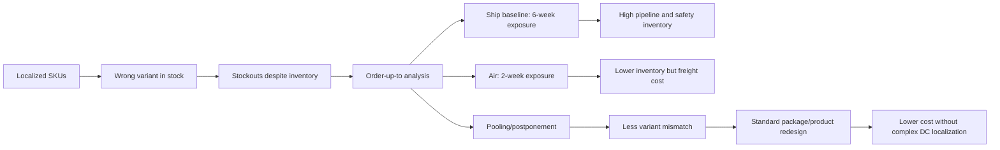

# Topic 14 Context: HP DeskJet Printer Case Study

Source note: [topic-14-hp-deskjet-case-study.md](topic-14-hp-deskjet-case-study.md)

Purpose: standalone terminology, formula, and ambiguity guide for the HP DeskJet case.

## Case And Product Terms

| Term | Definition | Aliases to avoid |
|---|---|---|
| **HP DeskJet case** | A supply-chain redesign case about high inventory, stockouts, localized European printer variants, order-up-to safety stock, transportation mode, pooling, and postponement. | Do not call it only an "inventory exercise"; the recommendation matters. |
| **Localized printer option** | A country/region-specific DeskJet variant, represented in the data as Europe options `A`, `AA`, `AB`, `AQ`, `AU`, and `AY`. | "Product" when the precise SKU/option level matters. |
| **SKU** | Stock keeping unit: the specific inventory item/version tracked and replenished separately. In HP, each European option is a SKU. | "Demand" without saying which option. |
| **Localized demand mismatch** | The situation where total inventory is high but demand hits a variant that is not available. | "Low inventory" as the only cause of stockouts. |
| **Product life-cycle maturity** | Stage where sales are high, margins are pressured, uncertainty is lower than launch, and operational efficiency/service become decisive. | "Decline" unless the facts explicitly show falling sales. |
| **Commoditization** | Reduced customer willingness to pay for differentiation because competitors offer similar products. | "No differentiation at all"; some differentiation may remain. |

## Metric Terms

| Term | Definition | Aliases to avoid |
|---|---|---|
| **Average inventory** | Average inventory held by SKU or DC, used to estimate capital tied up and holding cost. | "Safety stock" unless it is specifically the buffer component. |
| **Inventory turns** | `annual sales / average inventory`; measures how many times inventory is sold/replaced per year. | "High inventory" as a performance metric. |
| **On-hand inventory** | Inventory physically available at a location; in the HP slides, on-hand inventory is converted into weeks of supply. | Inventory position. |
| **Cycle time** | In this case deck, time for processing a complete product; the deck warns it differs from the earlier process-analysis definition. | Throughput time unless the definition is specified. |
| **Service level** | Probability or percentage of periods without a stockout; in order-up-to logic, `P(D <= S)`. | LIFR; fill rate. |
| **Line Item Fill Rate (LIFR)** | Fraction of demanded units/items filled from stock: `expected sales / expected demand`. | Service level; OFR. |
| **Order Fill Rate (OFR)** | Fraction of complete orders filled from stock. Stricter than LIFR if orders contain multiple line items. | LIFR when complete-order availability matters. |

## Formula And Symbol Terms

| Term | Definition | Aliases to avoid |
|---|---|---|
| **`V`** | Per-printer value used as a symbolic unit value. The slides also illustrate with `V = $400`. | Selling price unless the case states that value equals price. |
| **`c_o`** | Overage/holding cost per unit for one week: `c_o = 0.48V / 52 = 0.0092V`. | Annual holding cost; it is weekly in the service-level calculation. |
| **`c_u`** | Underage/backlog cost per unit: lost margin from failing to serve demand, `c_u = 0.224 * 0.50V = 0.112V`. | Full margin unless the case states all margin is lost. |
| **Critical fractile / cost-based service level** | `SL* = c_u / (c_u + c_o) = 92.4%` in the HP slides. | Arbitrary marketing target. |
| **`mu`** | Mean demand over the relevant protection period. | Monthly mean if the calculation needs weekly or lead-time demand. |
| **`sigma`** | Standard deviation of demand over the relevant protection period. | Variance; do not use variance directly as standard deviation. |
| **`z`** | Standard normal quantile: `z = (S - mu)/sigma`. For `SL = 92.4%`, `z` is about `1.43`. | Probability; z is a standardized distance. |
| **`L(z)`** | Standard normal loss function: `L(z) = phi(z) - z[1 - Phi(z)]`. At HP's service level, `L(z)` is about `0.034`. | Service level; it is expected shortfall measured in standard-deviation units. |
| **Expected backorders** | `sigma L(z)`, the expected demand not immediately filled from stock. | Stockout probability. |
| **Expected leftover / safety inventory** | `S - mu + expected backorders`; the expected inventory left when the replenishment arrives. | Expected backorders. |
| **Order-up-to level `S`** | Target inventory position after ordering: `S = mu + z*sigma` for normally distributed protection-period demand. | On-hand inventory. |

## Demand Conversion Terms

| Term | Definition | Aliases to avoid |
|---|---|---|
| **Monthly demand data** | Raw HP workbook data by option and month from November to October. | Weekly demand before conversion. |
| **Weekly mean conversion** | `weekly mean = monthly mean * 12/52`. | Dividing by 4 without explaining the time base. |
| **Weekly variance conversion** | `weekly variance = monthly variance * 12/52`; then `weekly sigma = sqrt(weekly variance)`. | Multiplying monthly standard deviation by `12/52` directly. |
| **Protection period** | Time span that demand must be protected by inventory: `lead time + cycle/review period`. | Lead time only. |
| **Baseline protection period** | Status quo ship case: `5 weeks lead time + 1 week cycle = 6 weeks`. | Five weeks only. |
| **Air protection period** | Air-shipment case: `1 week lead time + 1 week cycle = 2 weeks`. | One week only. |
| **Pooled protection period** | European integration/postponement case: aggregate demand with six-week ship protection period. | Two-week air case. |

## Scenario Terms

| Term | Definition | Aliases to avoid |
|---|---|---|
| **Baseline / status quo ship** | Current design: localized finished-goods options shipped with a five-week lead time and one-week review cycle. | Pooled case. |
| **Air shipment** | Transportation alternative that reduces lead time to one week, lowering pipeline and safety inventory but adding freight cost. | Free inventory reduction. |
| **Pooling** | Combining demands before final localization so variability partly cancels out and one generic inventory pool serves multiple variants. | Adding standard deviations. |
| **Postponement** | Delaying product differentiation until demand is clearer; in HP, delaying European localization or redesigning package contents. | Late shipping; it is a design/process choice. |
| **European integration** | Doing final localization/integration in Europe rather than shipping fully localized variants from Vancouver. | Always lean; it may add process complexity. |
| **Product redesign** | Simplifying the product/package so one standard printer box can serve Europe, e.g. all manuals/languages and all plugs included. | Pure manufacturing relocation. |
| **Process complexity** | Extra labor, skills, handoffs, quality risk, or waste caused by moving localization into DCs. | Implementation detail to ignore. |

## Relationships Between Canonical Terms

```text
Localized demand mismatch -> high inventory plus stockouts.
Monthly demand data -> weekly mean/variance -> protection-period mu/sigma.
Protection-period mu/sigma + service level -> order-up-to level S.
Order-up-to level S -> expected backorders and expected leftover inventory.
Expected inventory/backorders -> inventory-related cost per printer.
Air shipment -> shorter protection period -> lower inventory but higher freight cost.
Pooling/postponement -> lower variant mismatch -> better LIFR and less safety stock.
Product redesign -> postponement with less process complexity.
```

## Compact Formula Sheet

```text
c_o = 0.48V/52 = 0.0092V
c_u = 0.224*0.5V = 0.112V
SL* = c_u/(c_u+c_o) = 0.112/(0.112+0.0092) = 92.4%
z_92.4% approx 1.43
L(z) = phi(z) - z[1-Phi(z)] approx 0.034 at z=1.43

weekly mean = monthly mean * 12/52
weekly variance = monthly variance * 12/52
mu_protection = weekly mean * weeks
sigma_protection = sqrt(weekly variance * weeks)
S = mu_protection + z*sigma_protection
Expected backorders = sigma_protection * L(z)
Expected leftover inventory = S - mu_protection + expected backorders
LIFR = 1 - expected backorders / mu_protection
```

## Scenario Anchors

| Scenario | Protection period | Main slide result | Managerial test |
|---|---:|---|---|
| **Baseline / ship** | 6 weeks | Inventory cost about `$34.61` per printer. | Shows the cost of long lead time and localized stock. |
| **Air shipment** | 2 weeks | Inventory cost about `$13.80`; savings about `$20.80` per printer. | Use air if extra freight is below savings and process can handle it. |
| **Pooling / ship** | 6 weeks | Inventory cost about `$29.87`; savings about `$4.74`; LIFR about `99.21%`. | Useful if achieved by simple postponement, not costly complexity. |
| **Product redesign** | Depends on design | Possible cost about `$0.50`, possible savings about `$5.00`. | Best strategic recommendation if technically feasible. |

## Visual Mental Model



## Exam Traps And Correction Rules

| Trap | Correction rule |
|---|---|
| **Service level = LIFR** | Say service level is no-stockout probability, LIFR is unit-fill percentage. |
| **Use monthly standard deviation directly** | Convert variance to weekly/protection period, then take square root. |
| **Protection period equals lead time** | Add one review/cycle period: `lead time + 1`. |
| **Pooling standard deviation = sum of standard deviations** | Add variances under independence; take square root afterward. |
| **Air is automatically best** | Compare extra freight cost with about `$20.80` per-printer inventory savings. |
| **European integration is automatically lean** | Discuss added labor, skill needs, quality risk, and handoffs. |
| **Pooled `251.3` is safety inventory** | Safer wording: `251.3` expected backorders; `10,768.0` expected leftover/safety inventory. |

## Example Dialogue

**Student:** HP should just hold more inventory because there are stockouts.  
**Coach:** Use the canonical term **localized demand mismatch**. HP already has high inventory; the problem is that inventory is in the wrong **SKU**.

**Student:** Then air shipment solves it.  
**Coach:** Air reduces the **protection period** from six weeks to two weeks. It is attractive only if the extra freight cost is below the roughly `$20.80` per-printer saving.

**Student:** Pooling also helps because we add all option demands together.  
**Coach:** Yes, but be precise: **pooling** adds demand means and, under independence, variances. It does not add standard deviations.

**Student:** So the best answer is European integration.  
**Coach:** Maybe, but the exam-safe recommendation is **product redesign/postponement** if feasible, because it preserves lean flow better than adding complex localization work at European DCs.

## Flagged Ambiguities

| Ambiguity | Canonical recommendation |
|---|---|
| **Safety stock in the pooled slide** | State expected backorders and expected leftover inventory separately. Use `251.3` for expected backorders and `10,768.0` for expected leftover/safety inventory. |
| **"Service" in HP** | Specify whether the answer means **service level**, **LIFR**, or **OFR**. |
| **"Inventory cost"** | Specify whether using per-dollar unit value, total dollars at `V=$400`, cost per printer, or share of revenue. |
| **"Postponement" versus "integration in Europe"** | Integration is one possible postponement implementation; product redesign can be a cleaner postponement implementation. |
| **"Trend" in demand** | The slide regression has `p=0.166 > 0.1`, so exam wording should say no statistically significant trend in aggregate demand. |
