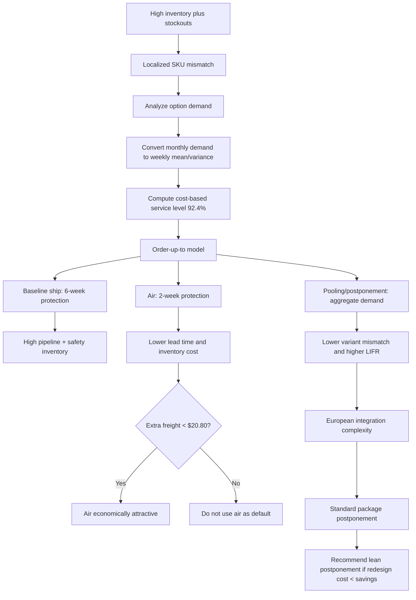

# Topic 14: HP DeskJet Printer Case Study

Source files:

- `supply-chain-management/raw/14 Case Study - HP/Slides HP.pdf`
- `supply-chain-management/raw/14 Case Study - HP/HP case data.xlsx`

Course: Supply Chain Management  
Processed: 2026-07-14  
Wiki note: `supply-chain-management/wiki/topic-14-hp-deskjet-case-study/topic-14-hp-deskjet-case-study.md`

Course logistics checked: SCM exam is closed-book, numerical/open-ended and multiple-choice questions are possible, and only one handwritten one-sided A4 cheat sheet plus a non-programmable calculator are allowed. The HP case is therefore exam-relevant as an applied order-up-to, service-level, line-item-fill-rate, risk-pooling, postponement, and recommendation case.

## 80/20 Exam Summary

HP's DeskJet printer case is a supply-chain redesign case, not just a calculation drill.

The operational problem:

```text
HP has high inventory and still experiences stockouts.
European demand differs by localized printer option.
The decision is whether to change transportation mode, product localization, or product design.
```

The exam-critical chain:

```text
demand data -> weekly mean/variance -> protection period demand -> service level
-> order-up-to level S -> expected inventory/backorders -> cost comparison
-> recommendation with process implications
```

Core recommendation:

```text
Air shipment greatly reduces lead time and inventory cost but adds transport cost.
European localization/postponement pools demand and improves fit but may add process complexity.
The strongest strategic solution is product redesign/postponement: one standard printer package
with multi-language manual and all needed plugs, if the added cost is below the inventory/service benefit.
```

## Case Questions In The Deck

The deck asks nine questions:

1. What situation did HP face in the early 1990s, and what tradeoffs did the decision entail?
2. Where is DeskJet in the product life-cycle model?
3. Which KPIs matter?
4. Analyze European demand by SKU/option and in aggregate.
5. What service level is optimal, and what LIFR follows?
6. Calculate safety stock for the status quo.
7. Calculate safety stock if products are shipped by air.
8. Calculate safety stock if integration is done in Europe, using pooling.
9. Discuss alternatives, process implications, and make a recommendation.

This means the exam may ask for a full case answer rather than a single formula.

## Situation Faced By HP

HP's Vancouver division produced DeskJet printers for several European country or option variants. The case symptoms were contradictory:

- Sales were increasing, but inventory was increasing roughly at the same pace.
- Warehouses were full, yet stockouts still occurred.
- Competition was increasing, which reduced margins and raised service expectations.
- Production in Vancouver was lean, but European distribution centers still behaved like make-to-stock systems for localized variants.

The EOQ intuition from earlier topics gives a useful diagnostic:

```text
Q* = sqrt(2Klambda / h)
```

If demand rate `lambda` doubles, the efficient cycle stock should grow by `sqrt(2)`, not double. Inventory growing at the same rate as sales suggests distribution or localization inefficiency.

## Main Tradeoffs

| Decision tension | Operational meaning | Exam interpretation |
|---|---|---|
| Service level vs inventory cost | More stock improves availability but ties up capital. | Use service-level and expected inventory/backorder formulas. |
| Ship vs air | Sea/ship has long lead time; air has shorter lead time but higher transport cost. | Compare inventory savings per printer with extra air freight cost. |
| Central production vs European integration | Vancouver may stay lean, but European DCs may need skilled labor and new processes. | Do not recommend local integration without discussing process complexity. |
| Model optimum vs incentives | The model may reveal global savings, but costs/benefits may fall on different actors. | Recommendation must include implementation and incentives. |

## Product Life-Cycle Position

DeskJet is positioned around maturity, possibly late growth into maturity.

Customer-side characteristics:

- commoditization and less differentiation
- lower margins due to competition
- higher customer expectations
- high or peak sales volume

Internal-side characteristics:

- more experience and learning-curve effects
- fewer ramp-up problems
- less demand uncertainty than in introduction
- superior supply-chain processes become a major success driver

Exam sentence:

```text
Because DeskJet is no longer a pure introduction-stage product, HP cannot hide behind high uncertainty or premium margins; process efficiency, service level, and inventory discipline become decisive.
```

## KPIs And Metrics

| Metric | Meaning | Why it matters in HP |
|---|---|---|
| Average inventory | Average monthly inventory by SKU or total per DC. | Internal cost and working-capital burden. |
| Inventory turns | Annual sales / average inventory. | Higher turns mean lower inventory intensity. |
| On-hand inventory | Average inventory / annual sales x 52. | Converts inventory into weeks of supply. |
| Cycle time | Time to process a complete product. | The deck warns this differs from the earlier process-analysis definition. |
| Line Item Fill Rate (LIFR) | Percentage of demanded units/items filled from stock. | Customer-facing unit availability. |
| Order Fill Rate (OFR) | Percentage of complete customer orders filled from stock. | Stricter when orders contain several items. |
| Service level | Percentage of periods without stockout. | Different from LIFR: a period can have a stockout but still fill most units. |

Exam trap:

```text
Service level = probability/percentage of no stockout in a period.
LIFR = fraction of demanded units filled from stock.
They are related but not identical.
```

## Demand Analysis

The workbook provides monthly European demand for six options: `A`, `AA`, `AB`, `AQ`, `AU`, `AY`.

Monthly means and standard deviations from the workbook:

| Europe option | Monthly mean | Monthly standard deviation |
|---|---:|---:|
| A | 42.3 | 32.4 |
| AA | 420.2 | 203.9 |
| AB | 15,830.1 | 5,624.6 |
| AQ | 2,301.2 | 1,168.5 |
| AU | 4,208.0 | 2,204.6 |
| AY | 306.8 | 103.1 |
| Total | 23,108.6 | 6,244.0 |

The slides test the total-demand trend:

```text
Regression slope = -738.73
R^2 = 0.182
F(df1=1, df2=10) = 2.224
p = 0.166 > 0.1
Conclusion: no statistically significant trend.
```

The deck treats demand as approximately normal. Evidence used:

- mean and median are reasonably close relative to the standard deviation
- values mostly fall within the two-standard-deviation and four-standard-deviation ranges
- aggregate demand is high-volume, making normal modeling plausible

Weekly conversion:

```text
Weekly mean = monthly mean x 12/52
Weekly variance = monthly variance x 12/52
Weekly standard deviation = sqrt(weekly variance)
```

The slide's weekly demand table:

| Option | Weekly mean | Weekly variance |
|---|---:|---:|
| A | 9.8 | 242.4 |
| AA | 97.0 | 9,596.8 |
| AB | 3,653.1 | 7,300,588.7 |
| AQ | 531.0 | 315,086.9 |
| AU | 971.1 | 1,121,581.6 |
| AY | 70.8 | 2,454.1 |
| Total | 5,332.8 | 8,997,008.9 |

## Service Level And LIFR

The case uses the order-up-to logic from Topic 10.

Assumptions from the slides:

```text
Annual holding cost = 48% of item value V
Weekly overage/holding cost c_o = (0.48/52)V = 0.0092V
Assumed per-unit margin = 22.4% of V
Backlogged unit loses 50% of margin
Underage/backlog cost c_u = 0.224 x 0.5V = 0.112V
```

Cost-based service level:

```text
SL* = c_u / (c_u + c_o)
SL* = 0.112V / (0.112V + 0.0092V) = 92.4%
```

This service level implies a normal z-value of about `1.43`.

Expected lost-sales/backorder function:

```text
z = (S - mu) / sigma
L(z) = phi(z) - z[1 - Phi(z)]
Expected lost demand / expected backorders = sigma L(z)
Expected sales = mu - sigma L(z)
LIFR = expected sales / mu = 1 - sigma L(z) / mu
```

At `SL = 92.4%`, the deck simplifies:

```text
LIFR approx 1 - 0.034 * sigma/mu
```

Important interpretation:

```text
The same service level creates different LIFRs for different SKUs because sigma/mu differs by SKU.
Small, volatile SKUs can have lower LIFR at the same service level than large stable SKUs.
```

## Order-Up-To Model In The HP Case

The recurring policy is:

```text
Order each period = S - inventory position
Protection period = lead time + cycle/review period
S = mu_protection + z(SL*) * sigma_protection
Expected backorders = sigma_protection * L(z)
Expected leftover inventory = S - mu_protection + expected backorders
```

For HP:

```text
Status quo by ship: lead time 5 weeks + cycle 1 week = 6 weeks
Air shipment: lead time 1 week + cycle 1 week = 2 weeks
Pooling/postponement by ship: aggregate demand, 6-week protection period
```

## Scenario 1: Baseline / Status Quo Shipments

Protection period:

```text
5 weeks lead time + 1 week cycle length = 6 weeks
```

Slide results:

| Product | Mean | Std. dev. | Order-up-to level S | LIFR | Safety stock / expected leftover |
|---|---:|---:|---:|---:|---:|
| A | 58.6 | 38.1 | 113.2 | 97.77% | 55.9 |
| AA | 581.8 | 240.0 | 925.2 | 98.59% | 351.7 |
| AB | 21,918.6 | 6,618.4 | 31,392.0 | 98.97% | 9,699.9 |
| AQ | 3,186.2 | 1,375.0 | 5,154.3 | 98.52% | 2,015.1 |
| AU | 5,826.5 | 2,594.1 | 9,539.6 | 98.48% | 3,801.9 |
| AY | 424.8 | 121.3 | 598.5 | 99.02% | 177.8 |
| Total | 31,996.5 |  | 47,723.0 |  |  |

Inventory decomposition:

```text
Cycle inventory = 2,666.4
In-transit inventory = 26,663.8
Expected backorders = 375.8
Expected leftover/safety inventory = 16,102.3
Average inventory used for holding-cost logic = about 45,432.4
```

Cost results with assumed printer value `V = $400`:

```text
Annual inventory holding cost per $ unit value = 21,800
Annual backorder cost per $ unit value = 2,200
Total inventory-related cost = $9.598M
Total revenue = $110.921M
Inventory cost share = 8.65% of revenue
Total inventory cost per printer = $34.61
```

Exam interpretation:

```text
The status quo gives high service but at very high pipeline and safety inventory because the six-week protection period is long.
```

## Scenario 2: Air Shipments

Protection period:

```text
1 week lead time + 1 week cycle length = 2 weeks
```

Slide results:

| Product | Mean | Std. dev. | Order-up-to level S | LIFR | Safety stock / expected leftover |
|---|---:|---:|---:|---:|---:|
| A | 19.5 | 22.0 | 51.1 | 96.14% | 32.3 |
| AA | 193.9 | 138.5 | 392.2 | 97.56% | 203.0 |
| AB | 7,306.2 | 3,821.1 | 12,775.7 | 98.21% | 5,673.3 |
| AQ | 1,062.1 | 793.8 | 2,198.4 | 97.44% | 1,203.9 |
| AU | 1,942.2 | 1,497.7 | 4,086.0 | 97.36% | 1,776.1 |
| AY | 141.6 | 70.1 | 241.9 | 98.31% | 171.1 |
| Total | 10,665.5 |  | 19,745.2 |  |  |

Inventory and cost results:

```text
Cycle inventory = 2,666.4
In-transit inventory = 5,332.8
Expected backorders = 217
Expected leftover/safety inventory = 9,059.7
Annual inventory holding cost per $ unit value = 8,300
Annual backorder cost per $ unit value = 1,263
Total inventory-related cost = $3.826M
Inventory cost share = 3.45% of revenue
Savings per printer versus baseline = $20.80
```

Exam interpretation:

```text
Air shipment substantially reduces the protection period, pipeline inventory, expected inventory cost, and backorder cost. It is economically attractive only if the extra air-freight cost per printer is below about $20.80, and if the process can absorb the transport change.
```

## Scenario 3: Pooling / European Integration With Shipments

Logic:

```text
Instead of holding separate localized finished-goods inventory for every option,
HP pools demand by delaying final localization.
```

Protection period remains:

```text
5 weeks lead time + 1 week cycle length = 6 weeks
```

Slide results:

| Product | Mean | Std. dev. | Order-up-to level S | LIFR | Expected backorders / safety nuance |
|---|---:|---:|---:|---:|---:|
| Pooled | 31,996.5 | 7,347.2 | 42,513.2 | 99.21% | 251.3 |

Important slide-label nuance:

```text
The next slide treats 251.3 as expected backorders and 10,768.0 as expected leftover/safety inventory.
For exam writing, state the two separately:
expected backorders = about 251.3;
expected leftover/safety inventory = about 10,768.0.
```

Inventory and cost results:

```text
Cycle inventory = 2,666.4
In-transit inventory = 26,663.8
Expected backorders = 251.3
Expected leftover/safety inventory = 10,768.0
Annual inventory holding cost per $ unit value = 19,250
Annual backorder cost per $ unit value = 1,460
Total inventory-related cost = $8.284M
Inventory cost share = 7.47% of revenue
Savings per printer = $4.74 at V=$400
LIFR improves from about 98.8% to 99.21%
```

Exam interpretation:

```text
Pooling reduces mismatch among variants and improves service, but it does not shorten transportation lead time. Therefore it saves less inventory cost than air shipment, but it can be strategically strong if implemented through simple product redesign rather than complex local assembly.
```

## Comparing The Alternatives

| Alternative | Main benefit | Main cost/risk | Slide result |
|---|---|---|---|
| Baseline / ship | No process change. | High inventory and stockout contradiction. | Cost per printer about $34.61. |
| Air shipment | Shorter lead time, much lower inventory. | Extra freight cost. | Cost per printer about $13.80; savings about $20.82. |
| Pooling / European integration | Risk pooling across options; higher LIFR. | Process complexity and local labor/skill requirements. | Cost per printer about $29.87; savings about $4.74. |
| Product redesign / postponement | Keeps processes lean and reduces localization mismatch. | Requires redesign/package cost. | Suggested cost about $0.50, possible savings about $5.00. |

Recommendation logic:

```text
1. If extra air freight < $20.80 per printer, air is financially attractive.
2. If HP wants a structural solution, redesign/postponement is stronger:
   one standard printer per box, manual with all languages, all European plugs included.
3. Avoid a recommendation that only moves complexity from Vancouver into European DCs.
4. The best answer weighs model savings, implementation cost, process complexity, service level, and incentives.
```

## Worked Calculation: Service Level

Known:

```text
Annual holding cost = 48% of V
One period = one week
Per-unit margin = 22.4% of V
Lost margin if backlogged = 50%
```

Formula:

```text
c_o = 0.48V / 52
c_u = 0.224V * 0.50
SL* = c_u / (c_u + c_o)
```

Substitution:

```text
c_o = 0.48V / 52 = 0.0092V
c_u = 0.224V * 0.50 = 0.112V
SL* = 0.112V / (0.112V + 0.0092V)
```

Result:

```text
SL* = 92.4%
```

Interpretation:

```text
Because shortage/backlog cost is much larger than one week of holding cost,
HP should target a high cycle service level.
```

## Worked Calculation: Demand Aggregation For Baseline AB

Known from weekly table:

```text
AB weekly mean = 3,653.1
AB weekly variance = 7,300,588.7
Protection period = 6 weeks
SL = 92.4%, so z approx 1.43
```

Formula:

```text
mu_6 = weekly mean * 6
sigma_6 = sqrt(weekly variance * 6)
S = mu_6 + z*sigma_6
```

Substitution:

```text
mu_6 = 3,653.1 * 6 = 21,918.6
sigma_6 = sqrt(7,300,588.7 * 6) = 6,618.4
S approx 21,918.6 + 1.43*6,618.4
```

Slide result:

```text
S approx 31,392.0 units
LIFR approx 98.97%
Expected leftover/safety inventory approx 9,699.9
```

Interpretation:

```text
AB dominates European volume, so its inventory decision drives most of the case economics.
```

## Managerial Recommendation Template

Use this answer shape in the exam:

```text
HP faces a localization mismatch: inventories are high, but the wrong option can be in stock.
The status quo protects six weeks of demand and therefore creates high pipeline and safety inventory.
Air shipment lowers lead time and saves about $20.80 per printer, so it is attractive if freight cost is below that.
Pooling/postponement improves risk pooling and LIFR, but local integration can add complexity.
The best structural solution is product redesign/postponement: standardize the printer package with all European plugs and manuals if the incremental cost is below the inventory/service savings.
```

## Links To Earlier SCM Topics

- [Topic 03 Newsvendor Model](../topic-03-newsvendor-model/topic-03-newsvendor-model.md): service-level critical fractile.
- [Topic 04 Random Variables](../topic-04-modeling-uncertain-demand-random-variables/topic-04-modeling-uncertain-demand-random-variables.md): normal demand, CDF, z-score, variance aggregation.
- [Topic 05 EOQ / Production Systems / Batching](../topic-05-eoq-production-systems-batching/topic-05-eoq-production-systems-batching.md): inventory-growth intuition and product-process positioning.
- [Topic 10 Order-Up-To Model](../topic-10-multi-period-inventory-management-order-up-to-model/topic-10-multi-period-inventory-management-order-up-to-model.md): `S`, protection period, expected backorders, expected inventory.
- [Topic 13 Lean Management](../topic-13-lean-management-lean-simulation/topic-13-lean-management-lean-simulation.md): keep process redesign lean; avoid adding waste through complex European localization.

## Exam Traps

| Trap | Correction |
|---|---|
| Treating service level and LIFR as the same metric. | Service level is no-stockout probability/period measure; LIFR is unit-fill percentage. |
| Using monthly standard deviation directly for weekly calculations. | Convert variance by `12/52`, then take the square root. |
| Forgetting the cycle/review period. | Protection period is `lead time + 1`, not only lead time. |
| Calling all pooled-table inventory "safety stock." | Separate expected backorders from expected leftover/safety inventory. |
| Recommending air without comparing freight cost. | Air is attractive only if added freight cost is below inventory savings per printer. |
| Recommending European integration without process discussion. | Local integration may break lean flow and require skilled labor. |
| Assuming aggregate demand standard deviation equals sum of SKU standard deviations. | Under pooling, variances add under independence; standard deviations do not. |

## Practice Questions

1. HP's sales and inventory both increase by roughly the same rate. Why is that suspicious from an EOQ perspective?

   Short answer: EOQ grows with the square root of demand rate. If demand doubles, efficient cycle stock should rise by about `sqrt(2)`, not double.

2. Why can HP have high inventory and still have stockouts?

   Short answer: inventory is held in localized variants. The wrong SKU may be available while the demanded SKU is stocked out.

3. Compute HP's service level from the case assumptions.

   Short answer: `c_o = 0.48V/52 = 0.0092V`, `c_u = 0.224*0.5V = 0.112V`, `SL = 0.112/(0.112+0.0092) = 92.4%`.

4. Why does air shipment reduce inventory so much?

   Short answer: it reduces the protection period from six weeks to two weeks, lowering both pipeline inventory and demand uncertainty during exposure.

5. Why can postponement improve service without necessarily increasing inventory?

   Short answer: demand is pooled before final localization, so the same generic stock can serve multiple option demands.

6. What final recommendation is strongest?

   Short answer: product redesign/postponement if the incremental cost is low: standard printer, all manuals/languages, all plugs. Use air only if the freight premium is below the per-printer savings.

## Visual Knowledge Map



## Subject Knowledge Graph

### Nodes

| Node | Type | Meaning |
|---|---|---|
| HPDeskJetCase | Case | Applied order-up-to and postponement case. |
| LocalizedDemand | Demand structure | Demand split across European printer options. |
| SKU | Product unit | Stock keeping unit / option variant. |
| ServiceLevelHP | Metric | Probability/percentage of periods without stockout. |
| LIFR | Metric | Percentage of demanded units filled from stock. |
| OrderUpToLevelHP | Inventory target | `S` for the protection-period demand distribution. |
| ProtectionPeriod | Time exposure | Lead time plus review/cycle period. |
| BaselineShip | Scenario | Status quo shipment with six-week protection period. |
| AirShipment | Scenario | One-week lead time plus one-week review period. |
| PoolingPostponement | Scenario | Aggregate demand before final localization. |
| ProductRedesign | Recommendation | Standardize package to delay differentiation. |
| ProcessComplexity | Implementation risk | Added labor, skills, handoffs, or waste in European DCs. |

### Edges

| From | Relationship | To |
|---|---|---|
| HPDeskJetCase | starts with | LocalizedDemand |
| LocalizedDemand | is measured by | SKU |
| LocalizedDemand | creates risk of | StockoutDespiteInventory |
| ServiceLevelHP | determines quantile for | OrderUpToLevelHP |
| ProtectionPeriod | determines exposure for | OrderUpToLevelHP |
| BaselineShip | has long | ProtectionPeriod |
| AirShipment | reduces | ProtectionPeriod |
| AirShipment | lowers | PipelineInventory |
| PoolingPostponement | reduces | LocalizedDemandMismatch |
| PoolingPostponement | improves | LIFR |
| ProductRedesign | enables | PoolingPostponement |
| ProcessComplexity | constrains | PoolingPostponement |
| ProductRedesign | should preserve | LeanFlow |

## Open Uncertainties

- The slides provide solution tables and should be treated as the exam anchor. Some labels around pooled "safety stock" are ambiguous; the safest interpretation is to separate expected backorders (`251.3`) from expected leftover/safety inventory (`10,768.0`).
- The deck says possible product-redesign cost may be about `$0.50` and possible savings about `$5.00`, depending on assumptions. Treat those as discussion anchors, not universal facts.
